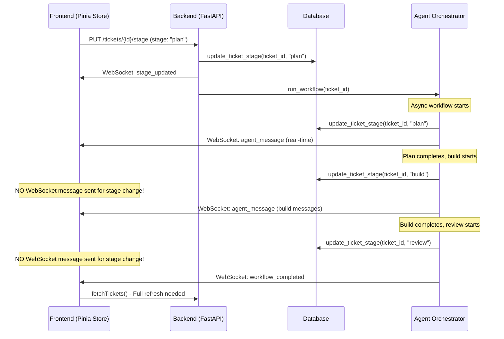

# Ticket Refresh Transition Fix

## Codebase Analysis

After analyzing the codebase, I identified the root cause of why tickets sometimes require manual refresh to transition from plan to build stages. The issue stems from WebSocket message handling race conditions and inconsistent state synchronization between the frontend and backend during workflow transitions.

### Key Files Examined

1. **Frontend State Management**:
   - `frontend/src/stores/tickets.js` - Pinia store managing ticket state and WebSocket connections
   - `frontend/src/App.vue` - Main kanban board with drag-and-drop functionality

2. **Backend Workflow Management**:
   - `backend/main.py` - FastAPI server with WebSocket handling and workflow orchestration
   - `backend/modules/agent_orchestrator.py` - Agent execution logic (referenced)

3. **Database Layer**:
   - `backend/db/database.py` - SQLite operations for ticket persistence (referenced)

### Current WebSocket Message Flow



## Problem Statement

The ticket transition system requires manual browser refresh because:

1. **Missing Stage Transition Notifications**: The `run_workflow()` function updates ticket stages directly in the database but doesn't emit WebSocket messages for intermediate stage changes (plan → build → review).

2. **Race Condition in WebSocket Handling**: The frontend WebSocket handler calls `fetchTickets()` for `workflow_completed` and `workflow_error` events, causing a full data refresh instead of targeted updates.

3. **Inconsistent State Synchronization**: Local state updates in the frontend aren't always synchronized with the backend state, especially during rapid workflow transitions.

4. **No Granular Stage Update Notifications**: The workflow only sends WebSocket notifications at the beginning (`workflow_started`) and end (`workflow_completed`/`workflow_error`), missing intermediate stage transitions.

## Technical Approach

### Root Cause Resolution Strategy

The solution involves implementing a comprehensive WebSocket-based state synchronization system that ensures real-time stage updates without requiring manual refreshes.

### Architecture Changes

1. **Enhanced WebSocket Message Protocol**: Add stage transition messages for all workflow stage changes
2. **Granular State Updates**: Replace bulk `fetchTickets()` calls with targeted state updates
3. **Race Condition Prevention**: Implement proper sequencing and debouncing for WebSocket messages
4. **Consistency Guarantees**: Add state validation and fallback mechanisms

## Implementation Guide

### Phase 1: Backend WebSocket Message Enhancement

#### Step 1.1: Add Stage Transition Notifications in Workflow

**File**: `backend/main.py`

Add WebSocket notifications for each stage transition in the `run_workflow()` function:

```python
async def run_workflow(ticket_id: int):
    """Run the complete plan -> build -> review workflow"""

    # ... existing code ...

    try:
        # ... existing workflow start code ...

        # ======= PLAN PHASE =======
        console.print(Panel.fit(f"[bold blue]📋 Planning: {ticket['title']}[/bold blue]", border_style="blue"))

        # Update to plan stage WITH WebSocket notification
        await update_ticket_stage(ticket_id, "plan")
        await manager.send_json({
            "type": "stage_updated",
            "ticket_id": ticket_id,
            "old_stage": "idle",  # Known previous stage
            "new_stage": "plan"
        })

        # ... plan agent execution ...

        # ======= BUILD PHASE =======
        console.print(Panel.fit(f"[bold green]🔨 Building: {ticket['title']}[/bold green]", border_style="green"))

        # Update to build stage WITH WebSocket notification
        await update_ticket_stage(ticket_id, "build")
        await manager.send_json({
            "type": "stage_updated",
            "ticket_id": ticket_id,
            "old_stage": "plan",
            "new_stage": "build"
        })

        # ... build agent execution ...

        # ======= REVIEW PHASE =======
        console.print(Panel.fit(f"[bold yellow]📋 Reviewing: {ticket['title']}[/bold yellow]", border_style="yellow"))

        # Update to review stage WITH WebSocket notification
        await update_ticket_stage(ticket_id, "review")
        await manager.send_json({
            "type": "stage_updated",
            "ticket_id": ticket_id,
            "old_stage": "build",
            "new_stage": "review"
        })

        # ... review agent execution ...

        # ======= SHIPPED =======
        await update_ticket_stage(ticket_id, "shipped")
        await manager.send_json({
            "type": "stage_updated",
            "ticket_id": ticket_id,
            "old_stage": "review",
            "new_stage": "shipped"
        })

        # Send workflow complete notification (keep existing)
        await manager.send_json({
            "type": "workflow_completed",
            "ticket_id": ticket_id,
            "status": "shipped"
        })

    except Exception as e:
        # ... existing error handling ...
        await update_ticket_stage(ticket_id, "errored")
        await manager.send_json({
            "type": "stage_updated",
            "ticket_id": ticket_id,
            "old_stage": "review",  # Most likely previous stage
            "new_stage": "errored"
        })
        # ... existing error notification ...
```

#### Step 1.2: Add Workflow Progress Tracking

**File**: `backend/main.py`

Add a workflow state tracker to maintain accurate stage history:

```python
# Add after the ConnectionManager class
class WorkflowTracker:
    def __init__(self):
        self.active_workflows: Dict[int, Dict[str, Any]] = {}

    def start_workflow(self, ticket_id: int, initial_stage: str):
        """Track a new workflow"""
        self.active_workflows[ticket_id] = {
            "current_stage": initial_stage,
            "start_time": time.time(),
            "stages_completed": []
        }

    def update_stage(self, ticket_id: int, old_stage: str, new_stage: str):
        """Update workflow stage tracking"""
        if ticket_id in self.active_workflows:
            self.active_workflows[ticket_id]["current_stage"] = new_stage
            self.active_workflows[ticket_id]["stages_completed"].append({
                "stage": old_stage,
                "completed_at": time.time()
            })

    def complete_workflow(self, ticket_id: int):
        """Mark workflow as completed"""
        if ticket_id in self.active_workflows:
            del self.active_workflows[ticket_id]

    def get_previous_stage(self, ticket_id: int) -> str:
        """Get the previous stage for accurate transition tracking"""
        if ticket_id not in self.active_workflows:
            return "unknown"

        completed = self.active_workflows[ticket_id]["stages_completed"]
        return completed[-1]["stage"] if completed else "idle"

# Initialize tracker
workflow_tracker = WorkflowTracker()
```

### Phase 2: Frontend State Management Optimization

#### Step 2.1: Remove Redundant fetchTickets() Calls

**File**: `frontend/src/stores/tickets.js`

Replace bulk refresh with targeted updates:

```javascript
handleWebSocketMessage(data) {
  switch (data.type) {
    case 'ticket_created':
      // ... existing code unchanged ...
      break

    case 'stage_updated':
      const ticket = this.tickets.find(t => t.id === data.ticket_id)
      if (ticket) {
        // Update stage immediately for real-time UI response
        ticket.stage = data.new_stage

        // Log transition for debugging
        console.log(`Ticket ${data.ticket_id}: ${data.old_stage} → ${data.new_stage}`)
      } else {
        // If ticket not found locally, fetch it specifically
        console.warn(`Ticket ${data.ticket_id} not found locally, fetching...`)
        this.fetchSpecificTicket(data.ticket_id)
      }
      break

    case 'agent_message':
      // ... existing code unchanged ...
      break

    case 'workflow_started':
      // Optional: Add workflow start tracking
      const startTicket = this.tickets.find(t => t.id === data.ticket_id)
      if (startTicket) {
        startTicket.workflow_active = true
      }
      break

    case 'workflow_completed':
    case 'workflow_error':
      // REMOVE the fetchTickets() call - rely on stage_updated messages instead
      const completedTicket = this.tickets.find(t => t.id === data.ticket_id)
      if (completedTicket) {
        completedTicket.workflow_active = false
        // Stage should already be updated via stage_updated message
      }

      // Only fetch if we suspect data inconsistency
      if (!completedTicket) {
        console.warn(`Completed workflow ticket ${data.ticket_id} not found, fetching all tickets`)
        this.fetchTickets()
      }
      break
  }
}
```

#### Step 2.2: Add Targeted Ticket Fetching

**File**: `frontend/src/stores/tickets.js`

Add method for fetching specific tickets when needed:

```javascript
async fetchSpecificTicket(ticketId) {
  try {
    const response = await axios.get(`${API_URL}/tickets/${ticketId}`)
    const updatedTicket = response.data

    // Update or add the ticket in local state
    const existingIndex = this.tickets.findIndex(t => t.id === ticketId)
    if (existingIndex >= 0) {
      this.tickets[existingIndex] = updatedTicket
    } else {
      this.tickets.push(updatedTicket)
    }
  } catch (error) {
    console.error(`Failed to fetch ticket ${ticketId}:`, error)
  }
}
```

#### Step 2.3: Add State Consistency Validation

**File**: `frontend/src/stores/tickets.js`

Add periodic state validation to catch inconsistencies:

```javascript
// Add to actions
async validateStateConsistency() {
  try {
    const response = await axios.get(`${API_URL}/tickets`)
    const serverTickets = response.data

    // Check for missing or outdated tickets
    const inconsistencies = []

    for (const serverTicket of serverTickets) {
      const localTicket = this.tickets.find(t => t.id === serverTicket.id)

      if (!localTicket) {
        inconsistencies.push({ type: 'missing', ticket: serverTicket })
      } else if (localTicket.stage !== serverTicket.stage) {
        inconsistencies.push({
          type: 'stage_mismatch',
          local: localTicket,
          server: serverTicket
        })
      }
    }

    if (inconsistencies.length > 0) {
      console.warn('State inconsistencies detected:', inconsistencies)
      // Resolve by using server state as source of truth
      this.tickets = serverTickets
    }
  } catch (error) {
    console.error('Failed to validate state consistency:', error)
  }
}
```

### Phase 3: Race Condition Prevention

#### Step 3.1: Add WebSocket Message Sequencing

**File**: `frontend/src/stores/tickets.js`

Implement message queuing to handle rapid WebSocket messages:

```javascript
// Add to state
state: () => ({
  tickets: [],
  sessionInfo: null,
  wsConnection: null,
  isConnected: false,
  messageQueue: [],
  processingMessages: false
}),

// Add to actions
async handleWebSocketMessage(data) {
  // Queue messages to prevent race conditions
  this.messageQueue.push(data)

  if (!this.processingMessages) {
    await this.processMessageQueue()
  }
},

async processMessageQueue() {
  this.processingMessages = true

  while (this.messageQueue.length > 0) {
    const message = this.messageQueue.shift()
    await this.processIndividualMessage(message)

    // Small delay to prevent overwhelming the UI
    await new Promise(resolve => setTimeout(resolve, 10))
  }

  this.processingMessages = false
},

async processIndividualMessage(data) {
  // Move existing handleWebSocketMessage logic here
  switch (data.type) {
    // ... existing switch cases ...
  }
}
```

#### Step 3.2: Add Debounced State Updates

**File**: `frontend/src/stores/tickets.js`

Prevent rapid successive updates from causing UI thrashing:

```javascript
// Add debounced update method
import { debounce } from 'lodash-es' // or implement simple debounce

// Add to actions
debouncedStateUpdate: debounce(function(ticketId, updates) {
  const ticket = this.tickets.find(t => t.id === ticketId)
  if (ticket) {
    Object.assign(ticket, updates)
  }
}, 100), // 100ms debounce
```

### Phase 4: Enhanced Error Handling and Fallbacks

#### Step 4.1: Add WebSocket Connection Health Monitoring

**File**: `frontend/src/stores/tickets.js`

```javascript
// Add to state
wsHealthCheck: null,
lastMessageTime: null,

// Modify connectWebSocket
connectWebSocket() {
  if (this.wsConnection) {
    return
  }

  this.wsConnection = new WebSocket(WS_URL)

  this.wsConnection.onopen = () => {
    console.log('WebSocket connected')
    this.isConnected = true
    this.startHealthCheck()
  }

  this.wsConnection.onmessage = (event) => {
    this.lastMessageTime = Date.now()
    const data = JSON.parse(event.data)
    this.handleWebSocketMessage(data)
  }

  // ... existing onclose and onerror handlers ...
},

startHealthCheck() {
  // Check WebSocket health every 30 seconds
  this.wsHealthCheck = setInterval(() => {
    const now = Date.now()
    const timeSinceLastMessage = now - (this.lastMessageTime || now)

    // If no message in 60 seconds, validate state
    if (timeSinceLastMessage > 60000) {
      console.log('WebSocket appears stale, validating state...')
      this.validateStateConsistency()
    }
  }, 30000)
},

disconnectWebSocket() {
  if (this.wsHealthCheck) {
    clearInterval(this.wsHealthCheck)
    this.wsHealthCheck = null
  }

  if (this.wsConnection) {
    this.wsConnection.close()
    this.wsConnection = null
    this.isConnected = false
  }
}
```

#### Step 4.2: Add Graceful Degradation

**File**: `frontend/src/App.vue`

Add fallback polling when WebSocket fails:

```javascript
// Add to setup()
const pollTickets = ref(null)

// Add method
const startFallbackPolling = () => {
  if (pollTickets.value) return

  console.log('Starting fallback polling due to WebSocket issues')
  pollTickets.value = setInterval(async () => {
    if (!store.isConnected) {
      await store.fetchTickets()
    }
  }, 5000) // Poll every 5 seconds when WebSocket is down
}

const stopFallbackPolling = () => {
  if (pollTickets.value) {
    clearInterval(pollTickets.value)
    pollTickets.value = null
  }
}

// Monitor WebSocket connection status
watch(() => store.isConnected, (isConnected) => {
  if (isConnected) {
    stopFallbackPolling()
  } else {
    startFallbackPolling()
  }
})

onUnmounted(() => {
  store.disconnectWebSocket()
  stopFallbackPolling()
})
```

## Testing Strategy

### Unit Tests

1. **WebSocket Message Handling**:
   - Test stage_updated message processing
   - Verify message queuing and sequencing
   - Test error recovery scenarios

2. **State Consistency**:
   - Test targeted ticket updates vs full refresh
   - Verify state validation logic
   - Test debounced update behavior

### Integration Tests

1. **Workflow Transition Testing**:
   - Test complete idle → plan → build → review → shipped workflow
   - Verify real-time UI updates without manual refresh
   - Test concurrent workflow handling

2. **WebSocket Reliability**:
   - Test WebSocket reconnection scenarios
   - Verify fallback polling activation
   - Test message ordering during network issues

### End-to-End Tests

1. **User Journey Testing**:
   - Create ticket and drag to plan stage
   - Verify automatic progression through all stages
   - Confirm no manual refresh needed
   - Test multiple simultaneous workflows

2. **Network Resilience**:
   - Test behavior during network interruptions
   - Verify state recovery after reconnection
   - Test graceful degradation to polling

## Success Criteria

### Primary Goals

1. **Eliminate Manual Refresh Requirement**: Users should never need to refresh the browser to see ticket stage transitions from plan to build to review.

2. **Real-time Stage Updates**: All stage transitions should be visible in the UI within 500ms of occurring in the backend.

3. **Consistent State**: Frontend and backend ticket states should remain synchronized at all times.

### Performance Targets

1. **WebSocket Message Latency**: < 100ms from backend emit to frontend update
2. **UI Responsiveness**: Stage transitions should update UI within 50ms of receiving WebSocket message
3. **Memory Efficiency**: No memory leaks from queued messages or event listeners

### Reliability Metrics

1. **Zero Data Loss**: No stage transitions should be missed during normal operation
2. **Graceful Degradation**: System should continue functioning with polling fallback if WebSocket fails
3. **State Consistency**: Periodic validation should detect and resolve any state drift

## Edge Cases and Error Handling

### Network Connectivity Issues

**Problem**: WebSocket disconnection during workflow execution
**Solution**: Implement exponential backoff reconnection with state validation upon reconnection

### Rapid Stage Transitions

**Problem**: Multiple stage updates in quick succession causing UI confusion
**Solution**: Message queuing with debounced UI updates

### Browser Tab Backgrounding

**Problem**: WebSocket messages may be throttled in background tabs
**Solution**: Resume state validation when tab becomes active

### Database Consistency

**Problem**: Backend database updates may not immediately reflect in queries
**Solution**: Add database transaction consistency checks and retry logic

### Concurrent Workflows

**Problem**: Multiple tickets transitioning simultaneously may cause state conflicts
**Solution**: Implement per-ticket state locking and conflict resolution

### WebSocket Message Ordering

**Problem**: Out-of-order message delivery causing incorrect state updates
**Solution**: Add message sequence numbers and ordering validation

This implementation plan addresses the core issue of manual refresh requirements by establishing a robust, real-time state synchronization system that eliminates the need for full data refreshes during workflow transitions.