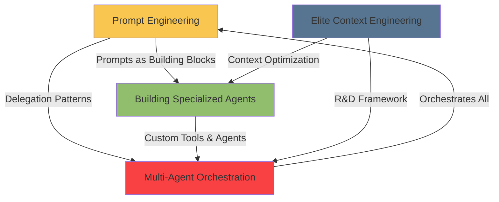

# Agentic Horizon: Mastery Synthesis

## The Quantum Leap from TAC to Horizon

The transition from TAC-8 to the Agentic Horizon represents not just an incremental advancement, but a **quantum leap in sophistication**. Where TAC teaches you to use agents, the Horizon teaches you to **architect agent ecosystems**.

```
TAC Foundation (1-8): Learning to use agents effectively
    ↓
Agentic Horizon: Becoming an agent architect
```

## The Four Pillars of Mastery

### 1. Agentic Prompt Engineering
**The Prompt as THE Fundamental Unit**

This isn't about writing better prompts - it's about understanding prompts as **engineering artifacts** that can be:
- **Composed**: Higher-order prompts accepting other prompts
- **Delegated**: Prompts that spawn and coordinate agents
- **Generated**: Metaprompts creating new prompts
- **Self-Improved**: Prompts that evolve through experience

The 7 levels create a complete taxonomy:
```
Static → Workflow → Control Flow → Delegation → Higher Order → Templates → Self-Improving
```

**Key Insight**: In agentic systems, prompts ARE the API. They define contracts, logic, and evolution.

### 2. Building Specialized Agents
**From Better Agents to Custom Agents**

The progression through 8 custom agents teaches:
- **Control**: Complete mastery over agent behavior
- **Integration**: Connecting agents to real-world systems
- **Orchestration**: Coordinating multiple specialized agents

```
Pong (basics) → Echo (tools) → Calculator (state) → Social Hype (streaming)
    → QA (specialization) → Tri-Copy (web apps) → SDLC (orchestration) → Ultra Stream (dual systems)
```

**Key Insight**: True mastery comes from building purpose-built agents tailored to specific domains.

### 3. Elite Context Engineering
**The R&D Framework for Maximum Performance**

Context engineering elevates from skill to science:
- **Reduce**: Systematic context optimization
- **Delegate**: Strategic cognition distribution

The 12 techniques provide a complete toolkit:
```
Measure → Reduce (MCP, CLAUDE.md, Output) → Delegate (Sub-agents, Patterns)
    → Advanced (Reset-Prime, Bundles) → Agentic (System Prompts, Experts)
```

**Key Insight**: Context is not just data, it's cognitive load. Master engineers orchestrate attention.

### 4. Multi-Agent Orchestration
**Production-Ready Systems at Scale**

The culmination - industrial-strength orchestration:
- **Natural Language Control**: Orchestrator interprets intent
- **Real-Time Streaming**: WebSocket event broadcasting
- **Persistent State**: PostgreSQL-backed reliability
- **Comprehensive Observability**: Every action tracked

```
User → Orchestrator → Management Tools → Agent Pool → Tasks
         ↑                                      ↓
         ←──────────── Reports ─────────────────
```

**Key Insight**: The future is self-managing agent ecosystems with enterprise reliability.

## The Complete Mastery Framework

### Conceptual Evolution

```
Level 1: Agent User
- Uses pre-built agents
- Follows documentation
- Basic prompt writing

Level 2: Agent Engineer
- Customizes agents
- Writes complex prompts
- Manages context

Level 3: Agent Architect (Horizon)
- Designs agent systems
- Creates specialized agents
- Orchestrates ecosystems
```

### The Synthesis: How the Four Domains Interconnect



Each domain reinforces the others:
- **Prompt Engineering** provides the language for all agent communication
- **Specialized Agents** become the workers in orchestrated systems
- **Context Engineering** ensures every agent operates at peak performance
- **Orchestration** brings everything together in production systems

## The Sophistication Leap

### From TAC-8 to Horizon

**TAC-8 Teaches:**
- Multi-agent basics
- Simple coordination
- Basic delegation
- Tool usage

**Horizon Teaches:**
- Agent architecture
- System design
- Production deployment
- Self-evolution

### The Key Differentiators

1. **Scale**: From single agents to agent ecosystems
2. **Sophistication**: From scripts to production systems
3. **Autonomy**: From commanded to self-managing
4. **Evolution**: From static to self-improving

## Practical Mastery Path

### Phase 1: Foundation (Weeks 1-2)
1. Master the 7 levels of prompts
2. Build your first custom agent
3. Measure and optimize context
4. Deploy basic orchestration

### Phase 2: Integration (Weeks 3-4)
1. Create specialized agent library
2. Implement R&D framework
3. Build multi-agent pipelines
4. Add real-time streaming

### Phase 3: Production (Weeks 5-6)
1. Deploy production orchestrator
2. Implement observability
3. Add persistence layer
4. Scale to multiple domains

### Phase 4: Mastery (Ongoing)
1. Self-improving agent systems
2. Domain-specific ecosystems
3. Enterprise deployments
4. Innovation at the edge

## The Three Laws of Agentic Mastery

### Law 1: Focus Beats Breadth
"A focused agent is a performant agent" - This applies to:
- Individual agents (context engineering)
- Agent purposes (specialization)
- System design (clear responsibilities)

### Law 2: Composition Beats Complexity
Complex behaviors emerge from simple, composable parts:
- Simple prompts → Complex workflows
- Specialized agents → Sophisticated systems
- Basic tools → Powerful capabilities

### Law 3: Evolution Beats Perfection
Systems that can evolve outperform static perfection:
- Self-improving prompts
- Learning agent experts
- Adaptive orchestration

## Real-World Impact

### What You Can Build After Mastery

1. **Autonomous Development Teams**
   - Orchestrator as Tech Lead
   - Specialized agents as team members
   - Complete SDLC automation

2. **Intelligence Amplification Systems**
   - Real-time data processing
   - Multi-source analysis
   - Automated decision support

3. **Self-Managing Operations**
   - Infrastructure orchestration
   - Incident response automation
   - Predictive maintenance

4. **Creative Synthesis Platforms**
   - Content generation pipelines
   - Multi-variant optimization
   - Audience-adapted outputs

## The Paradigm Shift

### From Tools to Colleagues
Agents transition from:
- Tools we use → Colleagues we collaborate with
- Commands we issue → Intentions we express
- Scripts we run → Systems that run themselves

### From Programming to Orchestrating
Engineering evolves from:
- Writing code → Designing agent interactions
- Debugging logic → Optimizing context
- Building features → Orchestrating capabilities

### From Static to Living Systems
Software becomes:
- Self-improving through agent experts
- Self-organizing through orchestration
- Self-healing through redundancy

## The Future Beyond Horizon

### Emerging Patterns
1. **Meta-Orchestrators**: Orchestrators managing orchestrators
2. **Agent Economies**: Market-based resource allocation
3. **Emergent Behaviors**: Unexpected capabilities from agent interaction
4. **Cognitive Meshes**: Distributed agent intelligence

### The Next Quantum Leap
From Horizon's "orchestrated ecosystems" to:
- Self-organizing swarms
- Emergent intelligence
- Autonomous innovation
- Artificial creativity

## Final Synthesis

The Agentic Horizon represents **the transition from using AI to architecting intelligence**. The four domains - Prompt Engineering, Specialized Agents, Context Engineering, and Orchestration - form a complete framework for building production-ready agentic systems.

The quantum leap from TAC to Horizon is the difference between:
- **Knowing how to use agents** vs **Knowing how to architect agent ecosystems**
- **Writing prompts** vs **Engineering prompt systems**
- **Managing context** vs **Orchestrating cognition**
- **Running agents** vs **Building self-managing systems**

This is not just an advancement in technical capability - it's a fundamental shift in how we think about software development. In the Horizon, we don't just write code; we **orchestrate intelligence**.

## The Ultimate Mastery

True mastery is achieved when you can:
1. **Design** agent architectures for any domain
2. **Build** specialized agents for any purpose
3. **Optimize** context for maximum performance
4. **Orchestrate** complex multi-agent workflows
5. **Evolve** systems that improve themselves

At this level, you're not just an engineer using AI - you're an **architect of intelligent systems**, capable of building the self-managing, self-improving software ecosystems that will define the future of technology.

Welcome to the Agentic Horizon - where the only limit is imagination.