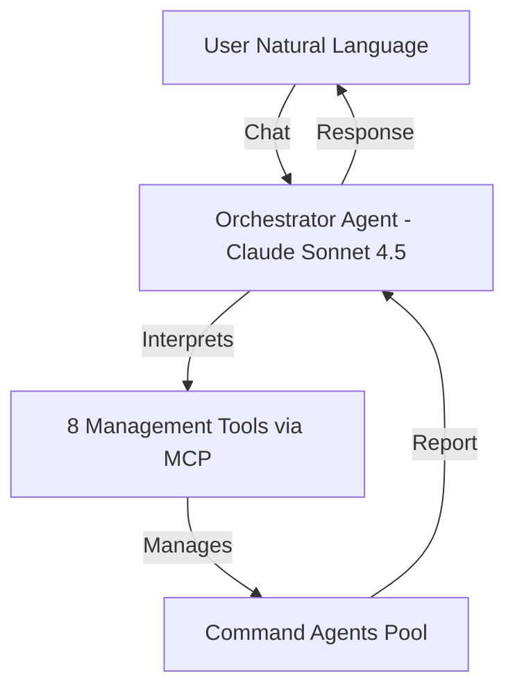

# Multi-Agent Orchestration - Module Analysis

## Domain Overview: Production-Ready Multi-Agent Systems at Scale

This module represents the pinnacle of agentic engineering - **a production-ready web-based orchestration system for managing and coordinating multiple Claude Code agents at scale**. It transitions from simple multi-agent concepts to industrial-strength orchestration with real-time streaming, PostgreSQL persistence, and comprehensive observability.

## Complete Structure

```
multi-agent-orchestration/
├── .claude/
│   ├── agents/
│   │   ├── build-agent.md            # Parallel implementation specialist
│   │   └── meta-agent.md             # Agent generator
│   ├── commands/
│   │   └── parallel_subagents.md     # Parallel execution
│   ├── skills/
│   │   └── meta-agent/
│   │       └── templates/
│   │           └── subagent-template.md
│   └── hooks/
│       └── subagent_stop.py          # Lifecycle management
├── apps/
│   ├── orchestrator_3_stream/        # Main production application
│   │   ├── .claude/
│   │   │   ├── agents/               # 7 specialized agents
│   │   │   │   ├── build-agent.md
│   │   │   │   ├── docs-scraper.md
│   │   │   │   ├── meta-agent.md
│   │   │   │   ├── playwright-validator.md
│   │   │   │   ├── review-agent.md
│   │   │   │   ├── scout-report-suggest.md
│   │   │   │   └── scout-report-suggest-fast.md
│   │   │   └── commands/             # Orchestration workflows
│   │   │       ├── orch_one_shot_agent.md
│   │   │       ├── orch_plan_w_scouts_build_review.md
│   │   │       ├── orch_scout_and_build.md
│   │   │       └── parallel_subagents.md
│   │   ├── backend/                  # FastAPI + Python
│   │   │   ├── main.py              # WebSocket + REST API
│   │   │   ├── modules/
│   │   │   │   ├── orchestrator_service.py
│   │   │   │   ├── agent_manager.py  # 8 management tools
│   │   │   │   ├── websocket_manager.py
│   │   │   │   └── database.py      # AsyncPG pool
│   │   │   └── prompts/
│   │   │       └── orchestrator_agent_system_prompt.md
│   │   └── frontend/                 # Vue 3 + TypeScript
│   │       └── src/
│   │           ├── components/       # 3-column UI
│   │           ├── stores/           # Pinia state
│   │           └── services/         # WebSocket client
│   └── orchestrator_db/              # Database schema
│       ├── migrations/               # 9 SQL migrations
│       │   ├── 0_orchestrator_agents.sql
│       │   ├── 1_agents.sql
│       │   ├── 2_prompts.sql
│       │   ├── 3_agent_logs.sql
│       │   ├── 4_system_logs.sql
│       │   ├── 5_indexes.sql        # 36+ performance indexes
│       │   ├── 6_functions.sql
│       │   ├── 7_triggers.sql
│       │   └── 8_orchestrator_chat.sql
│       └── models.py                 # Pydantic models
├── ARCHITECTURE.md                   # Comprehensive system design
└── specs/                            # Detailed specifications
    ├── orchestrator-3-wire-command-agents-and-event-streaming.md
    └── specialized-agent-templates.md
```

## System Architecture

### The Meta-Agent Pattern at Scale



### Three-Layer Architecture

#### 1. Orchestrator Layer
- **Role**: The "conductor" interpreting natural language
- **Model**: Claude Sonnet 4.5
- **Capabilities**: 8 management tools via MCP server
- **Context**: Maintains conversation history

#### 2. Management Layer (MCP Tools)
```typescript
create_agent(name, system_prompt?, model?, template?)
command_agent(agent_name, command)
check_agent_status(agent_name)
list_agents()
delete_agent(agent_name)
interrupt_agent(agent_name)
read_system_logs()
report_cost()
```

#### 3. Command Agent Layer
- **Role**: The "performers" executing tasks
- **Models**: Sonnet/Haiku based on requirements
- **Lifecycle**: Created, commanded, monitored, deleted
- **State**: Persistent across tasks

## Advanced Orchestration Patterns

### Pattern 1: One-Shot Agent
```markdown
/orch_one_shot_agent
Create → Execute → Delete
```
Perfect for isolated tasks without state persistence

### Pattern 2: Scout-Build Pipeline
```markdown
/orch_scout_and_build
Scout (investigate) → Report → Build (implement)
```
Investigation before implementation

### Pattern 3: Three-Phase SDLC
```markdown
/orch_plan_w_scouts_build_review
Scout → Plan → Build → Review
```
Complete development lifecycle

### Pattern 4: Parallel Execution
```markdown
/parallel_subagents
Spawn N agents → Execute simultaneously → Collect results
```
Massive parallelization for complex tasks

## Real-Time Event Streaming

### WebSocket Architecture
```python
# Event categories streamed in real-time:
- agent_created
- agent_updated
- agent_status_change
- agent_log
- chat_stream
- typing_indicator
- system_log
- error
```

### Event Flow
```
Backend Event → WebSocketManager → Broadcast → All Clients → UI Update
```

Every action is:
- Logged to PostgreSQL
- Streamed via WebSocket
- Displayed in real-time
- Cost-tracked automatically

## Database Design

### Six Core Tables

1. **orchestrator_agents**: Singleton orchestrator state
2. **agents**: Managed agent registry
3. **prompts**: Complete prompt history
4. **agent_logs**: Unified event log with AI summaries
5. **system_logs**: Application-level logging
6. **orchestrator_chat**: Three-way conversation tracking

### Advanced Features
- **36+ Performance Indexes**: Optimized queries
- **JSONB Fields**: Flexible metadata storage
- **Auto-update Triggers**: Timestamp management
- **Cost Accumulation**: Automatic token/USD tracking
- **AI Summaries**: 15-word event descriptions

## Production Features

### Comprehensive Observability
- Every hook captured
- Every tool use logged
- Every response recorded
- File changes tracked with git diffs
- Cost tracking per agent
- Session history persistence

### State Management
```python
# Session resumption
python main.py --session sess_abc123

# Working directory control
python main.py --cwd /path/to/project

# Combined
python main.py --session sess_xyz --cwd /my/project
```

### Real-Time Cost Tracking
```json
{
  "agent_id": "uuid",
  "input_tokens": 15234,
  "output_tokens": 3421,
  "total_cost": 0.47,
  "accumulated_cost": 12.35
}
```

## Advanced Concepts

### The Orchestration Hierarchy

```
Level 1: Direct Agent Control
User → Agent → Task

Level 2: Orchestrated Control
User → Orchestrator → Agent → Task

Level 3: Multi-Stage Orchestration
User → Orchestrator → [Scout → Plan → Build → Review] → Result

Level 4: Parallel Orchestration
User → Orchestrator → [N Parallel Agents] → Aggregated Result
```

### Agent Lifecycle Management

```python
# Complete lifecycle with state transitions
Created → Idle → Processing → Completed → Archived
                ↓
              Errored → Deleted
```

### Context Window Optimization
Each agent maintains isolated context:
- Orchestrator: Conversation + management
- Command Agents: Task-specific context only
- No cross-contamination
- Automatic cleanup

### Event-Driven Architecture
```python
# Every action triggers cascading events
User Message
  → Orchestrator Processing
    → Tool Invocation
      → Agent Creation/Command
        → Agent Processing
          → Database Log
            → WebSocket Broadcast
              → UI Update
```

## Implementation Patterns

### The Singleton Orchestrator
```python
# Only one orchestrator per system
class OrchestratorService:
    async def get_or_create_orchestrator():
        # Ensures single orchestrator instance
```

### The Agent Registry
```python
# Centralized agent management
agents = {}  # name -> ClaudeCodeAgent
async def create_agent(name, prompt):
    agents[name] = ClaudeCodeAgent(prompt)
```

### The Broadcast Hub
```python
# Central event distribution
class WebSocketManager:
    async def broadcast(event_type, data):
        for connection in connections:
            await connection.send_json({
                "type": event_type,
                "data": data,
                "timestamp": datetime.now()
            })
```

## Real-World Applications

### Software Development Team
```
Orchestrator = Tech Lead
Scout Agent = Requirements Analyst
Planner Agent = Architect
Builder Agent = Developer
Reviewer Agent = QA Engineer
```

### Data Processing Pipeline
```
Orchestrator = Pipeline Manager
Extractor Agents = Data collectors (parallel)
Transformer Agent = Data processor
Loader Agent = Database writer
```

### Customer Support System
```
Orchestrator = Support Manager
Triage Agent = Issue classifier
Specialist Agents = Domain experts
Resolution Agent = Solution implementer
```

## Integration with Previous Modules

This module synthesizes all previous learnings:

- **From Prompt Engineering**: Sophisticated prompt templates
- **From Building Agents**: Custom agent creation patterns
- **From Context Engineering**: Optimal context management
- **Plus**: Industrial-strength production features

## Production Considerations

### Scalability
- Connection pooling for database
- WebSocket connection management
- Horizontal scaling via multiple orchestrators
- Queue-based task distribution

### Reliability
- Automatic retries
- Graceful error handling
- Session persistence
- State recovery

### Security
- API key management
- Rate limiting
- Input validation
- Audit logging

### Performance
- Async/await throughout
- Database query optimization
- Lazy loading strategies
- Caching where appropriate

## Expert-Level Insights

### The Orchestration Paradox
More agents ≠ Better performance
- Coordination overhead
- Context fragmentation
- Communication costs
- Optimal agent count per task

### The Delegation Decision Tree
```
Single Agent Sufficient? → Use single agent
Parallel Possible? → Spawn parallel agents
Sequential Required? → Pipeline agents
Complex Coordination? → Orchestrator + specialists
```

### The Three Pillars of Orchestration

1. **Communication**: Clear command/response protocols
2. **Coordination**: Efficient task distribution
3. **Control**: Lifecycle and state management

### Evolution of Multi-Agent Systems

1. **Generation 1**: Manual agent coordination
2. **Generation 2**: Script-based orchestration
3. **Generation 3**: Natural language orchestration
4. **Generation 4**: Self-organizing agent systems (future)

## Key Patterns for Production

### Pattern 1: Graceful Degradation
```python
try:
    result = await command_agent(name, task)
except AgentError:
    result = await fallback_agent(task)
```

### Pattern 2: Progressive Enhancement
```
Simple task → Single agent
Complex task → Agent pipeline
Massive task → Parallel agent swarm
```

### Pattern 3: Observability First
```python
# Log everything, analyze later
async def agent_action(action):
    log_to_db(action)
    broadcast_to_websocket(action)
    track_cost(action)
    return execute(action)
```

## The Production Stack

### Backend Technologies
- **FastAPI**: High-performance async web framework
- **AsyncPG**: PostgreSQL async driver
- **Claude Agent SDK**: AI agent management
- **WebSocket**: Real-time communication
- **Pydantic**: Data validation

### Frontend Technologies
- **Vue 3**: Reactive UI framework
- **TypeScript**: Type-safe JavaScript
- **Pinia**: State management
- **Vite**: Build tooling
- **WebSocket Client**: Real-time updates

### Infrastructure
- **PostgreSQL**: Persistent storage (NeonDB recommended)
- **Docker**: Optional containerization
- **UV**: Python package management
- **Bun**: JavaScript runtime

## Key Takeaway

**"From orchestrating agents to agents orchestrating themselves"**

This module represents the culmination of agentic engineering education. It demonstrates how to build production-ready systems where an orchestrator agent manages other specialized agents through natural language, creating a seamless bridge between human intent and machine execution.

The quantum leap: Not just using multiple agents, but creating **self-managing agent ecosystems** with industrial-strength reliability, observability, and scalability. This is where agentic engineering transitions from experimental to enterprise-ready.

The system shows that the future of software development isn't just AI-assisted coding, but AI-orchestrated development workflows where specialized agents collaborate under intelligent orchestration to achieve complex goals.