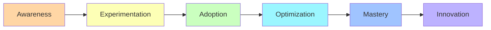

# Pattern Progression in Agentic Engineering

## Overview

This document traces how patterns evolve from basic implementations in TAC-1 through mastery-level sophistication in the Agentic Horizon. Understanding this progression helps developers know where they are in their journey and what comes next.

---

## The Journey of Pattern Evolution

### Pattern Maturity Stages

```
Stage 1: Introduction (First Appearance)
    ↓
Stage 2: Refinement (Improved Implementation)
    ↓
Stage 3: Integration (Combined with Other Patterns)
    ↓
Stage 4: Automation (Self-Managing)
    ↓
Stage 5: Mastery (Self-Evolving)
```

---

## Core Pattern Progressions

### 1. Command Pattern Evolution

#### TAC-1: Birth of Commands
```markdown
# Simple Command
Just do something with basic instructions
```
- **Characteristics**: Freeform, unstructured
- **Example**: Basic "hello agentic coding"
- **Limitations**: No reusability, no variables

#### TAC-2: Structured Commands
```markdown
# Command Name
## Instructions
Specific guidance here
## Process
Step-by-step workflow
```
- **Evolution**: Added structure and sections
- **Example**: `prime.md`, `tools.md`
- **Improvements**: Reusable, clearer purpose

#### TAC-3: Template Commands
```markdown
# Command with Template
## Instructions
## Variables
$ISSUE_TITLE, $ISSUE_BODY
## Plan Format
```markdown template here```
```
- **Evolution**: Added variables and templates
- **Example**: `bug.md`, `feature.md`
- **Improvements**: Dynamic, consistent output

#### TAC-4: Agent Commands
```python
def run_agent_with_template(template, variables):
    # Programmatic command execution
```
- **Evolution**: Commands become programmatic
- **Example**: `classify_issue.md`
- **Improvements**: API-driven, trackable

#### TAC-6: Conditional Commands
```python
if context.has_tests:
    load_command("test_runner")
else:
    load_command("test_creator")
```
- **Evolution**: Context-aware commands
- **Example**: `conditional_docs.md`
- **Improvements**: Adaptive behavior

#### Horizon: Self-Improving Commands
```markdown
## Expertise
[Accumulated learnings from past runs]
## Self-Improvement
Update expertise section after each run
```
- **Evolution**: Commands that learn
- **Example**: Expert prompts
- **Improvements**: Continuous optimization

---

### 2. Workflow Pattern Evolution

#### TAC-1: Single-Step Execution
```
Human → Command → Output
```
- **Characteristics**: Manual, one command at a time
- **Limitations**: No automation, no flow

#### TAC-3: Plan-Then-Build
```
Plan → Implement
```
- **Evolution**: Two-phase workflow
- **Example**: Create spec, then implement
- **Improvements**: Thinking before doing

#### TAC-4: Agent Pipeline
```
Classify → Plan → Build → Commit → PR
```
- **Evolution**: Multi-stage automation
- **Example**: ADW workflow
- **Improvements**: End-to-end automation

#### TAC-5: Test-Integrated Workflow
```
Plan → Build → Test → Fix → Validate
              ↓
         [Auto-retry on failure]
```
- **Evolution**: Quality integration
- **Example**: E2E test workflow
- **Improvements**: Self-correcting

#### TAC-7: Zero-Touch Workflow
```
Issue Created → [Fully Autonomous] → PR Merged
```
- **Evolution**: Complete automation
- **Example**: ZTE implementation
- **Improvements**: No human intervention

#### Horizon: Self-Orchestrating
```
Intent → [AI Determines Workflow] → Result
```
- **Evolution**: Dynamic workflow generation
- **Example**: Orchestrator patterns
- **Improvements**: Adaptive execution

---

### 3. Testing Pattern Evolution

#### TAC-1-2: No Testing
- **State**: Testing not addressed
- **Reality**: Manual testing assumed

#### TAC-3: Planning for Tests
```markdown
## Validation Commands
- Run these commands to verify
```
- **Evolution**: Test planning introduced
- **Improvements**: Explicit validation

#### TAC-5: Automated Testing
```python
@pytest.mark.asyncio
async def test_feature():
    # Automated test execution
```
- **Evolution**: Real test automation
- **Example**: Playwright E2E tests
- **Improvements**: Reliable validation

#### TAC-5: Self-Fixing Tests
```python
if test_failed:
    analyze_failure()
    generate_fix()
    apply_fix()
    rerun_test()
```
- **Evolution**: Auto-remediation
- **Example**: `resolve_failed_test.md`
- **Improvements**: Reduced manual intervention

#### TAC-6: Visual Testing
```python
screenshot = await page.screenshot()
compare_with_baseline(screenshot)
```
- **Evolution**: UI validation
- **Example**: MCP browser testing
- **Improvements**: Catches visual bugs

#### TAC-7: Continuous Validation
```
Every Change → Validate → Continue/Fix
```
- **Evolution**: Built-in quality gates
- **Improvements**: Early detection

#### Horizon: Predictive Testing
```python
predict_failure_risk(change)
generate_preventive_tests(risk_areas)
```
- **Evolution**: Proactive testing
- **Future**: AI-predicted test generation

---

### 4. Context Management Evolution

#### TAC-1-3: Full Context Loading
```python
# Load everything
context = load_all_files()
```
- **Characteristics**: No optimization
- **Problems**: Token limits, slow

#### TAC-4: Selective Context
```python
# Load relevant files only
context = load_files(["app.py", "test.py"])
```
- **Evolution**: Manual selection
- **Improvements**: Reduced tokens

#### TAC-6: Conditional Context
```python
if task_type == "bug":
    load_bug_context()
elif task_type == "feature":
    load_feature_context()
```
- **Evolution**: Task-based loading
- **Example**: `conditional_docs.md`
- **Improvements**: Relevant context

#### Horizon: Context Bundling
```python
bundle = create_bundle(related_files)
save_bundle("feature_x", bundle)
# Reuse later
```
- **Evolution**: Reusable context packages
- **Example**: Context bundle builder
- **Improvements**: Efficiency

#### Horizon: Reduce & Delegate
```python
main_agent = minimal_context()
sub_agents = [
    focused_context_a(),
    focused_context_b()
]
```
- **Evolution**: Strategic distribution
- **Example**: R&D framework
- **Improvements**: Optimal performance

#### Horizon: Context Measurement
```python
@measure_context
def agent_task():
    # Automatic measurement
    # Token counting
    # Relevance scoring
```
- **Evolution**: Scientific approach
- **Improvements**: Data-driven optimization

---

### 5. Agent Architecture Evolution

#### TAC-1: Single Claude CLI
```bash
claude "Do something"
```
- **Characteristics**: Direct CLI usage
- **Limitations**: No structure

#### TAC-2-3: Command-Based Agents
```bash
claude run .claude/commands/implement.md
```
- **Evolution**: Structured commands
- **Improvements**: Reusability

#### TAC-4: Specialized Agents
```python
agents = {
    "planner": PlannerAgent(),
    "implementor": ImplementorAgent(),
    "reviewer": ReviewerAgent()
}
```
- **Evolution**: Role specialization
- **Example**: ADW agents
- **Improvements**: Focused expertise

#### TAC-7: Multi-Agent Systems
```python
class AgentOrchestrator:
    def coordinate(self, agents, task):
        # Multi-agent coordination
```
- **Evolution**: Agent teams
- **Example**: ISO workflows
- **Improvements**: Parallel execution

#### TAC-8: Architecture Patterns
```
1. Minimum Viable
2. Minimal Agent
3. Standard
4. Scaled
5. Advanced
```
- **Evolution**: Multiple architectures
- **Improvements**: Fit for purpose

#### Horizon: Self-Building Agents
```yaml
meta-agent:
  creates: other-agents
  based-on: requirements
```
- **Evolution**: Agents creating agents
- **Example**: meta-agent.md
- **Improvements**: Dynamic capabilities

#### Horizon: Orchestrated Ecosystems
```python
class MultiAgentOrchestrator:
    async def natural_language_control(self, intent):
        # Interpret and execute
```
- **Evolution**: Living systems
- **Example**: Production orchestrator
- **Improvements**: Self-managing

---

### 6. Documentation Pattern Evolution

#### TAC-1-3: Manual Documentation
- **State**: Human-written docs
- **Problems**: Gets outdated

#### TAC-6: Auto-Documentation
```python
def generate_docs(codebase):
    # Analyze and document
```
- **Evolution**: Generated documentation
- **Example**: `document.md` command
- **Improvements**: Always current

#### TAC-6: Conditional Documentation
```python
if working_on("auth"):
    show_auth_docs()
```
- **Evolution**: Context-aware docs
- **Improvements**: Relevant information

#### TAC-7: Living Documentation
```
Code Change → Update Docs → Index → Serve
```
- **Evolution**: Real-time updates
- **Improvements**: Never outdated

#### Horizon: Self-Organizing Knowledge
```python
class KnowledgeGraph:
    def auto_organize(self):
        # Self-structuring docs
```
- **Evolution**: Intelligent organization
- **Future**: AI-curated knowledge

---

## Pattern Progression Timelines

### Typical Learning Path (6-8 Weeks)

```
Week 1-2: TAC 1-3 Patterns
├─ Basic commands
├─ Structured templates
└─ Simple workflows

Week 3-4: TAC 4-5 Patterns
├─ Agent pipelines
├─ GitHub integration
├─ Automated testing
└─ Error recovery

Week 5-6: TAC 6-7 Patterns
├─ Documentation automation
├─ Quality gates
├─ Multi-agent coordination
└─ Zero-touch engineering

Week 7-8: TAC-8 + Horizon
├─ Architecture patterns
├─ Advanced prompting
├─ Context optimization
└─ Orchestration mastery
```

### Pattern Adoption Stages



---

## Module-by-Module Pattern Introduction

### TAC-1: Foundation
**New Patterns**:
- Agentic Layer Pattern
- Basic Command Structure

**Key Learning**: Separation of concerns

### TAC-2: Structure
**New Patterns**:
- Command as Component
- Project Organization

**Evolution**: Commands become reusable

### TAC-3: Planning
**New Patterns**:
- Structured Templates
- Plan-Build Workflow
- Variable Injection

**Evolution**: Thinking before doing

### TAC-4: Automation
**New Patterns**:
- Agent Pipeline
- GitHub Integration
- ADW ID Tracking
- Issue-to-PR Workflow

**Evolution**: End-to-end automation

### TAC-5: Testing
**New Patterns**:
- E2E Testing
- Test Failure Resolution
- Self-Correcting Systems

**Evolution**: Quality automation

### TAC-6: Knowledge
**New Patterns**:
- Auto-Documentation
- Conditional Context
- Visual Testing

**Evolution**: Self-documenting systems

### TAC-7: Production
**New Patterns**:
- Zero-Touch Engineering
- Worktree Isolation
- Quality Gates
- KPI Tracking

**Evolution**: Production-ready systems

### TAC-8: Architecture
**New Patterns**:
- Multi-Architecture
- Pattern Selection
- Scaled Systems

**Evolution**: Architectural thinking

### Horizon: Mastery
**New Patterns**:
- Self-Improving Prompts
- Meta-Agents
- Reduce & Delegate
- Multi-Agent Orchestration

**Evolution**: Self-evolving systems

---

## Pattern Complexity Progression

### Complexity Levels

```
Level 1: Simple (Single-Purpose)
    ↓
Level 2: Composite (Multi-Component)
    ↓
Level 3: Integrated (Cross-System)
    ↓
Level 4: Autonomous (Self-Managing)
    ↓
Level 5: Evolving (Self-Improving)
```

### Pattern Examples by Complexity

#### Level 1: Simple
- Basic Commands (TAC-1)
- Variable Injection (TAC-3)
- File Operations

#### Level 2: Composite
- Plan-Build Workflow (TAC-3)
- Agent Pipeline (TAC-4)
- Test Suites (TAC-5)

#### Level 3: Integrated
- Issue-to-PR (TAC-4)
- Plan-Build-Test-Ship (TAC-7)
- GitHub Integration

#### Level 4: Autonomous
- Zero-Touch Engineering (TAC-7)
- Self-Healing Systems
- Auto-Documentation (TAC-6)

#### Level 5: Evolving
- Self-Improving Prompts (Horizon)
- Meta-Agents (Horizon)
- Predictive Systems

---

## Pattern Evolution Principles

### 1. Progressive Disclosure
```
Simple Interface → Advanced Options → Full Control
```
Each pattern starts simple and reveals complexity gradually.

### 2. Backward Compatibility
```
New Version ⊃ Old Version
```
Evolved patterns maintain core functionality of predecessors.

### 3. Composability First
```
Small Pattern + Small Pattern = Big Pattern
```
Patterns evolve to work better together.

### 4. Automation Gradient
```
Manual → Assisted → Semi-Auto → Full-Auto → Self-Managing
```
Every pattern moves toward greater automation.

### 5. Intelligence Accumulation
```
Static → Dynamic → Adaptive → Predictive → Creative
```
Patterns gain intelligence over time.

---

## Recognizing Your Stage

### Beginner (TAC 1-3)
**You're here if**:
- Writing individual commands
- Planning before implementing
- Using templates and variables

**Next Steps**:
- Learn agent pipelines
- Integrate with GitHub
- Add automation

### Intermediate (TAC 4-6)
**You're here if**:
- Building agent pipelines
- Automating workflows
- Running automated tests
- Generating documentation

**Next Steps**:
- Add quality gates
- Implement multi-agent systems
- Move toward zero-touch

### Advanced (TAC 7-8)
**You're here if**:
- Running zero-touch workflows
- Using multiple architectures
- Production deployments
- Full observability

**Next Steps**:
- Master prompt engineering
- Build custom agents
- Implement orchestration

### Master (Horizon)
**You're here if**:
- Creating self-improving systems
- Building meta-agents
- Orchestrating ecosystems
- Innovating new patterns

**Next Steps**:
- Pioneer new patterns
- Share knowledge
- Push boundaries

---

## Future Pattern Evolution

### Near-Term (Next 6-12 Months)
- **Predictive Patterns**: AI anticipates needs
- **Cross-Model Patterns**: Multi-model orchestration
- **Domain-Specific Patterns**: Industry specialization

### Medium-Term (1-2 Years)
- **Emergent Patterns**: Unexpected capabilities
- **Swarm Patterns**: Large-scale coordination
- **Creative Patterns**: Novel solution generation

### Long-Term (2-5 Years)
- **Conscious Patterns**: Self-aware systems
- **Evolutionary Patterns**: Natural selection
- **Quantum Patterns**: Quantum-enhanced AI

---

## Key Insights on Pattern Progression

### 1. Natural Evolution Path
Patterns follow a natural progression from simple to complex, manual to automated, static to dynamic.

### 2. Accumulative Learning
Each stage builds on previous knowledge; skipping stages often leads to confusion.

### 3. Problem-Driven Evolution
Patterns evolve in response to real problems encountered in previous stages.

### 4. Convergence Toward Autonomy
All patterns trend toward self-management and self-improvement.

### 5. Infinite Ceiling
There's no upper limit to pattern sophistication; innovation continues.

---

## Conclusion

The progression of patterns in Agentic Engineering represents a journey from simple automation to sophisticated self-evolving systems. Each TAC module introduces patterns that solve problems from the previous level, creating a natural learning progression.

Understanding this progression helps developers:
1. **Locate themselves** in the journey
2. **Plan their learning** path
3. **Anticipate challenges** ahead
4. **Choose appropriate** patterns
5. **Innovate beyond** current patterns

The key is not to rush through progressions but to deeply understand each stage before moving forward. Mastery comes from not just using advanced patterns, but understanding why they evolved and when simpler patterns might still be the right choice.