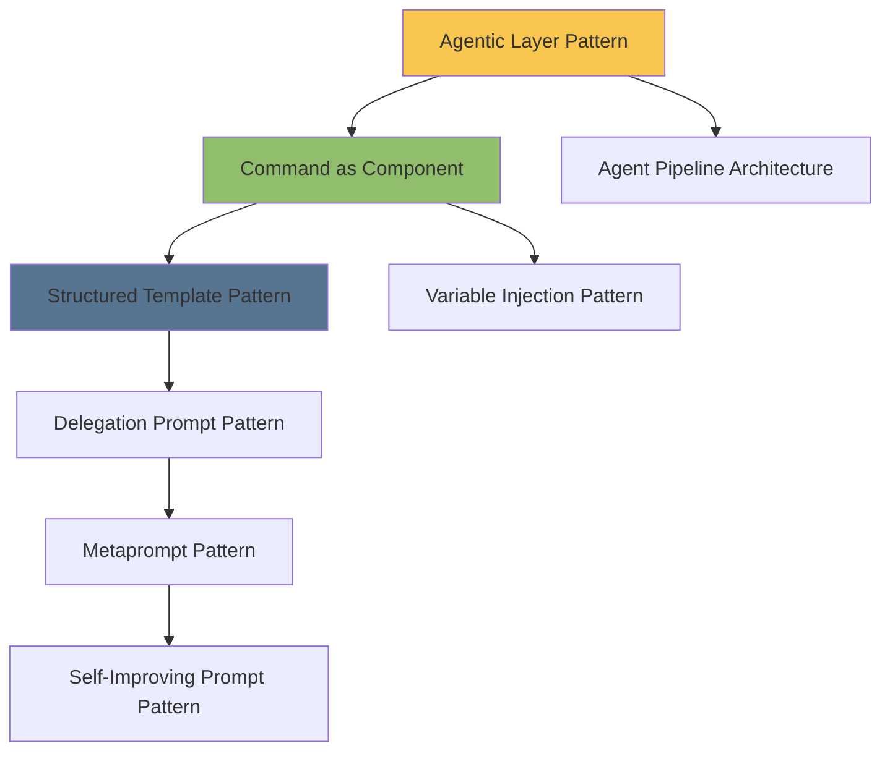
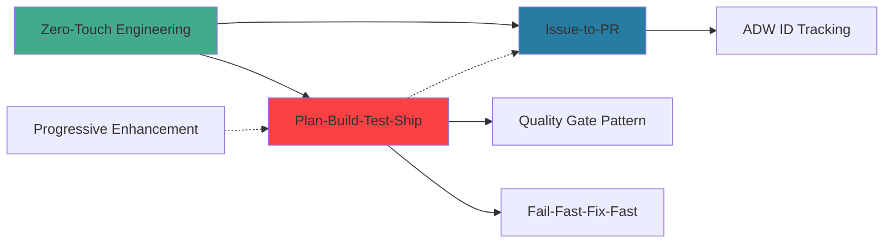
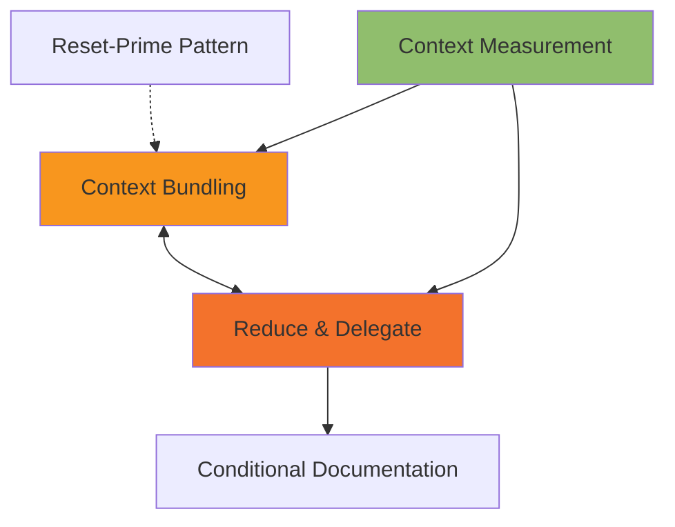
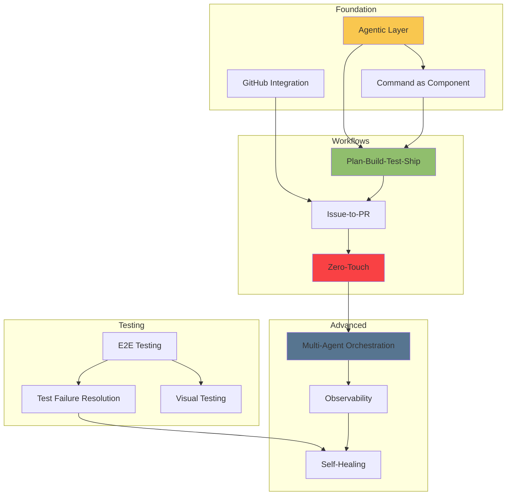

# Pattern Relationships in Agentic Engineering

## Overview

This document maps the relationships between patterns in the Agentic Engineering pattern library. Understanding these relationships is crucial for effective pattern composition and system design.

## Relationship Types

### 1. Prerequisites (→)
One pattern requires another to function properly

### 2. Complements (↔)
Patterns that work better together

### 3. Alternatives (⊕)
Different patterns solving similar problems

### 4. Compositions (⊗)
Patterns that combine to form larger patterns

### 5. Evolution (⇒)
How patterns evolve into more sophisticated versions

---

## Core Pattern Relationships

### Foundational Relationships



**Key Insights**:
- The Agentic Layer Pattern is the foundation for all other patterns
- Command patterns build on top of the layer structure
- Prompting patterns form an evolutionary hierarchy

### Workflow Relationships



**Key Insights**:
- Plan-Build-Test-Ship is the core workflow pattern
- Issue-to-PR extends PBTS with GitHub integration
- Zero-Touch Engineering orchestrates multiple workflow patterns

### Context Management Relationships



**Key Insights**:
- Context patterns work together to optimize performance
- Measurement informs bundling and delegation decisions
- Reset-Prime provides recovery mechanism

---

## Pattern Compositions

### 1. Complete Development System

```
Agentic Layer + Command Components + Agent Pipeline + Issue-to-PR + Plan-Build-Test-Ship + Quality Gates
= Autonomous Development System
```

**Components**:
- **Foundation**: Agentic Layer Pattern
- **Building Blocks**: Command as Component Pattern
- **Orchestration**: Agent Pipeline Architecture
- **Workflow**: Issue-to-PR + Plan-Build-Test-Ship
- **Quality**: Quality Gate Pattern

**Result**: Full TAC-7 style development automation

### 2. Resilient Testing Framework

```
E2E Testing + Test Failure Resolution + Visual Testing + Continuous Validation + Self-Healing
= Self-Correcting Test System
```

**Components**:
- **Core Testing**: E2E Browser Testing Pattern
- **Recovery**: Test Failure Resolution Pattern
- **Validation**: Visual Testing Pattern
- **Monitoring**: Continuous Validation Pattern
- **Resilience**: Self-Healing Pattern

**Result**: TAC-5/6 style testing automation

### 3. Scalable Agent Ecosystem

```
Multi-Agent Orchestration + Context Bundling + Reduce & Delegate + State Persistence + Observability
= Production Agent System
```

**Components**:
- **Orchestration**: Multi-Agent Orchestration Pattern
- **Optimization**: Context Bundling + Reduce & Delegate
- **Persistence**: State Persistence Pattern
- **Monitoring**: Observability Pattern

**Result**: Horizon-level orchestration system

### 4. Intelligent Prompt System

```
Structured Templates + Variable Injection + Delegation + Metaprompts + Self-Improvement
= Evolving Prompt Architecture
```

**Components**:
- **Foundation**: Structured Template Pattern
- **Dynamics**: Variable Injection Pattern
- **Scaling**: Delegation Prompt Pattern
- **Generation**: Metaprompt Pattern
- **Evolution**: Self-Improving Prompt Pattern

**Result**: Horizon Level 7 prompt system

---

## Pattern Prerequisites

### Essential Prerequisites

| Pattern | Requires | Why |
|---------|----------|-----|
| Agent Pipeline | Agentic Layer | Needs .claude structure |
| Issue-to-PR | GitHub Integration | Depends on GitHub API |
| Multi-Agent Orchestration | Agent Pipeline | Builds on pipeline concept |
| Self-Improving Prompts | Metaprompts | Needs generation capability |
| Zero-Touch Engineering | All workflow patterns | Orchestrates everything |
| Worktree Isolation | Git knowledge | Requires Git worktrees |
| Test Failure Resolution | E2E Testing | Needs tests to fix |
| Context Bundling | Context Measurement | Needs metrics to optimize |

### Recommended Prerequisites

| Pattern | Benefits From | Why |
|---------|---------------|-----|
| Quality Gates | Observability | Better metrics |
| Canary Deployment | Feature Flags | Controlled rollout |
| Self-Healing | Observability | Detection capability |
| Reduce & Delegate | Context Measurement | Informed decisions |
| Progressive Enhancement | Plan-Build-Test-Ship | Structured approach |

---

## Pattern Alternatives

### Workflow Alternatives

```
Manual Commands ⊕ Simple Scripts ⊕ Agent Pipeline ⊕ Full Orchestration
```

Choose based on:
- **Scale**: How many tasks?
- **Frequency**: How often run?
- **Complexity**: How intricate?
- **Team Size**: How many developers?

### Testing Alternatives

```
No Testing ⊕ Manual Testing ⊕ Unit Testing ⊕ E2E Testing ⊕ Visual Testing
```

Choose based on:
- **Application Type**: API vs UI?
- **Risk Tolerance**: Critical system?
- **Resources**: Time and compute?
- **Team Skills**: Testing expertise?

### Deployment Alternatives

```
Direct Deploy ⊕ Blue-Green ⊕ Canary ⊕ Feature Flags ⊕ Progressive Rollout
```

Choose based on:
- **Risk Level**: How critical?
- **User Base**: How many affected?
- **Rollback Needs**: How quick recovery?
- **Infrastructure**: What's available?

### Context Management Alternatives

```
Full Context ⊕ Manual Selection ⊕ Conditional Loading ⊕ Bundling ⊕ Reduce & Delegate
```

Choose based on:
- **Codebase Size**: How large?
- **Task Complexity**: How focused?
- **Performance Needs**: Token limits?
- **Agent Capabilities**: Model constraints?

---

## Pattern Evolution Paths

### Prompting Evolution

```
Static Prompts
    ⇒ Variable Templates (TAC-2)
    ⇒ Structured Templates (TAC-3)
    ⇒ Delegation Prompts (TAC-4)
    ⇒ Metaprompts (Horizon L6)
    ⇒ Self-Improving (Horizon L7)
```

### Workflow Evolution

```
Manual Execution
    ⇒ Scripted Commands (TAC-1)
    ⇒ Plan-Build (TAC-3)
    ⇒ Plan-Build-Test (TAC-5)
    ⇒ Full SDLC (TAC-7)
    ⇒ Zero-Touch (TAC-7)
    ⇒ Self-Managing (Horizon)
```

### Testing Evolution

```
No Testing
    ⇒ Manual Testing
    ⇒ Automated Tests (TAC-5)
    ⇒ Self-Fixing Tests (TAC-5)
    ⇒ Visual Testing (TAC-6)
    ⇒ Continuous Validation (TAC-7)
    ⇒ Predictive Testing (Future)
```

### Architecture Evolution

```
Single File Scripts
    ⇒ Command Structure (TAC-2)
    ⇒ Agent Pipeline (TAC-4)
    ⇒ Multi-Agent (TAC-7)
    ⇒ Orchestrated Systems (Horizon)
    ⇒ Self-Organizing (Future)
```

---

## Pattern Interaction Matrix

### Synergistic Combinations

| Pattern A | Pattern B | Synergy | Result |
|-----------|-----------|---------|--------|
| Agent Pipeline | ADW Tracking | Complete traceability | Full audit trail |
| Context Bundling | Reduce & Delegate | Optimal performance | Minimal token usage |
| Test Failure Resolution | Self-Healing | Resilient testing | Auto-fixing tests |
| Multi-Agent | State Persistence | Continuity | Resumable workflows |
| Quality Gates | Observability | Informed decisions | Data-driven quality |
| Issue-to-PR | Plan-Build-Test-Ship | Complete automation | End-to-end flow |
| Metaprompts | Self-Improvement | Evolution | Adaptive prompts |
| Worktree Isolation | Parallel Execution | Speed | Concurrent development |

### Conflicting Patterns

| Pattern A | Pattern B | Conflict | Resolution |
|-----------|-----------|----------|------------|
| Full Context | Reduce & Delegate | Token limits | Choose based on task |
| Blue-Green | Canary | Resource usage | Pick one approach |
| Synchronous | Asynchronous | Execution model | Design decision |
| Centralized | Distributed | Architecture | Depends on scale |

---

## Pattern Dependency Graph

### Core Dependencies



---

## Pattern Selection Decision Tree

### Starting a New Project

```
Q: Scale of project?
├─ Small/Personal
│  └─ Use: Agentic Layer + Commands
├─ Medium/Team
│  └─ Use: + Agent Pipeline + GitHub Integration
└─ Large/Enterprise
   └─ Use: + Multi-Agent Orchestration + Full Observability

Q: Development complexity?
├─ Simple CRUD
│  └─ Use: Plan-Build pattern
├─ Complex Logic
│  └─ Use: Plan-Build-Test-Ship pattern
└─ Mission Critical
   └─ Use: + Quality Gates + Self-Healing

Q: Deployment needs?
├─ Development only
│  └─ Use: Direct deployment
├─ Staging + Production
│  └─ Use: Blue-Green or Canary
└─ Global/Scaled
   └─ Use: Progressive Rollout + Feature Flags
```

### Optimizing Existing System

```
Q: Primary bottleneck?
├─ Development Speed
│  └─ Add: Agent Pipeline + Issue-to-PR
├─ Quality Issues
│  └─ Add: Testing Patterns + Quality Gates
├─ Context Overload
│  └─ Add: Reduce & Delegate + Context Bundling
└─ Operational Issues
   └─ Add: Observability + Self-Healing
```

---

## Pattern Maturity Model

### Level 1: Basic Automation
- Agentic Layer Pattern
- Command as Component
- Structured Templates

### Level 2: Workflow Automation
- + Agent Pipeline
- + Plan-Build Pattern
- + GitHub Integration

### Level 3: Quality Automation
- + Testing Patterns
- + Quality Gates
- + Test Failure Resolution

### Level 4: Full Automation
- + Issue-to-PR
- + Plan-Build-Test-Ship
- + Continuous Validation

### Level 5: Production Systems
- + Multi-Agent Orchestration
- + Observability
- + Self-Healing
- + State Persistence

### Level 6: Mastery
- + Self-Improving Prompts
- + Zero-Touch Engineering
- + Predictive Systems
- + Self-Organizing Architectures

---

## Common Pattern Combinations

### The Starter Pack
```
Agentic Layer + Command as Component + Structured Templates
```
**Use Case**: Getting started with agentic development

### The Developer Workflow
```
GitHub Integration + Issue-to-PR + Plan-Build-Test-Ship
```
**Use Case**: Automating development workflow

### The Quality Suite
```
E2E Testing + Test Failure Resolution + Visual Testing + Quality Gates
```
**Use Case**: Ensuring code quality

### The Production System
```
Multi-Agent Orchestration + State Persistence + Observability + Self-Healing
```
**Use Case**: Running production agent systems

### The Context Optimizer
```
Context Measurement + Context Bundling + Reduce & Delegate + Conditional Docs
```
**Use Case**: Optimizing large codebase work

### The Deployment Pipeline
```
Quality Gates + Blue-Green/Canary + Feature Flags + Rollback
```
**Use Case**: Safe production deployments

---

## Anti-Patterns to Avoid

### Pattern Conflicts

1. **Over-Orchestration**
   - Don't use Multi-Agent for simple tasks
   - Single agent is often sufficient

2. **Context Overload**
   - Don't load everything at once
   - Use Reduce & Delegate strategically

3. **Testing Overkill**
   - Don't test everything with E2E
   - Match testing strategy to risk

4. **Premature Optimization**
   - Don't start with complex patterns
   - Evolve patterns as needed

### Pattern Misuse

1. **Wrong Pattern for Context**
   - Blue-Green for small apps (wasteful)
   - Manual testing for critical systems (risky)
   - Full orchestration for simple scripts (overkill)

2. **Missing Prerequisites**
   - Multi-Agent without Agent Pipeline
   - Self-Improving without Metaprompts
   - Test Resolution without Tests

3. **Incompatible Combinations**
   - Synchronous and Asynchronous execution
   - Centralized and Distributed state
   - Manual and Automated workflows

---

## Conclusion

Understanding pattern relationships is crucial for effective agentic engineering. The key principles are:

1. **Start Simple**: Begin with foundational patterns
2. **Build Up**: Add patterns as complexity grows
3. **Compose Wisely**: Combine complementary patterns
4. **Evolve Gradually**: Follow natural evolution paths
5. **Avoid Conflicts**: Understand incompatibilities

The relationships between patterns form a rich tapestry that enables everything from simple automation to complex self-managing systems. Mastery comes from understanding not just individual patterns, but how they interact, compose, and evolve together.