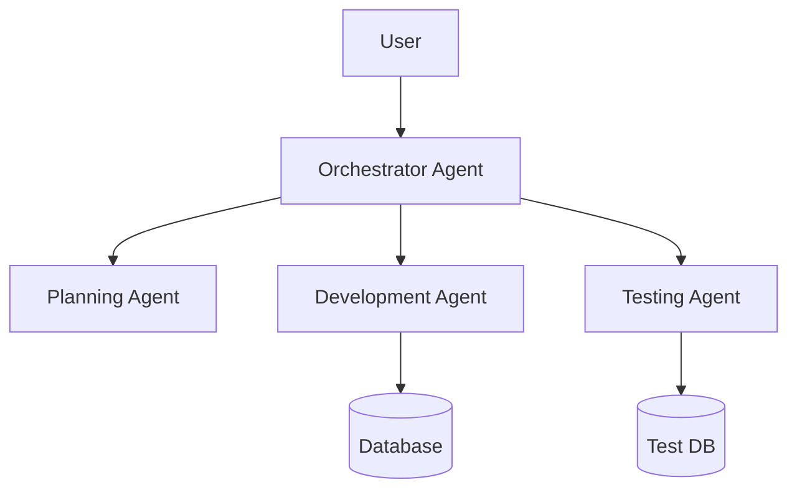

# Agentic Instructor

## Purpose

Transfer knowledge about agentic systems through documentation, tutorials, and structured learning paths. Guide teams through the journey from traditional development to autonomous AI-powered systems, following the proven TAC progression methodology.

## When to Use

- Onboarding new team members to agentic development
- Documenting agentic system architectures and patterns
- Creating tutorials for specific agent implementations
- Building internal knowledge bases for agentic practices
- Developing training materials for workshops
- Explaining complex agentic concepts to stakeholders
- Creating runbooks and operational guides
- Establishing team best practices and conventions

## How It Works

### Step 1: Assess Learning Needs

```python
class LearningAssessment:
    """Assess team's current knowledge and learning needs"""

    def __init__(self):
        self.skill_levels = {
            "beginner": "No AI/agent experience",
            "intermediate": "Basic AI usage, no agent building",
            "advanced": "Can build simple agents",
            "expert": "Designs agent systems"
        }

    def assess_team(self, team_members: List[dict]) -> dict:
        """Assess team's collective knowledge"""
        assessments = []

        for member in team_members:
            assessment = {
                "name": member["name"],
                "current_level": self.evaluate_skills(member),
                "learning_goals": self.identify_goals(member),
                "recommended_path": self.create_path(member)
            }
            assessments.append(assessment)

        return {
            "individual_assessments": assessments,
            "team_summary": self.summarize_team(assessments),
            "curriculum": self.design_curriculum(assessments)
        }

    def evaluate_skills(self, member: dict) -> str:
        """Evaluate individual skill level"""
        skills_checklist = [
            ("Has used AI assistants", 1),
            ("Understands prompting", 2),
            ("Can write structured prompts", 3),
            ("Has built simple automations", 4),
            ("Understands agent concepts", 5),
            ("Can design workflows", 6),
            ("Has built custom agents", 7),
            ("Can architect systems", 8)
        ]

        score = sum(points for skill, points in skills_checklist
                   if member.get(skill, False))

        if score <= 2:
            return "beginner"
        elif score <= 5:
            return "intermediate"
        elif score <= 7:
            return "advanced"
        else:
            return "expert"
```

### Step 2: Create Learning Paths

#### TAC-Based Progressive Learning Path

```markdown
## Learning Path: Beginner to Agentic Architect

### Phase 1: Foundation (Weeks 1-2)
**Corresponds to TAC-1 & TAC-2**

#### Week 1: Paradigm Shift
- **Day 1-2**: Introduction to Agentic Development
  - Traditional vs Agentic coding
  - Understanding autonomous systems
  - **Lab**: First agent interaction

- **Day 3-4**: Structured Prompting
  - Prompt engineering basics
  - Command patterns
  - **Lab**: Create your first command

- **Day 5**: Permissions and Safety
  - Agent permissions model
  - Safety considerations
  - **Lab**: Configure agent permissions

#### Week 2: Structure & Organization
- **Day 1-2**: Command Systems
  - Directory structures
  - Reusable components
  - **Lab**: Build command library

- **Day 3-4**: Real Applications
  - Case study: NLQ-to-SQL
  - Practical patterns
  - **Lab**: Implement basic automation

- **Day 5**: Review and Practice
  - Hands-on exercises
  - Q&A session

### Phase 2: Automation (Weeks 3-4)
**Corresponds to TAC-3 & TAC-4**

#### Week 3: SDLC Workflows
- **Day 1-2**: BFC Pattern
  - Bug/Feature/Chore workflows
  - Planning before implementation
  - **Lab**: Create BFC templates

- **Day 3-4**: Structured Development
  - SDLC integration
  - Quality gates
  - **Lab**: Automate development workflow

- **Day 5**: Advanced Workflows
  - Complex orchestration
  - Error handling
  - **Lab**: Multi-stage pipeline

#### Week 4: Agent Development
- **Day 1-2**: ADW Introduction
  - Agentic Development Workflow
  - Multi-agent pipelines
  - **Lab**: Build first ADW

- **Day 3-4**: GitHub Integration
  - Issue-to-PR automation
  - Code review agents
  - **Lab**: GitHub workflow

- **Day 5**: Testing & Validation
  - E2E testing with agents
  - Validation strategies
  - **Lab**: Automated testing

### Phase 3: Production (Weeks 5-6)
**Corresponds to TAC-5, TAC-6, TAC-7**

#### Week 5: Enterprise Features
- **Day 1-2**: Knowledge Management
  - Self-documenting systems
  - Auto-documentation
  - **Lab**: Documentation pipeline

- **Day 3-4**: Quality & Testing
  - Advanced testing patterns
  - Performance optimization
  - **Lab**: Complete test suite

- **Day 5**: Integration
  - MCP servers
  - API connections
  - **Lab**: System integration

#### Week 6: Complete Systems
- **Day 1-2**: ISO Patterns
  - Issue/Solution/Output
  - Modular composition
  - **Lab**: ISO implementation

- **Day 3-4**: ZTE
  - Zero Touch Execution
  - Full automation
  - **Lab**: ZTE pipeline

- **Day 5**: Production Deployment
  - Deployment strategies
  - Monitoring
  - **Lab**: Deploy to production

### Phase 4: Mastery (Week 7-8)
**Corresponds to TAC-8 & Agentic Horizon**

#### Week 7: Architecture Patterns
- **Day 1-2**: Five Architectures
  - API + WebSocket
  - Browser Extension
  - GitHub App
  - CLI Tool
  - Full Stack Web
  - **Lab**: Implement each pattern

- **Day 3-4**: Pattern Selection
  - Choosing architectures
  - Trade-offs
  - **Lab**: Architecture decisions

- **Day 5**: Advanced Patterns
  - Hybrid approaches
  - Custom patterns
  - **Lab**: Design custom architecture

#### Week 8: Agentic Horizon
- **Day 1-2**: Advanced Prompting
  - 7 levels mastery
  - Meta-prompts
  - **Lab**: Level 7 prompts

- **Day 3-4**: Elite Context Engineering
  - R&D Framework
  - Optimization techniques
  - **Lab**: Context optimization

- **Day 5**: Multi-Agent Orchestration
  - Complex orchestration
  - Production systems
  - **Final Project**: Complete system
```

### Step 3: Create Documentation Templates

#### System Documentation Template
```markdown
# [System Name] - Agentic Architecture Documentation

## Executive Summary
- **Purpose**: [What problem does this solve?]
- **Architecture Pattern**: [Which TAC-8 pattern?]
- **Key Benefits**: [Why agentic approach?]

## System Overview

### Architecture Diagram


### Components

#### 1. Orchestrator Agent
- **Purpose**: Coordinate multi-agent workflow
- **Prompt**: [Link to prompt file]
- **Tools**: GitHub, Slack, Database
- **Triggers**: Issue creation, PR update

#### 2. Planning Agent
- **Purpose**: Create implementation plans
- **Prompt**: [Link to prompt file]
- **Tools**: Read, Analysis
- **Input**: GitHub issue
- **Output**: implementation-plan.md

[Continue for each agent...]

## Workflows

### Issue-to-PR Workflow
1. **Trigger**: New issue with 'ready' label
2. **Planning**: Generate implementation plan
3. **Implementation**: Create code changes
4. **Testing**: Run automated tests
5. **Review**: Code review
6. **Output**: Pull request

### Quality Gates
- Code coverage > 80%
- All tests passing
- Security scan clean
- Documentation updated

## Integration Points

### MCP Servers
```json
{
  "filesystem": "/project",
  "database": "postgresql://...",
  "github": "token:..."
}
```

### API Endpoints
- `POST /api/tasks` - Submit task
- `GET /api/status/{id}` - Check status
- `WS /ws` - Real-time updates

## Operations Guide

### Deployment
```bash
# Deploy to production
./deploy.sh production

# Rollback
./rollback.sh v1.2.3
```

### Monitoring
- Metrics: Grafana dashboard
- Logs: CloudWatch
- Alerts: PagerDuty

### Troubleshooting
| Issue | Diagnosis | Solution |
|-------|-----------|----------|
| Agent timeout | Check API limits | Increase timeout |
| Failed tests | Review logs | Fix and retry |

## Development Guide

### Local Setup
```bash
# Clone repository
git clone ...

# Install dependencies
uv pip install -r requirements.txt

# Configure environment
cp .env.example .env

# Run locally
python -m agent_system
```

### Adding New Agents
1. Create agent definition in `.claude/agents/`
2. Add to orchestrator registry
3. Update workflows
4. Add tests

## Best Practices
- Always version prompts
- Test agents in isolation
- Monitor token usage
- Document decisions

## Support
- Slack: #agentic-team
- Wiki: [Internal Wiki Link]
- Training: [Learning Path Link]
```

### Step 4: Build Interactive Tutorials

```python
class InteractiveTutorial:
    """Create interactive learning experiences"""

    def __init__(self, topic: str):
        self.topic = topic
        self.steps = []
        self.checkpoints = []

    def add_step(self, instruction: str, validation: callable = None):
        """Add tutorial step with optional validation"""
        self.steps.append({
            "instruction": instruction,
            "validation": validation,
            "completed": False
        })

    async def run_tutorial(self, user_context: dict):
        """Run interactive tutorial"""
        print(f"Welcome to: {self.topic}")
        print("=" * 50)

        for i, step in enumerate(self.steps, 1):
            print(f"\nStep {i}: {step['instruction']}")

            # Wait for user action
            user_input = await self.get_user_input()

            # Validate if needed
            if step['validation']:
                if step['validation'](user_input, user_context):
                    print("✅ Correct! Moving to next step.")
                    step['completed'] = True
                else:
                    print("❌ Not quite. Let me help...")
                    await self.provide_hint(step)
                    continue

            # Checkpoint
            if i in self.checkpoints:
                await self.save_progress(user_context, i)

        print("\n🎉 Tutorial completed!")
        return self.generate_certificate(user_context)

# Example Tutorial: Building Your First Agent
tutorial = InteractiveTutorial("Building Your First Agent")

tutorial.add_step(
    "Create a new file called 'my-agent.md' in .claude/agents/",
    validation=lambda i, c: os.path.exists(".claude/agents/my-agent.md")
)

tutorial.add_step(
    "Add the agent metadata (name, description, color)",
    validation=lambda i, c: validate_agent_metadata("my-agent.md")
)

tutorial.add_step(
    "Write the agent's system prompt",
    validation=lambda i, c: len(get_agent_prompt("my-agent.md")) > 100
)

tutorial.add_step(
    "Test your agent with a simple task",
    validation=lambda i, c: test_agent_execution("my-agent")
)
```

### Step 5: Create Knowledge Base

```python
class AgenticKnowledgeBase:
    """Searchable knowledge base for agentic concepts"""

    def __init__(self):
        self.articles = {}
        self.index = SearchIndex()
        self.categories = {
            "concepts": [],
            "patterns": [],
            "tutorials": [],
            "reference": [],
            "troubleshooting": []
        }

    def add_article(self, title: str, content: str, category: str, tags: List[str]):
        """Add article to knowledge base"""
        article_id = generate_id(title)

        self.articles[article_id] = {
            "title": title,
            "content": content,
            "category": category,
            "tags": tags,
            "created": datetime.now(),
            "views": 0,
            "helpful": 0
        }

        # Index for search
        self.index.add(article_id, title, content, tags)

        # Add to category
        self.categories[category].append(article_id)

    def search(self, query: str) -> List[dict]:
        """Search knowledge base"""
        results = self.index.search(query)

        return [
            {
                "title": self.articles[id]["title"],
                "snippet": self.get_snippet(id, query),
                "relevance": score
            }
            for id, score in results
        ]

    def get_learning_path(self, skill_level: str) -> List[str]:
        """Get recommended articles for skill level"""
        if skill_level == "beginner":
            return [
                "introduction-to-agentic-development",
                "your-first-agent",
                "understanding-prompts",
                "basic-workflows"
            ]
        elif skill_level == "intermediate":
            return [
                "multi-agent-systems",
                "advanced-prompting",
                "workflow-orchestration",
                "testing-agents"
            ]
        else:  # advanced
            return [
                "architectural-patterns",
                "context-optimization",
                "production-deployment",
                "scaling-strategies"
            ]
```

## Inputs Expected

- **Audience Profile**: Team size, skill levels, roles
- **Learning Objectives**: What team needs to achieve
- **Time Constraints**: Available time for learning
- **System Context**: Existing architecture, tools in use
- **Documentation Needs**: What needs to be documented

## Outputs Provided

1. **Learning Curriculum**
   ```yaml
   curriculum:
     duration: 8 weeks
     phases:
       - foundation
       - automation
       - production
       - mastery
     materials:
       - slides
       - labs
       - projects
     assessments:
       - quizzes
       - projects
       - certification
   ```

2. **Documentation Suite**
   - Architecture documentation
   - API documentation
   - User guides
   - Runbooks
   - Troubleshooting guides

3. **Training Materials**
   - Slide decks
   - Lab exercises
   - Code examples
   - Video tutorials
   - Reference cards

4. **Knowledge Base**
   - Searchable articles
   - Best practices
   - Pattern library
   - FAQ section

## Examples

### Example 1: Onboarding Workshop

```python
class OnboardingWorkshop:
    """3-day intensive agentic development workshop"""

    def __init__(self):
        self.agenda = {
            "day1": {
                "morning": "Agentic Concepts & Theory",
                "afternoon": "Hands-on: First Agent",
                "lab": "Build a simple automation"
            },
            "day2": {
                "morning": "Multi-Agent Systems",
                "afternoon": "Workflow Design",
                "lab": "Create complete workflow"
            },
            "day3": {
                "morning": "Production Patterns",
                "afternoon": "Team Project",
                "demo": "Present solutions"
            }
        }

    def prepare_materials(self, team_size: int):
        """Prepare workshop materials"""
        return {
            "slides": self.generate_slides(),
            "handouts": self.create_handouts(),
            "lab_environments": self.setup_labs(team_size),
            "reference_materials": self.compile_references(),
            "certificates": self.prepare_certificates(team_size)
        }

    def run_day(self, day: int):
        """Execute workshop day"""
        schedule = self.agenda[f"day{day}"]

        # Morning session
        self.present_slides(schedule["morning"])
        self.facilitate_discussion()

        # Afternoon session
        self.present_slides(schedule["afternoon"])

        # Lab/Project
        if "lab" in schedule:
            self.supervise_lab(schedule["lab"])
        elif "demo" in schedule:
            self.run_demonstrations()

        # Daily retrospective
        self.collect_feedback()
```

### Example 2: Documentation Generator

```python
class DocumentationGenerator:
    """Generate documentation from agent systems"""

    def analyze_system(self, project_path: str):
        """Analyze agentic system for documentation"""
        return {
            "agents": self.find_agents(project_path),
            "workflows": self.find_workflows(project_path),
            "integrations": self.find_integrations(project_path),
            "prompts": self.extract_prompts(project_path)
        }

    def generate_docs(self, analysis: dict) -> dict:
        """Generate complete documentation"""
        docs = {}

        # Agent documentation
        for agent in analysis["agents"]:
            docs[f"agents/{agent['name']}"] = self.document_agent(agent)

        # Workflow documentation
        for workflow in analysis["workflows"]:
            docs[f"workflows/{workflow['name']}"] = self.document_workflow(workflow)

        # API documentation
        docs["api/reference"] = self.generate_api_docs(analysis["integrations"])

        # Architecture overview
        docs["architecture"] = self.generate_architecture_doc(analysis)

        # Getting started guide
        docs["getting-started"] = self.generate_getting_started(analysis)

        return docs

    def document_agent(self, agent: dict) -> str:
        """Generate agent documentation"""
        return f"""
# {agent['name']} Agent

## Purpose
{agent['description']}

## Configuration
```yaml
name: {agent['name']}
tools: {agent['tools']}
permissions: {agent['permissions']}
```

## Prompt
```markdown
{agent['prompt']}
```

## Usage Examples
{self.generate_usage_examples(agent)}

## Integration Points
{self.document_integrations(agent)}

## Testing
{self.document_tests(agent)}
"""
```

### Example 3: Learning Analytics

```python
class LearningAnalytics:
    """Track and analyze team learning progress"""

    def __init__(self):
        self.progress_tracker = {}
        self.skill_matrix = {}

    def track_progress(self, user_id: str, activity: dict):
        """Track individual learning progress"""
        if user_id not in self.progress_tracker:
            self.progress_tracker[user_id] = []

        self.progress_tracker[user_id].append({
            "activity": activity["name"],
            "completed": activity["completed"],
            "duration": activity["duration"],
            "score": activity.get("score"),
            "timestamp": datetime.now()
        })

        # Update skill matrix
        self.update_skills(user_id, activity)

    def generate_report(self, team_id: str) -> dict:
        """Generate team learning report"""
        team_members = self.get_team_members(team_id)

        return {
            "summary": {
                "total_members": len(team_members),
                "avg_progress": self.calculate_avg_progress(team_members),
                "completion_rate": self.calculate_completion_rate(team_members),
                "skill_coverage": self.calculate_skill_coverage(team_members)
            },
            "individual_progress": [
                self.get_individual_report(member)
                for member in team_members
            ],
            "recommendations": self.generate_recommendations(team_members),
            "next_steps": self.suggest_next_steps(team_members)
        }

    def identify_knowledge_gaps(self, team_id: str) -> List[str]:
        """Identify areas needing more training"""
        skills_matrix = self.get_team_skills_matrix(team_id)
        required_skills = self.get_required_skills()

        gaps = []
        for skill in required_skills:
            coverage = skills_matrix.get(skill, {}).get("coverage", 0)
            if coverage < 0.7:  # Less than 70% team coverage
                gaps.append(skill)

        return gaps
```

## Troubleshooting

### Common Teaching Challenges

1. **Varying Skill Levels**
   ```python
   def adapt_content(content: str, skill_level: str) -> str:
       if skill_level == "beginner":
           return add_explanations(simplify_language(content))
       elif skill_level == "advanced":
           return add_advanced_notes(content)
       return content
   ```

2. **Abstract Concepts**
   ```python
   def make_concrete(concept: str) -> dict:
       return {
           "analogy": find_real_world_analogy(concept),
           "example": create_practical_example(concept),
           "demonstration": build_interactive_demo(concept),
           "exercise": design_hands_on_exercise(concept)
       }
   ```

3. **Knowledge Retention**
   ```python
   def reinforce_learning(topic: str) -> List[dict]:
       return [
           create_spaced_repetition(topic),
           generate_practice_problems(topic),
           design_real_project(topic),
           setup_peer_review(topic)
       ]
   ```

## Related Skills

- **Workflow Designer**: Document workflow patterns
- **Agentic Architect**: Explain architectural decisions
- **Testing Strategist**: Create testing documentation
- **Agent Builder**: Document agent implementations
- **Prompt Engineer**: Teach prompt engineering

## Key Principles

1. **Progressive Complexity**: Start simple, build up gradually
2. **Hands-On Learning**: Practice is essential for mastery
3. **Real-World Examples**: Use actual use cases and scenarios
4. **Continuous Assessment**: Regular checkpoints and feedback
5. **Collaborative Learning**: Peer learning and knowledge sharing

---

*This skill synthesizes the pedagogical approach from the entire TAC course structure, providing comprehensive capabilities for teaching and documenting agentic systems.*