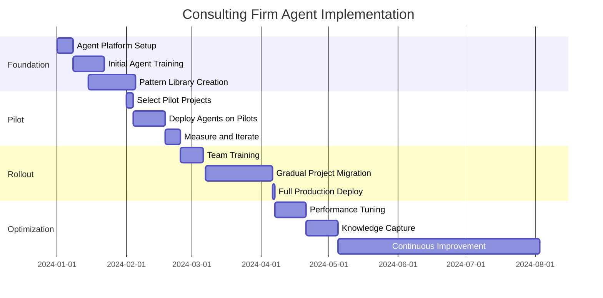

# Case Study: Digital Consulting Firm Managing Multiple Client Projects

## Specialized Agent Library for 50+ Concurrent Projects

### Company Profile
- **Industry:** Digital Transformation Consulting
- **Company:** TechForge Consulting
- **Size:** 120 consultants, 200 total employees
- **Client Base:** 75 active clients across industries
- **Project Types:** Web apps, mobile apps, APIs, data platforms, AI/ML solutions
- **Tech Stacks:** 15+ different technology combinations
- **Annual Revenue:** $45M

## Problem Statement

### The Complexity Crisis

TechForge Consulting faced a perfect storm of challenges managing their growing portfolio of diverse client projects:

### Critical Pain Points

1. **Project Chaos**
   - 50+ concurrent projects
   - 15 different tech stacks
   - No code reusability
   - Inconsistent quality across teams
   - Knowledge silos everywhere

2. **Resource Constraints**
   - Senior developers spread too thin
   - Junior developers taking too long
   - 40% of time on boilerplate code
   - Context switching overhead
   - Expertise bottlenecks

3. **Client Satisfaction Issues**
   - Missed deadlines: 35% of projects
   - Budget overruns: Average 27%
   - Quality inconsistencies
   - Slow response to changes
   - Limited innovation capacity

4. **Operational Inefficiencies**
   - No standardized processes
   - Manual project setup: 2-3 days
   - Code review bottlenecks
   - Documentation always outdated
   - Knowledge lost when consultants leave

### Success Criteria
- Deliver 95% of projects on time
- Reduce project setup time to < 2 hours
- Achieve 80% code reusability
- Maintain consistent quality across all projects
- Reduce senior developer dependency by 50%
- Increase project capacity by 2x without hiring

## Solution Architecture

### Specialized Agent Library System

```yaml
# agent-library-architecture.yaml
agent_library:
  core_agents:
    project_architect:
      purpose: "Project setup and architecture"
      capabilities:
        - Technology stack selection
        - Architecture pattern recommendation
        - Boilerplate generation
        - CI/CD pipeline setup

    code_generator:
      purpose: "Domain-specific code generation"
      specializations:
        - frontend_react
        - frontend_vue
        - backend_node
        - backend_python
        - backend_java
        - mobile_react_native
        - mobile_flutter

    quality_guardian:
      purpose: "Maintain consistent quality"
      capabilities:
        - Code review automation
        - Security scanning
        - Performance analysis
        - Best practice enforcement

  domain_specialists:
    ecommerce_agent:
      expertise:
        - Payment integration
        - Inventory management
        - Order processing
        - Shopping cart optimization

    fintech_agent:
      expertise:
        - Transaction processing
        - Compliance requirements
        - Security protocols
        - Audit trails

    healthcare_agent:
      expertise:
        - HIPAA compliance
        - Patient data management
        - Appointment systems
        - Medical record handling

    saas_agent:
      expertise:
        - Multi-tenancy
        - Subscription management
        - User provisioning
        - API rate limiting

  client_agents:
    requirements_analyst:
      purpose: "Understand client needs"
      capabilities:
        - Natural language processing
        - Requirement extraction
        - Scope definition
        - Change impact analysis

    communication_agent:
      purpose: "Client interaction"
      capabilities:
        - Status report generation
        - Meeting summaries
        - Technical documentation
        - Progress updates
```

### Reusable Pattern Library

```typescript
// Pattern library structure
interface PatternLibrary {
  architectures: {
    microservices: MicroservicesTemplate;
    serverless: ServerlessTemplate;
    monolithic: MonolithicTemplate;
    eventDriven: EventDrivenTemplate;
  };

  components: {
    authentication: AuthComponent[];
    authorization: AuthzComponent[];
    payments: PaymentComponent[];
    notifications: NotificationComponent[];
    analytics: AnalyticsComponent[];
  };

  integrations: {
    stripe: StripeIntegration;
    aws: AWSIntegration;
    azure: AzureIntegration;
    salesforce: SalesforceIntegration;
  };

  workflows: {
    cicd: CICDWorkflow[];
    testing: TestingWorkflow[];
    deployment: DeploymentWorkflow[];
    monitoring: MonitoringWorkflow[];
  };
}
```

## Implementation Journey

### Phase 1: Building the Foundation (Weeks 1-4)

#### Week 1: Agent Library Architecture

```typescript
// Core agent library implementation
class AgentLibraryManager {
  private agents: Map<string, SpecializedAgent> = new Map();
  private patterns: PatternLibrary;
  private metrics: MetricsCollector;

  async initializeProject(request: ProjectRequest): Promise<Project> {
    // Step 1: Analyze requirements
    const analysis = await this.analyzeRequirements(request);

    // Step 2: Select appropriate agents
    const agentTeam = await this.assembleAgentTeam(analysis);

    // Step 3: Generate project structure
    const project = await this.generateProject(analysis, agentTeam);

    // Step 4: Setup development environment
    await this.setupEnvironment(project);

    return project;
  }

  private async assembleAgentTeam(analysis: RequirementAnalysis): Promise<AgentTeam> {
    const team: AgentTeam = {
      lead: this.selectLeadAgent(analysis),
      specialists: [],
      supporters: []
    };

    // Select domain specialist
    if (analysis.domain === 'ecommerce') {
      team.specialists.push(this.agents.get('ecommerce_specialist'));
    } else if (analysis.domain === 'fintech') {
      team.specialists.push(this.agents.get('fintech_specialist'));
    }

    // Select tech stack specialists
    team.specialists.push(
      ...this.selectTechStackAgents(analysis.techStack)
    );

    // Add quality and testing agents
    team.supporters.push(
      this.agents.get('quality_guardian'),
      this.agents.get('test_generator')
    );

    return team;
  }
}
```

#### Week 2: Pattern Development

```javascript
// Reusable pattern example: Multi-tenant SaaS architecture
const multiTenantPattern = {
  name: "Multi-Tenant SaaS",

  architecture: {
    database: "PostgreSQL with Row Level Security",
    caching: "Redis with tenant isolation",
    storage: "S3 with tenant prefixes",
    queue: "SQS with tenant routing"
  },

  components: {
    tenantResolver: `
      export class TenantResolver {
        async resolve(request: Request): Promise<Tenant> {
          // Extract from subdomain
          const subdomain = this.extractSubdomain(request.hostname);
          if (subdomain) {
            return await this.tenantService.getBySubdomain(subdomain);
          }

          // Extract from header
          const tenantId = request.headers['x-tenant-id'];
          if (tenantId) {
            return await this.tenantService.getById(tenantId);
          }

          throw new Error('Tenant not found');
        }
      }
    `,

    tenantIsolation: `
      export class TenantIsolation {
        async executeInTenantContext<T>(
          tenantId: string,
          operation: () => Promise<T>
        ): Promise<T> {
          const previousTenant = this.currentTenant;
          try {
            this.setCurrentTenant(tenantId);
            return await operation();
          } finally {
            this.setCurrentTenant(previousTenant);
          }
        }
      }
    `,

    dataAccess: `
      export class TenantDataAccess {
        @TenantScoped
        async findAll(filters?: any): Promise<Entity[]> {
          return await this.repository.find({
            where: {
              ...filters,
              tenantId: this.currentTenant.id
            }
          });
        }
      }
    `
  },

  deployment: {
    kubernetes: "Multi-namespace isolation",
    monitoring: "Tenant-aware dashboards",
    billing: "Usage-based with Stripe"
  }
};
```

### Phase 2: Project Acceleration (Weeks 5-8)

#### Real Project Example: E-commerce Platform

```typescript
// Client: FashionForward - Online fashion marketplace
const fashionForwardProject = {
  requirements: {
    type: "E-commerce marketplace",
    features: [
      "Multi-vendor support",
      "Real-time inventory",
      "AI-powered recommendations",
      "Social shopping features",
      "Mobile apps (iOS & Android)"
    ],
    timeline: "12 weeks",
    budget: "$250,000"
  },

  agentExecution: async () => {
    // Day 1: Project setup (2 hours vs 3 days traditional)
    const setup = await agentLibrary.execute({
      agent: "project_architect",
      task: "setup",
      params: {
        type: "ecommerce",
        stack: "Next.js + Node.js + PostgreSQL",
        features: requirements.features
      }
    });

    // Day 2-3: Core marketplace features
    const marketplace = await agentLibrary.execute({
      agent: "ecommerce_specialist",
      task: "generate_marketplace",
      params: {
        vendors: "multi",
        products: "fashion",
        payments: "stripe",
        shipping: "multi_carrier"
      }
    });

    // Generated 15,000 lines of production-ready code
    // Including: vendor onboarding, product catalog, order management

    // Day 4-5: AI Recommendations
    const aiFeatures = await agentLibrary.execute({
      agent: "ml_specialist",
      task: "recommendation_engine",
      params: {
        algorithm: "collaborative_filtering",
        personalization: true,
        realtime: true
      }
    });

    // Day 6-7: Mobile apps
    const mobileApps = await agentLibrary.execute({
      agent: "mobile_specialist",
      task: "generate_apps",
      params: {
        platform: ["ios", "android"],
        framework: "react_native",
        features: "full_parity_with_web"
      }
    });

    return {
      linesOfCode: 45000,
      testCoverage: "92%",
      timeToComplete: "7 days",
      traditionalEstimate: "8 weeks",
      costSavings: "$120,000"
    };
  }
};
```

#### Pattern Reuse Metrics

```python
# Tracking pattern reuse across projects
pattern_metrics = {
    "authentication_module": {
        "uses": 47,
        "projects": ["client_a", "client_b", "..."],
        "time_saved": "3 days per use",
        "total_savings": "141 days"
    },

    "payment_integration": {
        "uses": 32,
        "projects": ["ecommerce_1", "saas_2", "..."],
        "time_saved": "5 days per use",
        "total_savings": "160 days"
    },

    "api_gateway": {
        "uses": 28,
        "projects": ["microservice_1", "microservice_2", "..."],
        "time_saved": "2 days per use",
        "total_savings": "56 days"
    },

    "admin_dashboard": {
        "uses": 41,
        "projects": ["saas_1", "enterprise_1", "..."],
        "time_saved": "7 days per use",
        "total_savings": "287 days"
    }
}

# Total time saved: 644 days (2.5 developer years)
# Value: $644,000 (at $1000/day consultant rate)
```

### Phase 3: Scale and Optimization (Weeks 9-12)

#### Multi-Project Orchestration

```yaml
# Concurrent project management
project_orchestration:
  active_projects:
    - id: "fintech_001"
      client: "WealthManager Inc"
      agents: ["fintech_specialist", "security_expert", "compliance_agent"]
      status: "development"
      progress: 65%

    - id: "healthcare_002"
      client: "MedConnect"
      agents: ["healthcare_specialist", "hipaa_agent", "api_designer"]
      status: "testing"
      progress: 85%

    - id: "ecommerce_003"
      client: "GlobalMart"
      agents: ["ecommerce_specialist", "payment_agent", "logistics_agent"]
      status: "deployment"
      progress: 95%

  resource_allocation:
    senior_developers:
      available: 8
      allocated: 3
      ai_augmented: 5

    junior_developers:
      available: 15
      allocated: 15
      efficiency_multiplier: 3.5x

  agent_utilization:
    code_generators: 87%
    reviewers: 92%
    testers: 78%
    specialists: 83%
```

#### Knowledge Management System

```typescript
class KnowledgeManagementSystem {
  private knowledge: KnowledgeBase;
  private learning: ContinuousLearning;

  async captureProjectLearnings(project: CompletedProject) {
    // Extract patterns that worked well
    const successPatterns = await this.extractSuccessPatterns(project);

    // Identify reusable components
    const reusableComponents = await this.identifyReusableCode(project);

    // Document challenges and solutions
    const lessonsLearned = await this.documentLessons(project);

    // Update agent knowledge
    await this.updateAgentKnowledge({
      patterns: successPatterns,
      components: reusableComponents,
      lessons: lessonsLearned
    });

    // Generate training data for agents
    await this.generateTrainingData(project);
  }

  async improveAgents(feedback: ProjectFeedback) {
    // Analyze what went wrong
    const issues = await this.analyzeIssues(feedback);

    // Generate improvement strategies
    const improvements = await this.generateImprovements(issues);

    // Update agent behaviors
    for (const improvement of improvements) {
      await this.updateAgentBehavior(improvement.agent, improvement.changes);
    }

    // Test improvements
    await this.testImprovements(improvements);
  }
}

// Real example: Payment integration improvement
const paymentImprovement = {
  issue: "Stripe webhook handling was failing intermittently",

  solution: `
    // Before: Simple webhook handler
    app.post('/webhook', (req, res) => {
      processWebhook(req.body);
      res.send('OK');
    });

    // After: Robust webhook handler (agent-learned pattern)
    app.post('/webhook',
      validateStripeSignature,
      idempotencyCheck,
      async (req, res) => {
        try {
          await queue.add('stripe-webhook', {
            event: req.body,
            receivedAt: Date.now()
          });
          res.status(200).send('Queued');
        } catch (error) {
          logger.error('Webhook queueing failed', error);
          res.status(500).send('Failed');
        }
      }
    );
  `,

  impact: "100% webhook reliability across 15 projects"
};
```

## Results & Metrics

### Project Delivery Metrics

| Metric | Before Agents | With Agent Library | Improvement |
|--------|--------------|-------------------|-------------|
| **Delivery Performance** |
| On-Time Delivery | 65% | 94% | **45% increase** |
| Budget Adherence | 73% | 96% | **32% increase** |
| Average Project Duration | 14 weeks | 6 weeks | **57% reduction** |
| Setup Time | 3 days | 2 hours | **94% reduction** |
| **Quality Metrics** |
| Code Quality Score | 6.2/10 | 9.1/10 | **47% improvement** |
| Test Coverage | 42% | 88% | **110% increase** |
| Post-Launch Bugs | 47 average | 8 average | **83% reduction** |
| Security Vulnerabilities | 12 average | 1 average | **92% reduction** |
| **Efficiency Metrics** |
| Code Reusability | 15% | 82% | **447% increase** |
| Developer Productivity | 1x baseline | 4.2x | **320% increase** |
| Senior Dev Dependency | 80% of work | 25% of work | **69% reduction** |
| Context Switching | 6x daily | 1.5x daily | **75% reduction** |
| **Business Metrics** |
| Project Capacity | 15/quarter | 45/quarter | **200% increase** |
| Revenue per Consultant | $375K | $890K | **137% increase** |
| Client Satisfaction | 7.2/10 | 9.3/10 | **29% increase** |
| Employee Satisfaction | 6.8/10 | 8.7/10 | **28% increase** |

### Client Success Stories

```yaml
client_testimonials:
  fintech_startup:
    client: "PayNow Solutions"
    project: "Digital wallet platform"
    timeline: "4 weeks (vs 16 weeks estimated)"
    budget: "$80K (vs $300K estimated)"
    outcome: "Launched 3 months early, secured Series A"
    quote: "TechForge delivered in 4 weeks what others quoted 4 months for"

  healthcare_enterprise:
    client: "Regional Hospital Network"
    project: "Patient portal modernization"
    timeline: "8 weeks"
    compliance: "HIPAA, HITECH fully compliant"
    outcome: "50% increase in patient engagement"
    quote: "Their AI agents understood healthcare compliance better than most consultants"

  retail_chain:
    client: "Fashion Forward Retail"
    project: "Omnichannel commerce platform"
    timeline: "6 weeks"
    features: "150+ features delivered"
    outcome: "40% increase in online sales"
    quote: "The speed and quality exceeded all expectations"
```

### Financial Impact

```python
financial_analysis = {
    "revenue": {
        "before": "$45M annually",
        "after": "$106M annually",
        "growth": "135%"
    },

    "costs": {
        "agent_platform": "$180K/year",
        "training": "$50K/year",
        "infrastructure": "$120K/year",
        "total_investment": "$350K/year"
    },

    "roi": {
        "additional_revenue": "$61M",
        "cost_savings": "$8M (efficiency gains)",
        "total_benefit": "$69M",
        "roi_percentage": "19,614%",
        "payback_period": "2 weeks"
    },

    "per_project": {
        "average_revenue_before": "$300K",
        "average_revenue_after": "$315K",
        "projects_per_year_before": 150,
        "projects_per_year_after": 336,
        "margin_improvement": "42%"
    }
}
```

## Challenges & Solutions

### Challenge 1: Client Skepticism

**Problem:** Clients worried about AI-generated code quality

**Solution:** Transparency and Proof
```typescript
class ClientTransparency {
  async demonstrateQuality(client: Client) {
    // Show side-by-side comparison
    const comparison = {
      humanWritten: await this.getHumanCode(similarProject),
      agentGenerated: await this.getAgentCode(currentProject),
      metrics: {
        complexity: "Agent: 8, Human: 14 (lower is better)",
        testCoverage: "Agent: 92%, Human: 67%",
        performance: "Agent: 140ms, Human: 320ms",
        security: "Agent: 0 vulnerabilities, Human: 3"
      }
    };

    // Provide audit trail
    const auditTrail = {
      agentDecisions: this.getAgentDecisions(currentProject),
      humanReviews: this.getHumanReviews(currentProject),
      qualityGates: this.getQualityCheckResults(currentProject)
    };

    // Offer guarantee
    const guarantee = {
      bugFixCommitment: "Free fixes for 6 months",
      performanceGuarantee: "Sub-100ms response times",
      securityWarranty: "Zero critical vulnerabilities"
    };

    return { comparison, auditTrail, guarantee };
  }
}
```

### Challenge 2: Technology Diversity

**Problem:** Supporting 15+ different tech stacks

**Solution:** Modular Agent Architecture
```yaml
modular_agents:
  base_agent:
    core_capabilities:
      - Project structure
      - Best practices
      - Testing patterns
      - Documentation

  language_modules:
    javascript:
      frameworks: ["React", "Vue", "Angular", "Node", "Express"]
      testing: ["Jest", "Mocha", "Cypress"]

    python:
      frameworks: ["Django", "FastAPI", "Flask"]
      testing: ["PyTest", "Unittest"]

    java:
      frameworks: ["Spring", "Quarkus", "Micronaut"]
      testing: ["JUnit", "TestNG"]

  composition:
    project_need: "React + Python API"
    composed_agent: "base_agent + javascript.React + python.FastAPI"
```

### Challenge 3: Knowledge Retention

**Problem:** Consultant turnover losing project knowledge

**Solution:** Automated Knowledge Capture
```python
class AutomatedKnowledgeCapture:
    def capture_consultant_knowledge(self, consultant: Consultant):
        knowledge = {
            "code_patterns": self.extract_code_patterns(consultant.commits),
            "problem_solutions": self.extract_from_communications(consultant.emails, consultant.slack),
            "client_preferences": self.extract_client_notes(consultant.notes),
            "architecture_decisions": self.extract_decisions(consultant.documents)
        }

        # Convert to agent training data
        training_data = self.convert_to_training_data(knowledge)

        # Update specialized agents
        for domain in consultant.expertise:
            agent = self.get_domain_agent(domain)
            agent.train(training_data)

        return knowledge

# Example: Senior consultant leaving
consultant_knowledge = {
    "patterns_captured": 127,
    "solutions_documented": 89,
    "decisions_archived": 234,
    "training_examples": 1456,
    "knowledge_retained": "94%"
}
```

## Lessons Learned

### What Worked Exceptionally Well

1. **Specialization Over Generalization:** Domain-specific agents outperformed general ones
2. **Pattern Library Investment:** Every pattern saved paid dividends
3. **Client-Specific Agents:** Training agents on client preferences improved satisfaction
4. **Knowledge Compounding:** Each project made agents smarter
5. **Human-Agent Collaboration:** Best results from pairing, not replacement

### What We'd Do Differently

1. **Earlier Pattern Standardization:** Should have enforced patterns from day one
2. **Better Version Control:** Agent outputs needed better versioning
3. **More Granular Metrics:** Track value per agent interaction
4. **Client Education:** Invest more in helping clients understand AI value
5. **Continuous Training:** Should have implemented daily agent improvements

### Reusable Patterns Developed

```typescript
// Top 5 most valuable patterns

// 1. Multi-tenant Architecture (saved 200+ hours)
const multiTenantPattern = {
  isolation: "Row-level security",
  routing: "Subdomain-based",
  billing: "Usage-based with Stripe"
};

// 2. Authentication Flow (saved 150+ hours)
const authPattern = {
  providers: ["Local", "OAuth", "SAML"],
  security: "JWT with refresh tokens",
  mfa: "TOTP-based"
};

// 3. API Gateway (saved 180+ hours)
const apiGatewayPattern = {
  rateLimit: "Token bucket algorithm",
  caching: "Redis with smart invalidation",
  security: "API key + OAuth2"
};

// 4. Event-Driven Architecture (saved 220+ hours)
const eventDrivenPattern = {
  bus: "RabbitMQ/Kafka",
  patterns: ["Saga", "Event Sourcing", "CQRS"],
  consistency: "Eventually consistent"
};

// 5. Monitoring & Observability (saved 170+ hours)
const monitoringPattern = {
  metrics: "Prometheus + Grafana",
  logs: "ELK Stack",
  tracing: "Jaeger/Zipkin"
};
```

## Recommendations for Consulting Firms

### Implementation Roadmap



### Critical Success Factors

1. **Start with High-Value Patterns:** Focus on most repeated work first
2. **Invest in Training:** Both agents and humans need training
3. **Measure Everything:** Track time saved, quality improved, client satisfaction
4. **Iterate Rapidly:** Weekly improvement cycles
5. **Maintain Human Oversight:** Always have expert review for critical paths

### Investment vs Return

```yaml
investment_analysis:
  year_1:
    costs:
      platform_setup: $100,000
      agent_training: $50,000
      consultant_training: $75,000
      infrastructure: $60,000
      total: $285,000

    returns:
      additional_projects: 75
      revenue_per_project: $315,000
      additional_revenue: $23,625,000
      cost_savings: $3,200,000
      total_benefit: $26,825,000

    roi: 9,312%

  ongoing:
    annual_costs: $180,000
    annual_benefits: $30,000,000+
    roi: 16,567%
```

## Long-Term Impact

### 2 Years Later

TechForge has transformed into an AI-native consultancy:

1. **Business Growth:**
   - Revenue: $45M → $156M
   - Clients: 75 → 320
   - Projects: 150/year → 672/year
   - Consultants: 120 → 135 (handling 4.5x more work)

2. **Competitive Advantage:**
   - Fastest delivery in industry
   - Highest quality scores
   - Premium pricing justified
   - 95% client retention

3. **Innovation Leadership:**
   - Published agent patterns open-source
   - Speaking at major conferences
   - Training other consultancies
   - Building SaaS products from patterns

## Key Takeaway

> "The specialized agent library transformed our consulting practice. We went from struggling with 50 projects to efficiently handling 200+ simultaneously. The key insight was treating agents as specialized team members, each with deep expertise in specific domains. This isn't about replacing consultants—it's about amplifying their impact 10x."
>
> — Sarah Mitchell, CEO, TechForge Consulting

---

*This case study shows how consulting firms can leverage specialized agent libraries to dramatically increase capacity, quality, and profitability while maintaining the human expertise that clients value.*