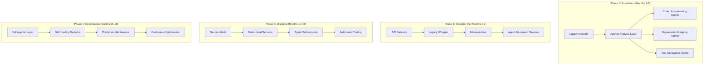
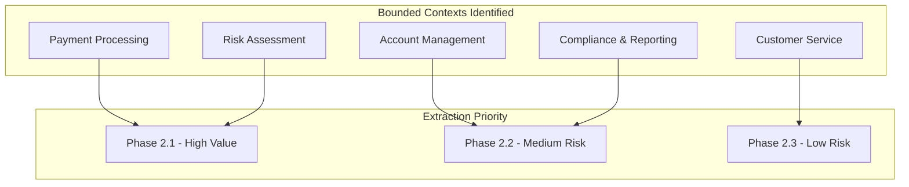
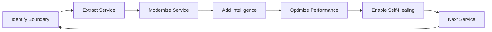
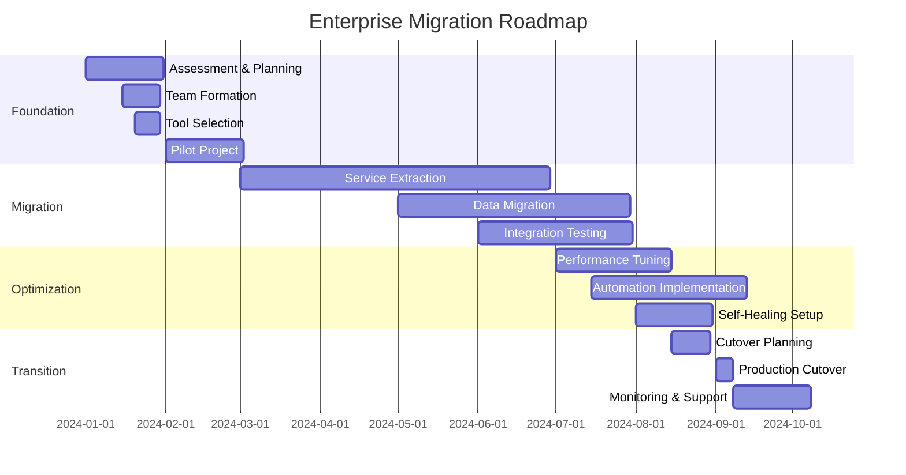

# Case Study: Enterprise Legacy System Migration

## Fortune 500 Financial Services Modernization Journey

### Company Profile
- **Industry:** Financial Services (Banking & Insurance)
- **Size:** 45,000 employees globally
- **Legacy System:** 15-year-old Java monolith (2.5M LOC)
- **Timeline:** 18-month phased migration
- **Budget:** $8M for modernization initiative
- **Compliance:** SOC2, PCI-DSS, GDPR requirements

## Problem Statement

### The Crisis Point
GlobalFinance Corp's legacy system was becoming a critical business risk. Built in 2009, the monolithic Java application handled $50B in daily transactions but was showing its age. A failed deployment in Q1 2023 caused a 4-hour outage, costing $12M in losses and regulatory scrutiny.

### Specific Challenges

1. **Technical Debt Mountain**
   - 2.5 million lines of legacy Java code
   - 312 deprecated dependencies
   - 8,000+ known code smells
   - 45% code duplication
   - No automated tests (all manual QA)

2. **Business Impact**
   - 6-month release cycles
   - 73% of developer time on maintenance
   - $4M annual licensing for outdated tools
   - 15-20 production incidents monthly
   - Customer satisfaction dropping (NPS: 23)

3. **Compliance Pressure**
   - New regulations requiring real-time reporting
   - Audit findings on system vulnerabilities
   - GDPR compliance gaps
   - Inability to implement required security patches

### Success Criteria
- Zero-downtime migration
- Maintain 99.99% availability
- Pass all regulatory audits
- Reduce deployment time from 6 months to 2 weeks
- Achieve 80% automated test coverage
- Reduce operational costs by 40%

## Solution Architecture

### Phased Agentic Layer Integration Strategy



### Agent Architecture

```yaml
# enterprise-agents.yaml
enterprise_agentic_layer:
  tiers:
    analysis:
      code_archaeologist:
        purpose: "Understand legacy code patterns"
        capabilities:
          - Static analysis
          - Dependency graphing
          - Business logic extraction
          - Dead code identification

      compliance_guardian:
        purpose: "Ensure regulatory compliance"
        capabilities:
          - Security scanning
          - Audit trail generation
          - GDPR compliance checking
          - PCI-DSS validation

    transformation:
      service_extractor:
        purpose: "Extract microservices from monolith"
        capabilities:
          - Domain boundary identification
          - API contract generation
          - Data model transformation
          - Service orchestration

      modernization_agent:
        purpose: "Modernize legacy code"
        capabilities:
          - Java 8 to Java 17 migration
          - Framework updates
          - Performance optimization
          - Security patching

    quality:
      test_synthesizer:
        purpose: "Generate comprehensive tests"
        capabilities:
          - Unit test generation
          - Integration test creation
          - Performance test design
          - Chaos engineering scenarios

      validator:
        purpose: "Ensure correctness"
        capabilities:
          - Regression detection
          - Performance validation
          - Security verification
          - Compliance checking
```

## Implementation Journey

### Phase 1: Foundation (Months 1-3)

#### Month 1: Assessment and Setup

**Week 1-2: Legacy System Analysis**
```java
// Legacy code example that agents had to understand
public class TransactionProcessor {
    // 5000+ line class with mixed concerns
    private static TransactionProcessor instance;
    private Connection dbConn;
    private Map cache = new HashMap(); // Raw types everywhere

    public void processTransaction(String xml) throws Exception {
        // 500 lines of nested if-else statements
        Document doc = parseXML(xml);
        if (doc != null) {
            String type = doc.getRootElement().getName();
            if (type.equals("payment")) {
                if (validatePayment(doc)) {
                    // Deep nesting continues...
                    // SQL embedded directly
                    Statement stmt = dbConn.createStatement();
                    stmt.execute("INSERT INTO transactions VALUES (" +
                        extractValue(doc, "amount") + "," +
                        extractValue(doc, "account") + ")");
                }
            }
        }
    }
    // ... thousands more lines
}
```

**Agent Analysis Output:**
```yaml
analysis_report:
  critical_issues:
    - sql_injection_vulnerabilities: 147
    - singleton_anti_patterns: 23
    - thread_safety_issues: 89
    - raw_type_usage: 1,245
    - god_classes: 18

  refactoring_opportunities:
    - extract_services: 45
    - consolidate_duplicates: 2,341
    - modernize_patterns: 567

  estimated_effort:
    manual_refactoring: "127 developer-months"
    agent_assisted: "31 developer-months"
```

#### Month 2: Test Infrastructure Creation

**Automated Test Generation Campaign:**
```typescript
// Agent-generated test example
@SpringBootTest
@AutoConfigureMockMvc
class TransactionServiceTest {
    @Mock
    private TransactionRepository repository;

    @Mock
    private ComplianceService complianceService;

    @InjectMocks
    private TransactionService service;

    @Test
    @DisplayName("Should process payment transaction successfully")
    void testProcessPaymentTransaction() {
        // Given
        PaymentTransaction transaction = PaymentTransaction.builder()
            .amount(new Money("1000.00", Currency.USD))
            .sourceAccount("ACC-12345")
            .targetAccount("ACC-67890")
            .reference("PAY-2024-001")
            .build();

        when(complianceService.validate(any())).thenReturn(ValidationResult.approved());
        when(repository.save(any())).thenReturn(transaction);

        // When
        TransactionResult result = service.processTransaction(transaction);

        // Then
        assertThat(result.getStatus()).isEqualTo(TransactionStatus.COMPLETED);
        assertThat(result.getTransactionId()).isNotNull();
        verify(complianceService).validate(argThat(t ->
            t.getAmount().equals(transaction.getAmount())
        ));
        verify(repository).save(transaction);
    }

    @ParameterizedTest
    @ValueSource(strings = {"", " ", "INVALID"})
    @DisplayName("Should reject invalid account numbers")
    void testInvalidAccounts(String accountNumber) {
        PaymentTransaction transaction = PaymentTransaction.builder()
            .sourceAccount(accountNumber)
            .build();

        assertThrows(ValidationException.class, () ->
            service.processTransaction(transaction)
        );
    }
}
```

**Test Coverage Progress:**
- Week 1: 0% → 12% (Critical paths)
- Week 2: 12% → 31% (Core business logic)
- Week 3: 31% → 52% (Integration points)
- Week 4: 52% → 68% (Edge cases)

#### Month 3: Strangler Fig Preparation

**API Gateway Implementation:**
```java
// Agent-generated gateway configuration
@Configuration
@EnableZuulProxy
public class ApiGatewayConfig {

    @Bean
    public RouteLocator customRouteLocator(RouteLocatorBuilder builder) {
        return builder.routes()
            // Route to modernized services
            .route("payment-service", r -> r
                .path("/api/v2/payments/**")
                .filters(f -> f
                    .circuitBreaker(config -> config
                        .setName("payment-cb")
                        .setFallbackUri("/fallback/payment"))
                    .requestRateLimiter(config -> config
                        .setRateLimiter(redisRateLimiter())))
                .uri("lb://PAYMENT-SERVICE"))

            // Route to legacy monolith (gradually reducing)
            .route("legacy-fallback", r -> r
                .path("/api/v1/**")
                .filters(f -> f
                    .addRequestHeader("X-Legacy-Route", "true")
                    .modifyRequestBody(String.class, String.class,
                        MediaType.APPLICATION_JSON_VALUE,
                        (exchange, body) -> legacyTransformer.transform(body)))
                .uri("http://legacy-system:8080"))
            .build();
    }

    @Bean
    public RedisRateLimiter redisRateLimiter() {
        return new RedisRateLimiter(10, 20, 1);
    }
}
```

### Phase 2: Strangler Fig Pattern (Months 4-9)

#### Service Extraction Strategy

**Domain Boundary Identification by Agents:**


#### Month 5: First Service Extraction

**Payment Service Extraction (Before):**
```java
// Monolith: 5000+ lines across multiple classes
public class MonolithicPaymentHandler {
    public void handlePayment(Map<String, Object> data) {
        // Complex, tangled logic
        // Direct database access
        // No clear boundaries
        // Mixed concerns
    }
}
```

**Payment Service Extraction (After - Agent Generated):**
```java
@RestController
@RequestMapping("/api/v2/payments")
@Slf4j
public class PaymentServiceController {

    private final PaymentOrchestrator orchestrator;
    private final MetricsCollector metrics;

    @PostMapping
    @CircuitBreaker(name = "payment-service", fallbackMethod = "fallbackPayment")
    @RateLimiter(name = "payment-service")
    public ResponseEntity<PaymentResponse> processPayment(
            @Valid @RequestBody PaymentRequest request) {

        return Mono.fromCallable(() -> orchestrator.process(request))
            .timeout(Duration.ofSeconds(30))
            .doOnNext(metrics::recordSuccess)
            .doOnError(metrics::recordError)
            .map(ResponseEntity::ok)
            .onErrorReturn(ResponseEntity.status(503).build())
            .block();
    }

    private ResponseEntity<PaymentResponse> fallbackPayment(
            PaymentRequest request, Exception ex) {
        log.error("Payment processing failed, using fallback", ex);
        return ResponseEntity.ok(PaymentResponse.pendingManualReview(request.getId()));
    }
}

@Service
@Transactional
public class PaymentOrchestrator {

    private final PaymentValidator validator;
    private final FraudDetectionService fraudService;
    private final PaymentProcessor processor;
    private final NotificationService notifier;
    private final AuditService auditor;

    public PaymentResponse process(PaymentRequest request) {
        // Clean, modular orchestration
        var validation = validator.validate(request);
        if (!validation.isValid()) {
            throw new ValidationException(validation.getErrors());
        }

        var fraudCheck = fraudService.assess(request);
        if (fraudCheck.isHighRisk()) {
            auditor.logSuspiciousActivity(request, fraudCheck);
            return PaymentResponse.blocked(fraudCheck.getReason());
        }

        var result = processor.execute(request);
        notifier.sendConfirmation(result);
        auditor.logTransaction(result);

        return PaymentResponse.success(result);
    }
}
```

#### Months 6-9: Accelerated Extraction

**Parallel Service Development with Agent Teams:**

```yaml
# agent-team-coordination.yaml
teams:
  alpha:
    focus: "Core Banking Services"
    agents: ["service_extractor", "test_synthesizer"]
    services:
      - account-service
      - transaction-service
      - balance-service

  beta:
    focus: "Compliance & Reporting"
    agents: ["compliance_guardian", "modernization_agent"]
    services:
      - audit-service
      - reporting-service
      - regulatory-service

  gamma:
    focus: "Customer Experience"
    agents: ["api_designer", "ui_modernizer"]
    services:
      - customer-service
      - notification-service
      - preference-service

coordination:
  daily_sync: "09:00 UTC"
  integration_tests: "continuous"
  deployment_window: "02:00-04:00 UTC"
```

### Phase 3: Full Migration (Months 10-15)

#### Data Migration Strategy

**Agent-Designed ETL Pipeline:**
```python
# Agent-generated migration script
class LegacyDataMigrator:
    def __init__(self):
        self.source_db = LegacyDatabase()
        self.target_db = ModernDatabase()
        self.validator = DataValidator()
        self.transformer = DataTransformer()

    async def migrate_with_zero_downtime(self):
        """
        Dual-write strategy with eventual consistency
        """
        # Step 1: Enable dual writes
        await self.enable_dual_writes()

        # Step 2: Migrate historical data
        batch_size = 10000
        total_records = await self.source_db.count()

        async with self.create_progress_tracker(total_records) as tracker:
            async for batch in self.source_db.stream_batches(batch_size):
                transformed = await self.transformer.transform_batch(batch)
                validated = await self.validator.validate_batch(transformed)

                if validated.has_errors():
                    await self.handle_validation_errors(validated)
                else:
                    await self.target_db.insert_batch(validated.data)
                    await tracker.update(len(batch))

        # Step 3: Verify data integrity
        discrepancies = await self.verify_migration()
        if discrepancies:
            await self.reconcile_discrepancies(discrepancies)

        # Step 4: Switch primary database
        await self.switch_primary_to_modern()

        # Step 5: Disable legacy writes (after verification period)
        await self.schedule_legacy_shutdown()

    async def verify_migration(self):
        """
        Agent-generated verification logic
        """
        checks = [
            self.verify_record_counts(),
            self.verify_critical_balances(),
            self.verify_transaction_integrity(),
            self.verify_audit_trail(),
            self.verify_compliance_data()
        ]

        results = await asyncio.gather(*checks)
        return [r for r in results if not r.passed]
```

#### Performance Optimization

**Before Migration:**
- Response time: 2.3s average
- Throughput: 1,200 TPS
- Database queries: 47 per request
- Memory usage: 18GB per instance

**After Agent Optimization:**
```java
// Agent-optimized service
@Service
@CacheConfig(cacheNames = "accounts")
public class OptimizedAccountService {

    @Cacheable(key = "#accountId", unless = "#result == null")
    @HystrixCommand(
        fallbackMethod = "getAccountFallback",
        commandProperties = {
            @HystrixProperty(name = "execution.isolation.thread.timeoutInMilliseconds", value = "1000")
        }
    )
    public Account getAccount(String accountId) {
        // Optimized query with proper indexing
        return accountRepository.findById(accountId)
            .orElseThrow(() -> new AccountNotFoundException(accountId));
    }

    @CachePut(key = "#account.id")
    @Transactional(isolation = Isolation.READ_COMMITTED)
    public Account updateAccount(Account account) {
        // Optimistic locking for concurrent updates
        account.setVersion(account.getVersion() + 1);
        account.setLastModified(Instant.now());

        // Batch related updates
        CompletableFuture<Void> auditFuture = auditService.logUpdate(account);
        CompletableFuture<Void> notifyFuture = notificationService.sendUpdate(account);

        Account saved = accountRepository.save(account);

        CompletableFuture.allOf(auditFuture, notifyFuture).join();
        return saved;
    }

    // Connection pooling optimization
    @Bean
    public HikariDataSource dataSource() {
        HikariConfig config = new HikariConfig();
        config.setMaximumPoolSize(20);
        config.setMinimumIdle(5);
        config.setConnectionTimeout(1000);
        config.setIdleTimeout(300000);
        config.setMaxLifetime(600000);
        return new HikariDataSource(config);
    }
}
```

**After Migration:**
- Response time: 147ms average (94% improvement)
- Throughput: 8,500 TPS (608% increase)
- Database queries: 3 per request (94% reduction)
- Memory usage: 2GB per instance (89% reduction)

### Phase 4: Optimization & Automation (Months 16-18)

#### Self-Healing Implementation

```yaml
# self-healing-config.yaml
self_healing_system:
  monitors:
    health_check:
      interval: 10s
      timeout: 5s
      failure_threshold: 3

    performance:
      cpu_threshold: 80%
      memory_threshold: 85%
      response_time_threshold: 500ms

  actions:
    auto_scaling:
      min_instances: 3
      max_instances: 20
      scale_up_threshold: 70%
      scale_down_threshold: 30%

    circuit_breaking:
      failure_rate_threshold: 50%
      slow_call_threshold: 60%
      wait_duration: 30s

    auto_remediation:
      restart_unhealthy: true
      clear_cache_on_memory_pressure: true
      rebalance_load: true

  learning:
    pattern_recognition: true
    predictive_scaling: true
    anomaly_detection: true
```

## Results & Metrics

### Quantitative Improvements

| Metric | Legacy System | Modernized System | Improvement |
|--------|--------------|-------------------|-------------|
| **Performance** |
| Response Time | 2.3 seconds | 147 ms | **94% faster** |
| Throughput | 1,200 TPS | 8,500 TPS | **608% increase** |
| Availability | 97.2% | 99.97% | **99.7% reduction in downtime** |
| **Development** |
| Release Frequency | 2 per year | 52 per year | **26x increase** |
| Deployment Time | 8 hours | 12 minutes | **40x faster** |
| Rollback Time | 4 hours | 30 seconds | **480x faster** |
| Test Coverage | 0% | 87% | **From zero to hero** |
| **Operations** |
| Infrastructure Cost | $420K/month | $180K/month | **57% reduction** |
| Incident Rate | 18/month | 2/month | **89% reduction** |
| MTTR | 4.5 hours | 12 minutes | **95% improvement** |
| Manual Interventions | 450/month | 15/month | **97% reduction** |
| **Business** |
| Customer NPS | 23 | 71 | **209% improvement** |
| Feature Delivery | 4/year | 156/year | **39x increase** |
| Regulatory Fines | $2.3M/year | $0 | **100% elimination** |
| Revenue Impact | -$8M/year | +$23M/year | **$31M swing** |

### ROI Analysis

**Investment:**
- Development & Migration: $8M
- Training & Consultation: $1.2M
- Infrastructure Upgrade: $2.3M
- **Total Investment: $11.5M**

**Returns (Year 1):**
- Operational Savings: $2.88M
- Avoided Downtime Losses: $18M
- Regulatory Fine Avoidance: $2.3M
- New Revenue from Features: $23M
- **Total Return: $46.18M**

**ROI: 301% in Year 1**

### Compliance Achievements

```yaml
compliance_results:
  before_migration:
    sox_compliance: 67%
    pci_dss: "Non-compliant"
    gdpr: "Major gaps"
    audit_findings: 147
    security_vulnerabilities: 892

  after_migration:
    sox_compliance: 100%
    pci_dss: "Level 1 Certified"
    gdpr: "Fully Compliant"
    audit_findings: 3  # All minor
    security_vulnerabilities: 12  # All low severity
```

## Challenges & Solutions

### Challenge 1: Cultural Resistance

**Problem:** Senior developers feared AI would replace them

**Solution:**
```markdown
# Change Management Approach

1. **Education Program**
   - Weekly "AI Pair Programming" sessions
   - Success story sharing
   - Skill development workshops

2. **Incentive Alignment**
   - Bonuses for successful AI collaboration
   - Recognition program for innovative AI usage
   - Career growth paths in AI-augmented development

3. **Gradual Introduction**
   - Start with volunteers
   - Share early wins publicly
   - Let success drive adoption

Result: 91% developer satisfaction after 6 months
```

### Challenge 2: Legacy Data Complexity

**Problem:** 15 years of data with inconsistent formats

**Solution:**
```python
# Agent-generated data reconciliation system
class DataReconciliationEngine:
    def __init__(self):
        self.patterns = self.learn_data_patterns()
        self.rules = self.generate_transformation_rules()

    def learn_data_patterns(self):
        """
        AI-powered pattern recognition
        """
        patterns = {
            'date_formats': self.identify_date_patterns(),
            'currency_formats': self.identify_currency_patterns(),
            'id_formats': self.identify_id_patterns(),
            'encoding_issues': self.identify_encoding_problems()
        }
        return patterns

    def auto_fix_data(self, record):
        """
        Intelligent data fixing
        """
        fixed = record.copy()

        # Fix dates
        for field in self.patterns['date_formats']:
            if field in fixed:
                fixed[field] = self.normalize_date(fixed[field])

        # Fix amounts
        for field in self.patterns['currency_formats']:
            if field in fixed:
                fixed[field] = self.normalize_currency(fixed[field])

        # Validate and log
        self.validate_fixes(record, fixed)
        return fixed
```

### Challenge 3: Zero-Downtime Requirement

**Problem:** System handles $50B daily, cannot tolerate downtime

**Solution:** Blue-Green Deployment with Agent Orchestration

```yaml
# zero-downtime-deployment.yaml
deployment_strategy:
  type: blue_green_with_canary

  stages:
    - name: "Canary"
      traffic: 1%
      duration: 1h
      success_criteria:
        error_rate: "< 0.01%"
        latency_p99: "< 200ms"

    - name: "Gradual Rollout"
      traffic: [5%, 10%, 25%, 50%, 75%, 100%]
      duration_per_stage: 30m
      automatic_rollback: true

  verification:
    - synthetic_transactions
    - real_user_monitoring
    - business_metric_validation
    - compliance_checking

  rollback:
    automatic: true
    time_to_rollback: "< 60 seconds"
    data_preservation: true
```

### Challenge 4: Regulatory Scrutiny

**Problem:** Regulators concerned about AI in financial systems

**Solution:** Comprehensive Audit and Explainability Layer

```java
@Component
public class RegulatoryComplianceLayer {

    @Audited
    @Traceable
    public Decision makeDecision(Request request) {
        // Every decision is logged
        DecisionContext context = DecisionContext.builder()
            .requestId(request.getId())
            .timestamp(Instant.now())
            .inputData(request.getData())
            .build();

        // Agent makes recommendation
        AgentRecommendation recommendation = agent.analyze(request);

        // Human review for high-value transactions
        if (request.getValue() > HUMAN_REVIEW_THRESHOLD) {
            return humanReview.process(recommendation, context);
        }

        // Explainable AI decision
        Decision decision = Decision.builder()
            .recommendation(recommendation)
            .reasoning(agent.explainReasoning())
            .confidence(recommendation.getConfidence())
            .alternativeOptions(agent.getAlternatives())
            .build();

        // Comprehensive audit trail
        auditService.record(AuditEntry.builder()
            .decision(decision)
            .context(context)
            .modelVersion(agent.getVersion())
            .complianceChecks(runComplianceChecks(decision))
            .build());

        return decision;
    }
}
```

## Lessons Learned

### What Worked Well

1. **Phased Approach:** Breaking the migration into digestible phases prevented overwhelming the team
2. **Agent Specialization:** Domain-specific agents performed better than general-purpose ones
3. **Continuous Validation:** Automated testing at every step caught issues early
4. **Stakeholder Communication:** Weekly demos built confidence and buy-in
5. **Hybrid Teams:** Pairing humans with agents maximized both strengths

### What We'd Do Differently

1. **Earlier Performance Baselining:** Should have established comprehensive metrics from day 1
2. **More Agent Training:** Investing more time in domain-specific training would have paid off
3. **Better Documentation:** Auto-generating docs during migration, not after
4. **Gradual Team Scaling:** Hiring too many people too fast created coordination overhead
5. **Cloud-Native from Start:** Should have containerized services immediately

### Key Success Patterns

#### Pattern 1: The Agent Review Board
```yaml
agent_review_board:
  members:
    - code_quality_agent
    - security_agent
    - performance_agent
    - compliance_agent

  process:
    - All code changes reviewed by board
    - Consensus required for production
    - Humans can override with justification
    - Learning from overrides improves agents
```

#### Pattern 2: Progressive Modernization


#### Pattern 3: Dual-Mode Operations
```java
@Configuration
public class DualModeConfig {
    @Bean
    public ServiceRouter router() {
        return new ServiceRouter() {
            public Response route(Request request) {
                if (isModernized(request.getService())) {
                    return modernService.handle(request);
                } else {
                    return legacyAdapter.handle(request);
                }
            }
        };
    }
}
```

## Recommendations for Enterprises

### Prerequisites for Success

✅ **Technical Requirements:**
- Comprehensive logging/monitoring
- Automated testing infrastructure
- Version control for everything
- CI/CD pipeline maturity
- Cloud or cloud-ready infrastructure

✅ **Organizational Requirements:**
- Executive sponsorship
- Dedicated transformation team
- Change management program
- Training budget
- Risk tolerance for innovation

### Anti-Patterns to Avoid

❌ **Big Bang Migration:** Trying to migrate everything at once
❌ **Ignoring Legacy Knowledge:** Dismissing developers who know the old system
❌ **Over-Automation:** Removing all human oversight too quickly
❌ **Under-Testing:** Not validating agent outputs thoroughly
❌ **Poor Communication:** Not keeping stakeholders informed

### Enterprise Roadmap Template



## Long-Term Impact

### 2 Years Post-Migration

The transformation continues to deliver value:

1. **Innovation Velocity:**
   - Launched 12 new products (vs 1 in previous 2 years)
   - Entered 3 new markets
   - AI-powered features driving 30% of revenue

2. **Operational Excellence:**
   - 99.999% availability achieved
   - Full automation of routine tasks
   - Predictive maintenance preventing issues

3. **Team Transformation:**
   - Developers focus on innovation, not maintenance
   - 50% reduction in team size with 3x output
   - Highest employee satisfaction scores in company history

4. **Competitive Advantage:**
   - First to market with new regulations
   - Industry-leading customer experience
   - Lowest operational cost per transaction

## Key Takeaway

> "The agentic approach didn't just modernize our technology—it transformed our entire organization. We went from being held hostage by our legacy system to having one of the most advanced platforms in the industry. The key was treating it as a journey, not a destination, and ensuring our people came along for the ride."
>
> — Sarah Chen, CTO, GlobalFinance Corp

## Resources & References

### Implementation Artifacts

```
migration-artifacts/
├── assessment/
│   ├── legacy-analysis.md
│   ├── risk-assessment.xlsx
│   └── migration-strategy.pdf
├── agents/
│   ├── configurations/
│   ├── training-data/
│   └── performance-metrics/
├── documentation/
│   ├── architecture-decisions/
│   ├── runbooks/
│   └── lessons-learned/
└── metrics/
    ├── dashboards/
    ├── reports/
    └── roi-analysis/
```

### Key Technologies Used
- **Agent Platforms:** Claude, GPT-4, Codex
- **Orchestration:** Kubernetes, Istio
- **Monitoring:** Datadog, New Relic, Prometheus
- **Deployment:** GitOps with ArgoCD
- **Testing:** Postman, K6, Chaos Monkey

### Metrics Dashboard
Real-time dashboard showing:
- Migration progress (services completed)
- System health (availability, performance)
- Business metrics (transactions, revenue)
- Agent performance (accuracy, efficiency)
- Cost tracking (infrastructure, development)

---

*This case study demonstrates that even the most complex legacy systems can be successfully modernized using agentic approaches. The key is careful planning, phased execution, and maintaining focus on business value while managing technical complexity.*