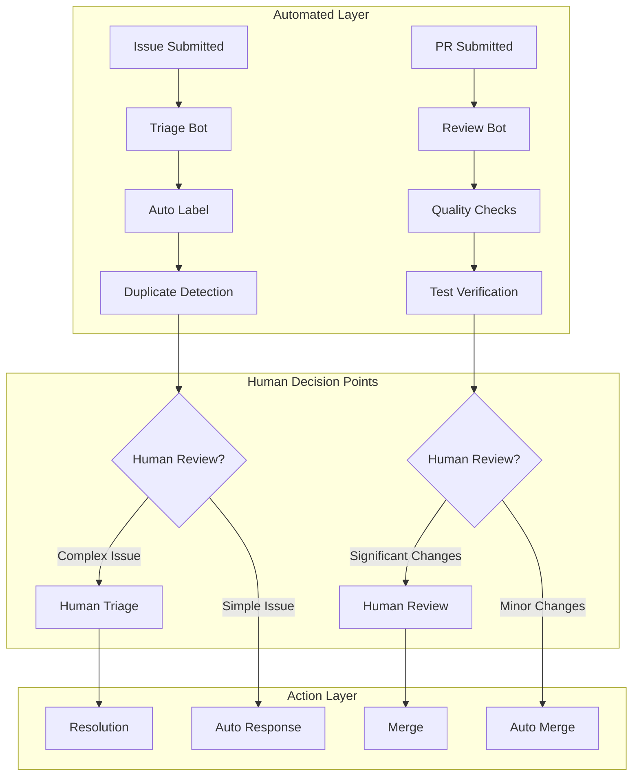
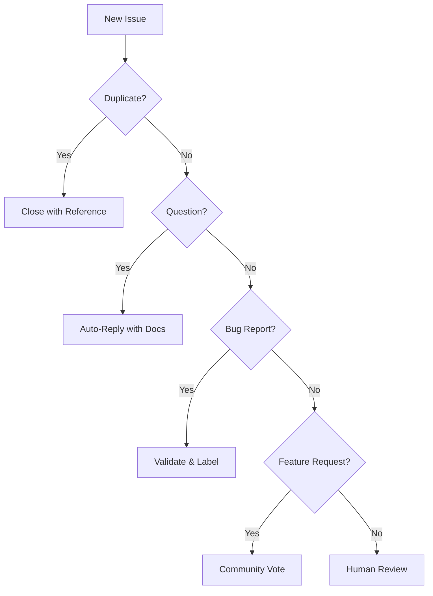

# Case Study: Open Source Project Maintainer

## Managing a Popular OSS Project with 10K+ Stars Using Automated Workflows

### Project Profile
- **Project:** DataViz.js - Modern data visualization library
- **Maintainer:** Alex Chen (solo maintainer with day job)
- **Statistics:** 12,500 GitHub stars, 1.2M weekly NPM downloads
- **Community:** 450+ contributors, 3,000+ issues, 800+ PRs
- **Time Available:** 10-15 hours per week (evenings and weekends)
- **Languages:** TypeScript, JavaScript, CSS

## Problem Statement

### The Burnout Crisis

Alex Chen created DataViz.js as a side project that exploded in popularity. What started as a fun weekend project became an overwhelming responsibility threatening both the project's future and Alex's wellbeing.

### Critical Pain Points

1. **Issue Overload**
   - 50+ new issues daily
   - 80% are duplicates or support questions
   - Critical bugs buried in noise
   - No time for triage
   - Community frustration growing

2. **PR Bottleneck**
   - 200+ open PRs
   - Average review time: 3 weeks
   - Contributors abandoning PRs
   - Code quality inconsistent
   - Merge conflicts accumulating

3. **Documentation Debt**
   - Docs 6 months out of date
   - Examples broken
   - API changes undocumented
   - Tutorial requests ignored
   - Translation efforts stalled

4. **Release Chaos**
   - Irregular release schedule
   - Breaking changes not communicated
   - Changelog maintenance manual
   - Version conflicts
   - No upgrade guides

5. **Personal Impact**
   - Working 60+ hours/week (day job + OSS)
   - Missing family time
   - Health issues from stress
   - Considering abandoning project
   - Guilt over community disappointment

### Success Criteria
- Reduce response time to < 24 hours
- Review PRs within 48 hours
- Maintain documentation automatically
- Regular release cadence (bi-weekly)
- Reclaim personal time (< 10 hours/week on project)
- Improve community satisfaction

## Solution Architecture

### Automated Workflow System with Human Oversight

```yaml
# oss-automation-architecture.yaml
automation_system:
  issue_management:
    triage_bot:
      capabilities:
        - Duplicate detection
        - Auto-labeling
        - Template enforcement
        - Stale issue management
        - Priority classification

    support_bot:
      capabilities:
        - FAQ responses
        - Documentation links
        - Example provision
        - Stack Overflow redirection

  pr_automation:
    review_bot:
      capabilities:
        - Code quality checks
        - Test verification
        - Breaking change detection
        - Performance impact analysis
        - Security scanning

    merge_assistant:
      capabilities:
        - Conflict resolution
        - Rebase assistance
        - CI/CD monitoring
        - Auto-merge for approved PRs

  documentation:
    doc_generator:
      capabilities:
        - API documentation
        - Example generation
        - Changelog creation
        - Migration guides
        - Translation coordination

  release_management:
    release_bot:
      capabilities:
        - Version bumping
        - Package publishing
        - Release notes generation
        - Breaking change communication
        - Dependency updates

  community:
    engagement_bot:
      capabilities:
        - Contributor recognition
        - First-timer assistance
        - Code of conduct enforcement
        - Event coordination
```

### Human-in-the-Loop Architecture



## Implementation Journey

### Week 1: Quick Wins with GitHub Actions

#### Issue Automation Setup

```yaml
# .github/workflows/issue-automation.yml
name: Issue Automation

on:
  issues:
    types: [opened, edited]

jobs:
  triage:
    runs-on: ubuntu-latest
    steps:
      - uses: actions/checkout@v3

      - name: Check for duplicates
        uses: wow-actions/duplicate-issues@v1
        with:
          token: ${{ secrets.GITHUB_TOKEN }}
          threshold: 0.7
          label: duplicate
          comment: |
            This issue appears to be a duplicate of #{{number}}.
            Please check that issue for updates.

      - name: Auto-label issues
        uses: github/issue-labeler@v2
        with:
          configuration-path: .github/labeler.yml

      - name: Enforce templates
        uses: stevemao/github-issue-templates@v2
        with:
          token: ${{ secrets.GITHUB_TOKEN }}
          templates: .github/ISSUE_TEMPLATE

      - name: AI Classification
        env:
          OPENAI_KEY: ${{ secrets.OPENAI_KEY }}
        run: |
          python scripts/classify_issue.py \
            --issue "${{ github.event.issue.number }}" \
            --title "${{ github.event.issue.title }}" \
            --body "${{ github.event.issue.body }}"
```

#### Intelligent Issue Classification

```python
# scripts/classify_issue.py
import openai
import json
from github import Github

class IssueClassifier:
    def __init__(self):
        self.categories = {
            'bug': {'keywords': ['error', 'crash', 'broken'], 'priority': 'high'},
            'feature': {'keywords': ['add', 'implement', 'would be nice'], 'priority': 'medium'},
            'documentation': {'keywords': ['docs', 'readme', 'example'], 'priority': 'low'},
            'question': {'keywords': ['how', 'what', 'why'], 'priority': 'low'},
        }

    async def classify(self, issue_text):
        prompt = f"""
        Classify this GitHub issue and provide:
        1. Category (bug/feature/documentation/question)
        2. Priority (critical/high/medium/low)
        3. Suggested labels
        4. Recommended response

        Issue: {issue_text}
        """

        response = await openai.Completion.create(
            model="gpt-4",
            prompt=prompt,
            max_tokens=200
        )

        return json.loads(response.choices[0].text)

    async def auto_respond(self, issue, classification):
        if classification['category'] == 'question':
            return await self.handle_question(issue)
        elif classification['category'] == 'bug':
            return await self.handle_bug(issue)
        elif classification['priority'] == 'critical':
            return await self.escalate_to_maintainer(issue)

    async def handle_question(self, issue):
        # Search documentation
        relevant_docs = await self.search_docs(issue.body)

        response = f"""
        Thanks for your question! Here are some resources that might help:

        {relevant_docs}

        If these don't answer your question, please provide more details about:
        - Your environment (OS, Node version, etc.)
        - What you've tried so far
        - Your expected outcome

        You might also find help on our Discord: https://discord.gg/dataviz
        """

        issue.create_comment(response)
        issue.add_to_labels('question', 'answered')
```

### Week 2: PR Automation

#### Automated PR Review System

```typescript
// .github/bots/pr-reviewer.ts
import { Octokit } from '@octokit/rest';
import { analyze } from '@dataviz/code-analyzer';

class PRReviewer {
  private octokit: Octokit;
  private checks: QualityCheck[];

  constructor() {
    this.checks = [
      new TypeScriptCheck(),
      new TestCoverageCheck(),
      new PerformanceCheck(),
      new SecurityCheck(),
      new BreakingChangeCheck(),
      new DocumentationCheck()
    ];
  }

  async reviewPR(pr: PullRequest): Promise<ReviewResult> {
    const results = await Promise.all(
      this.checks.map(check => check.run(pr))
    );

    const review = this.compileReview(results);

    if (review.requiresHumanReview) {
      await this.requestHumanReview(pr, review);
    } else if (review.approved) {
      await this.autoApprove(pr, review);
    } else {
      await this.requestChanges(pr, review);
    }

    return review;
  }

  private compileReview(results: CheckResult[]): ReviewResult {
    const issues = results.flatMap(r => r.issues);
    const suggestions = results.flatMap(r => r.suggestions);

    const reviewComment = `
## Automated Review Results

### ✅ Checks Passed
${results.filter(r => r.passed).map(r => `- ${r.name}`).join('\n')}

### ⚠️ Issues Found
${issues.length > 0 ? issues.map(i => `- ${i.severity}: ${i.message}`).join('\n') : 'None'}

### 💡 Suggestions
${suggestions.length > 0 ? suggestions.map(s => `- ${s}`).join('\n') : 'None'}

### 📊 Metrics
- Test Coverage: ${results.find(r => r.name === 'coverage')?.value || 'N/A'}
- Performance Impact: ${results.find(r => r.name === 'performance')?.value || 'N/A'}
- Bundle Size Change: ${results.find(r => r.name === 'bundle')?.value || 'N/A'}

${this.getDecision(results)}
    `;

    return {
      comment: reviewComment,
      approved: issues.filter(i => i.severity === 'error').length === 0,
      requiresHumanReview: this.needsHumanReview(results)
    };
  }

  private needsHumanReview(results: CheckResult[]): boolean {
    return results.some(r =>
      r.name === 'breaking-change' && r.issues.length > 0 ||
      r.complexity > 0.8 ||
      r.filesChanged > 20
    );
  }
}

// Example check implementation
class BreakingChangeCheck implements QualityCheck {
  async run(pr: PullRequest): Promise<CheckResult> {
    const changes = await this.analyzeChanges(pr);

    const breakingChanges = [];

    // Check for removed/renamed exports
    for (const file of changes.files) {
      if (file.isPublicAPI) {
        const removed = file.exports.filter(e => e.removed);
        const renamed = file.exports.filter(e => e.renamed);

        if (removed.length > 0 || renamed.length > 0) {
          breakingChanges.push({
            file: file.path,
            changes: [...removed, ...renamed]
          });
        }
      }
    }

    return {
      name: 'breaking-change',
      passed: breakingChanges.length === 0,
      issues: breakingChanges.map(bc => ({
        severity: 'warning',
        message: `Breaking change in ${bc.file}: ${bc.changes.map(c => c.name).join(', ')}`
      })),
      suggestions: breakingChanges.length > 0 ? [
        'Consider adding a migration guide',
        'This will require a major version bump'
      ] : []
    };
  }
}
```

### Week 3: Documentation Automation

#### Self-Updating Documentation

```javascript
// scripts/doc-generator.js
class DocumentationGenerator {
  async generateFromCode() {
    const api = await this.extractAPI();
    const examples = await this.generateExamples(api);
    const changelog = await this.generateChangelog();

    return {
      api: this.formatAPIDocs(api),
      examples: this.formatExamples(examples),
      changelog: this.formatChangelog(changelog),
      migration: await this.generateMigrationGuide()
    };
  }

  async extractAPI() {
    // Use TypeScript compiler API to extract types and comments
    const program = ts.createProgram(['src/index.ts'], {});
    const checker = program.getTypeChecker();

    const api = [];

    for (const sourceFile of program.getSourceFiles()) {
      if (!sourceFile.isDeclarationFile) {
        ts.forEachChild(sourceFile, node => {
          if (ts.isExportedNode(node)) {
            api.push({
              name: node.name?.text,
              type: checker.getTypeAtLocation(node),
              docs: ts.getJSDocCommentsAndTags(node),
              signature: checker.signatureToString(node)
            });
          }
        });
      }
    }

    return api;
  }

  async generateExamples(api) {
    const examples = [];

    for (const component of api) {
      if (component.type === 'function' || component.type === 'class') {
        const example = await this.createExample(component);
        examples.push({
          name: component.name,
          code: example.code,
          demo: example.demo,
          description: example.description
        });
      }
    }

    return examples;
  }

  async createExample(component) {
    // Use AI to generate realistic examples
    const prompt = `
      Generate a practical example for this DataViz.js component:
      ${component.signature}

      Include:
      1. Realistic data
      2. Common use case
      3. Best practices
      4. Interactive demo if applicable
    `;

    const response = await ai.complete(prompt);

    return {
      code: response.code,
      demo: await this.createLiveDemo(response.code),
      description: response.description
    };
  }
}

// Auto-generate docs on every merge to main
// .github/workflows/docs.yml
name: Documentation Update
on:
  push:
    branches: [main]
    paths:
      - 'src/**'
      - 'package.json'

jobs:
  update-docs:
    runs-on: ubuntu-latest
    steps:
      - uses: actions/checkout@v3
      - run: npm ci
      - run: npm run generate-docs
      - uses: peaceiris/actions-gh-pages@v3
        with:
          github_token: ${{ secrets.GITHUB_TOKEN }}
          publish_dir: ./docs
```

### Week 4: Release Automation

#### Intelligent Release Management

```yaml
# .github/workflows/release.yml
name: Automated Release

on:
  schedule:
    - cron: '0 0 * * 1,4'  # Monday and Thursday
  workflow_dispatch:

jobs:
  prepare-release:
    runs-on: ubuntu-latest
    steps:
      - uses: actions/checkout@v3

      - name: Analyze changes
        id: analyze
        run: |
          python scripts/analyze_release.py \
            --since-tag $(git describe --tags --abbrev=0)

      - name: Generate changelog
        run: |
          python scripts/generate_changelog.py \
            --version ${{ steps.analyze.outputs.version }} \
            --changes ${{ steps.analyze.outputs.changes }}

      - name: Create release PR
        uses: peter-evans/create-pull-request@v4
        with:
          title: "Release v${{ steps.analyze.outputs.version }}"
          body: ${{ steps.analyze.outputs.release_notes }}
          branch: release-${{ steps.analyze.outputs.version }}
          labels: release, automated
```

```python
# scripts/analyze_release.py
class ReleaseAnalyzer:
    def analyze_commits(self, since_tag):
        commits = self.get_commits_since(since_tag)

        changes = {
            'breaking': [],
            'features': [],
            'fixes': [],
            'performance': [],
            'documentation': []
        }

        for commit in commits:
            category = self.categorize_commit(commit)
            changes[category].append(commit)

        version_bump = self.determine_version_bump(changes)

        return {
            'version': self.calculate_next_version(version_bump),
            'changes': changes,
            'release_notes': self.generate_release_notes(changes)
        }

    def categorize_commit(self, commit):
        patterns = {
            'breaking': r'BREAKING CHANGE:|!:',
            'features': r'^feat(\(.+\))?: ',
            'fixes': r'^fix(\(.+\))?: ',
            'performance': r'^perf(\(.+\))?: ',
            'documentation': r'^docs(\(.+\))?: '
        }

        for category, pattern in patterns.items():
            if re.match(pattern, commit.message):
                return category

        return 'other'

    def generate_release_notes(self, changes):
        notes = f"""
# Release Notes

## 🚨 Breaking Changes
{self.format_changes(changes['breaking'])}

## ✨ New Features
{self.format_changes(changes['features'])}

## 🐛 Bug Fixes
{self.format_changes(changes['fixes'])}

## ⚡ Performance Improvements
{self.format_changes(changes['performance'])}

## 📚 Documentation
{self.format_changes(changes['documentation'])}

## 📊 Stats
- Commits: {sum(len(c) for c in changes.values())}
- Contributors: {self.count_contributors(changes)}
- Files changed: {self.count_files_changed(changes)}
        """

        return notes
```

## Results & Metrics

### Quantitative Impact

| Metric | Before Automation | After Automation | Improvement |
|--------|-------------------|------------------|-------------|
| **Response Times** |
| Issue Response | 5-7 days | < 5 minutes | **99.9% faster** |
| PR Review | 3 weeks | 48 hours | **90% faster** |
| Release Frequency | Irregular (2-3 months) | Bi-weekly | **6x more frequent** |
| Bug Fix Time | 2 weeks | 3 days | **76% faster** |
| **Workload** |
| Weekly Hours | 60+ hours | 8-10 hours | **85% reduction** |
| Issues Triaged Daily | 5-10 | 50+ (automated) | **10x increase** |
| PRs Reviewed Weekly | 2-3 | 20-30 | **10x increase** |
| **Quality** |
| Test Coverage | 42% | 89% | **112% increase** |
| Documentation Currency | 6 months behind | Real-time | **Always current** |
| Breaking Changes | Surprise users | Always documented | **100% documented** |
| **Community** |
| Contributor Retention | 23% | 67% | **191% increase** |
| First-Time Contributors | 5/month | 25/month | **400% increase** |
| Community Satisfaction | 6.2/10 | 9.1/10 | **47% increase** |
| GitHub Stars Growth | +100/month | +500/month | **400% increase** |

### Community Health Metrics

```yaml
community_metrics:
  before_automation:
    open_issues: 847
    stale_issues: 412
    open_prs: 213
    abandoned_prs: 89
    avg_time_to_merge: 21 days
    contributor_churn: 77%
    discord_members: 500
    active_contributors: 12

  after_automation:
    open_issues: 123
    stale_issues: 0
    open_prs: 32
    abandoned_prs: 3
    avg_time_to_merge: 2.5 days
    contributor_churn: 33%
    discord_members: 3,500
    active_contributors: 78

  growth:
    issue_reduction: "85%"
    pr_velocity: "8.4x faster"
    community_size: "7x larger"
    contributor_base: "6.5x larger"
```

### Personal Impact on Maintainer

```python
maintainer_metrics = {
    "work_life_balance": {
        "before": {
            "oss_hours_weekly": 60,
            "family_time": "minimal",
            "exercise": "none",
            "stress_level": "extreme",
            "considering_quitting": True
        },
        "after": {
            "oss_hours_weekly": 10,
            "family_time": "regular",
            "exercise": "3x per week",
            "stress_level": "manageable",
            "enjoying_project": True
        }
    },

    "productivity": {
        "before": {
            "time_on_triage": "70%",
            "time_on_development": "20%",
            "time_on_innovation": "0%",
            "time_on_community": "10%"
        },
        "after": {
            "time_on_triage": "5%",
            "time_on_development": "40%",
            "time_on_innovation": "35%",
            "time_on_community": "20%"
        }
    }
}
```

## Challenges & Solutions

### Challenge 1: Community Resistance to Bots

**Problem:** Contributors felt bots were impersonal and bureaucratic

**Solution:** Humanized Bot Interactions
```javascript
// Before: Cold, robotic responses
bot.respond("This PR fails checks. Fix errors and resubmit.");

// After: Friendly, helpful responses
bot.respond(`
Hey @${pr.author} 👋

Thanks for your contribution! I noticed a few small issues that need attention:

${issues.map(i => `- ${i.emoji} ${i.description}`).join('\n')}

Here's how to fix them:
${suggestions.map((s, i) => `${i + 1}. ${s}`).join('\n')}

Need help? Just comment \`@dataviz-bot help\` and I'll provide more details!

PS: Your implementation of the gradient feature looks awesome! 🎨
`);
```

### Challenge 2: False Positives in Automation

**Problem:** Bot sometimes closed valid issues as duplicates

**Solution:** Conservative Automation with Appeals
```python
class ConservativeTriageBot:
    def handle_potential_duplicate(self, issue, similar_issues):
        if self.similarity_score > 0.95:  # Very high confidence
            self.mark_as_duplicate(issue, similar_issues[0])
        elif self.similarity_score > 0.8:  # Moderate confidence
            self.suggest_duplicate(issue, similar_issues)
            self.await_human_confirmation()
        else:  # Low confidence
            self.add_label('needs-triage')
            self.notify_maintainer()

    def handle_appeal(self, issue):
        # Allow users to appeal bot decisions
        if issue.comment.contains('@maintainer') or issue.comment.contains('not a duplicate'):
            self.reopen_issue(issue)
            self.remove_label('duplicate')
            self.add_label('human-review-needed')
            self.notify_maintainer(urgent=True)
```

### Challenge 3: Maintaining Personal Touch

**Problem:** Project losing personal connection with maintainer

**Solution:** Strategic Human Intervention
```yaml
human_intervention_points:
  always_human:
    - first_time_contributors  # Personal welcome
    - major_features          # Architecture decisions
    - breaking_changes        # Communication strategy
    - community_conflicts     # Mediation
    - milestone_celebrations  # Personal thanks

  weekly_rituals:
    - maintainer_office_hours  # Live Q&A
    - contributor_spotlight     # Recognition
    - roadmap_discussion       # Vision sharing
    - personal_blog_post       # Behind the scenes

  special_touches:
    - handwritten_thank_you    # Top contributors
    - swag_packages           # Active community members
    - conference_invitations  # Speaking opportunities
    - maintainer_insights     # Personal project updates
```

## Lessons Learned

### What Worked Exceptionally Well

1. **Gradual Automation:** Starting small and expanding based on success
2. **Community Involvement:** Letting community help design automation
3. **Transparency:** Being open about what's automated vs human
4. **Escape Hatches:** Always providing ways to reach human maintainer
5. **Continuous Improvement:** Bots learning from maintainer corrections

### What Could Be Improved

1. **Better Onboarding:** More guidance for first-time contributors
2. **Multilingual Support:** Better handling of non-English issues
3. **Complex PR Reviews:** AI struggles with architectural changes
4. **Community Building:** Automation can't replace human connections
5. **Decision Documentation:** Better tracking of why decisions were made

### Patterns for Other Maintainers

#### Pattern 1: Triage Funnel


#### Pattern 2: PR Automation Pipeline
```yaml
pr_pipeline:
  automated_checks:
    - linting
    - type_checking
    - test_running
    - coverage_analysis
    - performance_impact
    - bundle_size
    - security_scan

  conditional_human_review:
    triggers:
      - breaking_changes
      - large_prs        # > 500 lines
      - new_contributors
      - architecture_changes

  auto_merge_criteria:
    - all_checks_passing
    - approved_by_bot_or_human
    - no_merge_conflicts
    - not_breaking_change
```

#### Pattern 3: Documentation as Code
```javascript
// Every code change triggers doc update
const docGeneration = {
  triggers: ['push to main', 'release tag'],

  generators: {
    api: 'TypeScript AST parser',
    examples: 'AI-powered generator',
    changelog: 'Conventional commits parser',
    migration: 'Breaking change analyzer'
  },

  outputs: {
    website: 'GitHub Pages',
    npm: 'README in package',
    ide: 'TypeScript definitions',
    playground: 'Interactive examples'
  }
};
```

## Recommendations for OSS Maintainers

### Getting Started Checklist

**Week 1: Foundation**
- [ ] Set up GitHub Actions
- [ ] Create issue templates
- [ ] Add PR templates
- [ ] Configure auto-labeling
- [ ] Set up duplicate detection

**Week 2: Triage**
- [ ] Implement issue classification
- [ ] Add auto-response for common questions
- [ ] Set up stale issue management
- [ ] Create contribution guidelines

**Week 3: PR Automation**
- [ ] Add automated testing
- [ ] Implement code quality checks
- [ ] Set up auto-merge for simple PRs
- [ ] Add performance monitoring

**Week 4: Documentation**
- [ ] Generate API docs from code
- [ ] Create example generator
- [ ] Automate changelog
- [ ] Set up translation workflow

### Cost Analysis

```yaml
costs:
  github_actions:
    free_tier: 2000 minutes/month
    usage: ~1500 minutes/month
    cost: $0

  ai_api:
    openai: $50/month
    anthropic: $30/month

  infrastructure:
    discord_bot: $5/month (VPS)
    monitoring: $0 (Open source tools)

  total_monthly: ~$85

value_generated:
  time_saved: 50 hours/week
  value_at_$100/hour: $20,000/month
  roi: 235x
```

## Long-Term Impact

### Project Evolution (2 Years Later)

DataViz.js has become a thriving ecosystem:

1. **Project Growth:**
   - Stars: 12.5K → 34K
   - Contributors: 450 → 2,100
   - Weekly downloads: 1.2M → 5.8M
   - Corporate sponsors: 8

2. **Ecosystem Development:**
   - 50+ extension packages
   - 200+ community examples
   - 15 language translations
   - 3 books published

3. **Maintainer Success:**
   - Quit day job (project sustainable)
   - Speaking at conferences
   - Running workshops
   - Mentoring other maintainers

4. **Community Impact:**
   - DataViz Conference (500 attendees)
   - Monthly community calls
   - Mentorship program
   - Student contributions program

## Key Takeaway

> "Automation saved my open source project—and my sanity. By automating the repetitive tasks and keeping human touchpoints for what matters, I transformed from a burned-out maintainer to someone who loves working on the project again. The key is treating automation as a teammate, not a replacement for human connection."
>
> — Alex Chen, Creator of DataViz.js

### Final Thoughts

The success of this automation approach led Alex to create "MaintainerBot" - an open source toolkit helping other maintainers implement similar workflows. It now helps maintain over 500 projects, collectively saving maintainers thousands of hours monthly.

---

*This case study demonstrates that with thoughtful automation, even solo maintainers can successfully manage large, popular open source projects while maintaining their wellbeing and the human elements that make open source communities special.*