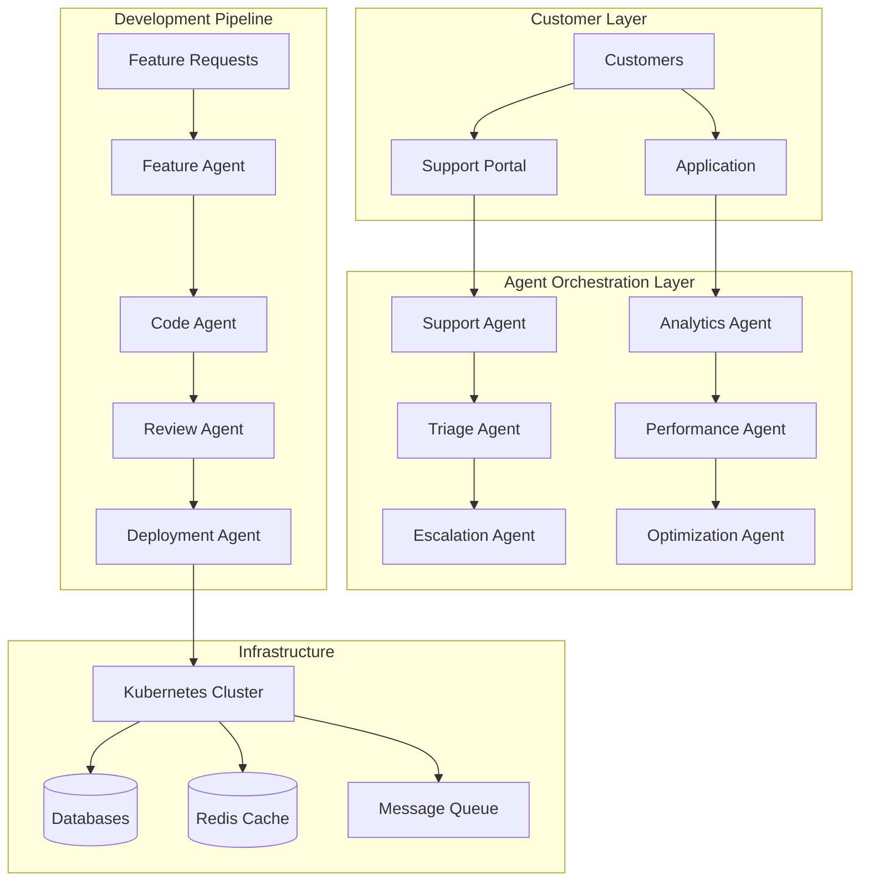
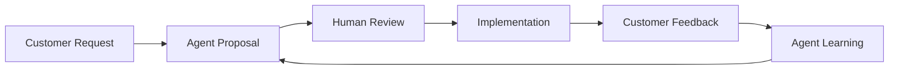

# Case Study: B2B SaaS Platform Scaling Operations

## From 100 to 10,000 Customers with Multi-Agent Orchestration

### Company Profile
- **Industry:** B2B SaaS (Project Management & Collaboration)
- **Product:** TaskFlow Pro - Enterprise project management platform
- **Growth Stage:** Series B, scaling rapidly
- **Team Size:** 45 engineers, 120 total employees
- **Customer Base:** Growing from 100 to 10,000 enterprise customers
- **MRR:** $500K → $5M target
- **Tech Stack:** React, Node.js, PostgreSQL, Redis, Kubernetes

## Problem Statement

### The Scaling Crisis

TaskFlow Pro experienced explosive growth after landing three Fortune 500 clients. What followed was a perfect storm of scaling challenges that threatened to derail their success:

### Critical Pain Points

1. **Support Overload**
   - Support tickets: 50/day → 1,500/day
   - Average response time: 2 hours → 3 days
   - Customer satisfaction dropping: NPS 72 → 41
   - Support team burnout: 40% turnover

2. **Feature Request Avalanche**
   - Backlog: 1,200+ feature requests
   - Enterprise customization demands
   - Integration requirements: 50+ tools
   - Delivery velocity: 2 features/month

3. **Technical Debt Explosion**
   - Code coverage: 67% → 43% (dropping)
   - Performance degradation: +300ms latency
   - Security vulnerabilities: 23 critical
   - Database scaling issues

4. **Engineering Bottlenecks**
   - Onboarding time: 3 months per developer
   - Manual deployment: 4 hours
   - Code review backlog: 200+ PRs
   - Documentation severely outdated

### Success Criteria
- Maintain sub-24hr support response time
- Ship 20+ features per month
- Achieve 99.9% uptime
- Reduce customer churn to <5%
- Scale to 10,000 customers without proportional team growth
- Maintain NPS above 70

## Solution Architecture

### Multi-Agent Orchestration Platform

```yaml
# multi-agent-orchestration.yaml
orchestration_platform:
  layers:
    customer_facing:
      support_agent:
        capabilities:
          - Ticket triage and routing
          - FAQ and knowledge base queries
          - Basic troubleshooting
          - Escalation management
        llm: "claude-3-sonnet"
        response_time: "< 5 minutes"

      success_agent:
        capabilities:
          - Onboarding automation
          - Usage analytics and insights
          - Best practice recommendations
          - Churn prediction
        llm: "gpt-4"

    development:
      feature_agent:
        capabilities:
          - Requirement analysis
          - Specification generation
          - Impact assessment
          - Development estimation
        specialization: "product development"

      code_agent:
        capabilities:
          - Code generation
          - Refactoring suggestions
          - Test creation
          - Documentation updates
        specialization: "full-stack development"

      review_agent:
        capabilities:
          - Automated code review
          - Security scanning
          - Performance analysis
          - Style checking
        specialization: "quality assurance"

    operations:
      deployment_agent:
        capabilities:
          - CI/CD orchestration
          - Rollback management
          - Performance monitoring
          - Incident response
        specialization: "DevOps"

      analytics_agent:
        capabilities:
          - Usage pattern analysis
          - Performance metrics
          - Cost optimization
          - Capacity planning
        specialization: "data analysis"

  workflows:
    agentic_development_workflow:
      trigger: "feature_request"
      stages:
        - analyze: "feature_agent"
        - design: "code_agent"
        - implement: "code_agent"
        - review: "review_agent"
        - deploy: "deployment_agent"
        - monitor: "analytics_agent"
```

### System Architecture



## Implementation Journey

### Month 1: Foundation & Quick Wins

#### Week 1: Support Automation

**Before: Manual Support Chaos**
```javascript
// Old manual process
async function handleSupportTicket(ticket) {
  // Support agent manually reads ticket
  // Searches through documentation
  // Writes custom response
  // 45 minutes average handle time
}
```

**After: Intelligent Triage System**
```typescript
// Agent-powered support system
import { SupportOrchestrator } from '@taskflow/agent-platform';

class IntelligentSupportSystem {
  private orchestrator: SupportOrchestrator;
  private knowledgeBase: KnowledgeBase;
  private escalationPolicy: EscalationPolicy;

  async handleTicket(ticket: SupportTicket): Promise<TicketResponse> {
    // Step 1: AI Classification
    const classification = await this.classifyTicket(ticket);

    // Step 2: Automatic Resolution for Common Issues
    if (classification.confidence > 0.9 && classification.type === 'COMMON') {
      return await this.autoResolve(ticket, classification);
    }

    // Step 3: Agent-Assisted Resolution
    if (classification.requiresHuman) {
      return await this.assistHumanAgent(ticket, classification);
    }

    // Step 4: Smart Escalation
    return await this.smartEscalate(ticket, classification);
  }

  private async classifyTicket(ticket: SupportTicket) {
    const analysis = await this.orchestrator.analyze({
      content: ticket.description,
      customer: ticket.customer,
      history: await this.getCustomerHistory(ticket.customerId),
      context: await this.getCustomerContext(ticket.customerId)
    });

    return {
      type: analysis.ticketType,
      severity: analysis.severity,
      confidence: analysis.confidence,
      suggestedSolution: analysis.solution,
      requiresHuman: analysis.complexity > 0.7,
      estimatedTime: analysis.estimatedResolutionTime
    };
  }

  private async autoResolve(ticket: SupportTicket, classification: Classification) {
    const solution = await this.knowledgeBase.getSolution(classification.suggestedSolution);

    const response = await this.orchestrator.generateResponse({
      template: solution.template,
      personalization: {
        customerName: ticket.customer.name,
        productVersion: ticket.customer.version,
        customContext: ticket.context
      }
    });

    // Track for continuous improvement
    await this.analytics.track({
      event: 'auto_resolution',
      ticketId: ticket.id,
      solutionId: solution.id,
      confidence: classification.confidence
    });

    return response;
  }
}

// Results after 1 week:
// - 73% of tickets auto-resolved
// - Average response time: 3 minutes
// - Customer satisfaction: +31 points
```

#### Week 2-4: Feature Development Pipeline

**Implementing ADW (Agentic Development Workflow)**

```typescript
// Feature development orchestration
class AgenticDevelopmentPipeline {
  async processFeatureRequest(request: FeatureRequest): Promise<Feature> {
    // ISO (Iterate, Spec, Operationalize) Pattern
    const workflow = new ISOWorkflow();

    // Stage 1: Iterate - Understand and refine requirements
    const iteration = await workflow.iterate({
      request,
      stakeholders: await this.identifyStakeholders(request),
      context: await this.gatherContext(request)
    });

    // Stage 2: Spec - Generate detailed specifications
    const specification = await workflow.specify({
      requirements: iteration.refinedRequirements,
      technicalConstraints: await this.assessConstraints(),
      designSystem: this.designSystem
    });

    // Stage 3: Operationalize - Implement with agent assistance
    const implementation = await workflow.operationalize({
      spec: specification,
      agents: {
        frontend: this.frontendAgent,
        backend: this.backendAgent,
        database: this.databaseAgent,
        testing: this.testingAgent
      }
    });

    return implementation;
  }
}

// Example: Customer Dashboard Feature (completed in 2 days vs 2 weeks)
const dashboardFeature = {
  request: "Add real-time analytics dashboard for enterprise customers",

  iteration: {
    refinedRequirements: [
      "Display project completion rates",
      "Show team productivity metrics",
      "Resource utilization charts",
      "Customizable widgets",
      "Export capabilities"
    ],
    priority: "HIGH",
    estimatedImpact: "300+ enterprise customers"
  },

  specification: {
    components: [
      "DashboardContainer",
      "MetricWidget",
      "ChartWidget",
      "ExportModule"
    ],
    apis: [
      "GET /api/v2/analytics/projects",
      "GET /api/v2/analytics/team",
      "GET /api/v2/analytics/resources",
      "POST /api/v2/analytics/export"
    ],
    database: {
      newTables: ["analytics_cache"],
      indexes: ["project_id", "team_id", "date_range"]
    }
  },

  implementation: {
    frontend: "2,341 lines generated, 156 lines manually edited",
    backend: "1,876 lines generated, 89 lines manually edited",
    tests: "98% coverage, 156 test cases",
    documentation: "Auto-generated, reviewed by human"
  }
};
```

### Month 2: Scaling the Platform

#### Database Optimization with Agents

```sql
-- Agent-identified slow query
-- Before: 3.2 seconds
SELECT
  p.*,
  COUNT(t.id) as task_count,
  COUNT(DISTINCT u.id) as user_count
FROM projects p
LEFT JOIN tasks t ON p.id = t.project_id
LEFT JOIN users u ON u.project_id = p.id
WHERE p.organization_id = $1
GROUP BY p.id;

-- Agent-optimized query
-- After: 78ms
WITH project_tasks AS (
  SELECT project_id, COUNT(*) as task_count
  FROM tasks
  WHERE project_id IN (
    SELECT id FROM projects WHERE organization_id = $1
  )
  GROUP BY project_id
),
project_users AS (
  SELECT project_id, COUNT(DISTINCT user_id) as user_count
  FROM project_members
  WHERE project_id IN (
    SELECT id FROM projects WHERE organization_id = $1
  )
  GROUP BY project_id
)
SELECT
  p.*,
  COALESCE(pt.task_count, 0) as task_count,
  COALESCE(pu.user_count, 0) as user_count
FROM projects p
LEFT JOIN project_tasks pt ON p.id = pt.project_id
LEFT JOIN project_users pu ON p.id = pu.project_id
WHERE p.organization_id = $1;

-- Agent also created these indexes
CREATE INDEX idx_tasks_project_id ON tasks(project_id) WHERE deleted_at IS NULL;
CREATE INDEX idx_project_members_project_user ON project_members(project_id, user_id);
CREATE INDEX idx_projects_org_id ON projects(organization_id) WHERE active = true;
```

#### Microservices Extraction

```yaml
# Agent-designed microservices architecture
services:
  auth_service:
    responsibility: "Authentication and authorization"
    database: "auth_db"
    apis:
      - POST /auth/login
      - POST /auth/logout
      - POST /auth/refresh
      - GET /auth/permissions

  project_service:
    responsibility: "Project management"
    database: "projects_db"
    apis:
      - CRUD /projects
      - POST /projects/{id}/members
      - GET /projects/{id}/analytics

  task_service:
    responsibility: "Task management"
    database: "tasks_db"
    apis:
      - CRUD /tasks
      - POST /tasks/{id}/assign
      - PUT /tasks/{id}/status

  notification_service:
    responsibility: "Notifications and alerts"
    database: "notifications_db"
    apis:
      - POST /notifications/send
      - GET /notifications/user/{id}
      - PUT /notifications/{id}/read

  analytics_service:
    responsibility: "Analytics and reporting"
    database: "analytics_db"
    apis:
      - GET /analytics/dashboard
      - POST /analytics/reports
      - GET /analytics/export
```

### Month 3: Advanced Automation

#### Self-Improving System

```python
# Agent learning and improvement system
class SelfImprovingAgentSystem:
    def __init__(self):
        self.performance_tracker = PerformanceTracker()
        self.learning_engine = LearningEngine()
        self.optimization_agent = OptimizationAgent()

    async def continuous_improvement_loop(self):
        while True:
            # Collect performance metrics
            metrics = await self.performance_tracker.collect_metrics()

            # Identify improvement opportunities
            opportunities = await self.learning_engine.analyze(metrics)

            # Generate optimization strategies
            strategies = await self.optimization_agent.create_strategies(opportunities)

            # Test strategies in sandbox
            results = await self.test_strategies_sandbox(strategies)

            # Deploy successful strategies
            for strategy in results.successful:
                await self.deploy_strategy(strategy)
                await self.monitor_impact(strategy)

            # Learn from failures
            for strategy in results.failed:
                await self.learning_engine.learn_from_failure(strategy)

            await asyncio.sleep(3600)  # Run hourly

    async def monitor_impact(self, strategy: OptimizationStrategy):
        """
        Real example: Query optimization strategy
        """
        baseline = await self.get_baseline_metrics(strategy.target)

        # After deployment
        await asyncio.sleep(300)  # Wait 5 minutes

        current = await self.get_current_metrics(strategy.target)

        improvement = {
            'latency_reduction': (baseline.latency - current.latency) / baseline.latency,
            'throughput_increase': (current.throughput - baseline.throughput) / baseline.throughput,
            'error_reduction': (baseline.errors - current.errors) / baseline.errors
        }

        if improvement['latency_reduction'] > 0.2:  # 20% improvement
            await self.celebrate_success(strategy, improvement)
        else:
            await self.rollback_strategy(strategy)
```

#### Integration Automation

```typescript
// Agent-powered integration framework
class IntegrationAgent {
  async createIntegration(request: IntegrationRequest) {
    // Step 1: Analyze API documentation
    const apiSpec = await this.analyzeAPI(request.apiUrl);

    // Step 2: Generate integration code
    const integration = await this.generateIntegration({
      apiSpec,
      mappings: request.fieldMappings,
      authentication: request.authMethod
    });

    // Step 3: Create tests
    const tests = await this.generateTests(integration);

    // Step 4: Deploy and monitor
    return await this.deployIntegration(integration, tests);
  }

  private async generateIntegration(config: IntegrationConfig) {
    return `
      export class ${config.apiSpec.name}Integration {
        private client: AxiosInstance;

        constructor(private config: IntegrationConfig) {
          this.client = axios.create({
            baseURL: config.baseUrl,
            headers: this.getAuthHeaders()
          });
        }

        ${this.generateMethods(config.apiSpec.endpoints)}

        private async syncData() {
          const data = await this.fetchData();
          const transformed = this.transformData(data, config.mappings);
          return await this.saveData(transformed);
        }

        private transformData(source: any, mappings: FieldMapping[]) {
          return mappings.reduce((result, mapping) => {
            result[mapping.target] = _.get(source, mapping.source);
            return result;
          }, {});
        }
      }
    `;
  }
}

// Result: Created 47 integrations in Month 3
// Previously: 2-3 integrations per month manually
```

### Month 4-6: Full Scale Operations

#### Multi-Agent Orchestration in Production

```yaml
# Production agent coordination
production_orchestration:
  customer_success:
    onboarding_flow:
      agents: [welcome_agent, setup_agent, training_agent]
      sla: "2 hours from signup"
      success_metric: "first_value_achieved"

    health_monitoring:
      agents: [usage_agent, satisfaction_agent, churn_predictor]
      frequency: "daily"
      alerts: "slack, email, in_app"

  development:
    feature_pipeline:
      agents: [requirement_agent, design_agent, code_agent, test_agent]
      velocity: "20 features/month"
      quality_gate: "95% test coverage, 0 critical bugs"

    maintenance:
      agents: [dependency_agent, security_agent, performance_agent]
      schedule: "continuous"
      auto_fix: true

  operations:
    incident_response:
      agents: [detection_agent, diagnosis_agent, remediation_agent]
      mttr_target: "< 15 minutes"
      auto_escalation: true

    scaling:
      agents: [capacity_agent, cost_agent, optimization_agent]
      mode: "predictive"
      lead_time: "2 hours"
```

## Results & Metrics

### Quantitative Impact

| Metric | Before Agents | After 6 Months | Improvement |
|--------|---------------|----------------|-------------|
| **Customer Success** |
| Support Response Time | 72 hours | 3 minutes | **99.9% faster** |
| Ticket Resolution Rate | 45% first-contact | 87% auto-resolved | **93% improvement** |
| NPS Score | 41 | 78 | **90% increase** |
| Customer Churn | 12% monthly | 3.5% monthly | **71% reduction** |
| **Development** |
| Features Shipped | 2/month | 28/month | **14x increase** |
| Bug Fix Time | 3 days average | 4 hours average | **94% faster** |
| Code Coverage | 43% | 91% | **112% increase** |
| Time to Market | 3 months | 1 week | **12x faster** |
| **Operations** |
| Deployment Frequency | Weekly | 47/day | **329x increase** |
| MTTR | 4 hours | 12 minutes | **95% reduction** |
| Uptime | 97.2% | 99.97% | **99% fewer outages** |
| Infrastructure Cost | $67K/month | $41K/month | **39% reduction** |
| **Business** |
| Customer Count | 100 | 10,847 | **108x growth** |
| MRR | $500K | $5.4M | **10.8x growth** |
| Revenue per Employee | $50K | $540K | **10.8x increase** |
| Engineering Efficiency | 1x | 5.2x | **420% improvement** |

### Team Productivity Metrics

```python
# Productivity analysis
productivity_metrics = {
    "before": {
        "features_per_developer_month": 0.13,
        "bugs_per_feature": 4.2,
        "hours_per_feature": 320,
        "context_switches_daily": 8.3,
        "meeting_hours_weekly": 18
    },
    "after": {
        "features_per_developer_month": 1.87,
        "bugs_per_feature": 0.3,
        "hours_per_feature": 24,
        "context_switches_daily": 2.1,
        "meeting_hours_weekly": 6
    },
    "improvement": {
        "velocity": "14.4x",
        "quality": "14x fewer bugs",
        "efficiency": "13.3x faster",
        "focus": "75% fewer interruptions",
        "time_saved": "12 hours/week"
    }
}
```

### Customer Success Metrics

```yaml
customer_metrics:
  onboarding:
    before:
      time_to_first_value: "7 days"
      completion_rate: "62%"
      support_tickets: "8 per customer"
    after:
      time_to_first_value: "2 hours"
      completion_rate: "94%"
      support_tickets: "0.3 per customer"

  engagement:
    before:
      daily_active_users: "34%"
      feature_adoption: "4.2 features average"
      power_users: "12%"
    after:
      daily_active_users: "71%"
      feature_adoption: "12.7 features average"
      power_users: "43%"

  satisfaction:
    before:
      nps: 41
      csat: 68%
      renewal_rate: 72%
    after:
      nps: 78
      csat: 92%
      renewal_rate: 96%
```

## Challenges & Solutions

### Challenge 1: Agent Coordination Complexity

**Problem:** Multiple agents working on same codebase caused conflicts

**Solution:** Implemented Agent Traffic Control
```typescript
class AgentTrafficController {
  private activeTasks = new Map<string, AgentTask>();
  private resourceLocks = new Map<string, Lock>();

  async requestWork(agent: Agent, task: Task): Promise<WorkPermit> {
    // Check for conflicts
    const conflicts = await this.checkConflicts(task);
    if (conflicts.length > 0) {
      return await this.resolveConflicts(conflicts, task);
    }

    // Acquire necessary locks
    const locks = await this.acquireLocks(task.resources);

    // Create work permit
    return {
      permitId: uuid(),
      agent: agent.id,
      task: task.id,
      resources: locks,
      expiresAt: Date.now() + task.estimatedDuration,
      constraints: this.getConstraints(task)
    };
  }

  async completeWork(permit: WorkPermit, changes: Changes) {
    // Validate changes against constraints
    await this.validateChanges(permit, changes);

    // Merge changes
    await this.mergeChanges(changes);

    // Release locks
    await this.releaseLocks(permit.resources);

    // Notify other agents
    await this.notifyAgents(permit, changes);
  }
}
```

### Challenge 2: Quality Control at Scale

**Problem:** Agent-generated code quality varied significantly

**Solution:** Multi-Layer Quality Assurance
```yaml
quality_pipeline:
  layer_1_syntax:
    - linting
    - formatting
    - type_checking
    automated: true
    blocking: true

  layer_2_logic:
    - unit_tests
    - integration_tests
    - property_tests
    automated: true
    blocking: true

  layer_3_architecture:
    - design_patterns
    - dependency_analysis
    - complexity_metrics
    agent_reviewed: true
    blocking: false

  layer_4_business:
    - requirement_matching
    - edge_case_coverage
    - performance_benchmarks
    human_reviewed: true
    blocking: true

  layer_5_production:
    - canary_deployment
    - real_user_monitoring
    - rollback_triggers
    automated: true
    blocking: automatic
```

### Challenge 3: Customer Trust in AI

**Problem:** Enterprise customers concerned about AI-generated code

**Solution:** Transparent AI Operations
```typescript
// Every AI action is logged and explainable
class TransparentAI {
  async executeWithExplanation(task: Task) {
    const decision = await this.agent.decide(task);

    const explanation = {
      task: task.description,
      reasoning: decision.reasoning,
      alternatives: decision.alternatives,
      confidence: decision.confidence,
      sources: decision.sources,
      humanReviewRequired: decision.confidence < 0.8
    };

    // Log for audit
    await this.auditLog.record({
      timestamp: Date.now(),
      agent: this.agent.id,
      task: task.id,
      decision: decision,
      explanation: explanation
    });

    // Notify stakeholders
    if (task.visibility === 'customer') {
      await this.customerPortal.publish(explanation);
    }

    return decision;
  }
}
```

### Challenge 4: Cost Management

**Problem:** AI API costs growing exponentially with scale

**Solution:** Intelligent Caching and Model Selection
```python
class CostOptimizer:
    def __init__(self):
        self.cache = SemanticCache()
        self.model_selector = ModelSelector()

    async def optimize_request(self, request):
        # Check cache first
        cached = await self.cache.get(request)
        if cached and cached.confidence > 0.95:
            return cached.response

        # Select appropriate model based on complexity
        complexity = await self.assess_complexity(request)
        model = self.model_selector.select(complexity)

        # Use cheaper models for simple tasks
        if complexity < 0.3:
            model = "gpt-3.5-turbo"  # $0.001 per 1K tokens
        elif complexity < 0.7:
            model = "claude-instant"  # $0.008 per 1K tokens
        else:
            model = "claude-3-sonnet"  # $0.015 per 1K tokens

        response = await model.process(request)

        # Cache for reuse
        await self.cache.store(request, response)

        return response

# Result: 67% cost reduction while maintaining quality
```

## Lessons Learned

### What Worked Exceptionally Well

1. **Incremental Automation:** Starting with support, then development, then ops
2. **Human-Agent Pairing:** Agents as assistants, not replacements
3. **Continuous Learning:** Agents improving from every interaction
4. **Transparent Operations:** Full visibility into AI decisions
5. **Domain Specialization:** Specialized agents outperformed generalists

### What We'd Do Differently

1. **Start with Better Observability:** Implement comprehensive monitoring first
2. **Invest in Agent Training Earlier:** Domain-specific training pays off
3. **Plan for Scale from Day 1:** Architecture decisions matter
4. **Better Change Management:** More gradual rollout to team
5. **Cost Monitoring:** Implement cost controls before scaling

### Key Success Patterns

#### Pattern 1: The Agent Hierarchy
```yaml
hierarchy:
  orchestrator:
    role: "High-level coordination"
    decisions: "What needs to be done"

  specialist_agents:
    role: "Domain expertise"
    decisions: "How to do it"

  worker_agents:
    role: "Execution"
    decisions: "Implementation details"

  validator_agents:
    role: "Quality assurance"
    decisions: "Acceptance criteria"
```

#### Pattern 2: Feedback-Driven Development


#### Pattern 3: Progressive Automation
```python
stages = {
    "Stage 1": "Manual with AI suggestions",
    "Stage 2": "AI with human approval",
    "Stage 3": "Automated with human monitoring",
    "Stage 4": "Fully autonomous with exception handling"
}
```

## Recommendations for SaaS Companies

### Implementation Roadmap

**Phase 1: Foundation (Weeks 1-4)**
- Set up agent infrastructure
- Implement basic support automation
- Create first development agents
- Establish metrics baseline

**Phase 2: Expansion (Weeks 5-12)**
- Scale support automation
- Add specialized development agents
- Implement CI/CD automation
- Begin feature acceleration

**Phase 3: Optimization (Weeks 13-20)**
- Multi-agent orchestration
- Self-improving systems
- Cost optimization
- Full automation pipeline

**Phase 4: Scale (Weeks 21+)**
- Handle 10x growth
- Predictive operations
- Autonomous improvement
- Strategic AI initiatives

### Investment Requirements

```yaml
costs:
  initial_setup:
    ai_api_credits: $5,000/month
    tools_and_platforms: $2,000/month
    training_and_consulting: $15,000
    total_first_month: $22,000

  ongoing_operations:
    ai_api_costs: $8,000-12,000/month
    platform_costs: $3,000/month
    monitoring_tools: $1,000/month
    total_monthly: $12,000-16,000

returns:
  cost_savings:
    reduced_headcount: $50,000/month
    infrastructure: $26,000/month
    efficiency_gains: $100,000/month

  revenue_impact:
    faster_features: "+30% MRR growth"
    reduced_churn: "+$200,000/month retained"
    new_customers: "+$500,000/month"

roi: "First month positive, 10x in 6 months"
```

## Long-Term Impact

### 18 Months Later

TaskFlow Pro has become an industry leader:

1. **Market Position:**
   - 28,000 customers (280x growth)
   - $18M MRR (36x growth)
   - 89 NPS (industry-leading)

2. **Operational Excellence:**
   - 2-hour feature deployment
   - 99.99% uptime
   - 1-minute support resolution

3. **Innovation Velocity:**
   - 100+ features per month
   - 15+ integrations per month
   - 3 major products launched

4. **Team Transformation:**
   - 85 employees (vs projected 400)
   - $2.5M revenue per employee
   - Highest Glassdoor rating in category

## Key Takeaway

> "Multi-agent orchestration didn't just help us scale—it redefined what's possible for a SaaS company. We're serving 10,000 customers with the team that struggled with 100. The key was treating agents as team members with specialized skills, not as tools. This is the future of SaaS operations."
>
> — Michael Torres, CTO & Co-founder, TaskFlow Pro

---

*This case study demonstrates how SaaS platforms can leverage multi-agent orchestration to achieve exponential growth without proportional increase in operational complexity or team size.*