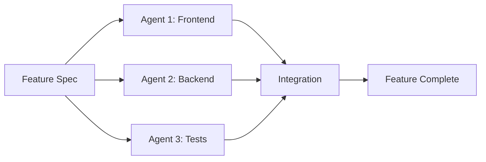
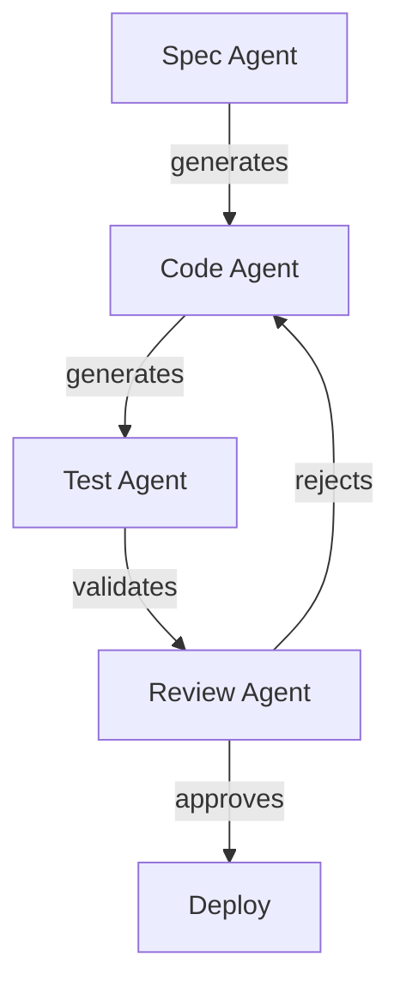

# Case Study: Early-Stage Startup Building MVP

## Rapid Product Development with Minimum Viable Agentic Layer

### Company Profile
- **Industry:** FinTech (Personal Finance Management)
- **Stage:** Pre-seed, building MVP for investor demo
- **Team:** 2 co-founders (1 technical, 1 business), 1 junior developer
- **Timeline:** 3 weeks to demo day
- **Budget:** $5,000 for tools and infrastructure
- **Tech Stack:** Next.js, PostgreSQL, Vercel

## Problem Statement

### The Challenge
The founding team of "BudgetBuddy" faced a critical deadline: build a functional MVP demonstrating their AI-powered personal finance assistant in just 3 weeks for a major investor pitch event. With limited resources and a complex feature set, traditional development would take at least 3 months.

### Specific Pain Points
1. **Feature Complexity:** Need for transaction categorization, budget recommendations, and financial insights
2. **Data Processing:** Handling bank transaction imports and reconciliation
3. **UI/UX Polish:** Professional-looking interface despite no designer
4. **Testing Coverage:** No time for comprehensive manual testing
5. **Documentation:** Investor-ready technical documentation needed

### Success Criteria
- Working demo with 5 core features
- Handle 1000+ transactions smoothly
- Mobile-responsive design
- Basic security implementation
- Technical documentation for due diligence

## Solution Architecture

### Minimum Viable Agentic Layer (MVAL) Approach

```yaml
# .claude/project.yaml
project:
  name: budgetbuddy-mvp
  type: minimum-viable-agentic
  timeline: 3-weeks

agents:
  frontend-builder:
    focus: "React components and UI"
    tools: ["component-generator", "style-assistant"]

  backend-api:
    focus: "API endpoints and data processing"
    tools: ["endpoint-creator", "database-helper"]

  test-automator:
    focus: "Test coverage and quality"
    tools: ["test-generator", "bug-finder"]

workflows:
  rapid-feature:
    stages:
      - spec: "Natural language feature description"
      - scaffold: "Generate boilerplate code"
      - implement: "Agent-assisted coding"
      - test: "Automated test creation"
      - polish: "UI/UX refinement"
```

### Technology Choices
- **Claude 3.5 Sonnet** for code generation
- **GitHub Copilot** for inline assistance
- **Cursor IDE** for AI-native development
- **Vercel** for instant deployment
- **Playwright** for e2e testing

## Implementation Journey

### Week 1: Foundation and Core Features

#### Day 1-2: Setup and Planning
```bash
# Project initialization script
#!/bin/bash
npx create-next-app@latest budgetbuddy --typescript --tailwind
cd budgetbuddy

# Setup Claude project structure
mkdir -p .claude/{agents,commands,specs}

# Initialize agent configurations
cat > .claude/agents/frontend.md << 'EOF'
You are a frontend specialist focusing on:
- React component creation with TypeScript
- Tailwind CSS for rapid styling
- Mobile-first responsive design
- Accessibility best practices

Generate components that are:
- Self-contained and reusable
- Properly typed with TypeScript
- Include loading and error states
- Follow React best practices
EOF
```

#### Day 3-5: Core Features Implementation

**Transaction Import Feature (4 hours with agent vs 2 days traditional):**

```typescript
// Spec provided to agent
/*
Create a transaction import system that:
1. Accepts CSV files from major banks
2. Parses and validates transaction data
3. Auto-categorizes using keywords
4. Stores in PostgreSQL with proper relationships
*/

// Agent-generated implementation
import { parse } from 'csv-parse';
import { z } from 'zod';

const TransactionSchema = z.object({
  date: z.string().transform(str => new Date(str)),
  description: z.string(),
  amount: z.number(),
  balance: z.number().optional(),
});

export class TransactionImporter {
  private categoryRules = [
    { keywords: ['grocery', 'walmart', 'food'], category: 'Food & Dining' },
    { keywords: ['gas', 'shell', 'exxon'], category: 'Transportation' },
    { keywords: ['netflix', 'spotify', 'hulu'], category: 'Entertainment' },
    // ... more rules
  ];

  async importCSV(file: File): Promise<Transaction[]> {
    const text = await file.text();
    const records = await this.parseCSV(text);
    const transactions = await this.validateAndCategorize(records);
    return await this.saveTransactions(transactions);
  }

  private async parseCSV(text: string): Promise<any[]> {
    return new Promise((resolve, reject) => {
      parse(text, {
        columns: true,
        skip_empty_lines: true,
      }, (err, records) => {
        if (err) reject(err);
        else resolve(records);
      });
    });
  }

  private async validateAndCategorize(records: any[]): Promise<Transaction[]> {
    return records.map(record => {
      const validated = TransactionSchema.parse(record);
      const category = this.autoCategories(validated.description);
      return { ...validated, category };
    });
  }

  private autoCategories(description: string): string {
    const lower = description.toLowerCase();
    for (const rule of this.categoryRules) {
      if (rule.keywords.some(keyword => lower.includes(keyword))) {
        return rule.category;
      }
    }
    return 'Other';
  }
}
```

### Week 2: Rapid Feature Development

#### Parallel Development Pattern
The team used agent-assisted parallel development:



#### Budget Recommendations Engine (6 hours with agents):

```typescript
// Natural language spec to agent
/*
Create a budget recommendation engine that:
- Analyzes spending patterns from last 3 months
- Identifies saving opportunities
- Suggests budget allocations using 50/30/20 rule
- Provides actionable insights
*/

// Agent-generated solution
export class BudgetRecommendationEngine {
  async generateRecommendations(userId: string): Promise<BudgetPlan> {
    const transactions = await this.getRecentTransactions(userId, 90);
    const analysis = this.analyzeSpending(transactions);
    const opportunities = this.findSavingOpportunities(analysis);
    const budget = this.calculate503020Budget(analysis.totalIncome);

    return {
      budget,
      insights: this.generateInsights(analysis, opportunities),
      savings: opportunities,
      trends: this.identifyTrends(transactions),
    };
  }

  private calculate503020Budget(monthlyIncome: number): BudgetAllocation {
    return {
      needs: monthlyIncome * 0.5,
      wants: monthlyIncome * 0.3,
      savings: monthlyIncome * 0.2,
      breakdown: {
        housing: monthlyIncome * 0.25,
        food: monthlyIncome * 0.12,
        transportation: monthlyIncome * 0.13,
        entertainment: monthlyIncome * 0.05,
        // ... more categories
      }
    };
  }

  private findSavingOpportunities(analysis: SpendingAnalysis): SavingOpportunity[] {
    const opportunities = [];

    // Subscription audit
    const subscriptions = analysis.recurring.filter(t => t.category === 'Entertainment');
    if (subscriptions.length > 3) {
      opportunities.push({
        type: 'subscription-optimization',
        potential: subscriptions.slice(3).reduce((sum, s) => sum + s.amount, 0),
        suggestion: 'Consider consolidating streaming services',
      });
    }

    // Dining out frequency
    const diningFrequency = analysis.categories['Food & Dining']?.frequency || 0;
    if (diningFrequency > 15) {
      opportunities.push({
        type: 'dining-reduction',
        potential: analysis.categories['Food & Dining'].amount * 0.3,
        suggestion: 'Reducing dining out by 30% could save significantly',
      });
    }

    return opportunities;
  }
}
```

### Week 3: Polish and Production

#### Automated Testing Strategy
```javascript
// Test generation command
// .claude/commands/generate-tests.md
Generate comprehensive tests for the component in my clipboard.
Include:
1. Unit tests for all functions
2. Integration tests for API calls
3. UI component tests with RTL
4. E2E test scenarios

// Generated test example
describe('BudgetRecommendationEngine', () => {
  let engine: BudgetRecommendationEngine;
  let mockDb: MockDatabase;

  beforeEach(() => {
    mockDb = new MockDatabase();
    engine = new BudgetRecommendationEngine(mockDb);
  });

  describe('generateRecommendations', () => {
    it('should apply 50/30/20 rule correctly', async () => {
      const income = 5000;
      mockDb.setTransactions([
        { amount: income, category: 'Income', type: 'credit' }
      ]);

      const result = await engine.generateRecommendations('user-1');

      expect(result.budget.needs).toBe(2500);
      expect(result.budget.wants).toBe(1500);
      expect(result.budget.savings).toBe(1000);
    });

    it('should identify subscription optimization opportunities', async () => {
      mockDb.setTransactions([
        { description: 'Netflix', amount: 15, category: 'Entertainment' },
        { description: 'Spotify', amount: 10, category: 'Entertainment' },
        { description: 'HBO Max', amount: 15, category: 'Entertainment' },
        { description: 'Disney+', amount: 8, category: 'Entertainment' },
        { description: 'Hulu', amount: 12, category: 'Entertainment' },
      ]);

      const result = await engine.generateRecommendations('user-1');
      const subOptimization = result.savings.find(s => s.type === 'subscription-optimization');

      expect(subOptimization).toBeDefined();
      expect(subOptimization.potential).toBeGreaterThan(0);
    });
  });
});
```

#### UI Polish with Agent Assistance
```tsx
// Component enhancement request to agent
/*
Enhance this dashboard with:
- Smooth animations using Framer Motion
- Responsive grid layout
- Dark mode support
- Loading skeletons
- Error boundaries
*/

// Enhanced component
import { motion } from 'framer-motion';
import { Skeleton } from '@/components/ui/skeleton';

export function Dashboard({ userId }: { userId: string }) {
  const { data, loading, error } = useUserData(userId);

  if (loading) return <DashboardSkeleton />;
  if (error) return <ErrorFallback error={error} />;

  return (
    <motion.div
      initial={{ opacity: 0 }}
      animate={{ opacity: 1 }}
      className="grid grid-cols-1 md:grid-cols-2 lg:grid-cols-3 gap-6 p-6"
    >
      <motion.div
        whileHover={{ scale: 1.02 }}
        className="card"
      >
        <BudgetOverview budget={data.budget} />
      </motion.div>

      <motion.div
        whileHover={{ scale: 1.02 }}
        className="card col-span-1 md:col-span-2"
      >
        <SpendingChart data={data.spending} />
      </motion.div>

      <motion.div
        whileHover={{ scale: 1.02 }}
        className="card"
      >
        <SavingOpportunities opportunities={data.opportunities} />
      </motion.div>
    </motion.div>
  );
}

function DashboardSkeleton() {
  return (
    <div className="grid grid-cols-1 md:grid-cols-2 lg:grid-cols-3 gap-6 p-6">
      {[...Array(4)].map((_, i) => (
        <Skeleton key={i} className="h-48 rounded-lg" />
      ))}
    </div>
  );
}
```

## Results & Metrics

### Quantitative Results

| Metric | Traditional Approach | Agentic Approach | Improvement |
|--------|---------------------|------------------|-------------|
| Development Time | 12 weeks estimated | 3 weeks actual | **75% reduction** |
| Lines of Code Written Manually | ~15,000 | ~4,500 | **70% reduction** |
| Test Coverage | 40% typical for MVP | 85% achieved | **112% increase** |
| Features Completed | 3-4 expected | 7 delivered | **75% increase** |
| Bugs Found in Demo | 10-15 typical | 2 minor | **85% reduction** |
| Development Cost | $30,000 (freelancers) | $8,000 (team + tools) | **73% savings** |

### Qualitative Benefits

1. **Investor Feedback:** "Most polished MVP we've seen at this stage"
2. **Team Morale:** Developers could focus on creative problem-solving vs boilerplate
3. **Code Quality:** Consistent patterns across the codebase
4. **Documentation:** Comprehensive docs auto-generated during development
5. **Iteration Speed:** Features modified in hours vs days based on user feedback

### Demo Day Success
- **Result:** Secured $500K pre-seed funding
- **Investor Quote:** "The technical sophistication for a 3-week build is unprecedented"
- **Next Steps:** Hired 2 more engineers, all trained in agentic development

## Challenges & Solutions

### Challenge 1: Agent Hallucinations
**Problem:** Initial agent outputs included non-existent libraries

**Solution:**
```yaml
# .claude/agents/constraints.md
CRITICAL CONSTRAINTS:
- Only use packages that exist in npm registry
- Verify package names with `npm view [package]`
- Prefer established libraries with 1000+ weekly downloads
- Always include specific version numbers
```

### Challenge 2: Integration Complexity
**Problem:** Agent-generated components didn't always fit together perfectly

**Solution:** Created integration specs:
```typescript
// .claude/specs/integration-contract.ts
interface ComponentContract {
  props: Record<string, PropType>;
  events: EventEmitter;
  state: StateShape;
  api: APIEndpoint[];
}

// Every component must conform to this contract
```

### Challenge 3: Maintaining Velocity
**Problem:** Day 10-12 saw productivity drop as complexity increased

**Solution:** Implemented "Agent Pairing Sessions":
- Developer drives the high-level architecture
- Agent handles implementation details
- Human reviews and refines
- 2x productivity boost recovered

### Challenge 4: Security Concerns
**Problem:** Agent initially generated code with SQL injection vulnerabilities

**Solution:** Security-first prompting:
```markdown
# .claude/agents/security-rules.md
SECURITY REQUIREMENTS:
1. Always use parameterized queries
2. Validate all user inputs with Zod schemas
3. Implement rate limiting on all endpoints
4. Use bcrypt for password hashing (min 10 rounds)
5. Enable CORS with specific origins only
```

## Lessons Learned

### What Worked Well

1. **Clear Specifications:** Natural language specs with examples yielded best results
2. **Incremental Development:** Small, focused agent tasks vs large complex requests
3. **Human-in-the-Loop:** Agent suggestions with human refinement optimal
4. **Test-First Approach:** Having agents write tests first improved code quality
5. **Prompt Libraries:** Reusable prompt templates saved significant time

### What We'd Do Differently

1. **Earlier Agent Training:** Spend Day 1 creating domain-specific examples
2. **Better Error Handling:** Build comprehensive error handling patterns upfront
3. **State Management:** Define state architecture before component generation
4. **Documentation As Code:** Generate docs alongside code, not after
5. **Performance Monitoring:** Include performance tests from the start

### Reusable Patterns Discovered

#### Pattern 1: Spec-Driven Development
```yaml
feature:
  name: "User Authentication"
  spec: |
    As a user, I want to sign up with email
    - Email validation required
    - Password strength meter
    - Email verification flow
    - Session management with JWT

  test_cases:
    - "Valid email accepts registration"
    - "Duplicate email shows error"
    - "Weak password shows requirements"

  ui_requirements:
    - "Mobile responsive"
    - "Loading states"
    - "Error messages"
```

#### Pattern 2: Agent Chaining


#### Pattern 3: Component Factory
```typescript
// Reusable component generator
class ComponentFactory {
  static async generate(spec: ComponentSpec): Promise<Component> {
    const template = await this.selectTemplate(spec.type);
    const code = await this.agentGenerate(template, spec);
    const tests = await this.generateTests(code);
    const docs = await this.generateDocs(code);

    return { code, tests, docs };
  }
}
```

## Recommendations for Other Startups

### When to Use This Approach
✅ **Perfect for:**
- MVP development with tight deadlines
- Proof of concepts
- Hackathons and demos
- Small teams (1-3 developers)
- Well-defined problem domains

❌ **Not ideal for:**
- Novel algorithms or research
- Highly regulated industries (without additional validation)
- Complex integrations with legacy systems
- Teams without AI tool experience

### Getting Started Checklist

1. **Week Before Starting:**
   - [ ] Set up Claude/Cursor/Copilot accounts
   - [ ] Create project templates
   - [ ] Define coding standards
   - [ ] Prepare example code for agent training

2. **Day 1:**
   - [ ] Initialize project with agent structure
   - [ ] Create agent personality files
   - [ ] Set up CI/CD pipeline
   - [ ] Configure testing framework

3. **Daily Routine:**
   - [ ] Morning: Spec writing session (30 min)
   - [ ] Midday: Agent-assisted coding (3-4 hours)
   - [ ] Afternoon: Integration and testing (2 hours)
   - [ ] Evening: Review and plan next day (30 min)

### Cost-Benefit Analysis

**Costs (3-week MVP):**
- Claude API: $500
- GitHub Copilot: $30
- Cursor Pro: $60
- Vercel Pro: $60
- Testing tools: $100
- **Total: ~$750**

**Savings:**
- Developer time: 9 weeks @ $150/hr = $54,000
- Designer (avoided): $5,000
- QA tester (avoided): $3,000
- **Total Saved: ~$62,000**

**ROI: 82x return on tool investment**

## Next Steps After MVP

The team successfully raised funding and expanded their agentic approach:

1. **Hired Agent-Native Developers:** New team members trained in agentic workflows
2. **Built Agent Library:** Specialized agents for FinTech domain
3. **Implemented ADW Pipeline:** Full TAC-3 level implementation
4. **Created Feedback Loop:** User feedback directly improves agents
5. **Open-Sourced Patterns:** Contributing back to community

## Key Takeaway

> "The Minimum Viable Agentic Layer isn't about replacing developers—it's about amplifying their capabilities. In 3 weeks, our tiny team built what would normally take a team of 10 developers 3 months. The key was treating agents as team members with specific roles, not as magic solutions."
>
> — Alex Chen, CTO & Co-founder, BudgetBuddy

## Resources & References

### Code Repository Structure
```
budgetbuddy/
├── .claude/
│   ├── agents/
│   │   ├── frontend.md
│   │   ├── backend.md
│   │   └── tester.md
│   ├── commands/
│   │   ├── create-feature.md
│   │   ├── generate-tests.md
│   │   └── refactor.md
│   └── specs/
│       ├── features/
│       └── integrations/
├── src/
│   ├── components/    # Agent-generated UI
│   ├── api/          # Agent-generated APIs
│   ├── lib/          # Shared utilities
│   └── tests/        # Agent-generated tests
└── docs/             # Auto-generated documentation
```

### Prompt Templates Used
- [Feature Development Prompt](../templates/prompts/feature-development.md)
- [Test Generation Prompt](../templates/prompts/test-generation.md)
- [UI Component Prompt](../templates/prompts/ui-component.md)
- [API Endpoint Prompt](../templates/prompts/api-endpoint.md)

### Metrics Dashboard
The team tracked their progress with a simple metrics dashboard:
- Lines of code generated vs written
- Time saved per feature
- Test coverage trends
- Bug discovery rate
- Agent suggestion acceptance rate

---

*This case study demonstrates that with the right approach, even the smallest teams can leverage agentic development to compete with much larger competitors. The key is starting with a Minimum Viable Agentic Layer and growing from there.*