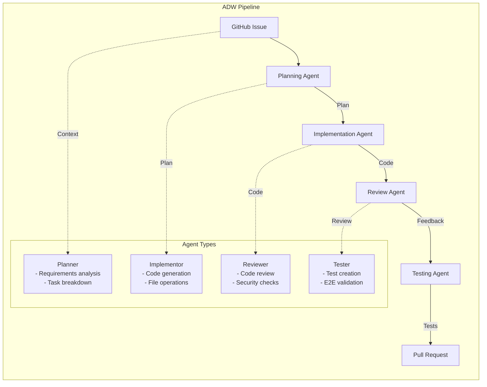
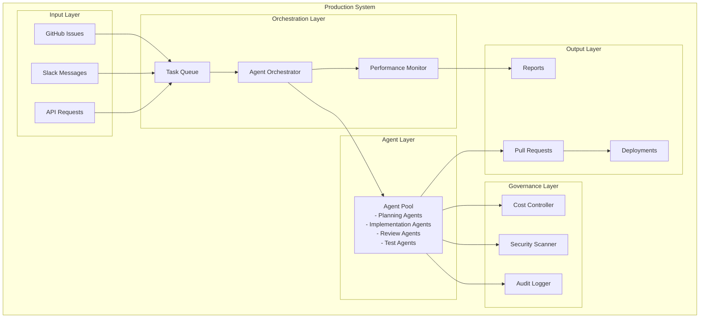
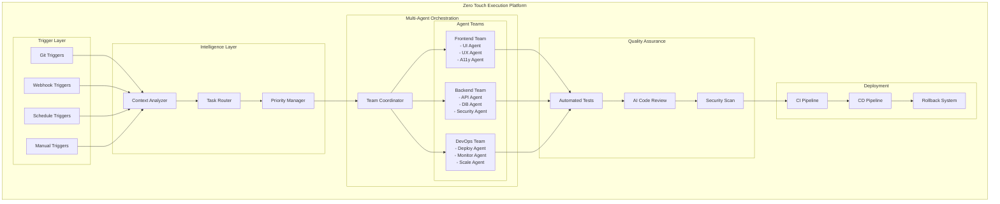
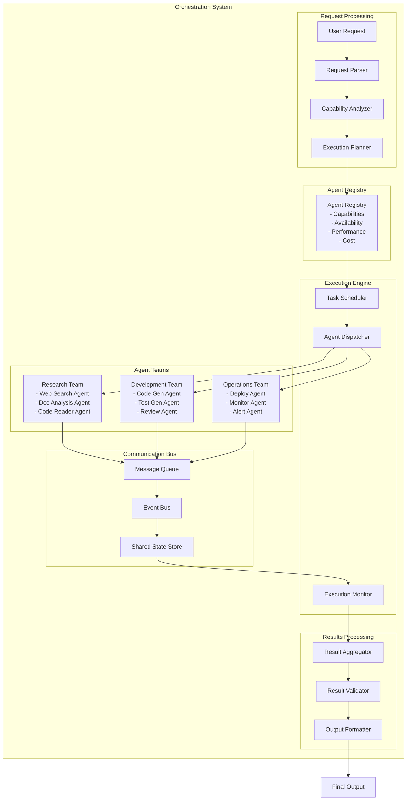
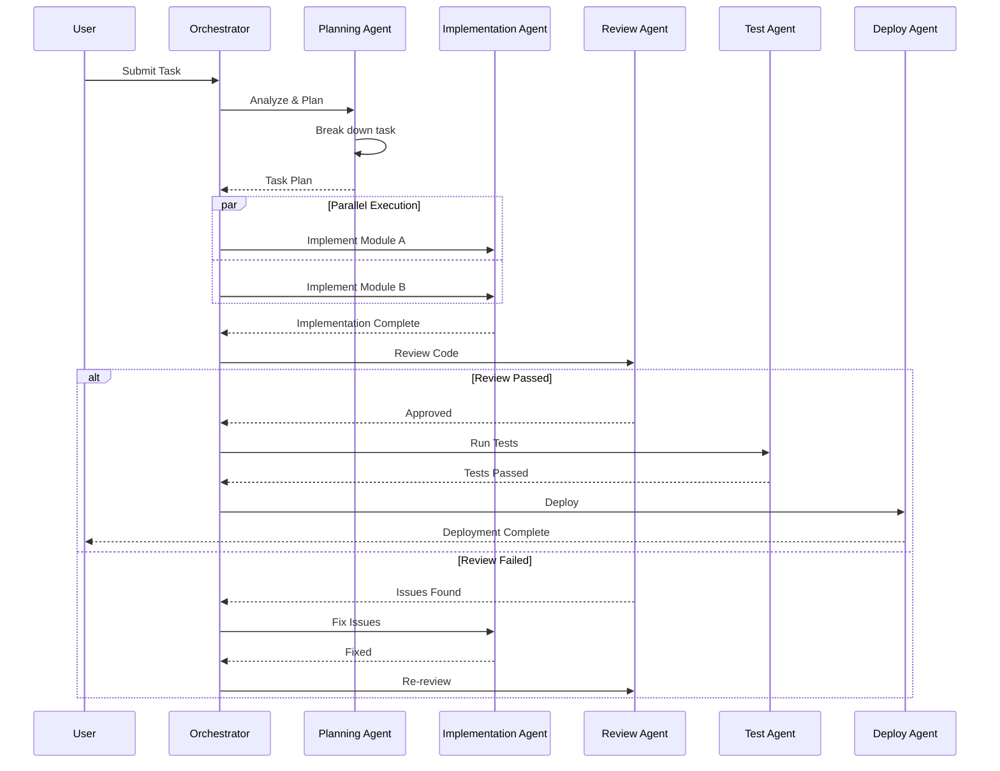
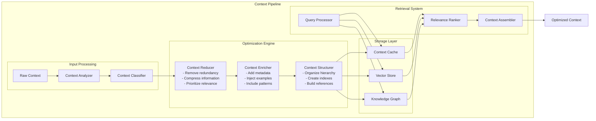
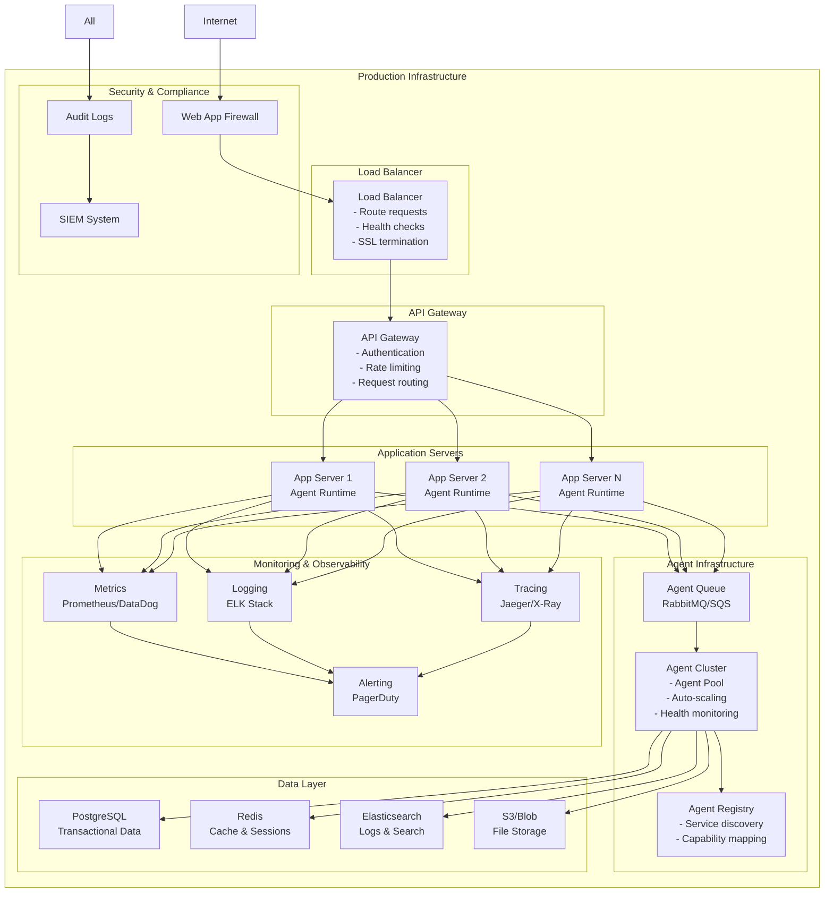
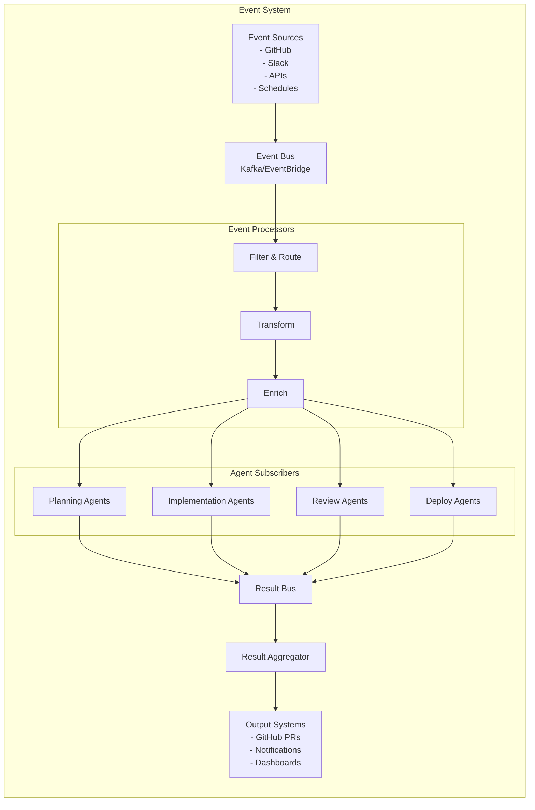
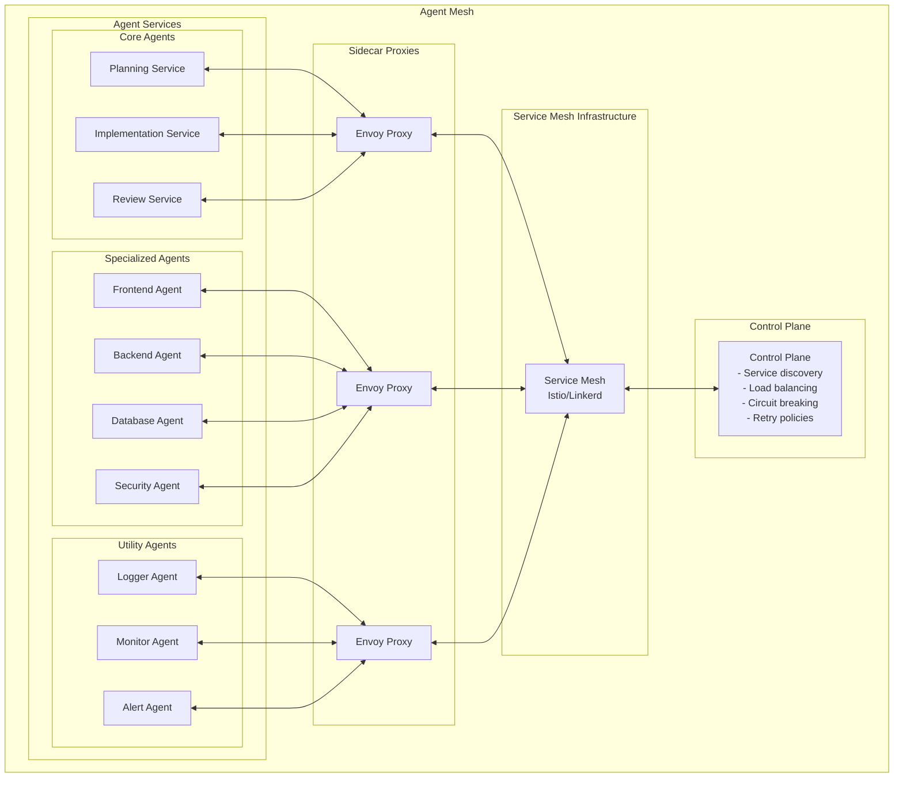

# Architecture Diagrams

## System Architecture Evolution

### TAC-1 to TAC-3: Foundation Architecture
*Basic Claude CLI integration with structured prompts*

```mermaid
graph TB
    subgraph "TAC-1: Basic Integration"
        User1[Developer] --> CLI1[Claude CLI]
        CLI1 --> Prompt1[Single Prompt]
        Prompt1 --> Output1[Code Output]
    end

    subgraph "TAC-2: Command Structure"
        User2[Developer] --> Commands[Command Directory]
        Commands --> |Reusable| CLI2[Claude CLI]
        CLI2 --> App[Application Code]
    end

    subgraph "TAC-3: SDLC Workflows"
        User3[Developer] --> Template[BFC/Feature Templates]
        Template --> Planning[Planning Phase]
        Planning --> Implementation[Implementation]
        Implementation --> Review[Review Process]
    end
```

### TAC-4 to TAC-5: Agentic Development Workflow (ADW)
*Multi-agent pipeline with specialized agents*

### TAC-6 to TAC-7: Production Architecture
*Enterprise-ready with monitoring and governance*

### TAC-8: Full Automation Platform
*Complete zero-touch execution system*

## Agentic Horizon: Advanced Architectures

### Multi-Agent Orchestration Architecture
*Complex agent coordination and communication*

### Agent Communication Architecture
*How agents coordinate and share information*

### Context Engineering Architecture
*Advanced context management system*

### Production Deployment Architecture
*Complete production system with all components*

## Integration Patterns

### Event-Driven Agent Architecture
*Asynchronous agent communication*

### Agent Mesh Architecture
*Microservices-style agent deployment*

## Key Architectural Principles

### 1. **Separation of Concerns**
- Each agent has a single, well-defined responsibility
- Clear interfaces between agents
- Modular, replaceable components

### 2. **Scalability**
- Horizontal scaling of agent pools
- Queue-based task distribution
- Auto-scaling based on load

### 3. **Resilience**
- Circuit breakers for failing agents
- Retry mechanisms with exponential backoff
- Graceful degradation

### 4. **Observability**
- Comprehensive logging at all levels
- Distributed tracing for request flow
- Real-time metrics and dashboards

### 5. **Security**
- Zero-trust between agents
- Encrypted communication
- Audit logging for compliance

### 6. **Flexibility**
- Pluggable agent architecture
- Configuration-driven behavior
- Feature flags for gradual rollout