# Concept Maps

## Core Concepts and Relationships

### Agentic Engineering Ecosystem
*Complete conceptual framework*

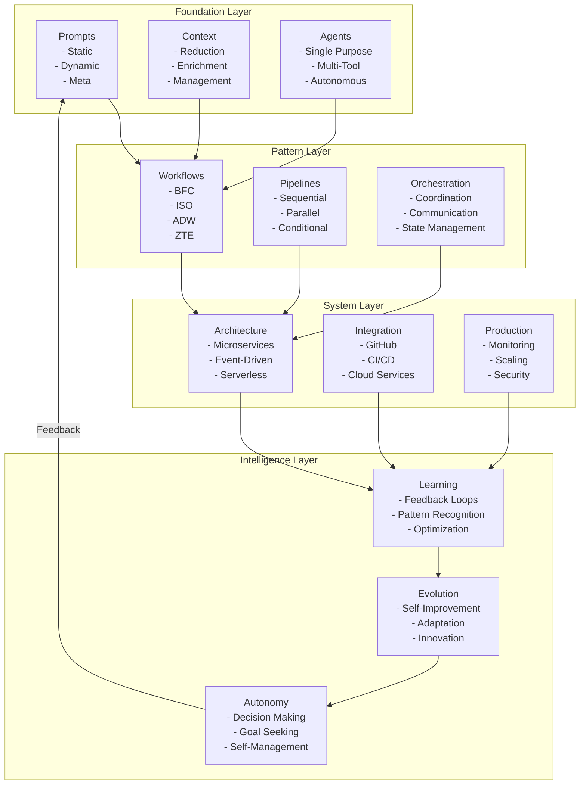

### Prompt Engineering Taxonomy
*Complete classification of prompt types*

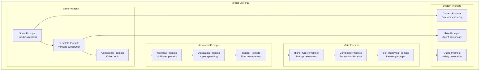

### Agent Capability Model
*Hierarchy of agent capabilities*

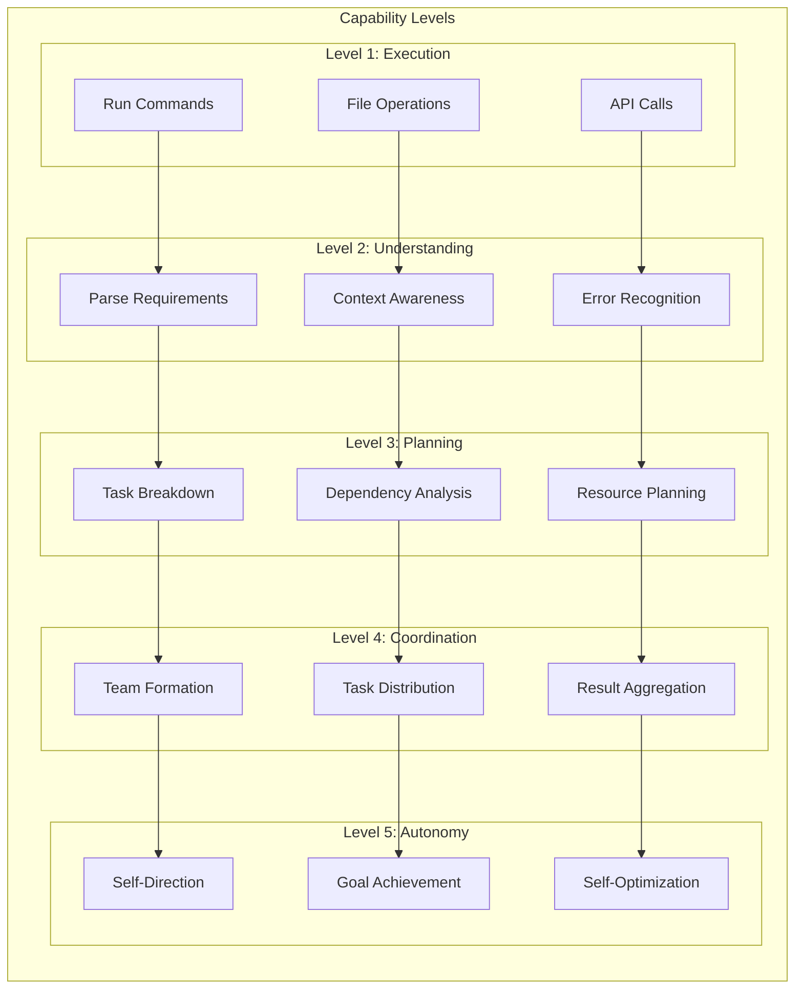

### Pattern Category Relationships
*How different pattern types connect*

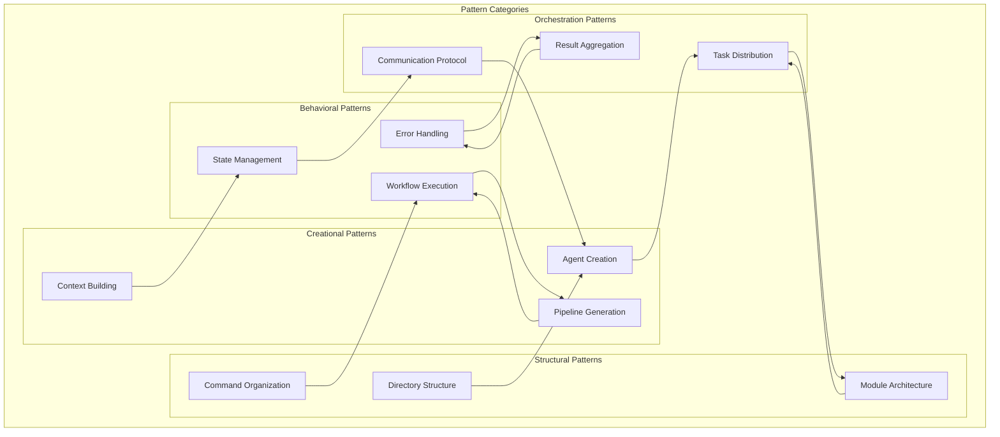

### Context Engineering Framework
*Complete context management system*

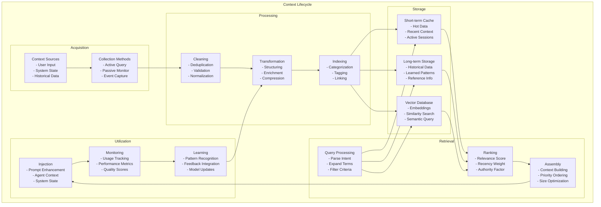

## Mental Models

### The Agentic Paradigm Shift
*Evolution from traditional to agentic development*

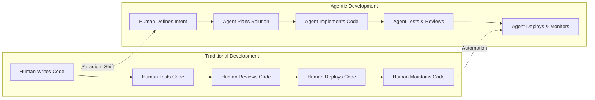

### Complexity Abstraction Layers
*How complexity is managed at different levels*

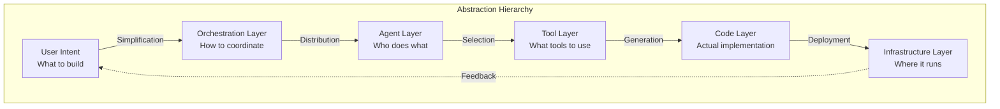

### Value Creation Model
*How agentic systems create value*

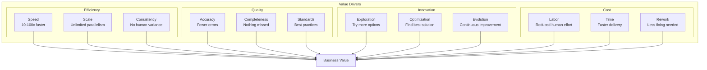

### Knowledge Transfer Model
*How knowledge flows in the system*

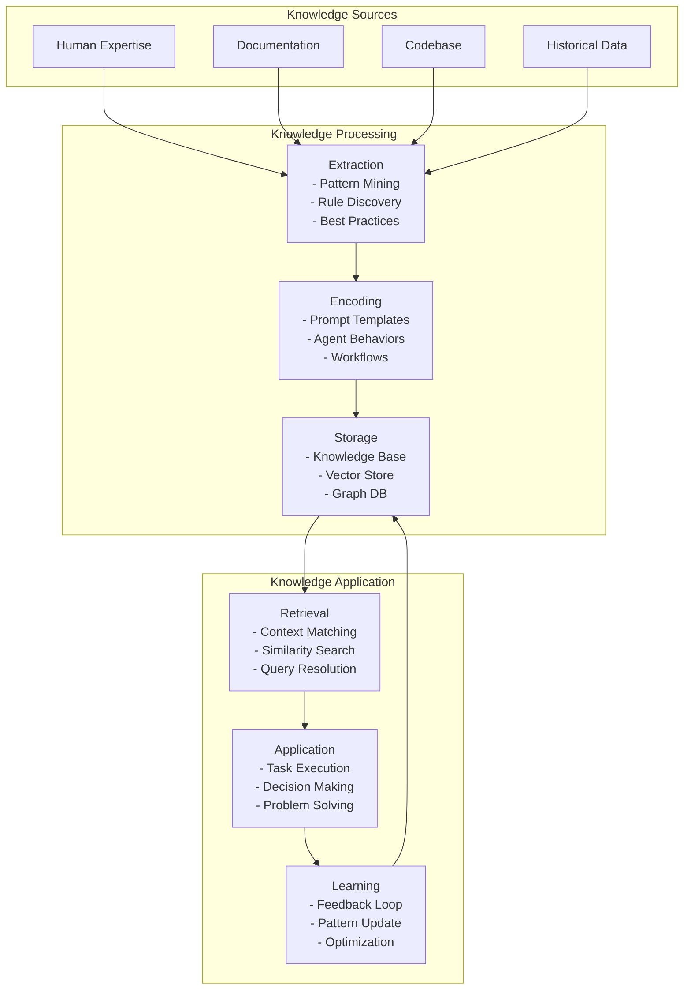

## System Thinking Models

### Feedback Loop Architecture
*How systems learn and improve*

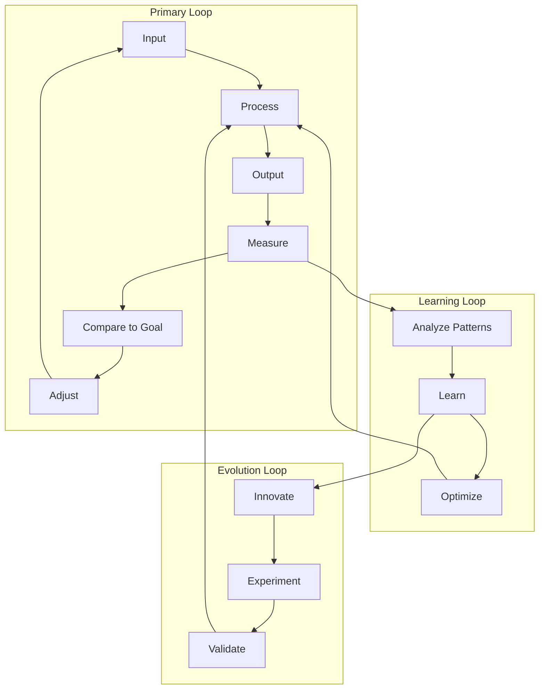

### Emergence Model
*How complex behavior emerges from simple rules*

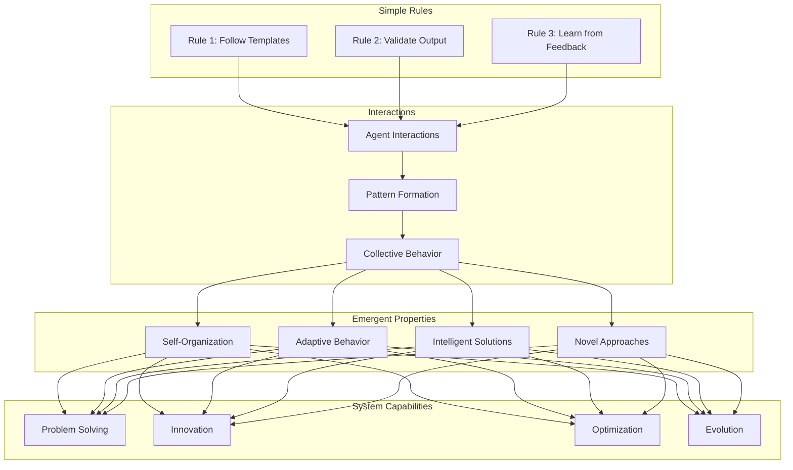

### Scalability Model
*How systems scale from simple to complex*

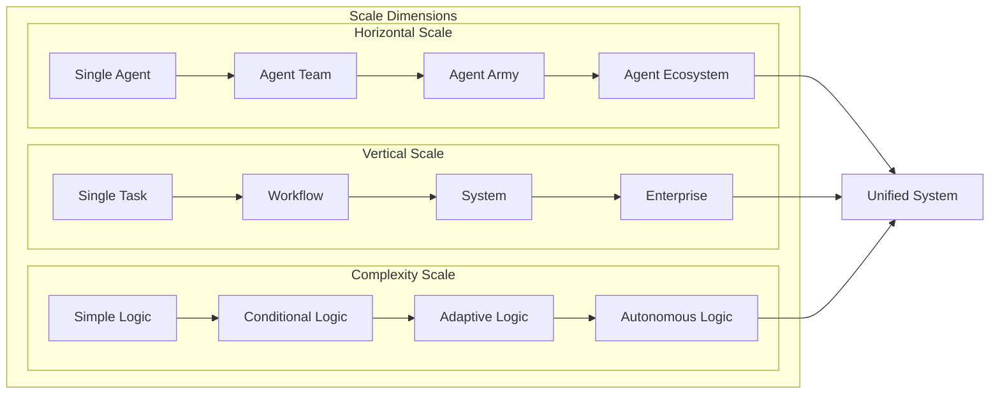

## Integration Models

### Tool Integration Map
*How different tools connect in the ecosystem*

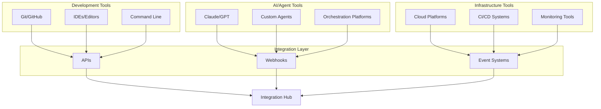

### Data Flow Model
*How information flows through the system*

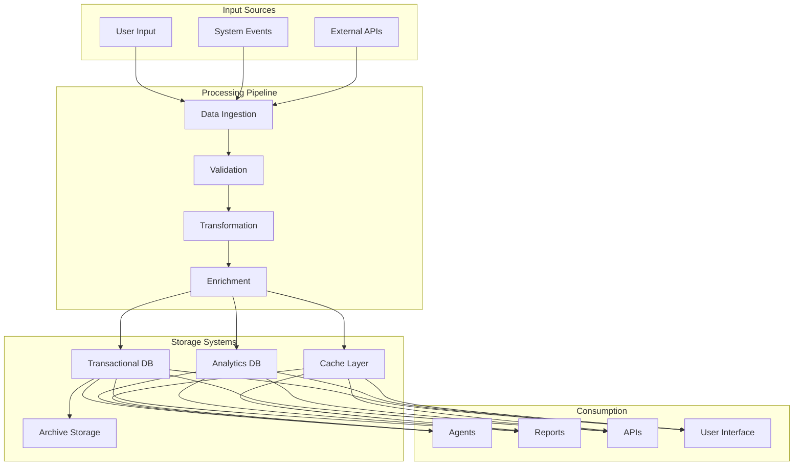

## Key Conceptual Insights

### 1. **Everything is a Pattern**
- Prompts are patterns for AI behavior
- Agents are patterns for task execution
- Workflows are patterns for processes
- Systems are patterns of patterns

### 2. **Composition Over Complexity**
- Simple components combine into complex systems
- Each layer adds capability without adding complexity
- Interfaces remain clean despite internal sophistication

### 3. **Automation Enables Innovation**
- Removing manual work frees cognitive capacity
- Agents handle execution, humans handle creativity
- Systems evolve through automated experimentation

### 4. **Context is King**
- Better context leads to better results
- Context engineering is as important as prompt engineering
- Shared context enables agent collaboration

### 5. **Evolution Through Feedback**
- Systems improve through continuous feedback
- Learning happens at every level
- Evolution is built into the architecture