# Decision Trees

## Pattern Selection Decision Trees

### When to Use Which Pattern?
*Choosing the right pattern for your use case*

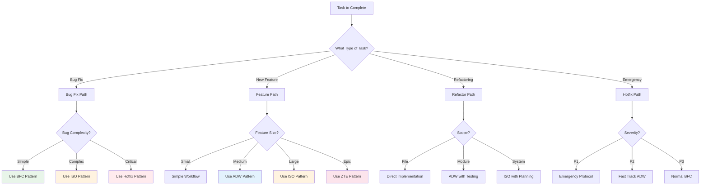

### Architecture Selection Guide
*Choosing the right architecture for your system*

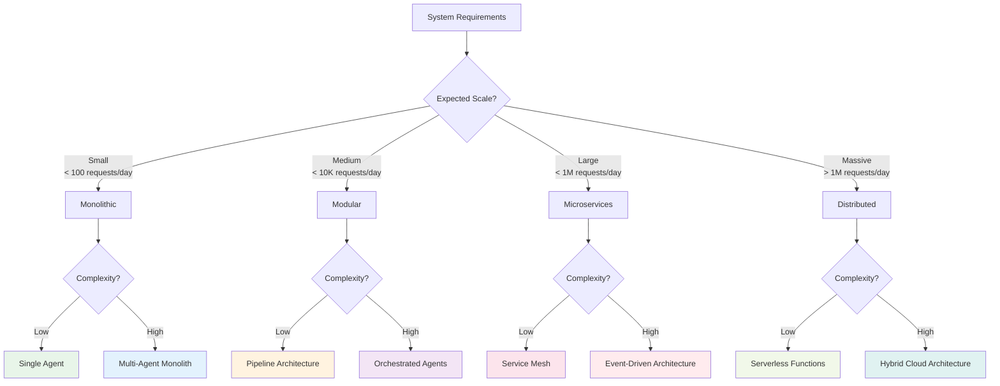

### Agent Type Selection
*Choosing the right agent for the task*

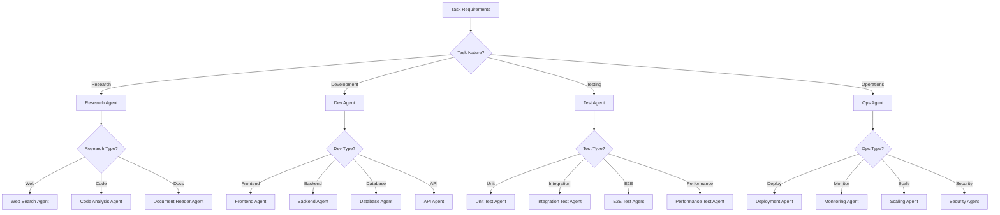

## Troubleshooting Decision Trees

### Performance Issues
*Diagnosing and fixing performance problems*

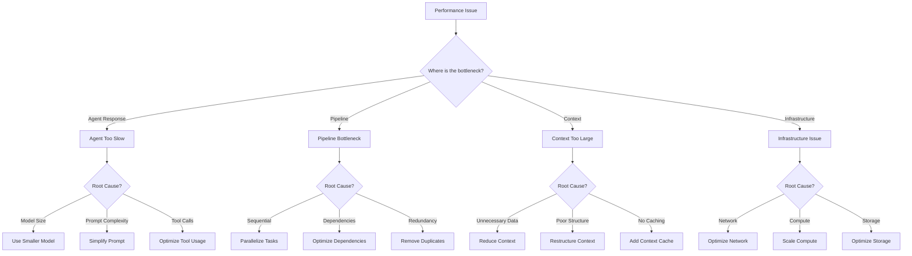

### Error Handling
*How to handle different types of errors*

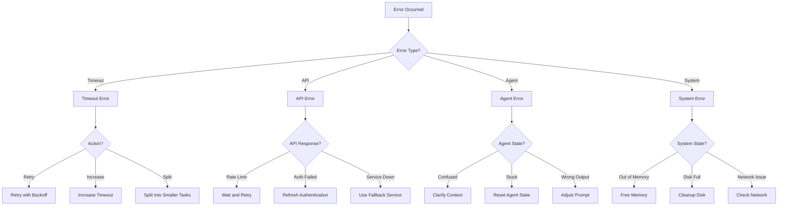

### Quality Issues
*Diagnosing and fixing quality problems*

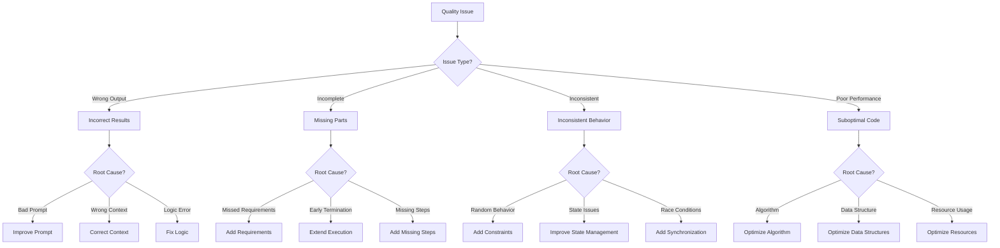

## Implementation Decision Trees

### Starting a New Project
*How to begin an agentic project*

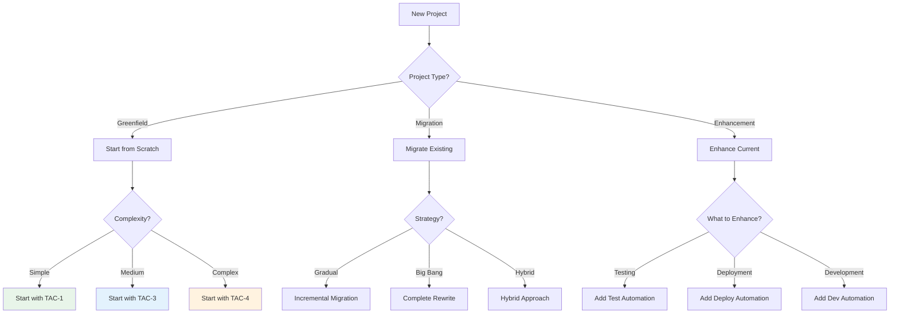

### Technology Stack Selection
*Choosing the right tools and technologies*

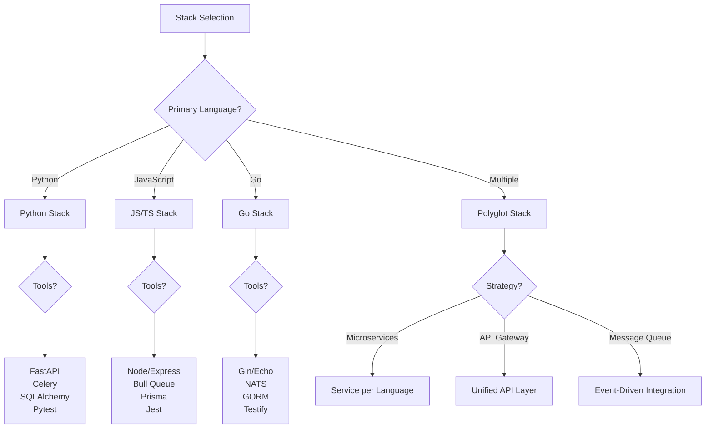

### Scaling Decision Tree
*When and how to scale your system*

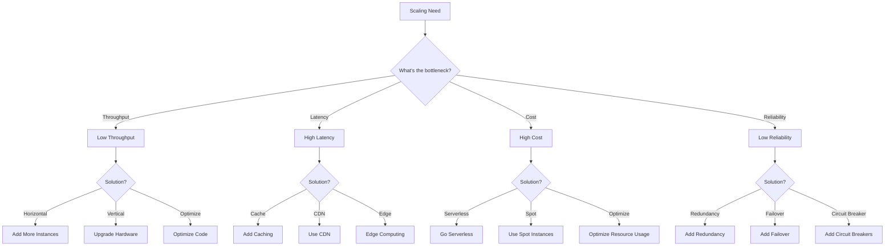

## Operational Decision Trees

### Deployment Strategy
*Choosing the right deployment approach*

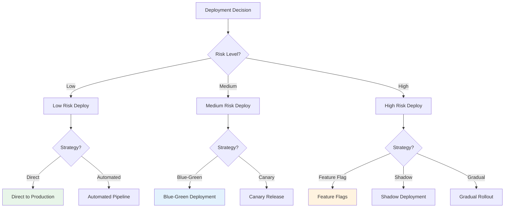

### Monitoring Strategy
*What and how to monitor*

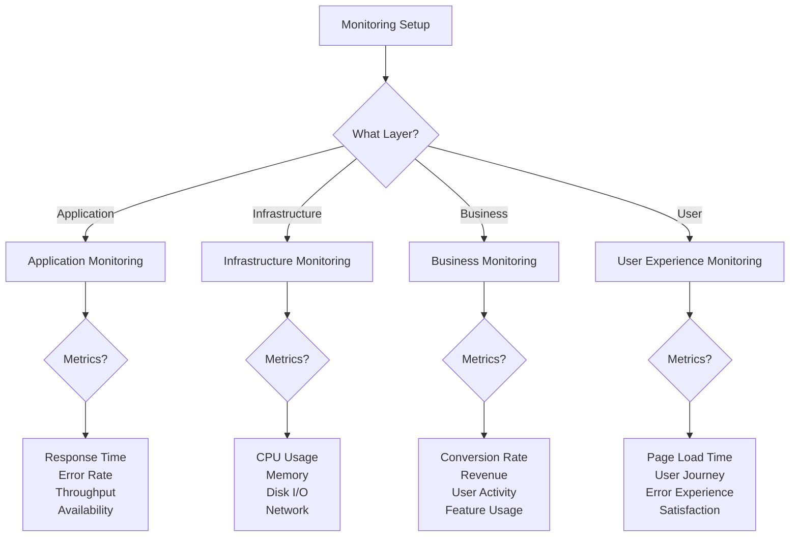

### Incident Response
*How to handle production incidents*

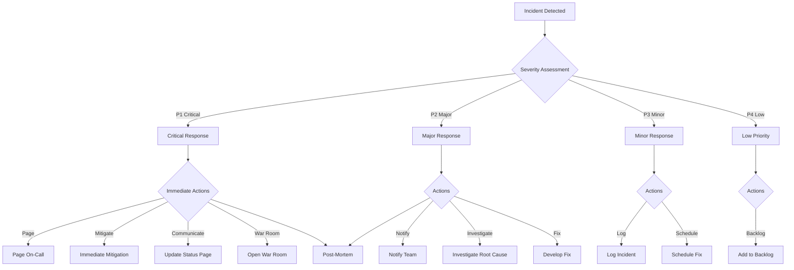

## Advanced Decision Trees

### Optimization Strategy
*How to optimize different aspects*

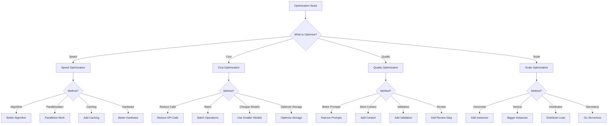

### Learning Path Selection
*Choosing your learning journey*

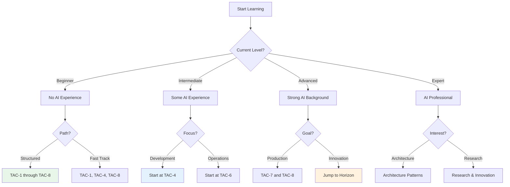

## Key Decision Principles

### 1. **Start Simple, Evolve Complexity**
- Begin with the simplest solution that works
- Add complexity only when needed
- Maintain simplicity at interfaces

### 2. **Measure Before Optimizing**
- Identify actual bottlenecks
- Use data to drive decisions
- Avoid premature optimization

### 3. **Fail Fast, Learn Faster**
- Quick validation of approaches
- Rapid iteration cycles
- Learning from failures

### 4. **Context Drives Decisions**
- No one-size-fits-all solutions
- Consider your specific requirements
- Adapt patterns to your needs

### 5. **Automate Decision Making**
- Codify decision trees as rules
- Let agents make routine decisions
- Reserve human judgment for exceptions