# Progression Maps

## Complete Learning Journey

### TAC to Horizon: The Full Path
*From basic AI-assisted coding to agentic mastery*

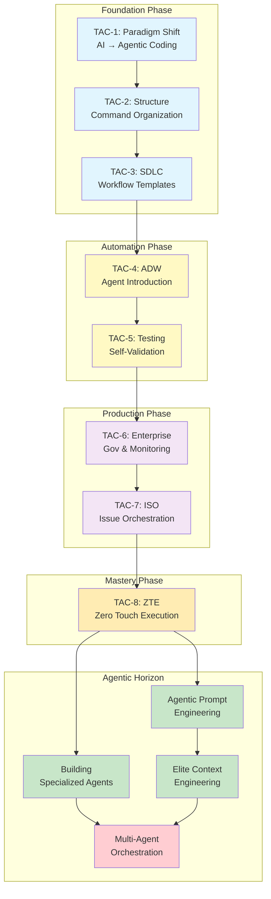

### Skill Progression Tree
*Skills acquired at each level*

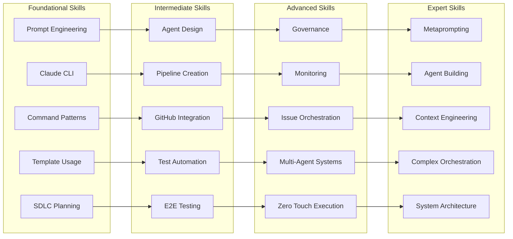

### Pattern Evolution Timeline
*How patterns evolve through the course*

```mermaid
gantt
    title Pattern Evolution Through TAC Levels
    dateFormat X
    axisFormat %s

    section Basic Patterns
    Single Prompts          :done, 1, 3
    Command Structure       :done, 2, 4
    Template Usage         :done, 3, 5

    section Workflow Patterns
    BFC Workflow           :done, 3, 6
    Planning-First         :done, 3, 7
    Review Cycles         :done, 4, 8

    section Agent Patterns
    Single Agent          :done, 4, 6
    Multi-Agent Pipeline  :done, 4, 8
    Agent Teams          :active, 6, 10

    section Orchestration
    Basic Orchestration   :done, 7, 9
    ISO Pattern          :done, 7, 10
    Full Automation      :active, 8, 11

    section Advanced
    Metaprompting        :crit, 9, 11
    Context Engineering  :crit, 9, 12
    Self-Improvement    :crit, 10, 12
```

### Maturity Model Visualization
*Progression through maturity levels*

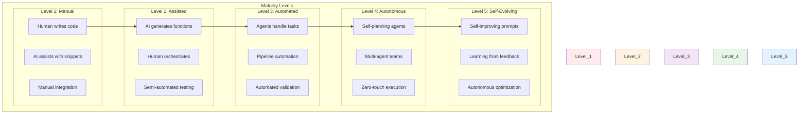

### Knowledge Dependency Graph
*How concepts build on each other*

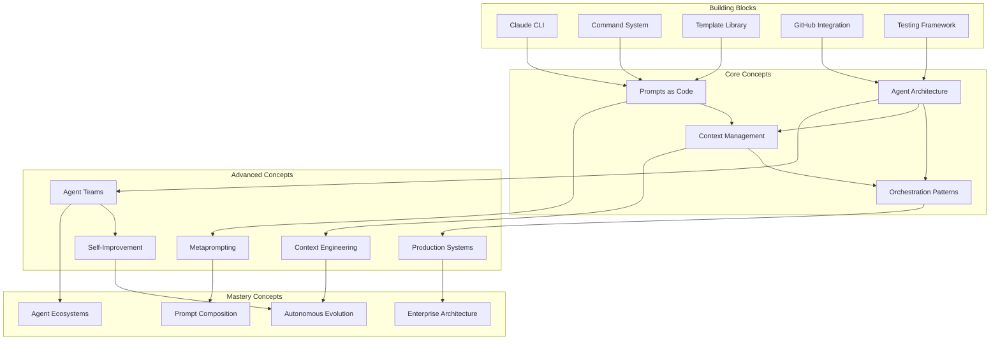

### Capability Progression Model
*Growth in capabilities across dimensions*

```mermaid
radar
    title Capability Growth by TAC Level
    dateFormat  X
    axisFormat %s

    section TAC-1
    Automation : 20
    Complexity : 10
    Independence : 10
    Scale : 10
    Intelligence : 20

    section TAC-4
    Automation : 60
    Complexity : 50
    Independence : 40
    Scale : 30
    Intelligence : 50

    section TAC-8
    Automation : 95
    Complexity : 85
    Independence : 90
    Scale : 80
    Intelligence : 85

    section Horizon
    Automation : 100
    Complexity : 100
    Independence : 100
    Scale : 100
    Intelligence : 100
```

### Learning Curve Visualization
*Effort vs capability over time*

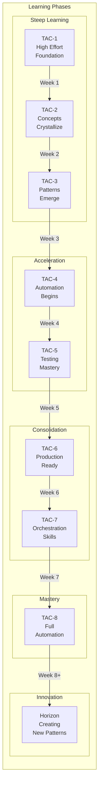

## Pattern Progression Maps

### Pattern Complexity Evolution
*How patterns become more sophisticated*

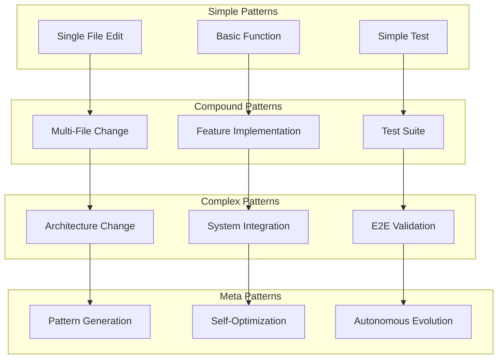

### Workflow Pattern Evolution
*From manual to autonomous workflows*

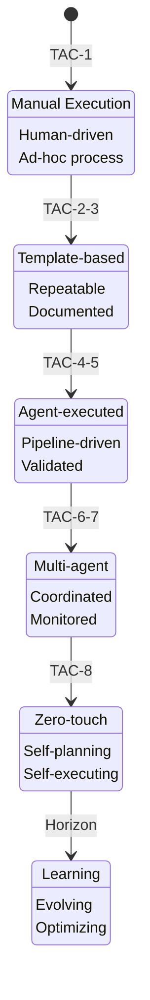

### Agent Sophistication Journey
*Evolution of agent capabilities*

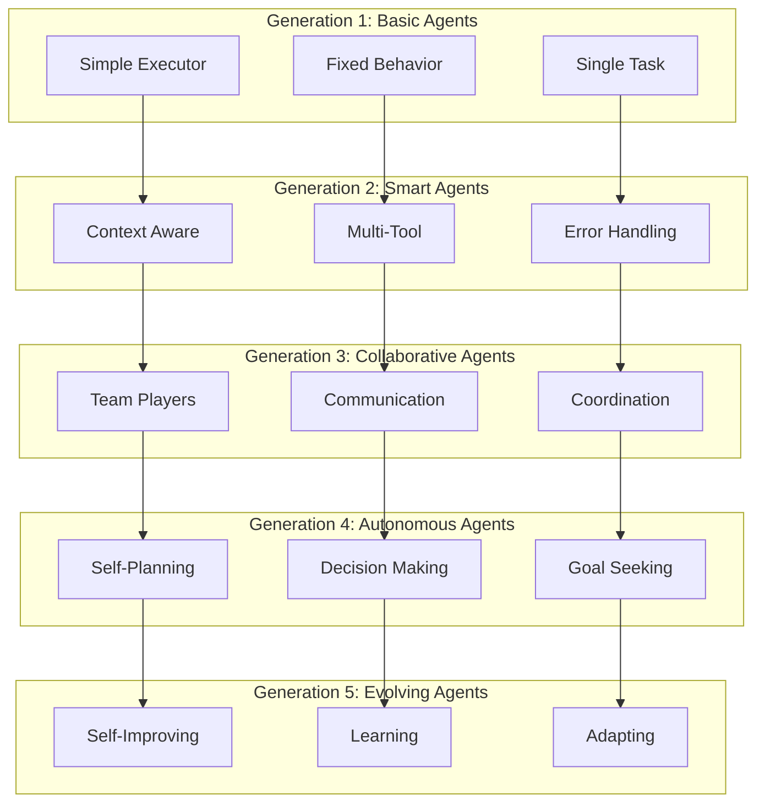

## Competency Progression Framework

### Technical Competencies
*Skills acquired at each level*

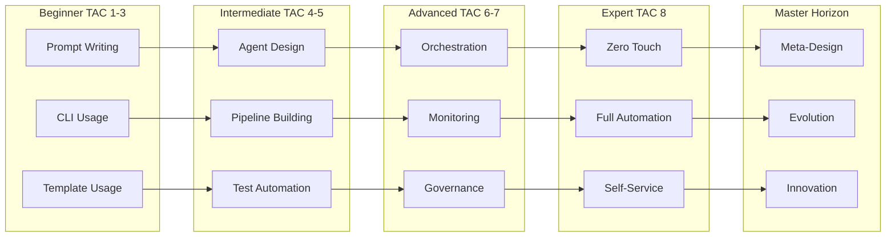

### Conceptual Understanding Progression
*Deepening understanding of core concepts*

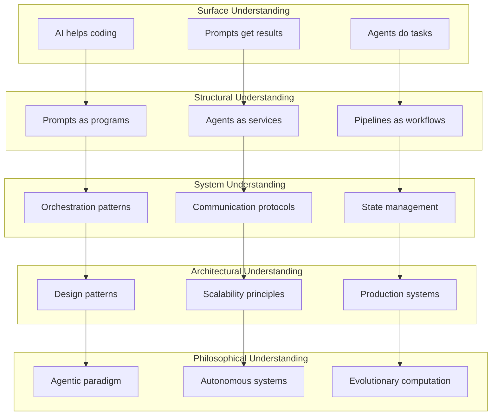

## Key Progression Insights

### 1. **Non-Linear Growth**
- Skills compound exponentially
- Later modules build on all previous learning
- Breakthrough moments at TAC-4 and TAC-8

### 2. **Paradigm Shifts**
- TAC-1: From coding to prompting
- TAC-4: From prompting to agents
- TAC-8: From agents to systems
- Horizon: From systems to ecosystems

### 3. **Mastery Markers**
- **Foundation (TAC 1-3)**: Can build structured workflows
- **Automation (TAC 4-5)**: Can create autonomous pipelines
- **Production (TAC 6-7)**: Can deploy enterprise systems
- **Excellence (TAC 8)**: Can achieve zero-touch execution
- **Innovation (Horizon)**: Can create new patterns

### 4. **Learning Accelerators**
- Each module provides tools for the next
- Patterns become reusable components
- Meta-learning increases with progression

### 5. **Capability Multiplication**
- TAC-1: 1x productivity
- TAC-4: 5x productivity
- TAC-8: 20x productivity
- Horizon: Unlimited scalability