# Workflow Diagrams

## Core Workflows

### BFC (Bug Fix Commit) Workflow
*Complete bug fixing process from issue to deployment*

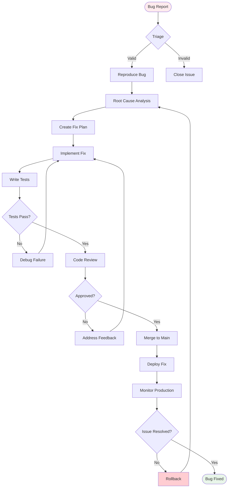

### ISO (Issue Structured Orchestration) Workflow
*Automated issue processing pipeline*

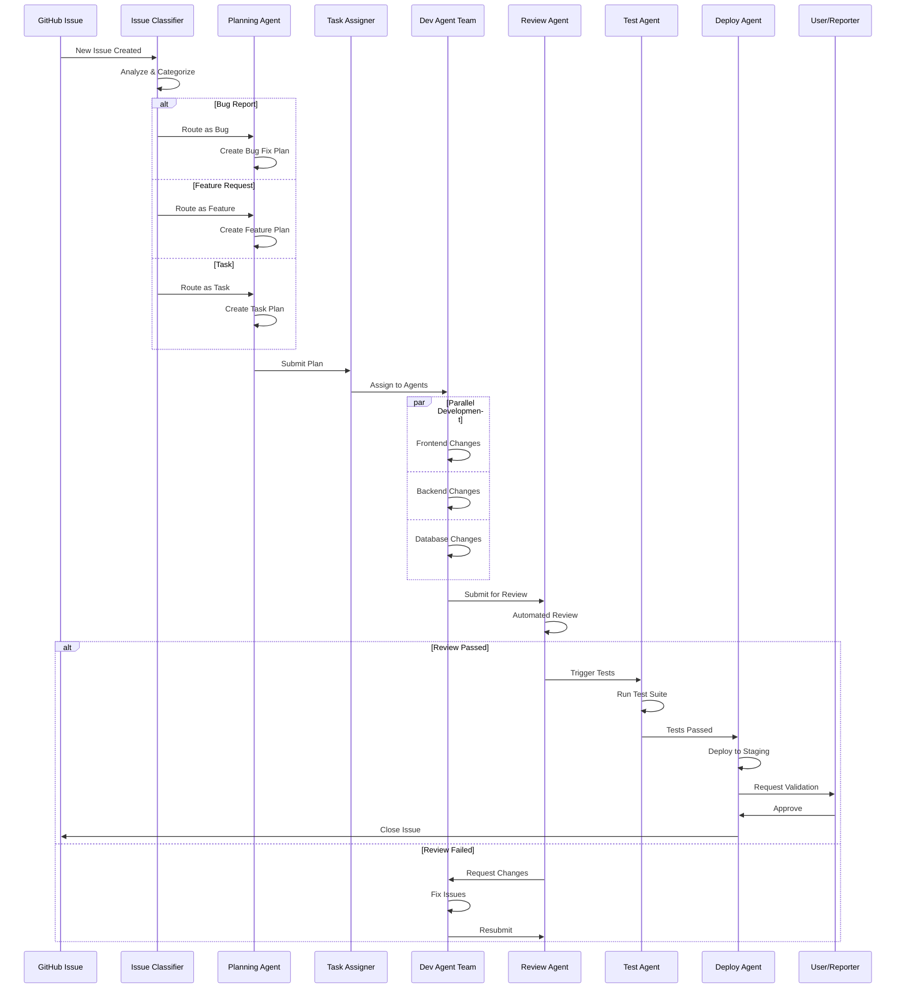

### ADW (Agentic Development Workflow) Complete Flow
*End-to-end development automation*

```mermaid
flowchart LR
    subgraph "Input Phase"
        Issue[GitHub Issue]
        Slack[Slack Request]
        API[API Call]
    end

    subgraph "Planning Phase"
        Intake[Intake Processing]
        Analysis[Requirement Analysis]
        Breakdown[Task Breakdown]
        Planning[Execution Planning]
    end

    subgraph "Development Phase"
        subgraph "Implementation"
            CodeGen[Code Generation]
            FileOps[File Operations]
            Integration[Integration]
        end

        subgraph "Quality"
            Linting[Linting]
            Security[Security Scan]
            Testing[Test Creation]
        end
    end

    subgraph "Review Phase"
        CodeReview[Code Review]
        TestReview[Test Review]
        SecReview[Security Review]
    end

    subgraph "Deployment Phase"
        PR[Pull Request]
        CI[CI Pipeline]
        CD[CD Pipeline]
        Production[Production]
    end

    Issue & Slack & API --> Intake
    Intake --> Analysis
    Analysis --> Breakdown
    Breakdown --> Planning
    Planning --> CodeGen
    CodeGen --> FileOps
    FileOps --> Integration
    Integration --> Linting
    Linting --> Security
    Security --> Testing
    Testing --> CodeReview
    CodeReview --> TestReview
    TestReview --> SecReview
    SecReview --> PR
    PR --> CI
    CI --> CD
    CD --> Production
```

### ZTE (Zero Touch Execution) Pipeline
*Fully autonomous execution flow*

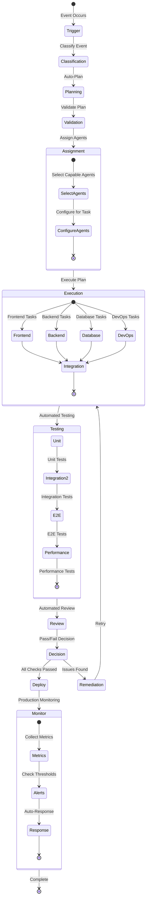

### Multi-Agent Coordination Workflow
*How multiple agents work together*

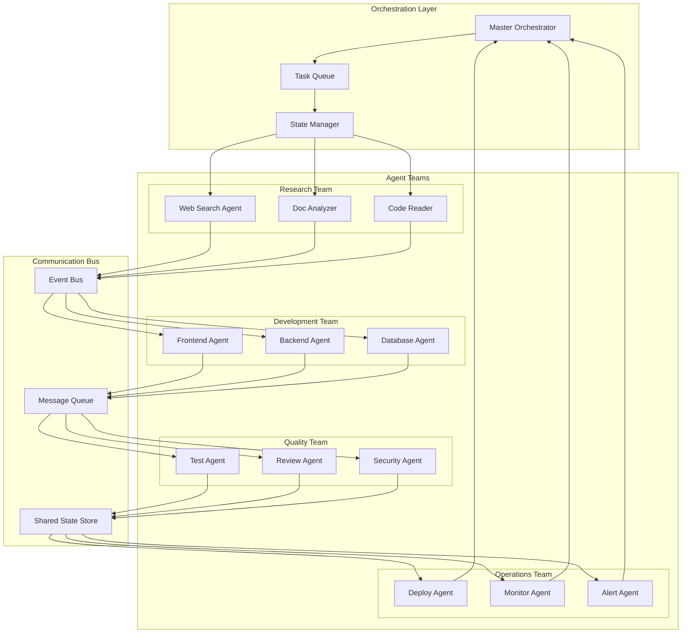

## Specialized Workflows

### Feature Development Workflow
*Complete feature implementation process*

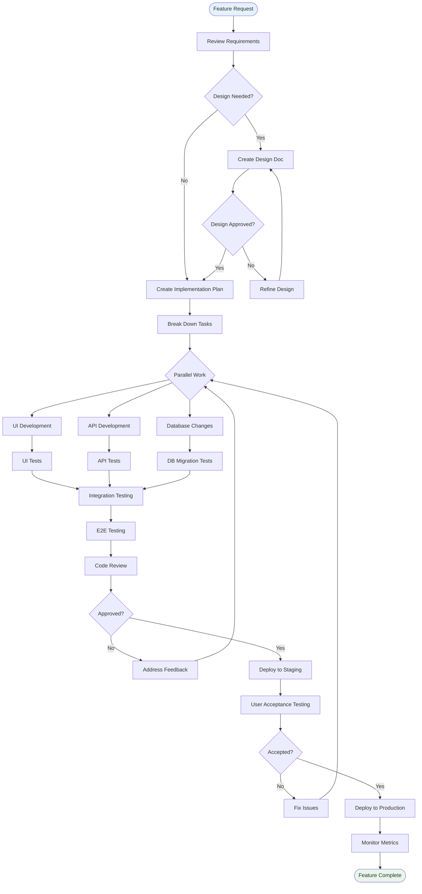

### Hotfix Workflow
*Emergency production fix process*

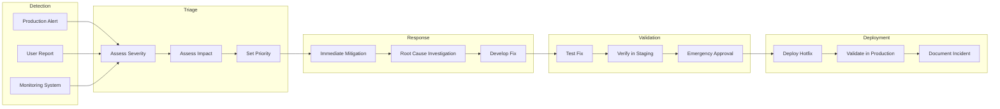

### Refactoring Workflow
*Code improvement and technical debt reduction*

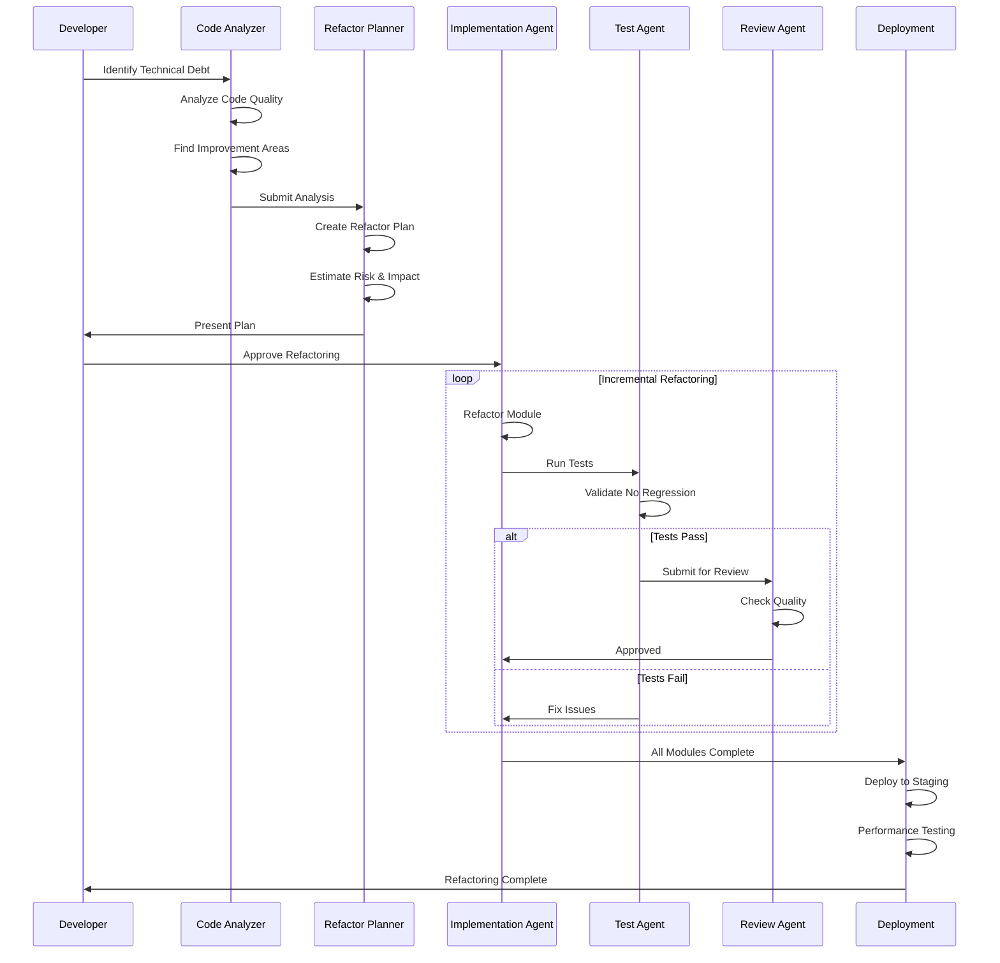

### Release Management Workflow
*Version release and deployment process*

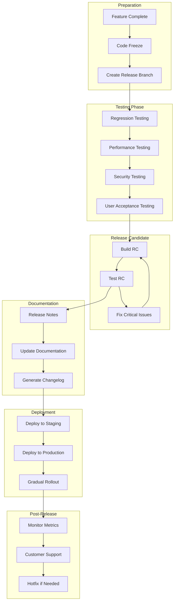

## Agent Communication Patterns

### Request-Response Pattern
*Synchronous agent communication*

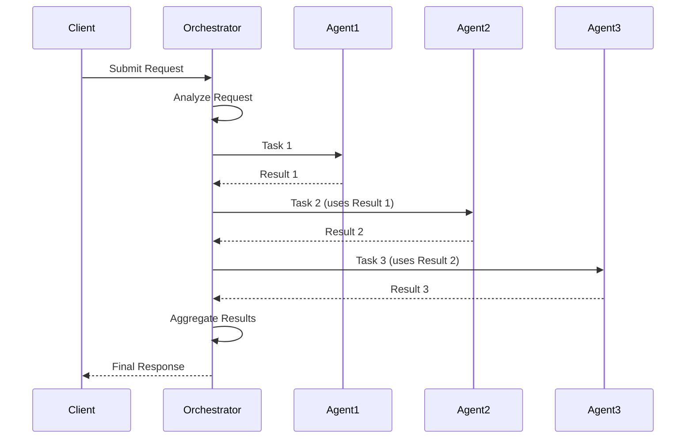

### Pub-Sub Pattern
*Event-driven agent communication*

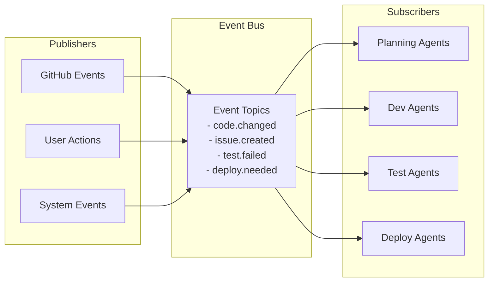

### Pipeline Pattern
*Sequential processing through agents*

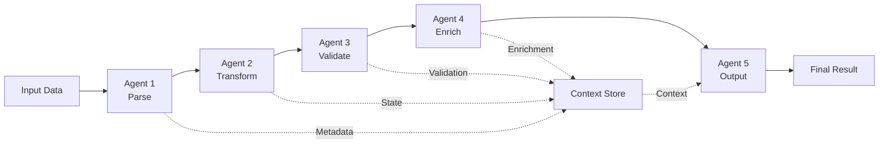

## Workflow Optimization Patterns

### Parallel Processing Pattern
*Maximizing throughput with parallel execution*

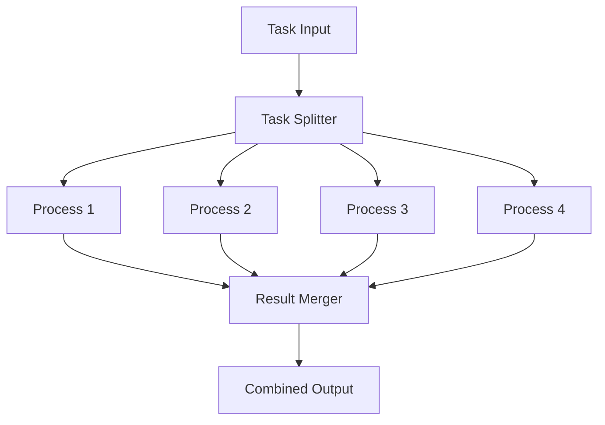

### Circuit Breaker Pattern
*Handling failures gracefully*

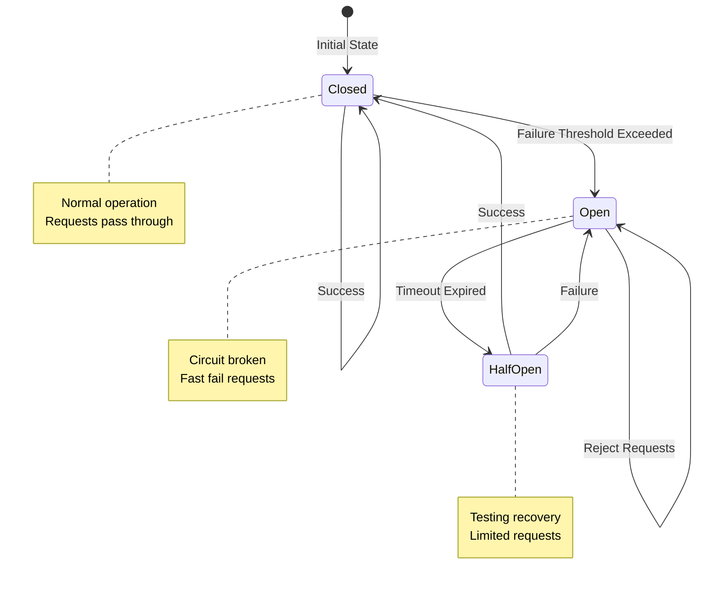

## Key Workflow Principles

### 1. **Automation First**
- Minimize human intervention
- Automate repetitive tasks
- Use agents for decision-making

### 2. **Parallel When Possible**
- Identify independent tasks
- Execute concurrently
- Merge results efficiently

### 3. **Fail Fast, Recover Gracefully**
- Early validation
- Quick failure detection
- Automated recovery mechanisms

### 4. **Continuous Feedback**
- Real-time status updates
- Progress tracking
- Performance metrics

### 5. **Idempotent Operations**
- Safe to retry
- Consistent results
- No side effects from retries