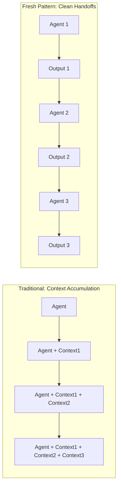

# The Fresh Agent Pattern

*The clean handoff methodology for maintaining agent focus and preventing context contamination*

## Introduction

The Fresh Agent Pattern is one of the most critical innovations in specialized agent architecture. It ensures each agent starts with a completely clean context, receiving only what it needs to accomplish its specific task. This pattern is the key to maintaining focus, preventing confusion, and enabling true specialization at scale.

> "No matter what we prompt here, the response is always pong. This silly agent encapsulates the most important concept when you're building custom agents."

---

## What Is the Fresh Agent Pattern?

### Definition

The Fresh Agent Pattern is a design methodology where:

1. **Each agent starts with zero prior context**
2. **Receives only its system prompt and specific inputs**
3. **Has no knowledge of previous agents' work**
4. **Outputs in a standardized format for the next agent**
5. **Maintains complete isolation from other agents**

### Core Philosophy

```python
# Traditional Approach (Context Accumulation)
conversation = []
for task in tasks:
    conversation.append(task)
    result = agent.query(conversation)  # Context grows and pollutes

# Fresh Agent Pattern (Clean Context)
for task in tasks:
    fresh_agent = create_new_agent()
    result = fresh_agent.query(task)  # Always fresh, always focused
```

### Visual Representation



---

## Why Fresh Context Matters

### Problem 1: Context Contamination

When agents inherit context from previous interactions, they become confused:

```python
# BAD: Contaminated Context
class ContaminatedWorkflow:
    def __init__(self):
        self.context = []  # Accumulates everything

    def execute_task(self, task):
        self.context.append(task)  # Pollution begins

        # Agent sees everything that came before
        result = self.agent.query(
            context=self.context,  # Includes irrelevant history
            task=task
        )

        self.context.append(result)  # More pollution
        return result

# Result: Agent trying to plan sees building errors
# Agent trying to test sees planning details
# Agent trying to document sees test failures
```

### Problem 2: Focus Dilution

Agents lose sight of their primary purpose:

```python
# BAD: Diluted Focus
agent_with_history = Agent(
    context=[
        "Previous task: Build authentication",
        "Previous error: Database timeout",
        "Previous decision: Use JWT tokens",
        "Current task: Write tests"  # Buried in noise
    ]
)
# Agent might try to fix database instead of writing tests
```

### Problem 3: Token Waste

Irrelevant context consumes valuable tokens:

```python
# Token Usage Analysis
contaminated_tokens = {
    "previous_agent_1": 5000,
    "previous_agent_2": 8000,
    "previous_agent_3": 12000,
    "current_task": 2000,
    "available_for_work": 23000  # Only 46% available!
}

fresh_tokens = {
    "system_prompt": 2000,
    "current_task": 2000,
    "available_for_work": 46000  # 92% available!
}
```

### Problem 4: Error Propagation

Errors and confusion cascade through the workflow:

```python
# BAD: Error Cascade
def cascading_workflow():
    agents = [PlannerAgent(), BuilderAgent(), TesterAgent()]
    context = {}

    for agent in agents:
        try:
            # Error in agent 1 confuses all subsequent agents
            result = agent.execute(context)
            context.update(result)  # Propagates confusion
        except Exception as e:
            context["error"] = str(e)  # Contamination spreads
```

---

## Implementation Patterns

### Pattern 1: Basic Fresh Agent

The simplest implementation:

```python
class FreshAgent:
    """Basic fresh agent implementation"""

    def __init__(self, system_prompt: str, tools: List[str]):
        self.system_prompt = system_prompt
        self.tools = tools
        self.context = None  # Always starts empty

    def execute(self, input_data: dict) -> dict:
        """Execute with fresh context"""

        # Create new agent instance
        agent = ClaudeCodeAgent(
            system_prompt=self.system_prompt,
            tools=self.tools
        )

        # Execute with only required input
        result = agent.query(input_data["prompt"])

        # Return standardized output
        return {
            "success": True,
            "output": result,
            "metadata": {
                "agent": self.__class__.__name__,
                "timestamp": datetime.now()
            }
        }
```

### Pattern 2: Stateful Fresh Agent

Fresh context with controlled state:

```python
class StatefulFreshAgent:
    """Fresh agent with managed state"""

    def __init__(self, agent_id: str):
        self.agent_id = agent_id
        self.state_dir = Path(f"agents/{agent_id}")
        self.state_dir.mkdir(exist_ok=True)

    def execute(self, input_data: dict) -> dict:
        """Fresh execution with state management"""

        # Load only necessary state
        state = self.load_minimal_state()

        # Create fresh agent
        agent = self.create_fresh_agent(state)

        # Execute task
        result = agent.query(input_data["prompt"])

        # Save only essential state
        self.save_minimal_state(result)

        return result

    def load_minimal_state(self) -> dict:
        """Load only essential state"""

        state_file = self.state_dir / "minimal_state.json"
        if state_file.exists():
            return json.loads(state_file.read_text())
        return {}

    def save_minimal_state(self, result: dict):
        """Save only what next agent needs"""

        minimal = {
            "last_action": result.get("action"),
            "output_location": result.get("output_path"),
            "timestamp": datetime.now().isoformat()
        }

        state_file = self.state_dir / "minimal_state.json"
        state_file.write_text(json.dumps(minimal, indent=2))
```

### Pattern 3: Handoff Protocol

Structured handoffs between agents:

```python
class HandoffProtocol:
    """Standardized handoff between agents"""

    @dataclass
    class Handoff:
        """Standard handoff package"""
        from_agent: str
        to_agent: str
        payload: dict
        metadata: dict

    @staticmethod
    def create_handoff(
        from_agent: Agent,
        to_agent: Type[Agent],
        data: dict
    ) -> Handoff:
        """Create standardized handoff"""

        return HandoffProtocol.Handoff(
            from_agent=from_agent.__class__.__name__,
            to_agent=to_agent.__name__,
            payload=data,
            metadata={
                "timestamp": datetime.now().isoformat(),
                "version": "1.0"
            }
        )

    @staticmethod
    def receive_handoff(
        agent: Agent,
        handoff: Handoff
    ) -> dict:
        """Receive and process handoff"""

        # Validate handoff is for this agent
        if handoff.to_agent != agent.__class__.__name__:
            raise ValueError(f"Handoff meant for {handoff.to_agent}")

        # Process with fresh context
        return agent.execute(handoff.payload)
```

### Pattern 4: Pipeline Implementation

Fresh agents in a pipeline:

```python
class FreshAgentPipeline:
    """Pipeline of fresh agents"""

    def __init__(self):
        self.agents = []
        self.handoff_dir = Path("handoffs")
        self.handoff_dir.mkdir(exist_ok=True)

    def add_agent(self, agent_class: Type[Agent], config: dict):
        """Add agent to pipeline"""

        self.agents.append({
            "class": agent_class,
            "config": config
        })

    def execute(self, initial_input: dict) -> dict:
        """Execute pipeline with fresh agents"""

        current_data = initial_input

        for i, agent_spec in enumerate(self.agents):
            # Create fresh agent
            agent = agent_spec["class"](**agent_spec["config"])

            # Execute with clean context
            result = agent.execute(current_data)

            # Save handoff for debugging
            handoff_file = self.handoff_dir / f"{i}_{agent.__class__.__name__}.json"
            handoff_file.write_text(json.dumps(result, indent=2))

            # Prepare data for next agent
            current_data = self.prepare_handoff(result)

        return current_data

    def prepare_handoff(self, agent_output: dict) -> dict:
        """Prepare clean handoff for next agent"""

        return {
            "input": agent_output.get("output"),
            "previous_agent": agent_output.get("metadata", {}).get("agent"),
            # Only essential data, no full history
        }
```

---

## When to Use Fresh Agents

### Use Fresh Agents When:

#### 1. Tasks Are Independent
```python
# Good for fresh agents
tasks = [
    "Create user authentication",
    "Build payment processing",
    "Implement search feature"
]
# Each task is independent, no shared context needed
```

#### 2. Specialization Is Critical
```python
# Fresh agent ensures specialization
planner = PlannerAgent()  # Only knows planning
builder = BuilderAgent()  # Only knows building
# No confusion between roles
```

#### 3. Context Would Be Harmful
```python
# Previous errors shouldn't affect new tasks
if previous_task_failed:
    # Fresh agent won't be biased by previous failure
    fresh_agent = create_new_agent()
    fresh_agent.retry_different_approach()
```

#### 4. Working at Scale
```python
# Processing many items independently
for document in documents:
    agent = FreshDocumentProcessor()
    result = agent.process(document)
    # Each document gets full attention
```

### When NOT to Use Fresh Agents:

#### 1. Continuous Conversation
```python
# BAD for fresh agents: Conversational UI
user: "Build a todo app"
agent: "I'll create a React todo app"
user: "Make it use TypeScript"  # Needs context from before
```

#### 2. Iterative Refinement
```python
# Needs context accumulation
agent.create_draft()
agent.incorporate_feedback(feedback1)
agent.incorporate_feedback(feedback2)
# Each iteration builds on previous
```

#### 3. Complex State Management
```python
# Needs persistent context
debugging_session = DebuggingAgent()
debugging_session.analyze_error()
debugging_session.try_fix_1()  # Needs to remember error
debugging_session.try_fix_2()  # Needs to know fix_1 failed
```

---

## Implementation Examples

### Example 1: SDLC Workflow with Fresh Agents

```python
class SDLCWorkflow:
    """Complete SDLC with fresh agents"""

    def execute_feature(self, requirement: str):
        """Each agent gets fresh context"""

        # Step 1: Planning (Fresh)
        planner = FreshAgent(
            system_prompt="You are a Planning Agent...",
            tools=["Read", "Write", "Grep"]
        )
        plan = planner.execute({"prompt": requirement})
        plan_file = save_plan(plan["output"])

        # Step 2: Building (Fresh, only sees plan)
        builder = FreshAgent(
            system_prompt="You are a Builder Agent...",
            tools=["Read", "Write", "Edit", "Bash"]
        )
        code = builder.execute({
            "prompt": f"Implement the plan at {plan_file}"
        })

        # Step 3: Testing (Fresh, only sees code)
        tester = FreshAgent(
            system_prompt="You are a Testing Agent...",
            tools=["Read", "Bash", "Write"]
        )
        tests = tester.execute({
            "prompt": f"Test the implementation in {code['files']}"
        })

        # Step 4: Review (Fresh, compares plan vs implementation)
        reviewer = FreshAgent(
            system_prompt="You are a Review Agent...",
            tools=["Read", "Bash"]
        )
        review = reviewer.execute({
            "prompt": f"Review implementation against plan: {plan_file}"
        })

        return {
            "plan": plan,
            "code": code,
            "tests": tests,
            "review": review
        }
```

### Example 2: Document Processing Pipeline

```python
class DocumentPipeline:
    """Process documents with specialized fresh agents"""

    def process_document(self, doc_path: str):
        """Each agent focuses on one aspect"""

        # Extract text (Fresh)
        extractor = FreshAgent(
            system_prompt="Extract and clean text from documents",
            tools=["Read"]
        )
        text = extractor.execute({"prompt": f"Extract text from {doc_path}"})

        # Analyze content (Fresh)
        analyzer = FreshAgent(
            system_prompt="Analyze document content and structure",
            tools=["Read"]
        )
        analysis = analyzer.execute({
            "prompt": f"Analyze this text: {text['output'][:1000]}..."
        })

        # Generate summary (Fresh)
        summarizer = FreshAgent(
            system_prompt="Create concise summaries",
            tools=["Write"]
        )
        summary = summarizer.execute({
            "prompt": f"Summarize based on: {analysis['output']}"
        })

        return {
            "text": text,
            "analysis": analysis,
            "summary": summary
        }
```

### Example 3: Multi-Agent Code Review

```python
class CodeReviewTeam:
    """Multiple fresh specialists review code"""

    def review_pull_request(self, pr_number: int):
        """Each reviewer has fresh perspective"""

        reviews = {}

        # Security Review (Fresh)
        security = FreshAgent(
            system_prompt="You are a Security Reviewer...",
            tools=["Read", "Grep"]
        )
        reviews["security"] = security.execute({
            "prompt": f"Security review PR #{pr_number}"
        })

        # Performance Review (Fresh)
        performance = FreshAgent(
            system_prompt="You are a Performance Reviewer...",
            tools=["Read", "Bash"]
        )
        reviews["performance"] = performance.execute({
            "prompt": f"Performance review PR #{pr_number}"
        })

        # Style Review (Fresh)
        style = FreshAgent(
            system_prompt="You are a Style Reviewer...",
            tools=["Read"]
        )
        reviews["style"] = style.execute({
            "prompt": f"Style review PR #{pr_number}"
        })

        return self.consolidate_reviews(reviews)
```

---

## State Management Between Agents

### Minimal State Transfer

Only pass essential information:

```python
class MinimalStateTransfer:
    """Transfer only what's needed"""

    @staticmethod
    def extract_essentials(agent_output: dict) -> dict:
        """Extract only essential information"""

        essentials = {
            "success": agent_output.get("success"),
            "output_location": None,
            "key_decisions": [],
            "next_action": None
        }

        # Extract file locations if any
        if "files" in agent_output:
            essentials["output_location"] = agent_output["files"]

        # Extract key decisions made
        if "decisions" in agent_output:
            essentials["key_decisions"] = agent_output["decisions"][:3]

        return essentials
```

### File-Based Handoffs

Use files for clean handoffs:

```python
class FileBasedHandoff:
    """Use files for agent communication"""

    def __init__(self):
        self.handoff_dir = Path("handoffs")
        self.handoff_dir.mkdir(exist_ok=True)

    def save_handoff(self, agent_name: str, data: dict) -> Path:
        """Save handoff to file"""

        handoff_file = self.handoff_dir / f"{agent_name}_{uuid4()}.json"
        handoff_file.write_text(json.dumps(data, indent=2))
        return handoff_file

    def load_handoff(self, handoff_path: Path) -> dict:
        """Load handoff from file"""

        if not handoff_path.exists():
            raise FileNotFoundError(f"Handoff not found: {handoff_path}")

        return json.loads(handoff_path.read_text())
```

### Database-Based Handoffs

For production systems:

```python
class DatabaseHandoff:
    """Database-backed handoff system"""

    def __init__(self, db_url: str):
        self.db = Database(db_url)

    async def create_handoff(
        self,
        from_agent: str,
        to_agent: str,
        data: dict
    ) -> str:
        """Create handoff in database"""

        handoff_id = str(uuid4())

        await self.db.execute(
            """
            INSERT INTO handoffs (id, from_agent, to_agent, data, created_at)
            VALUES ($1, $2, $3, $4, $5)
            """,
            handoff_id, from_agent, to_agent, json.dumps(data), datetime.now()
        )

        return handoff_id

    async def retrieve_handoff(self, handoff_id: str) -> dict:
        """Retrieve handoff from database"""

        result = await self.db.fetch_one(
            "SELECT * FROM handoffs WHERE id = $1",
            handoff_id
        )

        return {
            "from_agent": result["from_agent"],
            "to_agent": result["to_agent"],
            "data": json.loads(result["data"]),
            "created_at": result["created_at"]
        }
```

---

## Antipatterns to Avoid

### Antipattern 1: Context Accumulation

```python
# BAD: Accumulating context
class AccumulatingWorkflow:
    def __init__(self):
        self.history = []  # This grows without bound

    def run_agent(self, task):
        self.history.append(task)  # Everything accumulates
        return agent.query(self.history)  # Agent sees everything

# GOOD: Fresh context
class FreshWorkflow:
    def run_agent(self, task):
        agent = create_fresh_agent()
        return agent.query(task)  # Agent sees only current task
```

### Antipattern 2: Hidden State

```python
# BAD: Hidden state in agents
class StatefulAgent:
    def __init__(self):
        self.memory = []  # Hidden state

    def execute(self, task):
        self.memory.append(task)  # State accumulates
        return self.process_with_memory()

# GOOD: Explicit state management
class StatelessAgent:
    def execute(self, task, state=None):
        # State is explicit and optional
        return self.process(task, state)
```

### Antipattern 3: Circular Dependencies

```python
# BAD: Agents depend on each other's full output
class CircularWorkflow:
    def execute(self):
        plan = planner.execute(build_result)  # Needs build
        build = builder.execute(plan)  # Needs plan
        # Circular dependency!

# GOOD: Linear flow with fresh agents
class LinearWorkflow:
    def execute(self):
        plan = FreshPlanner().execute(requirement)
        build = FreshBuilder().execute(plan)
        # Clear progression
```

### Antipattern 4: Over-Sharing

```python
# BAD: Sharing everything
def oversharing_handoff(agent_output):
    return {
        "full_conversation": agent_output["conversation"],
        "all_errors": agent_output["errors"],
        "complete_history": agent_output["history"],
        "internal_state": agent_output["state"],
        # Too much information!
    }

# GOOD: Sharing essentials
def minimal_handoff(agent_output):
    return {
        "result": agent_output["result"],
        "next_step": agent_output["next_step"]
        # Just what's needed
    }
```

---

## Debugging Fresh Agent Workflows

### Debugging Tools

```python
class FreshAgentDebugger:
    """Tools for debugging fresh agent workflows"""

    def __init__(self, debug_dir: Path = Path("debug")):
        self.debug_dir = debug_dir
        self.debug_dir.mkdir(exist_ok=True)

    def trace_execution(self, agent: Agent, input_data: dict):
        """Trace agent execution"""

        trace_id = str(uuid4())
        trace_file = self.debug_dir / f"trace_{trace_id}.json"

        # Record input
        trace = {
            "agent": agent.__class__.__name__,
            "input": input_data,
            "timestamp_start": datetime.now().isoformat()
        }

        # Execute with monitoring
        try:
            result = agent.execute(input_data)
            trace["result"] = result
            trace["success"] = True
        except Exception as e:
            trace["error"] = str(e)
            trace["success"] = False
            raise
        finally:
            trace["timestamp_end"] = datetime.now().isoformat()
            trace_file.write_text(json.dumps(trace, indent=2))

        return result

    def visualize_pipeline(self, executions: List[dict]):
        """Visualize pipeline execution"""

        print("\n=== Pipeline Execution Trace ===\n")

        for i, execution in enumerate(executions):
            status = "✓" if execution["success"] else "✗"
            print(f"{status} Step {i+1}: {execution['agent']}")
            print(f"  Input: {execution['input'][:100]}...")
            if execution["success"]:
                print(f"  Output: {execution['result'][:100]}...")
            else:
                print(f"  Error: {execution['error']}")
            print()
```

### Logging Best Practices

```python
class FreshAgentLogger:
    """Logging for fresh agent patterns"""

    def __init__(self):
        self.logger = self.setup_logger()

    def setup_logger(self):
        """Configure logging for fresh agents"""

        logger = logging.getLogger("fresh_agents")
        logger.setLevel(logging.DEBUG)

        handler = logging.FileHandler("fresh_agents.log")
        formatter = logging.Formatter(
            '%(asctime)s - %(name)s - %(levelname)s - %(message)s'
        )
        handler.setFormatter(formatter)
        logger.addHandler(handler)

        return logger

    def log_handoff(self, from_agent: str, to_agent: str, data_size: int):
        """Log handoff between agents"""

        self.logger.info(
            f"Handoff: {from_agent} -> {to_agent} ({data_size} bytes)"
        )

    def log_execution(self, agent: str, duration: float, success: bool):
        """Log agent execution"""

        if success:
            self.logger.info(
                f"Agent {agent} completed in {duration:.2f}s"
            )
        else:
            self.logger.error(
                f"Agent {agent} failed after {duration:.2f}s"
            )
```

---

## Performance Optimization

### Memory Management

```python
class MemoryEfficientFreshAgent:
    """Memory-optimized fresh agent"""

    def execute(self, input_data: dict):
        """Execute with memory management"""

        # Process in chunks if needed
        if self.is_large_input(input_data):
            return self.process_chunked(input_data)

        # Normal processing
        agent = self.create_agent()
        result = agent.execute(input_data)

        # Clean up immediately
        del agent
        gc.collect()

        return result

    def process_chunked(self, input_data: dict):
        """Process large inputs in chunks"""

        chunks = self.split_input(input_data)
        results = []

        for chunk in chunks:
            agent = self.create_agent()
            result = agent.execute(chunk)
            results.append(result)

            # Clean up after each chunk
            del agent
            gc.collect()

        return self.merge_results(results)
```

### Parallel Execution

```python
class ParallelFreshAgents:
    """Execute fresh agents in parallel"""

    async def execute_parallel(self, tasks: List[dict]):
        """Run fresh agents in parallel"""

        async def run_agent(task):
            agent = FreshAgent(
                system_prompt=task["system_prompt"],
                tools=task["tools"]
            )
            return await agent.async_execute(task["input"])

        # Execute all agents in parallel
        results = await asyncio.gather(
            *[run_agent(task) for task in tasks]
        )

        return results
```

---

## Migration Guide

### Migrating from Stateful to Fresh Agents

#### Step 1: Audit Current State Usage

```python
def audit_state_usage(agent_class):
    """Identify what state is actually needed"""

    state_usage = {
        "essential": [],  # Must be preserved
        "helpful": [],    # Nice to have
        "unnecessary": [] # Can be removed
    }

    # Analyze agent code
    # ... implementation ...

    return state_usage
```

#### Step 2: Refactor to Fresh Pattern

```python
# Before: Stateful Agent
class StatefulAgent:
    def __init__(self):
        self.conversation_history = []
        self.decisions_made = []
        self.errors_encountered = []

    def execute(self, task):
        self.conversation_history.append(task)
        # ... process with full history ...

# After: Fresh Agent
class FreshAgent:
    def execute(self, task, essential_context=None):
        # Only uses what's explicitly provided
        if essential_context:
            # Use only essential context
            pass
        # ... process with fresh perspective ...
```

#### Step 3: Implement Handoff Protocol

```python
def implement_handoffs():
    """Add handoff mechanism"""

    # 1. Define handoff format
    handoff_schema = {
        "result": "required",
        "next_action": "optional",
        "files_created": "optional"
    }

    # 2. Update agents to use handoffs
    # 3. Test with fresh contexts
    # 4. Monitor performance
```

---

## Conclusion

The Fresh Agent Pattern is fundamental to building effective specialized agent systems. By ensuring each agent starts with a clean context:

1. **Agents maintain focus** on their singular purpose
2. **Errors don't propagate** through the system
3. **Token usage is optimized** for each task
4. **Debugging becomes simpler** with isolated contexts
5. **Scaling becomes possible** without complexity explosion

### Key Takeaways

- **Fresh > Accumulated**: Fresh context beats accumulated context for specialized tasks
- **Explicit > Implicit**: Make handoffs explicit, not hidden
- **Minimal > Complete**: Transfer only essential information
- **Isolated > Connected**: Isolated agents are easier to debug and improve

### Your Next Steps

1. **Identify workflows** that would benefit from fresh agents
2. **Start with one pipeline** and implement fresh handoffs
3. **Measure the improvement** in reliability and performance
4. **Expand gradually** to other workflows
5. **Share patterns** that work in your domain

Remember: **The power of specialization comes from focus, and focus requires fresh context.**

> "One Agent, One Prompt, One Purpose" - and always with fresh context.