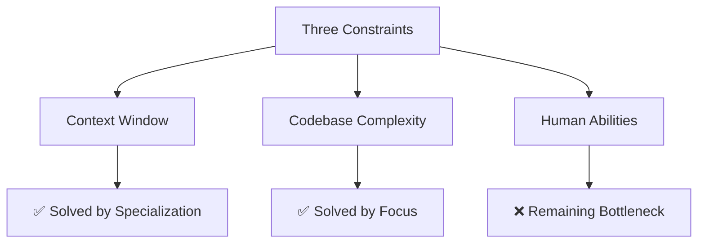

# The Specialization Framework

*A deep dive into why and how agent specialization wins over generalization*

## Executive Summary

The future of agentic engineering isn't about building one perfect "god model" that can do everything. It's about building an ecosystem of specialized agents, each mastering a specific domain. This framework explains why specialization is the winning strategy and provides a systematic approach to implementing it.

> "This is where all the alpha is in engineering. It's in the hard specific problems that most engineers and most agents can't solve out of the box."

---

## Part I: Why Specialization Wins

### The Fundamental Problem with General-Purpose Agents

Generic agents like Claude Code, Cursor, and GitHub Copilot are incredible tools, but they suffer from a critical flaw:

**They're built for everyone's codebase, not yours.**

This creates several problems:

1. **Context Dilution**: They carry knowledge about millions of codebases, diluting focus on yours
2. **Token Waste**: Processing generic patterns instead of your specific patterns
3. **Edge Case Blindness**: Can't handle your unique domain problems
4. **Performance Degradation**: As your codebase grows, generic agents become less effective

### The Three Constraints Framework

Every agentic system faces three fundamental constraints:



#### Constraint 1: Context Window (Solved ✅)

**Problem**: Limited token budget for any single interaction

**How Specialization Solves It**:
- Each specialist gets the FULL context window
- No pollution from unrelated functionality
- Focused prompts use fewer tokens
- Domain-specific compression of information

```python
# Generic Agent (wastes context)
context_usage = {
    "system_prompt": "10,000 tokens (generic instructions)",
    "tools": "5,000 tokens (15+ generic tools)",
    "history": "20,000 tokens (unfocused conversation)",
    "available": "15,000 tokens"
}

# Specialized Agent (maximizes context)
context_usage = {
    "system_prompt": "2,000 tokens (focused instructions)",
    "tools": "1,000 tokens (3 specific tools)",
    "history": "5,000 tokens (relevant only)",
    "available": "42,000 tokens"  # 2.8x more space!
}
```

#### Constraint 2: Codebase Complexity (Solved ✅)

**Problem**: Modern codebases are too complex for any one agent to understand fully

**How Specialization Solves It**:
- Each agent masters a specific aspect
- Deep knowledge of particular patterns
- Understanding of domain-specific edge cases
- Ability to handle unique requirements

```python
# Generic Agent Attempting Everything
class GenericAgent:
    knowledge = {
        "frontend": "20% understanding",
        "backend": "20% understanding",
        "database": "20% understanding",
        "testing": "20% understanding",
        "deployment": "20% understanding"
    }
    # Jack of all trades, master of none

# Specialized Agents
class TestingAgent:
    knowledge = {
        "testing": "95% understanding",
        "test_patterns": "expert",
        "edge_cases": "comprehensive",
        "frameworks": "deep knowledge"
    }
    # Master of testing
```

#### Constraint 3: Human Abilities (Remaining Bottleneck ❌)

**Problem**: Human capacity to manage and direct agents

**Current Reality**:
- Humans still needed for high-level decisions
- Context switching between agents requires human orchestration
- Quality validation needs human judgment

**Future Solution**: Meta-agents that orchestrate specialists (emerging)

---

## Part II: The Economics of Specialization

### Cost-Benefit Analysis

#### Generic Agent Costs

```python
# Typical generic agent interaction
generic_costs = {
    "attempts_to_success": 3.5,  # Multiple tries needed
    "tokens_per_attempt": 50_000,
    "total_tokens": 175_000,
    "time_to_solution": "45 minutes",
    "error_rate": 0.3,  # 30% require human fixes
    "context_switching": "high"
}
```

#### Specialized Agent Savings

```python
# Specialized agent interaction
specialized_costs = {
    "attempts_to_success": 1.2,  # Usually first try
    "tokens_per_attempt": 20_000,  # Focused context
    "total_tokens": 24_000,  # 86% reduction!
    "time_to_solution": "5 minutes",
    "error_rate": 0.05,  # 5% require human fixes
    "context_switching": "none"
}

# ROI Calculation
savings_per_task = {
    "tokens_saved": 151_000,
    "cost_saved": "$4.53",  # At typical rates
    "time_saved": "40 minutes",
    "reliability_gain": "6x"
}
```

### Scalability Mathematics

As your codebase grows, the advantages of specialization compound:

```python
def specialization_advantage(codebase_size_kloc):
    """Calculate advantage of specialized vs generic agents"""

    # Generic agent degradation
    generic_effectiveness = 1.0 / (1 + 0.01 * codebase_size_kloc)

    # Specialized agent maintains effectiveness
    specialized_effectiveness = 0.95  # Consistent regardless of size

    advantage_multiplier = specialized_effectiveness / generic_effectiveness

    return {
        "10k_lines": 1.05,   # 5% better
        "100k_lines": 1.9,   # 90% better
        "1m_lines": 10.5,    # 10x better!
    }
```

---

## Part III: Specialization Strategies

### Strategy 1: By Task Type

Divide agents by what they do:

```python
TASK_SPECIALISTS = {
    "planning": PlannerAgent,      # Requirements → Design
    "building": BuilderAgent,      # Design → Code
    "testing": TesterAgent,        # Code → Validation
    "reviewing": ReviewerAgent,    # Code → Quality
    "documenting": DocumenterAgent,# Code → Documentation
    "debugging": DebuggerAgent,    # Errors → Fixes
    "optimizing": OptimizerAgent,  # Code → Performance
}
```

**Benefits**:
- Clear boundaries
- Easy to understand
- Natural workflow integration
- Measurable performance

**Example Implementation**:
```python
class TaskSpecialistFactory:
    """Create specialists for specific tasks"""

    @staticmethod
    def create(task_type: str) -> Agent:
        specialist_class = TASK_SPECIALISTS[task_type]

        return specialist_class(
            system_prompt=f"You are a {task_type} specialist.",
            tools=get_tools_for_task(task_type),
            model=get_optimal_model(task_type)
        )
```

### Strategy 2: By Domain

Divide agents by what they know:

```python
DOMAIN_SPECIALISTS = {
    "frontend": FrontendAgent,      # UI/UX expertise
    "backend": BackendAgent,        # Server expertise
    "database": DatabaseAgent,      # Data expertise
    "infrastructure": InfraAgent,   # DevOps expertise
    "security": SecurityAgent,      # Security expertise
    "mobile": MobileAgent,          # Mobile expertise
}
```

**Benefits**:
- Deep domain knowledge
- Pattern recognition
- Technology-specific optimizations
- Better tool selection

**Example Implementation**:
```python
class DomainSpecialist:
    """Domain-specific agent configuration"""

    def __init__(self, domain: str):
        self.domain = domain
        self.patterns = load_domain_patterns(domain)
        self.conventions = load_domain_conventions(domain)
        self.tools = load_domain_tools(domain)

    def configure_agent(self) -> Agent:
        return Agent(
            system_prompt=self.build_domain_prompt(),
            tools=self.tools,
            context=self.patterns + self.conventions
        )
```

### Strategy 3: By Complexity Level

Divide agents by problem complexity:

```python
COMPLEXITY_TIERS = {
    "trivial": {
        "agent": QuickFixAgent,
        "model": "haiku",  # Fast, cheap
        "timeout": 30,
        "max_tokens": 10_000
    },
    "standard": {
        "agent": StandardAgent,
        "model": "sonnet",  # Balanced
        "timeout": 300,
        "max_tokens": 50_000
    },
    "complex": {
        "agent": DeepAnalysisAgent,
        "model": "opus",  # Powerful
        "timeout": 1800,
        "max_tokens": 200_000
    }
}
```

**Benefits**:
- Cost optimization
- Resource efficiency
- Appropriate tool allocation
- Faster response times

### Strategy 4: By Tool Usage

Divide agents by the tools they use:

```python
TOOL_SPECIALISTS = {
    "git_agent": {
        "tools": ["git", "github_cli"],
        "purpose": "Version control operations"
    },
    "test_runner": {
        "tools": ["pytest", "jest", "playwright"],
        "purpose": "Test execution and validation"
    },
    "database_admin": {
        "tools": ["psql", "mysql", "mongo"],
        "purpose": "Database operations"
    },
    "deployment_agent": {
        "tools": ["docker", "kubernetes", "terraform"],
        "purpose": "Infrastructure management"
    }
}
```

**Benefits**:
- Tool expertise
- Optimal configurations
- Safety boundaries
- Permission management

---

## Part IV: Measuring Specialization Effectiveness

### Key Performance Indicators (KPIs)

#### 1. Task Success Rate

```python
def measure_success_rate(agent: Agent, tasks: List[Task]) -> float:
    """Measure how often agent completes tasks successfully"""

    successes = 0
    for task in tasks:
        result = agent.execute(task)
        if validate_result(result, task.expected_output):
            successes += 1

    return successes / len(tasks)

# Specialized agents should achieve >90% success
# Generic agents typically achieve 60-70%
```

#### 2. Token Efficiency

```python
def measure_token_efficiency(agent: Agent, task: Task) -> dict:
    """Measure tokens used vs task complexity"""

    tokens_used = agent.execute_with_tracking(task)
    complexity_score = calculate_complexity(task)

    return {
        "efficiency": complexity_score / tokens_used,
        "vs_baseline": tokens_used / GENERIC_BASELINE[task.type]
    }
```

#### 3. Time to Solution

```python
def measure_time_to_solution(agent: Agent, task: Task) -> dict:
    """Measure speed of task completion"""

    start = time.time()
    result = agent.execute(task)
    duration = time.time() - start

    return {
        "duration": duration,
        "vs_human": duration / HUMAN_BASELINE[task.type],
        "vs_generic": duration / GENERIC_BASELINE[task.type]
    }
```

#### 4. Error Recovery Rate

```python
def measure_error_recovery(agent: Agent, error_scenarios: List) -> float:
    """Measure agent's ability to recover from errors"""

    recoveries = 0
    for scenario in error_scenarios:
        inject_error(scenario)
        if agent.recover_and_continue(scenario):
            recoveries += 1

    return recoveries / len(error_scenarios)
```

### Specialization Maturity Model

Track your specialization journey:

```python
class SpecializationMaturity:
    """Five levels of specialization maturity"""

    LEVELS = {
        1: "Ad-hoc": {
            "description": "Using generic agents for everything",
            "agents": 1,
            "specialization": 0,
            "effectiveness": 0.4
        },
        2: "Emerging": {
            "description": "First specialized agents created",
            "agents": 2-5,
            "specialization": 0.3,
            "effectiveness": 0.5
        },
        3: "Defined": {
            "description": "Clear agent roles and boundaries",
            "agents": 5-10,
            "specialization": 0.6,
            "effectiveness": 0.7
        },
        4: "Managed": {
            "description": "Orchestrated agent workflows",
            "agents": 10-20,
            "specialization": 0.8,
            "effectiveness": 0.85
        },
        5: "Optimized": {
            "description": "Self-improving agent ecosystem",
            "agents": "20+",
            "specialization": 0.95,
            "effectiveness": 0.95
        }
    }
```

---

## Part V: Evolution from General to Specialized

### The Migration Path

#### Stage 1: Identify Specialization Opportunities

```python
def analyze_workflow_for_specialization():
    """Find tasks suitable for specialized agents"""

    opportunities = []

    # Analyze your current workflow
    for task in daily_tasks:
        if task.frequency > 5_per_week:
            opportunities.append({
                "task": task,
                "potential_agent": suggest_agent_type(task),
                "estimated_savings": calculate_savings(task)
            })

    return sorted(opportunities, key=lambda x: x["estimated_savings"])
```

#### Stage 2: Create Your First Specialist

Start with the highest-value, lowest-risk specialization:

```python
# Example: Test Runner Specialist
class TestRunnerAgent(Agent):
    """Your first specialized agent"""

    def __init__(self):
        super().__init__(
            system_prompt="""
            You are a Test Execution Specialist.
            Your ONLY job is to run tests and report results.

            You MUST:
            1. Find relevant test files
            2. Execute test suites
            3. Parse results
            4. Report failures clearly

            You MUST NOT:
            - Write new tests
            - Modify code
            - Fix failures
            """,
            tools=["Bash", "Read", "Grep"],
            model="sonnet"  # Fast and reliable
        )
```

#### Stage 3: Measure and Iterate

```python
def evaluate_specialist(agent: Agent, baseline_data: dict):
    """Compare specialist to generic approach"""

    metrics = {
        "speed_improvement": measure_speed(agent) / baseline_data["speed"],
        "accuracy_improvement": measure_accuracy(agent) / baseline_data["accuracy"],
        "cost_reduction": baseline_data["cost"] / measure_cost(agent),
        "user_satisfaction": survey_users(agent)
    }

    if all(metric > 1.2 for metric in metrics.values()):
        return "SUCCESS: Continue specialization"
    else:
        return "ITERATE: Refine approach"
```

#### Stage 4: Build the Ecosystem

```python
class AgentEcosystem:
    """Manage your growing collection of specialists"""

    def __init__(self):
        self.agents = {}
        self.workflows = {}
        self.metrics = MetricsCollector()

    def register_agent(self, agent: Agent):
        """Add new specialist to ecosystem"""
        self.agents[agent.purpose] = agent
        self.update_workflows()

    def update_workflows(self):
        """Reconfigure workflows with available agents"""
        for workflow in self.workflows.values():
            workflow.optimize_with_agents(self.agents)

    def get_agent_for_task(self, task: Task) -> Agent:
        """Select best agent for task"""
        candidates = self.find_capable_agents(task)
        return self.rank_by_performance(candidates, task)[0]
```

---

## Part VI: Advanced Specialization Patterns

### Pattern 1: Hierarchical Specialization

Specialists within specialists:

```python
class HierarchicalSpecialization:
    """Multi-level specialization"""

    def __init__(self):
        # Top level: Domain
        self.frontend_team = FrontendTeam()

        # Second level: Technology
        self.frontend_team.react_specialist = ReactAgent()
        self.frontend_team.vue_specialist = VueAgent()

        # Third level: Task
        self.frontend_team.react_specialist.component_builder = ComponentAgent()
        self.frontend_team.react_specialist.hook_optimizer = HookAgent()
```

### Pattern 2: Adaptive Specialization

Agents that adjust their specialization:

```python
class AdaptiveSpecialist:
    """Dynamically adjusts specialization"""

    def __init__(self):
        self.specializations = {}
        self.performance_history = []

    def adapt_to_task(self, task: Task):
        """Adjust specialization based on task"""

        # Analyze task characteristics
        features = extract_features(task)

        # Load appropriate specialization
        if features["domain"] not in self.specializations:
            self.learn_specialization(features["domain"])

        # Configure for task
        self.current_config = self.specializations[features["domain"]]

    def learn_specialization(self, domain: str):
        """Learn new specialization from examples"""

        examples = load_domain_examples(domain)
        patterns = extract_patterns(examples)

        self.specializations[domain] = {
            "patterns": patterns,
            "tools": identify_required_tools(examples),
            "prompt_adjustments": generate_domain_prompt(patterns)
        }
```

### Pattern 3: Collaborative Specialization

Specialists that work together:

```python
class CollaborativeTeam:
    """Specialists that enhance each other"""

    def __init__(self):
        self.architect = ArchitectAgent()
        self.builder = BuilderAgent()
        self.reviewer = ReviewerAgent()

    async def collaborate_on_feature(self, requirement: str):
        """Specialists work in parallel and sync"""

        # Architect creates design
        design = await self.architect.design(requirement)

        # Builder and Reviewer work together
        async def build_with_review():
            implementation = await self.builder.build(design)
            review = await self.reviewer.review_incremental(implementation)

            if review["needs_changes"]:
                implementation = await self.builder.revise(
                    implementation,
                    review["feedback"]
                )

            return implementation

        return await build_with_review()
```

---

## Part VII: Common Pitfalls and Solutions

### Pitfall 1: Over-Specialization

**Problem**: Agents too narrow to be useful

```python
# TOO SPECIALIZED
class TooSpecificAgent:
    purpose = "Fix null pointer exceptions in Java Spring Boot 2.7.x controllers"
    # Only useful in very specific scenarios
```

**Solution**: Find the right granularity

```python
# RIGHT LEVEL
class JavaDebugAgent:
    purpose = "Debug Java application errors"
    # Broad enough to be useful, focused enough to be expert
```

### Pitfall 2: Specialization Silos

**Problem**: Agents can't work together

**Solution**: Design clear interfaces

```python
class AgentInterface:
    """Standard interface for agent communication"""

    def handoff(self, data: dict, next_agent: Agent):
        """Standard handoff protocol"""

        output = {
            "from": self.name,
            "to": next_agent.name,
            "timestamp": datetime.now(),
            "data": self.prepare_output(data),
            "context": self.get_relevant_context()
        }

        return next_agent.receive(output)
```

### Pitfall 3: Maintenance Overhead

**Problem**: Too many agents to maintain

**Solution**: Agent templates and inheritance

```python
class SpecialistTemplate:
    """Base template for all specialists"""

    def __init__(self, specialization: dict):
        self.system_prompt = self.build_prompt(specialization)
        self.tools = specialization["tools"]
        self.validators = specialization["validators"]

    def build_prompt(self, spec: dict) -> str:
        """Generate prompt from specification"""

        return f"""
        You are a {spec['role']} specializing in {spec['domain']}.

        Your ONLY job is to {spec['purpose']}.

        You MUST:
        {chr(10).join(f"- {rule}" for rule in spec['must_do'])}

        You MUST NOT:
        {chr(10).join(f"- {rule}" for rule in spec['must_not_do'])}
        """
```

---

## Part VIII: The Future of Specialization

### Emerging Patterns

#### 1. Self-Organizing Teams

```python
class SelfOrganizingTeam:
    """Agents that form teams dynamically"""

    def assemble_team(self, project: Project):
        """Automatically assemble specialist team"""

        required_skills = analyze_requirements(project)
        available_agents = self.agent_registry.get_available()

        team = []
        for skill in required_skills:
            best_agent = max(
                available_agents,
                key=lambda a: a.skill_match(skill)
            )
            team.append(best_agent)

        return Team(team)
```

#### 2. Learning Specialists

```python
class LearningSpecialist:
    """Agents that improve their specialization"""

    def learn_from_feedback(self, task: Task, result: Result, feedback: Feedback):
        """Improve specialization based on outcomes"""

        if feedback.success:
            self.reinforce_pattern(task, result)
        else:
            self.adjust_approach(task, feedback.error)

        self.version += 0.1
        self.save_checkpoint()
```

#### 3. Meta-Specialists

```python
class MetaSpecialist:
    """Specialists that create other specialists"""

    def create_specialist(self, need: str) -> Agent:
        """Generate new specialist for identified need"""

        # Analyze the need
        requirements = self.analyze_need(need)

        # Design the specialist
        design = self.design_agent(requirements)

        # Generate and test
        agent = self.generate_agent(design)
        self.test_agent(agent, requirements)

        return agent
```

### Industry Implications

#### The Death of "God Models"

The industry's pursuit of massive, all-knowing models is a dead end:

```python
# Industry Direction (Wrong)
class GodModel:
    parameters = "1_trillion"
    knowledge = "everything"
    effectiveness = "mediocre at everything"
    cost = "astronomical"

# Specialized Future (Right)
class SpecializedEcosystem:
    agents = "hundreds of specialists"
    knowledge = "deep expertise in specific domains"
    effectiveness = "exceptional at specific tasks"
    cost = "optimized per task"
```

#### The Rise of Agent Marketplaces

```python
class AgentMarketplace:
    """Future: Sharing and trading specialists"""

    def publish_specialist(self, agent: Agent, pricing: dict):
        """Share your specialist with others"""

        listing = {
            "agent": agent.export(),
            "performance_metrics": agent.get_metrics(),
            "pricing": pricing,
            "reviews": []
        }

        self.marketplace.publish(listing)

    def find_specialist(self, need: str) -> List[Agent]:
        """Find specialists created by others"""

        return self.marketplace.search(
            purpose=need,
            min_rating=4.0,
            max_cost=100
        )
```

---

## Implementation Roadmap

### Phase 1: Foundation (Weeks 1-2)
- [ ] Audit current agent usage
- [ ] Identify top 3 specialization opportunities
- [ ] Create first specialist
- [ ] Measure baseline metrics

### Phase 2: Expansion (Weeks 3-8)
- [ ] Build 5 core specialists
- [ ] Implement handoff protocols
- [ ] Create simple orchestration
- [ ] Document patterns

### Phase 3: Integration (Weeks 9-12)
- [ ] Integrate with existing workflows
- [ ] Build agent registry
- [ ] Implement monitoring
- [ ] Train team

### Phase 4: Optimization (Months 4-6)
- [ ] Analyze performance data
- [ ] Refine specializations
- [ ] Build complex workflows
- [ ] Share learnings

### Phase 5: Scale (Months 7-12)
- [ ] Create agent factory
- [ ] Implement self-improvement
- [ ] Build meta-agents
- [ ] Open source frameworks

---

## Conclusion: The Specialization Imperative

The future of agentic engineering is clear: **Specialization wins**.

### Key Principles

1. **One Agent, One Purpose**: Focus beats flexibility
2. **Deep Over Broad**: Expertise beats generalization
3. **Composition Over Complexity**: Many simple agents beat one complex agent
4. **Evolution Over Revolution**: Start small, grow systematically

### The Competitive Advantage

Your specialized agents become your moat:

```python
competitive_advantage = {
    "generic_tools": "Available to everyone",
    "specialized_agents": "Unique to your domain",
    "result": "Insurmountable productivity gap"
}
```

### Your Next Step

Don't wait for the perfect agent. Start with ONE specialization:

```python
def start_specialization_journey():
    """Your first step into specialization"""

    # 1. Pick your most repetitive task
    task = identify_highest_frequency_task()

    # 2. Create a specialist
    agent = create_specialist_for_task(task)

    # 3. Measure the impact
    impact = measure_before_after(task, agent)

    # 4. Share the success
    evangelize_results(impact)

    return "Journey begun"
```

Remember: **The alpha is in the hard, specific problems**. Generic agents will never solve them. Your specialists will.

The age of specialization has arrived. The only question is: Will you lead or follow?