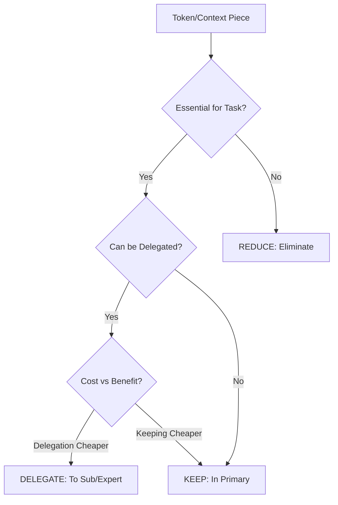

# THE CONTEXT OPTIMIZATION FRAMEWORK

> *"There are only TWO ways to manage your context window: Reduce and Delegate"*

## Executive Overview

The R&D Framework is the systematic approach to achieving 70% context reduction while maintaining or improving agent performance. This document provides the complete methodology, strategies, and implementation patterns.

---

## Table of Contents

1. [The R&D Philosophy](#the-rd-philosophy)
2. [REDUCE Strategies](#reduce-strategies)
3. [DELEGATE Strategies](#delegate-strategies)
4. [The 70% Reduction Methodology](#the-70-reduction-methodology)
5. [Before/After Examples](#beforeafter-examples)
6. [Measurement and Validation](#measurement-and-validation)
7. [Advanced Optimization Patterns](#advanced-optimization-patterns)

---

## The R&D Philosophy

### Core Principle

> Every token in your context window should either:
> 1. Be absolutely essential for the current task (KEEP)
> 2. Be eliminated (REDUCE)
> 3. Be handled by another agent (DELEGATE)

### The Context Equation

```
Optimal Context = Minimal Essential Information + Zero Waste + Perfect Distribution
```

### The Decision Tree



---

## REDUCE Strategies

### Strategy 1: Information Compression

**Principle:** Extract essence, discard verbosity

#### Implementation Patterns

**Pattern A: Interface Extraction**
```python
# BEFORE: 2000 tokens
class UserService:
    def __init__(self, db, cache, logger, config, ...):
        self.db = db
        self.cache = cache
        # ... 100 lines of initialization

    def get_user(self, user_id):
        # ... 50 lines of implementation

    def update_user(self, user_id, data):
        # ... 75 lines of implementation

# AFTER: 200 tokens
class UserService:
    def get_user(self, user_id: str) -> User
    def update_user(self, user_id: str, data: dict) -> User
    def delete_user(self, user_id: str) -> bool
```

**Pattern B: Summary Extraction**
```markdown
# BEFORE: 5000 tokens (full documentation)
[Entire API documentation with examples, edge cases, history...]

# AFTER: 500 tokens (extracted essence)
## API Endpoints
- GET /users/{id} - Retrieve user
- PUT /users/{id} - Update user
- DELETE /users/{id} - Remove user

## Key Rules
- Auth required for all endpoints
- Rate limit: 100/minute
- Returns JSON, status 200/400/401/404/500
```

**Pattern C: Decision Preservation**
```markdown
# BEFORE: 10K tokens (full discussion)
[Long conversation about architecture decisions...]

# AFTER: 1K tokens (decisions only)
## Architectural Decisions
1. Use PostgreSQL (not MongoDB) - Better ACID compliance
2. Implement caching layer - Redis for session data
3. Microservices architecture - Scale independently
4. REST over GraphQL - Simpler for team
```

### Strategy 2: Relevance Filtering

**Principle:** Load only what's needed for current task

#### Contextual Loading Patterns

**Pattern A: Task-Based Filtering**
```python
def load_context_for_task(task_type):
    base_context = load_minimal_base()  # 2K tokens

    if task_type == "api_development":
        context = base_context + load_api_specs()  # +5K
    elif task_type == "frontend_work":
        context = base_context + load_component_library()  # +8K
    elif task_type == "database_optimization":
        context = base_context + load_schema_and_queries()  # +6K
    else:
        context = base_context  # Minimal only

    return context
```

**Pattern B: Progressive Disclosure**
```bash
# Start minimal
/prime_minimal  # 2K tokens - Just project structure

# Add layers as needed
/prime_add_api  # +3K tokens - When touching API
/prime_add_auth  # +2K tokens - When dealing with auth
/prime_add_tests  # +4K tokens - When writing tests
```

**Pattern C: Time-Based Relevance**
```python
def filter_by_recency(files, threshold_days=7):
    """Only load recently modified files"""
    relevant_files = []
    cutoff = datetime.now() - timedelta(days=threshold_days)

    for file in files:
        if file.modified_date > cutoff:
            relevant_files.append(file)

    return relevant_files  # 80% reduction on mature codebases
```

### Strategy 3: Noise Elimination

**Principle:** Remove all non-essential information

#### Noise Patterns to Eliminate

**Type 1: Boilerplate Code**
```javascript
// BEFORE: Include all boilerplate
import React from 'react';
import { useState, useEffect } from 'react';
import { useRouter } from 'next/router';
// ... 20 more imports

// AFTER: Skip obvious imports
// [Standard React imports omitted]
// Focus on business logic only
```

**Type 2: Repetitive Patterns**
```python
# BEFORE: Every CRUD operation fully defined
def get_user(id): ...
def get_product(id): ...
def get_order(id): ...
# ... 20 similar functions

# AFTER: Pattern recognition
# Standard CRUD for: User, Product, Order, ...
# All follow pattern: get_{entity}(id) -> {Entity}
```

**Type 3: Generated Code**
```yaml
# BEFORE: Include all generated files
migrations/
  001_initial.sql  # 2K tokens
  002_add_users.sql  # 1K tokens
  # ... 50 more migrations

# AFTER: Reference only
# 52 migration files (details in migrations/)
# Latest: 052_add_analytics.sql
```

### Strategy 4: Smart Summarization

**Principle:** Hierarchical compression based on importance

#### Summarization Techniques

**Technique A: Layered Abstractions**
```python
class ContextSummarizer:
    def summarize(self, content, level):
        if level == "critical":
            return self.extract_critical_only(content)  # 10% size
        elif level == "important":
            return self.extract_important(content)  # 30% size
        elif level == "standard":
            return self.standard_summary(content)  # 50% size
        else:
            return content  # Full context
```

**Technique B: Entity-Relationship Compression**
```markdown
# BEFORE: Full database documentation
[100+ tables with all columns, indices, relations...]

# AFTER: Entity model
## Core Entities
- User (id, email, role)
- Product (id, name, price)
- Order (id, user_id, total)

## Key Relations
User -> Orders (1:many)
Order -> Products (many:many via OrderItems)
```

**Technique C: Behavioral Summarization**
```typescript
// BEFORE: Full implementation
class ShoppingCart {
  // 500 lines of implementation
}

// AFTER: Behavioral contract
interface ShoppingCart {
  // Core behaviors only
  addItem(product: Product, quantity: number): void
  removeItem(productId: string): void
  checkout(): Order
  // State: items[], total, userId
}
```

---

## DELEGATE Strategies

### Strategy 1: Task Distribution

**Principle:** Distribute work based on specialization

#### Distribution Patterns

**Pattern A: Horizontal Distribution**
```python
# Distribute similar tasks across multiple agents
tasks = ["analyze_file_1", "analyze_file_2", "analyze_file_3", ...]

for i, task in enumerate(tasks):
    agent = spawn_agent(f"analyzer_{i}")
    agent.execute(task, context_limit=10_000)
```

**Pattern B: Vertical Distribution**
```python
# Layer agents by responsibility
pipeline = [
    ("researcher", 30_000),  # High context for exploration
    ("architect", 20_000),   # Medium context for design
    ("builder", 15_000),     # Focused context for implementation
    ("validator", 10_000)    # Minimal context for verification
]

for role, context_limit in pipeline:
    agent = spawn_agent(role, context_limit)
    result = agent.execute(previous_result)
```

**Pattern C: Expertise-Based Distribution**
```python
# Route to domain experts
def route_to_expert(task):
    if "database" in task:
        return database_expert
    elif "api" in task:
        return api_expert
    elif "ui" in task:
        return frontend_expert
    else:
        return generalist_agent
```

### Strategy 2: Agent Specialization

**Principle:** Create focused agents for specific domains

#### Specialization Patterns

**Pattern A: Domain Experts**
```markdown
# Database Expert
- Context: Schema, queries, optimization rules
- Capabilities: Query optimization, migration generation
- Not included: Frontend, API, business logic

# API Expert
- Context: OpenAPI specs, middleware, routes
- Capabilities: Endpoint creation, validation rules
- Not included: Database internals, UI components
```

**Pattern B: Task Specialists**
```python
specialists = {
    "bug_fixer": {
        "context": ["error_logs", "recent_changes", "test_failures"],
        "exclude": ["feature_specs", "documentation", "configs"]
    },
    "feature_builder": {
        "context": ["requirements", "api_specs", "models"],
        "exclude": ["error_logs", "performance_metrics"]
    },
    "test_writer": {
        "context": ["test_framework", "fixtures", "coverage"],
        "exclude": ["implementation_details", "configs"]
    }
}
```

**Pattern C: Lifecycle Specialists**
```yaml
Planning Specialist:
  context: requirements, constraints, architecture
  output: detailed_spec.md
  tokens: 20K

Implementation Specialist:
  context: spec, relevant_code_files
  output: implemented_code
  tokens: 30K

Review Specialist:
  context: diff, standards, patterns
  output: review_comments.md
  tokens: 15K
```

### Strategy 3: External Tool Integration

**Principle:** Delegate to specialized external systems

#### Tool Delegation Patterns

**Pattern A: Database Operations**
```python
# Instead of loading schema into context
def delegate_to_database():
    # Use MCP database server
    db_agent = spawn_with_mcp("postgres")
    return db_agent.query("SELECT * FROM users")
    # Saves 10K+ tokens of schema context
```

**Pattern B: Web Operations**
```python
# Instead of loading web content into primary
def delegate_web_scraping(urls):
    scraper = spawn_agent("web_scraper")
    for url in urls:
        scraper.fetch_and_save(url)
    return "Results saved to files"
    # Saves 50K+ tokens per URL
```

**Pattern C: File System Operations**
```bash
# Instead of reading all files
/delegate "Find all TypeScript files modified this week" filesystem_expert

# Expert uses specialized file commands
# Returns only relevant file list
# Saves exploring entire codebase
```

### Strategy 4: MCP Server Usage

**Principle:** Use MCP servers as context delegates

#### MCP Optimization Patterns

**Pattern A: On-Demand Loading**
```bash
# Never in .mcp.json (default load)
# Load only when needed
claude --mcp-config .mcp.postgres.json  # Only for DB work
claude --mcp-config .mcp.github.json    # Only for Git operations
```

**Pattern B: Minimal Configurations**
```json
// .mcp.minimal.json - Absolute minimum
{
  "mcpServers": {
    "filesystem": {
      "command": "npx",
      "args": ["@modelcontextprotocol/server-filesystem"],
      "config": {"directories": ["./src"]}  // Limited scope
    }
  }
}
```

**Pattern C: Task-Specific MCP Sets**
```python
mcp_configs = {
    "web_dev": [".mcp.filesystem.json", ".mcp.browser.json"],
    "api_dev": [".mcp.postgres.json", ".mcp.http.json"],
    "devops": [".mcp.docker.json", ".mcp.kubernetes.json"],
    "analysis": [".mcp.github.json", ".mcp.search.json"]
}

def launch_for_task(task_type):
    configs = mcp_configs.get(task_type, [])
    return f"claude --mcp-config {' '.join(configs)}"
```

---

## The 70% Reduction Methodology

### Step-by-Step Process

#### Phase 1: Baseline Measurement (Day 1)

```python
def establish_baseline():
    """Measure current context usage"""

    # 1. Document current state
    baseline = {
        "startup_tokens": measure_startup(),      # Often 50K+
        "claudemd_size": len(read("CLAUDE.md")),  # Often 20K+
        "mcp_tokens": measure_mcp_servers(),      # Often 25K+
        "typical_task_tokens": measure_average_task(),  # 150K+
    }

    # 2. Identify waste categories
    waste = {
        "static_bloat": baseline["claudemd_size"] - 500,  # Should be <500
        "unused_mcp": baseline["mcp_tokens"],  # Should be 0 default
        "redundant_info": find_duplicates(),
        "stale_context": find_outdated_info()
    }

    return baseline, waste
```

#### Phase 2: Quick Wins (Day 1-3)

```python
def apply_quick_wins():
    """Immediate 30-40% reduction"""

    # 1. Eliminate static bloat
    minimize_claude_md()  # Save 15-20K

    # 2. Remove default MCP
    delete_default_mcp()  # Save 20-25K

    # 3. Implement concise output
    set_concise_output_style()  # Save 20K over session

    # 4. Create prime commands
    create_task_specific_primes()  # Dynamic vs static

    return measure_improvement()
```

#### Phase 3: Structural Changes (Week 1)

```python
def implement_structural_changes():
    """Additional 20-30% reduction"""

    # 1. Implement delegation patterns
    patterns = [
        create_sub_agents(),        # Offload specialized work
        setup_architect_editor(),   # Separate planning/building
        configure_background_agents()  # Parallel processing
    ]

    # 2. Establish context budgets
    budgets = {
        "exploration": 50_000,
        "planning": 20_000,
        "implementation": 30_000,
        "validation": 15_000
    }

    # 3. Create expertise system
    experts = build_expert_agents()

    return patterns, budgets, experts
```

#### Phase 4: Optimization (Week 2-4)

```python
def optimize_context_flow():
    """Final 10-20% reduction"""

    # 1. Implement context bundles
    enable_context_bundles()

    # 2. Fine-tune priming
    optimize_prime_commands()

    # 3. Create reset triggers
    auto_reset_rules = {
        "token_threshold": 50_000,
        "prompt_count": 30,
        "time_elapsed": 3600  # 1 hour
    }

    # 4. Measure and iterate
    return continuous_improvement_loop()
```

### Validation Framework

```python
class ContextValidator:
    def __init__(self, target_reduction=0.7):
        self.target = target_reduction
        self.baseline = None

    def validate_reduction(self, current_usage):
        """Verify 70% reduction achieved"""

        reduction = 1 - (current_usage / self.baseline)

        return {
            "achieved": reduction >= self.target,
            "reduction_percentage": reduction * 100,
            "tokens_saved": self.baseline - current_usage,
            "multiplier": self.baseline / current_usage
        }

    def validate_performance(self, metrics):
        """Ensure performance maintained/improved"""

        return {
            "task_success_rate": metrics["success"] / metrics["attempts"],
            "time_to_completion": metrics["avg_completion_time"],
            "error_rate": metrics["errors"] / metrics["attempts"],
            "intervention_rate": metrics["interventions"] / metrics["attempts"]
        }
```

---

## Before/After Examples

### Example 1: API Development Task

#### BEFORE (No Optimization)
```python
# Context Load on Startup
startup_context = {
    "CLAUDE.md": 18_000,  # Bloated with everything
    "MCP_servers": 24_000,  # All servers loaded
    "auto_loaded_files": 15_000,  # Random files
    # Total: 57,000 tokens before even starting
}

# Task Execution
task = "Create user authentication API"

# Single agent tries to do everything
agent.load("all_api_docs")  # +20K
agent.load("all_models")    # +15K
agent.load("all_tests")     # +12K
agent.load("all_configs")   # +8K
# Total context: 112K tokens

# Results
success = False  # Context overflow at 180K
attempts = 3     # Multiple restarts needed
time = 4.5  # hours
cost = 89  # dollars
```

#### AFTER (With R&D Framework)
```python
# Optimized Startup
startup_context = {
    "CLAUDE.md": 400,  # Minimal essentials
    "MCP_servers": 0,   # None by default
    "auto_loaded_files": 0,  # Nothing auto-loaded
    # Total: 400 tokens
}

# Task Execution with R&D
task = "Create user authentication API"

# Delegated Approach
planner = Agent("planner", context=15_000)
planner.prime("api_planning")
spec = planner.create_spec(task)  # Output: 2K

builder = Agent("builder", context=20_000)
builder.prime("api_implementation")
code = builder.implement(spec)  # Focused execution

tester = Agent("tester", context=10_000)
tests = tester.create_tests(code)

# Total context: 45K tokens (vs 112K)

# Results
success = True   # First attempt
attempts = 1     # No restarts
time = 0.75  # hours
cost = 22  # dollars
```

### Example 2: Bug Investigation

#### BEFORE (Context Explosion)
```bash
# Developer guides agent through debugging
# Step 1: Load everything that might be relevant
/read logs/          # +40K tokens
/read src/           # +60K tokens
/read tests/         # +30K tokens
/read configs/       # +20K tokens

# Context is now 150K before investigation starts

# Step 2: Start investigating
"Find the bug in the payment system"
# Agent is overwhelmed, loses focus
# Starts checking irrelevant files
# Context overflows at 200K

# Reset and try again...
# Total: 3 attempts, 6 hours, 450K tokens used
```

#### AFTER (Focused Delegation)
```bash
# Orchestrated investigation
/experts/debugger/investigate "Payment system error"

# Expert delegates to specialists
log_analyzer = SubAgent(context=20K)
log_analyzer.scan_errors("logs/payments.log")
# Returns: "Error at line 457: null reference"

code_inspector = SubAgent(context=15K)
code_inspector.check("src/payments/processor.ts", line=457)
# Returns: "Missing null check on user.subscription"

fix_generator = SubAgent(context=10K)
fix_generator.create_patch(issue)
# Returns: patch file

# Total: 45K tokens (vs 450K)
# Time: 15 minutes (vs 6 hours)
# Success: First attempt
```

### Example 3: Multi-Feature Sprint

#### BEFORE (Single Agent Juggling)
```python
# Friday: Sprint planning
features = ["auth", "payments", "notifications", "search", "admin"]

# Single agent approach
agent = Claude()
for feature in features:
    agent.load_requirements(feature)  # Each adds 20K
    # Context now has 100K of mixed requirements

    agent.implement(feature)
    # Agent confused by overlapping contexts
    # Makes mistakes, cross-contamination
    # Context explodes, needs reset

# Results
completed = 2/5  # Only 2 features done
quality = "poor"  # Many bugs
time = 40  # hours
cost = 800  # dollars
```

#### AFTER (Parallel Experts)
```python
# Friday: Sprint planning
features = ["auth", "payments", "notifications", "search", "admin"]

# Parallel expert execution
for feature in features:
    cmd = f"/background '/experts/{feature}/implement' opus {feature}.md"
    execute(cmd)
    # Each expert has focused 25K context
    # All run in parallel

# Monday morning: All complete
results = check_reports()

# Results
completed = 5/5  # All features done
quality = "excellent"  # Well-tested, documented
time = 8  # hours (parallel)
cost = 180  # dollars
```

### Example 4: Codebase Refactoring

#### BEFORE (Monolithic Approach)
```python
# Large refactoring task
task = "Migrate from Express to Fastify"

# Load entire codebase
context = {
    "all_routes": 40_000,
    "all_middleware": 30_000,
    "all_models": 25_000,
    "all_tests": 35_000,
    "documentation": 20_000
}
# Total: 150K tokens

# Try to refactor everything at once
# Loses track of changes
# Makes inconsistent modifications
# Context overflow at 200K
# Partial completion, manual fixes needed
```

#### AFTER (Surgical Delegation)
```python
# Large refactoring task
task = "Migrate from Express to Fastify"

# Phase 1: Analysis (delegated)
analyzer = Expert("migration_analyzer", context=30K)
migration_plan = analyzer.create_plan()
# Output: Ordered list of 47 changes needed

# Phase 2: Parallel execution
changes = chunk(migration_plan, size=5)
for chunk in changes:
    worker = Agent(f"migrator_{i}", context=20K)
    worker.execute(chunk)
    # Each handles 5 specific changes

# Phase 3: Validation
validator = Expert("migration_validator", context=25K)
validator.verify_consistency()

# Results
# All 47 changes completed
# Zero manual intervention
# Total time: 2 hours
# Perfect consistency
```

---

## Measurement and Validation

### Key Metrics Framework

```python
class ContextMetrics:
    """Track and validate context optimization"""

    def __init__(self):
        self.metrics = {
            "efficiency": {},
            "performance": {},
            "cost": {},
            "quality": {}
        }

    def measure_efficiency(self, session):
        """Context efficiency metrics"""
        return {
            "startup_tokens": session.initial_context,
            "peak_tokens": session.max_context,
            "average_tokens": session.avg_context,
            "waste_ratio": session.unused_tokens / session.total_tokens,
            "delegation_ratio": session.delegated_tokens / session.total_work,
            "reduction_achieved": 1 - (session.final / session.baseline)
        }

    def measure_performance(self, session):
        """Task performance metrics"""
        return {
            "success_rate": session.successful / session.attempts,
            "first_attempt_success": session.first_success / session.tasks,
            "time_to_completion": session.avg_completion_time,
            "context_overflows": session.overflow_count,
            "manual_interventions": session.intervention_count
        }

    def measure_cost(self, session):
        """Economic metrics"""
        return {
            "total_tokens": session.total_tokens_used,
            "input_token_cost": session.input_tokens * INPUT_RATE,
            "output_token_cost": session.output_tokens * OUTPUT_RATE,
            "cost_per_task": session.total_cost / session.tasks,
            "savings_vs_baseline": session.baseline_cost - session.actual_cost
        }

    def measure_quality(self, session):
        """Output quality metrics"""
        return {
            "error_rate": session.errors / session.operations,
            "test_pass_rate": session.tests_passed / session.tests_run,
            "rework_rate": session.rework_needed / session.tasks,
            "review_score": session.human_review_score
        }
```

### Validation Checklist

```python
def validate_optimization(before, after):
    """Comprehensive validation of context optimization"""

    validations = []

    # 1. Context Reduction
    reduction = (before.tokens - after.tokens) / before.tokens
    validations.append({
        "metric": "Context Reduction",
        "target": 0.7,
        "achieved": reduction,
        "passed": reduction >= 0.7
    })

    # 2. Performance Maintenance
    perf_delta = after.success_rate - before.success_rate
    validations.append({
        "metric": "Performance",
        "target": "maintained or improved",
        "achieved": f"{perf_delta:+.1%}",
        "passed": perf_delta >= 0
    })

    # 3. Cost Reduction
    cost_reduction = (before.cost - after.cost) / before.cost
    validations.append({
        "metric": "Cost Reduction",
        "target": 0.6,
        "achieved": cost_reduction,
        "passed": cost_reduction >= 0.6
    })

    # 4. Time Improvement
    time_improvement = (before.time - after.time) / before.time
    validations.append({
        "metric": "Time Saved",
        "target": 0.5,
        "achieved": time_improvement,
        "passed": time_improvement >= 0.5
    })

    return all(v["passed"] for v in validations), validations
```

### Continuous Monitoring

```python
class ContextMonitor:
    """Real-time context optimization monitoring"""

    def __init__(self, alert_threshold=0.8):
        self.threshold = alert_threshold
        self.baseline = 200_000

    def check_context_health(self, current_context):
        """Real-time health check"""

        usage_ratio = current_context / self.baseline

        if usage_ratio > self.threshold:
            self.trigger_alert({
                "level": "warning" if usage_ratio < 0.9 else "critical",
                "message": f"Context at {usage_ratio:.0%} capacity",
                "recommendation": self.get_recommendation(usage_ratio)
            })

        return {
            "healthy": usage_ratio < self.threshold,
            "usage": current_context,
            "remaining": self.baseline - current_context,
            "usage_percentage": usage_ratio * 100
        }

    def get_recommendation(self, usage_ratio):
        """Context-aware recommendations"""

        if usage_ratio > 0.9:
            return "Immediate reset required: /clear && /prime"
        elif usage_ratio > 0.8:
            return "Consider delegating next task"
        elif usage_ratio > 0.7:
            return "Monitor closely, prepare delegation"
        else:
            return "Healthy context level"
```

---

## Advanced Optimization Patterns

### Pattern 1: Predictive Context Loading

```python
class PredictiveContextLoader:
    """ML-based context prediction and loading"""

    def __init__(self):
        self.task_patterns = self.learn_patterns()

    def predict_context_needs(self, task_description):
        """Predict what context will be needed"""

        task_type = self.classify_task(task_description)
        predicted_files = self.task_patterns[task_type]

        # Load only predicted files
        context = {
            "essential": self.load_essential(predicted_files),
            "optional": self.prepare_optional(predicted_files),
            "excluded": self.identify_excluded(task_type)
        }

        return self.optimize_loading_order(context)

    def learn_patterns(self):
        """Learn from successful task completions"""

        patterns = {}
        for session in successful_sessions:
            task = session.task_type
            used_files = session.files_actually_used

            if task not in patterns:
                patterns[task] = []
            patterns[task].extend(used_files)

        # Identify most common patterns
        return {
            task: most_common(files, n=10)
            for task, files in patterns.items()
        }
```

### Pattern 2: Adaptive Context Windows

```python
class AdaptiveContextManager:
    """Dynamically adjust context based on performance"""

    def __init__(self):
        self.performance_history = []
        self.optimal_ranges = {}

    def adapt_context_size(self, task, current_performance):
        """Adjust context window size based on performance"""

        if task not in self.optimal_ranges:
            self.optimal_ranges[task] = {
                "min": 10_000,
                "max": 50_000,
                "sweet_spot": 25_000
            }

        range_config = self.optimal_ranges[task]

        if current_performance["success_rate"] < 0.8:
            # Increase context if failing
            range_config["sweet_spot"] *= 1.2
        elif current_performance["tokens_wasted"] > 0.3:
            # Decrease if wasteful
            range_config["sweet_spot"] *= 0.8

        return range_config["sweet_spot"]

    def learn_optimal_range(self, task_type, results):
        """Learn optimal context range for task types"""

        self.performance_history.append({
            "task": task_type,
            "context_size": results["context_used"],
            "success": results["success"],
            "time": results["completion_time"]
        })

        # Find sweet spot
        successful = [h for h in self.performance_history
                     if h["task"] == task_type and h["success"]]

        if successful:
            optimal = min(successful, key=lambda x: x["context_size"])
            self.optimal_ranges[task_type]["sweet_spot"] = optimal["context_size"]
```

### Pattern 3: Context Compression Cache

```python
class ContextCompressionCache:
    """Intelligent caching of compressed context"""

    def __init__(self, cache_size=100):
        self.cache = LRUCache(cache_size)
        self.compression_stats = {}

    def get_or_compress(self, content_key, content, task_type):
        """Get compressed content or compress and cache"""

        cache_key = f"{content_key}:{task_type}"

        if cache_key in self.cache:
            return self.cache[cache_key]

        # Compress based on task requirements
        compressed = self.compress_for_task(content, task_type)

        # Track compression effectiveness
        self.compression_stats[cache_key] = {
            "original_size": len(content),
            "compressed_size": len(compressed),
            "ratio": len(compressed) / len(content),
            "task_type": task_type
        }

        self.cache[cache_key] = compressed
        return compressed

    def compress_for_task(self, content, task_type):
        """Task-specific compression strategies"""

        if task_type == "bug_fix":
            # Keep error handling, remove comments
            return self.extract_error_relevant(content)
        elif task_type == "feature":
            # Keep interfaces, remove implementation
            return self.extract_interfaces(content)
        elif task_type == "refactor":
            # Keep structure, remove details
            return self.extract_structure(content)
        else:
            # Standard compression
            return self.standard_compress(content)
```

### Pattern 4: Hierarchical Context Management

```python
class HierarchicalContextManager:
    """Manage context in hierarchical layers"""

    def __init__(self):
        self.layers = {
            "global": {},      # Always loaded
            "domain": {},      # Domain-specific
            "task": {},        # Task-specific
            "temporary": {}    # Current operation
        }

    def build_context(self, task):
        """Build layered context for task"""

        context = ChainMap(
            self.layers["temporary"],
            self.layers["task"],
            self.layers["domain"],
            self.layers["global"]
        )

        # Clear temporary after each operation
        self.layers["temporary"].clear()

        # Load task-specific context
        self.layers["task"] = self.load_task_context(task)

        return context

    def promote_context(self, info, level):
        """Promote important info to higher layers"""

        if level == "global":
            # Very important, always needed
            self.layers["global"].update(info)
        elif level == "domain":
            # Needed for this domain
            self.layers["domain"].update(info)
        # Task and temporary are cleared regularly
```

---

## Summary

The R&D Framework provides a systematic approach to achieving 70% context reduction through:

1. **REDUCE** - Eliminate waste through compression, filtering, and summarization
2. **DELEGATE** - Distribute work through specialization and tool integration

Success depends on:
- Rigorous measurement and validation
- Systematic application of techniques
- Continuous monitoring and optimization
- Discipline in maintaining context hygiene

The framework transforms context management from reactive overflow handling to proactive optimization, enabling scalable, efficient agentic systems that deliver consistent results at a fraction of the cost.