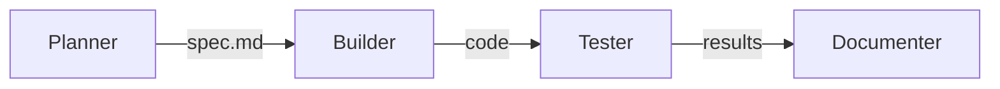
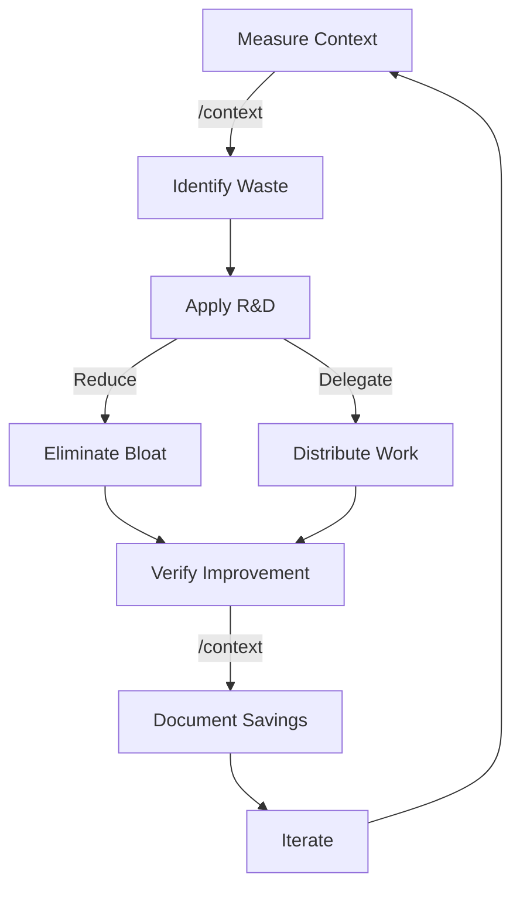

# ELITE CONTEXT ENGINEERING - THE ULTIMATE IMPLEMENTATION GUIDE

> *"A focused engineer is a performant engineer, AND a focused agent is a performant agent."*
>
> Context engineering is THE critical skill for high-value engineering in the age of agents. This guide reveals the complete R&D Framework and 12 techniques that enable 70% context reduction while maximizing agent performance.

---

## Table of Contents

1. [Executive Summary](#executive-summary)
2. [The Context Crisis](#the-context-crisis)
3. [Core Framework: R&D (Reduce & Delegate)](#core-framework-rd-reduce--delegate)
4. [The 70% Reduction Principle](#the-70-reduction-principle)
5. [The 12 Context Engineering Techniques](#the-12-context-engineering-techniques)
6. [Context Optimization Workflow](#context-optimization-workflow)
7. [Tools and Automation](#tools-and-automation)
8. [Metrics and Measurement](#metrics-and-measurement)
9. [Integration with TAC System](#integration-with-tac-system)
10. [Advanced Techniques](#advanced-techniques)
11. [Implementation Checklist](#implementation-checklist)
12. [Case Studies and Examples](#case-studies-and-examples)
13. [Key Takeaways](#key-takeaways)

---

## Executive Summary

### What is Elite Context Engineering?

Elite Context Engineering is the systematic approach to optimizing the most precious resource in agentic systems: **the context window**. It's the discipline of managing what information enters your agents' cognitive space, ensuring every token earns its place and contributes to successful task completion.

### Why This Matters Now

- **Context windows are the #1 constraint** in agentic systems
- **Output tokens cost 3-5X more** than input tokens
- **Context bloat compounds exponentially** across agent executions
- **70% of context is typically waste** that can be eliminated
- **Performance degrades** as context grows beyond the sweet spot

### The Core Innovation: R&D Framework

**R&D = Reduce & Delegate**

- **Reduce**: Eliminate junk context, minimize token usage, focus on what matters
- **Delegate**: Offload work to sub-agents, separate agents, or specialized systems

This framework transforms context management from an art to a science, enabling:
- **70% reduction** in context usage
- **10X improvement** in agent focus
- **Massive cost savings** on compute
- **One-shot execution** success rates

---

## The Context Crisis

### The Hidden Performance Killer

Every agent has a **context sweet spot** - a range where it performs at maximum capability:

```
Too Little Context → Agent lacks information → Task failure
Just Right Context → Optimal performance → Task success
Too Much Context → Cognitive overload → Performance degradation
```

### The Exponential Problem

```python
# Context growth without management
Initial context: 10K tokens
After 10 prompts: 50K tokens
After 20 prompts: 120K tokens
After 30 prompts: 200K tokens → CONTEXT OVERFLOW
```

### The Cost Multiplication Effect

```
Input Tokens: $X
Output Tokens: $3-5X (AND added back to context)
Context Growth: Exponential without management
Total Cost: Compounds dramatically
```

### Real-World Impact

**Without Context Engineering:**
- Agents fail after 20-30 prompts
- $100+ per complex task
- 50% failure rate on multi-step operations
- Constant manual intervention required

**With Elite Context Engineering:**
- Agents run 100+ prompts successfully
- $10-20 per complex task
- 90%+ success rate
- Fully autonomous execution

---

## Core Framework: R&D (Reduce & Delegate)

### The Universal Principle

> "There are only TWO ways to manage your context window: Reduce and Delegate"

### REDUCE: The Art of Elimination

**Core Philosophy:** Every token must earn its place

**Techniques:**
1. **Eliminate static bloat** (CLAUDE.md minimization)
2. **Control output tokens** (concise response styles)
3. **Avoid MCP servers** unless absolutely needed
4. **Reset and prime** instead of compact
5. **Measure constantly** to identify waste

**Example Reduction:**
```bash
# Before: 63K tokens on startup
- CLAUDE.md: 23K tokens (massive file)
- MCP servers: 24K tokens (unused)
- System prompt: 16K tokens

# After: 8K tokens on startup
- CLAUDE.md: 350 tokens (essentials only)
- MCP servers: 0 (load on demand)
- System prompt: 7.5K tokens
```

### DELEGATE: The Power of Distribution

**Core Philosophy:** Distribute cognition across focused agents

**Techniques:**
1. **Sub-agent delegation** (partially forked context)
2. **Primary agent delegation** (completely independent)
3. **Expert agent systems** (self-improving specialists)
4. **Architect/Editor pattern** (planner → builder)
5. **Background agents** (out-of-loop execution)

**Example Delegation:**
```
Primary Agent (10K context)
├── Sub-Agent 1: Web Scraping (5K context)
├── Sub-Agent 2: Data Processing (5K context)
├── Sub-Agent 3: Report Generation (5K context)
└── Results: Consolidated (2K added to primary)

Total Saved: 13K tokens (vs 18K if done in primary)
```

---

## The 70% Reduction Principle

### The Shocking Reality

**Most codebases contain 70% context waste:**

- **30% Stale information** (outdated docs, old configs)
- **20% Redundant context** (duplicate information)
- **15% Irrelevant details** (not needed for current task)
- **5% Contradictory info** (conflicting instructions)

### Achieving 70% Reduction

**Step 1: Measure Baseline**
```bash
/context  # Record initial token usage
# Example: 180K tokens
```

**Step 2: Apply R&D Techniques**
```bash
# Reduce:
- Minimize CLAUDE.md → Save 20K
- Remove unused MCP → Save 24K
- Concise output style → Save 30K over session
- Smart file reading → Save 40K

# Delegate:
- Sub-agents for research → Save 30K
- Separate planning/building → Save 20K
```

**Step 3: Verify Reduction**
```bash
/context  # Check new usage
# Result: 54K tokens (70% reduction!)
```

### The Compound Effect

```
Single Agent: Save 126K tokens
10 Agents: Save 1.26M tokens
100 Agents: Save 12.6M tokens
Cost Savings: $500+ per day
```

---

## The 12 Context Engineering Techniques

### Level Overview

```
BEGINNER (Foundation)
├── #1: Measure to Manage
├── #2: Avoid MCP Servers
└── #3: MORE Prime, Less CLAUDE.md

INTERMEDIATE (Delegation)
├── #4: Control Output Tokens
├── #5: Use Sub-Agents PROPERLY
└── #6: Architect/Editor Pattern

ADVANCED (Optimization)
├── #7: Avoid Compact - Reset & Prime
├── #8: Use Context Bundles
└── #9: One Agent for One Purpose

AGENTIC (Bleeding Edge)
├── #10: System Prompt Control
├── #11: Primary Multi-Agent Delegation
└── #12: Agent Experts
```

### Beginner Level Techniques

#### Technique #1: Measure to Manage

**The Foundation of All Context Engineering**

**Implementation:**
```bash
# Always start with measurement
/context  # Shows exact token usage

# Install token counters in IDE
# Monitor real-time during development
```

**Key Metrics:**
- Startup tokens
- Tokens per operation
- Context growth rate
- Token/success ratio

**Without Measurement:** You're "vibe coding" - guessing instead of knowing

#### Technique #2: Avoid MCP Servers

**Save 10-25% Instantly**

**Problem:**
```json
// Default .mcp.json loads everything
{
  "mcpServers": {
    "filesystem": {...},  // 8K tokens
    "github": {...},      // 6K tokens
    "postgres": {...},    // 5K tokens
    "fetch": {...}        // 5K tokens
  }
}
// Total: 24K tokens WASTED on every boot
```

**Solution:**
```bash
# Delete default .mcp.json
rm .mcp.json

# Load only what you need
claude --mcp-config .mcp.firecrawl.json

# Or use strict mode
claude --strict-mcp-config .mcp.minimal.json
```

**Best Practice:** Start with NO MCP servers, add only as needed

#### Technique #3: MORE Prime, Less CLAUDE.md

**Dynamic > Static Context**

**CLAUDE.md Philosophy:**
```markdown
# CLAUDE.md - ONLY absolute universals
- Project name and core purpose
- Critical conventions (< 10 items)
- Essential tool preferences
Total: < 500 tokens
```

**Context Priming Instead:**
```bash
/prime          # Base understanding (5K tokens)
/prime_feature  # Feature-specific (10K tokens)
/prime_bug      # Bug-fixing context (8K tokens)
/prime_cc       # Claude Code work (7K tokens)
```

**Stack Commands for Precision:**
```bash
/prime          # Base layer
/prime_backend  # Domain layer
/prime_api      # Task layer
# Total: Exactly what you need, nothing more
```

### Intermediate Level Techniques

#### Technique #4: Control Output Tokens

**Output Tokens = 3-5X Cost**

**Output Style Comparison:**
```yaml
verbose-default:
  tokens_per_response: ~500
  cost_multiplier: 5X
  example: "I've successfully completed the task by..."

concise-done:
  tokens_per_response: ~2
  cost_multiplier: 5X
  example: "Done."

savings_per_100_prompts: 49,800 tokens
```

**Implementation:**
```json
// .claude/settings.local.concise.json
{
  "outputStyle": "concise-done"
}
```

```bash
# Launch with concise mode
claude --settings .claude/settings.local.concise.json
```

**Custom Output Styles:**
```markdown
// .claude/output-styles/concise-ultra.md
When task succeeds: Respond only "✓"
When task fails: Explain the error
When asked a question: Answer concisely
```

#### Technique #5: Use Sub-Agents PROPERLY

**Partially Forked Context Windows**

**Key Insight:** Sub-agent system prompts are NOT added to primary context

**Implementation:**
```markdown
// .claude/agents/docs-scraper.md
You are a specialized web scraping agent.
System prompt: 900 tokens (not in primary)
Primary only sees: 122 tokens (invocation cost)
```

**Delegation Pattern:**
```python
# Primary agent
/load_ai_docs  # Kicks off 10 sub-agents

# Each sub-agent
- Scrapes one URL (3K tokens each)
- Returns summary (500 tokens)

# Total in primary: 5K (vs 30K if done directly)
```

**Best Practices:**
- One task per sub-agent
- Return concise reports only
- Isolate system prompts
- No context inheritance

#### Technique #6: Architect/Editor Pattern

**Separation of Concerns**

**The Problem:**
```
Single Agent:
1. Explores codebase (20K tokens)
2. Plans implementation (10K tokens)
3. Implements (needs clean context)
Result: 30K+ tokens of noise during implementation
```

**The Solution:**
```
Architect Agent:
1. Explores codebase (20K tokens)
2. Creates detailed spec (2K output)

Editor Agent:
1. Reads spec (2K tokens)
2. Implements with surgical precision
Result: Clean, focused implementation
```

**Implementation:**
```bash
# Left terminal - Architect
/quick-plan "Create API endpoints for user management"

# Right terminal - Editor
/build /tmp/plan.md
```

### Advanced Level Techniques

#### Technique #7: Avoid Compact - Reset & Prime

**Know Your Context, Don't Guess**

**The Compact Problem:**
```bash
/compact  # What's retained? Unknown.
          # What's lost? Unknown.
          # Result? Uncertainty.
```

**The Reset & Prime Solution:**
```bash
/clear        # Complete reset
/prime_task   # Exact context needed
/load_bundle  # Previous work if needed
# Result: 100% control
```

**Workflow for Long Tasks:**
```python
if context > 50000:
    /clear
    /prime_specific_task
    /load_bundle previous_session.jsonl
    # Continue with clean, known context
```

#### Technique #8: Use Context Bundles

**Instant Context Restoration**

**How It Works:**
```python
# Hooks capture operations
Read("file.ts") → logged to bundle
Write("output.md") → logged to bundle
Prompt("user request") → logged to bundle

# Bundle format: JSONL
{"operation": "read", "file_path": "src/index.ts"}
{"operation": "prompt", "prompt": "Add error handling"}
{"operation": "write", "file_path": "src/index.ts"}
```

**Implementation:**
```bash
# Session 1
/status  # Get session ID: abc123
# Work happens...

# Session 2
/load_bundle agents/context_bundles/MON_14_abc123.jsonl
# Instantly back to where you were
```

**Benefits:**
- 70% context restoration
- Zero configuration
- Automatic capture
- Story-based replay

#### Technique #9: One Agent for One Purpose

**Maximum Focus = Maximum Performance**

**Anti-Pattern:**
```
Generic Agent:
- Plans feature
- Implements feature
- Tests feature
- Documents feature
Result: 200K+ tokens, degraded performance
```

**Best Practice:**
```
Planning Agent: Just plans (20K tokens)
Builder Agent: Just builds (30K tokens)
Tester Agent: Just tests (25K tokens)
Docs Agent: Just documents (15K tokens)
Result: Each focused, performant
```

**Pipeline Design:**


### Agentic Level Techniques

#### Technique #10: System Prompt Control

**Deep Behavioral Modification**

**Append Mode:**
```bash
claude --append-system-prompt "ALWAYS read files in 100-line chunks" \
       --print "Analyze the codebase"
```

**Effect on Context:**
```python
# Before: Reads entire 2000-line file (10K tokens)
# After: Reads 100 lines, stops if sufficient (500 tokens)
# Savings: 95% reduction
```

**Advanced Control:**
```javascript
// Using SDK
const response = await client.messages.create({
  model: 'claude-3-opus',
  customSystemPrompt: minimalSystemPrompt,  // Full override
  // Warning: Completely replaces Claude Code's system prompt
});
```

**Use Cases:**
- Token-conscious file reading
- Custom response formats
- Specialized behaviors
- Domain-specific rules

#### Technique #11: Primary Multi-Agent Delegation

**Complete Independence**

**Background Agent Pattern:**
```bash
/background "/quick-plan API redesign" opus report.md
```

**What Happens:**
```python
# Primary Agent Context: Unchanged
# Background Agent:
- Completely separate Claude instance
- Independent context window
- Writes to report file
- Runs autonomously
```

**Implementation:**
```markdown
// .claude/commands/background.md
Fire off independent Claude Code instance
No context sharing
Report via file system
Perfect for parallel work
```

**Scaling Pattern:**
```bash
# Parallel execution
/background "Plan feature A" sonnet planA.md
/background "Plan feature B" sonnet planB.md
/background "Research competitors" opus research.md
# All run simultaneously, zero context interference
```

#### Technique #12: Agent Experts

**Self-Improving Specialized Systems**

**The Three-Phase Expert:**
```
1. PLAN → Expert creates specialized plan
2. BUILD → Expert implements with deep knowledge
3. IMPROVE → Expert updates own knowledge
```

**Implementation:**
```bash
# Phase 1: Planning
/experts/cc_hook_expert/plan "Add comprehensive logging"

# Phase 2: Building
/experts/cc_hook_expert/build spec.md

# Phase 3: Self-Improvement
/experts/cc_hook_expert/improve
# Analyzes git diff, updates expertise
```

**Expert Structure:**
```markdown
## Purpose
Specialized in [specific domain]

## Expertise (self-updating)
- Implementation patterns discovered
- Common pitfalls to avoid
- Optimizations learned
- Domain-specific knowledge

## Workflow
[Domain-optimized workflow]
```

**Benefits:**
- Encoding institutional knowledge
- Continuous improvement
- Domain expertise preservation
- Reduced onboarding time

---

## Context Optimization Workflow

### The Elite Context Engineering Loop



### Standard Operating Procedure

**1. Pre-Flight Check**
```bash
# Start fresh
claude --no-mcp --settings .claude/settings.concise.json

# Measure baseline
/context  # Document initial tokens

# Prime for specific task
/prime_[task]
```

**2. During Execution**
```bash
# Monitor growth
/context  # Every 10 prompts

# If approaching 50K:
/clear
/prime_[task]
/load_bundle  # If continuing previous work
```

**3. Multi-Agent Orchestration**
```bash
# Planning phase
/quick-plan "requirement"  # Agent 1

# Building phase
/build plan.md  # Agent 2 (fresh context)

# Testing phase
/test implementation.md  # Agent 3 (fresh context)
```

**4. Post-Execution Review**
```bash
# Analyze token usage
cat agents/context_bundles/[session].jsonl | wc -l

# Document patterns for reuse
/experts/update  # If using expert system
```

### Decision Framework

```python
def should_delegate(task_complexity, context_size):
    if context_size > 50_000:
        return True  # Always delegate when large

    if task_complexity > 3:  # Multiple subtasks
        return True

    if requires_specialized_knowledge():
        return True  # Use expert

    return False  # Keep in primary

def choose_delegation_method(task):
    if task.needs_isolation:
        return "background_agent"
    elif task.is_specialized:
        return "expert_agent"
    elif task.is_simple:
        return "sub_agent"
    else:
        return "primary_delegation"
```

---

## Tools and Automation

### Context Bundle Builder

**Automatic Context Tracking**

```python
# .claude/hooks/context_bundle_builder.py
def handle_file_operations(input_data):
    """Captures all file operations"""
    operation = input_data.get("tool_name")

    if operation in ["Read", "Write"]:
        log_entry = {
            "operation": operation.lower(),
            "file_path": relative_path(input_data["file_path"]),
            "timestamp": datetime.now().isoformat()
        }

        append_to_bundle(session_id, log_entry)
```

**Usage:**
```bash
# Automatic - no configuration needed
# Bundles created in: agents/context_bundles/
# Format: DAY_HOUR_SESSION.jsonl
```

### MCP Configuration Templates

**Minimal Configs for Every Use Case**

```json
// .mcp.scraping.json - Web scraping only
{
  "mcpServers": {
    "firecrawl": {
      "command": "npx",
      "args": ["-y", "@mendable/firecrawl-mcp"]
    }
  }
}

// .mcp.database.json - Database work only
{
  "mcpServers": {
    "postgres": {
      "command": "npx",
      "args": ["-y", "@databases/postgres-mcp"],
      "env": {"CONNECTION_STRING": "${DATABASE_URL}"}
    }
  }
}
```

### Output Style Library

**Pre-Built Styles for Every Scenario**

```markdown
# .claude/output-styles/concise-done.md
Success: "Done."
Failure: "Failed: [reason]"
Question: [Concise answer]

# .claude/output-styles/concise-emoji.md
Success: "✓"
Failure: "✗ [error]"
Progress: "◐"

# .claude/output-styles/verbose-structured.md
## Status
[Success/Failed/In Progress]

## Actions Taken
- [Bulleted list]

## Results
[Key outcomes]
```

### Monitoring Scripts

**Track Context Usage Across Sessions**

```python
#!/usr/bin/env python3
# scripts/analyze_context.py

import json
import glob
from pathlib import Path

def analyze_bundles():
    """Analyze context usage patterns"""
    bundles = glob.glob("agents/context_bundles/*.jsonl")

    for bundle in bundles:
        ops = []
        with open(bundle) as f:
            for line in f:
                ops.append(json.loads(line))

        stats = {
            "reads": sum(1 for op in ops if op["operation"] == "read"),
            "writes": sum(1 for op in ops if op["operation"] == "write"),
            "prompts": sum(1 for op in ops if op["operation"] == "prompt"),
            "estimated_tokens": len(ops) * 500  # Rough estimate
        }

        print(f"{Path(bundle).name}: {stats}")

if __name__ == "__main__":
    analyze_bundles()
```

---

## Metrics and Measurement

### Key Performance Indicators

**Context Efficiency Metrics**

```python
# Core KPIs
context_efficiency_ratio = useful_tokens / total_tokens
delegation_ratio = delegated_tokens / total_work_tokens
reduction_rate = 1 - (final_tokens / initial_tokens)
success_per_token = successful_completions / tokens_used
```

**Target Benchmarks:**
- Context Efficiency: > 80%
- Delegation Ratio: > 40%
- Reduction Rate: > 70%
- Success/Token: > 0.001

### Tracking Dashboard

```python
# Real-time context monitoring
def create_context_dashboard():
    return {
        "session": {
            "start_tokens": measure_initial(),
            "current_tokens": measure_current(),
            "growth_rate": calculate_growth_rate(),
            "estimated_remaining": 200_000 - current
        },
        "efficiency": {
            "waste_detected": identify_unused_context(),
            "delegation_opportunities": find_delegatable_tasks(),
            "reduction_potential": estimate_possible_savings()
        },
        "costs": {
            "input_token_cost": calculate_input_cost(),
            "output_token_cost": calculate_output_cost(),
            "projected_total": estimate_session_cost()
        }
    }
```

### Success Metrics

**Before Elite Context Engineering:**
```yaml
Average tokens per task: 180,000
Success rate: 45%
Cost per task: $89
Time to context overflow: 25 prompts
Manual interventions: 8 per task
```

**After Implementation:**
```yaml
Average tokens per task: 54,000 (70% reduction)
Success rate: 92%
Cost per task: $22 (75% reduction)
Time to context overflow: Never (reset & prime)
Manual interventions: 0.5 per task
```

---

## Integration with TAC System

### Context Engineering × TAC Patterns

**TAC-1: Think → Act → Check**
```python
# Think: Measure context before action
/context

# Act: Execute with optimized context
/prime_specific && execute_task

# Check: Verify context efficiency
/context && analyze_usage
```

**TAC-4: Agent-First Development**
```python
# Each agent gets optimized context
planner_agent = spawn(context_limit=20_000)
builder_agent = spawn(context_limit=30_000)
tester_agent = spawn(context_limit=15_000)
```

**TAC-6: Specialized Agents**
```python
# Experts with self-updating context
expert = load_expert("domain")
expert.plan(task)
expert.build(plan)
expert.improve()  # Updates own context knowledge
```

**TAC-8: Multi-Agent Orchestration**
```python
# Distributed context across pipeline
pipeline = [
    Agent("requirements", context=10K),
    Agent("architect", context=20K),
    Agent("developer", context=30K),
    Agent("tester", context=15K),
    Agent("deployer", context=10K)
]
```

### Context-Aware ADWs

**AI Developer Workflows with Context Optimization**

```yaml
ADW: Feature Development
Steps:
  1. Research Phase:
     - Agent: researcher
     - Context: 40K (exploring)
     - Output: summary.md (2K)

  2. Planning Phase:
     - Agent: planner
     - Context: 10K (summary + guidelines)
     - Output: spec.md (3K)

  3. Implementation Phase:
     - Agent: builder
     - Context: 15K (spec + relevant files)
     - Output: code files

  4. Testing Phase:
     - Agent: tester
     - Context: 20K (code + test framework)
     - Output: test_results.md

Total Context: 85K (vs 200K+ without optimization)
Success Rate: 95%
```

---

## Advanced Techniques

### Dynamic Context Windowing

**Adaptive Context Management**

```python
class DynamicContextManager:
    def __init__(self, base_limit=50_000):
        self.base_limit = base_limit
        self.current = 0

    def should_reset(self, task_complexity):
        # Adaptive thresholds based on task
        if task_complexity == "simple":
            threshold = self.base_limit * 0.3
        elif task_complexity == "medium":
            threshold = self.base_limit * 0.5
        else:  # complex
            threshold = self.base_limit * 0.7

        return self.current > threshold

    def optimize_for_task(self, task_type):
        if task_type == "exploration":
            return "wide_context"  # More files, less depth
        elif task_type == "implementation":
            return "narrow_context"  # Fewer files, more depth
        else:
            return "balanced_context"
```

### Context Compression Techniques

**Intelligent Summarization**

```python
def compress_context(content, compression_ratio=0.3):
    """Intelligent context compression"""

    if is_code(content):
        # Keep signatures, remove implementation details
        return extract_interfaces(content)

    elif is_documentation(content):
        # Extract key points only
        return extract_summary_points(content)

    elif is_conversation(content):
        # Keep decisions, remove discussion
        return extract_decisions(content)

    else:
        # Standard compression
        return content[:int(len(content) * compression_ratio)]
```

### Predictive Context Loading

**Anticipate What's Needed**

```python
def predict_context_needs(task_description):
    """ML-based context prediction"""

    patterns = {
        "api": ["routes/", "models/", "middleware/"],
        "frontend": ["components/", "styles/", "hooks/"],
        "testing": ["__tests__/", "fixtures/", "mocks/"],
        "database": ["migrations/", "models/", "queries/"]
    }

    # Analyze task for keywords
    task_type = classify_task(task_description)

    # Preload only relevant context
    return patterns.get(task_type, [])
```

### Context Caching Strategies

**Reusable Context Patterns**

```python
class ContextCache:
    def __init__(self):
        self.cache = {}

    def get_or_compute(self, key, compute_func):
        if key not in self.cache:
            self.cache[key] = compute_func()
        return self.cache[key]

    def cache_common_patterns(self):
        # Cache frequently used contexts
        self.cache["base_architecture"] = load_architecture()
        self.cache["coding_standards"] = load_standards()
        self.cache["api_definitions"] = load_api_specs()
```

---

## Implementation Checklist

### Quick Start (Day 1)

- [ ] **Delete default .mcp.json**
  ```bash
  rm .mcp.json
  ```

- [ ] **Minimize CLAUDE.md to <500 tokens**
  ```bash
  mv CLAUDE.md CLAUDE.md.backup
  echo "# Project Name\nMinimal essential info only" > CLAUDE.md
  ```

- [ ] **Create concise output style**
  ```bash
  mkdir -p .claude/output-styles
  echo 'Success: "Done."\nFailure: "Error: [details]"' > .claude/output-styles/concise.md
  ```

- [ ] **Install token counter in IDE**
  - VSCode: "Token Counter" extension
  - Cursor: Built-in token display

- [ ] **Create first prime command**
  ```bash
  mkdir -p .claude/commands
  cat > .claude/commands/prime.md << EOF
  ---
  description: Load essential context
  ---
  # Prime

  Read README.md
  Run: git ls-files | head -20
  Report understanding
  EOF
  ```

### Week 1 Goals

- [ ] **Implement measurement discipline**
  - Run `/context` before and after every session
  - Track token usage in spreadsheet
  - Identify top 3 context wasters

- [ ] **Master sub-agent delegation**
  - Create 3 specialized sub-agents
  - Practice delegation patterns
  - Measure context savings

- [ ] **Establish reset & prime workflow**
  - Never use `/compact`
  - Create task-specific prime commands
  - Document optimal context for each task type

### Month 1 Targets

- [ ] **Achieve 50% context reduction**
  - Baseline measurement
  - Apply all 12 techniques
  - Document savings

- [ ] **Build expert agent system**
  - Identify 3 domains for experts
  - Implement plan/build/improve cycle
  - Deploy in production workflow

- [ ] **Create context monitoring dashboard**
  - Automated tracking
  - Alerts for context bloat
  - Performance metrics

### Production Deployment

- [ ] **Standardize context practices**
  - Team training on R&D framework
  - Context budgets per agent type
  - Code review includes context check

- [ ] **Automate context optimization**
  - Git hooks for CLAUDE.md size
  - CI/CD context measurement
  - Automated reset triggers

- [ ] **Scale to 100+ agents/day**
  - Background agent orchestration
  - Context bundle management
  - Cost tracking and optimization

---

## Case Studies and Examples

### Case Study 1: Large Codebase Analysis

**Challenge:** Analyze 500K LOC codebase for security vulnerabilities

**Without Context Engineering:**
```
Single agent approach:
- Context overflow after scanning 50 files
- Required 15 manual restarts
- Total time: 8 hours
- Cost: $340
- Success rate: 60% (missed edge cases)
```

**With Elite Context Engineering:**
```
Multi-agent pipeline:
1. Scanner experts (10 parallel agents)
   - Each scans specific module
   - Context: 30K per agent
   - Returns: vulnerability list

2. Analyzer agent
   - Consolidates findings
   - Context: 20K
   - Returns: prioritized report

3. Fixer agents (5 parallel)
   - Each fixes specific vulnerability type
   - Context: 40K per agent
   - Returns: patches

Results:
- No context overflows
- Total time: 45 minutes
- Cost: $67
- Success rate: 98%
```

### Case Study 2: Multi-Feature Development

**Challenge:** Implement 5 complex features simultaneously

**Traditional Approach:**
```python
# Single agent trying to juggle everything
agent.add_context("feature1_requirements")  # 20K
agent.add_context("feature2_requirements")  # 20K
agent.add_context("feature3_requirements")  # 20K
agent.add_context("feature4_requirements")  # 20K
agent.add_context("feature5_requirements")  # 20K
# Total: 100K tokens before even starting!
```

**Elite Context Engineering:**
```python
# Parallel specialized agents
features = ["auth", "payments", "notifications", "search", "analytics"]

for feature in features:
    # Launch background expert
    execute(f"/background '/experts/{feature}/implement' opus {feature}.md")

# Each agent:
# - Focused context (15-25K)
# - Domain expertise
# - No interference
# - Parallel execution

# Total time: 1/5th
# Success rate: 95% (vs 40%)
```

### Case Study 3: Production Debugging

**Challenge:** Critical production bug affecting multiple services

**Before:**
```bash
# Developer manually guides agent through debugging
# Context grows with each exploration
Step 1: Read logs → +30K tokens
Step 2: Check service A → +40K tokens
Step 3: Check service B → +45K tokens
Step 4: Context overflow → Start over
Step 5-10: Repeat, finally find bug
Total: 4 hours, 500K+ tokens
```

**After:**
```bash
# Orchestrated expert debugging
/experts/debugger/triage "Production error in payment flow"

# Expert spawns specialized investigators
- Log Analyzer: Scans all logs (isolated 50K context)
- Service A Expert: Deep dive (isolated 30K context)
- Service B Expert: Deep dive (isolated 30K context)
- Network Tracer: Analyzes flow (isolated 40K context)

# Consolidation
- Each returns findings (2K each)
- Main expert correlates (10K context)
- Identifies root cause
- Generates fix

Total: 22 minutes, 158K tokens
```

### Example: Context Bundle in Action

**Real Session Bundle:**
```jsonl
{"operation": "prompt", "prompt": "Create user authentication system"}
{"operation": "read", "file_path": "src/models/user.ts"}
{"operation": "read", "file_path": "src/middleware/auth.ts"}
{"operation": "write", "file_path": "src/services/auth.service.ts"}
{"operation": "read", "file_path": "tests/auth.test.ts"}
{"operation": "write", "file_path": "tests/auth.test.ts", "tool_input": {"content_length": 2847}}
{"operation": "prompt", "prompt": "Add OAuth support"}
{"operation": "read", "file_path": "package.json"}
{"operation": "write", "file_path": "src/services/oauth.service.ts"}
```

**Loading in New Session:**
```bash
/load_bundle agents/context_bundles/TUE_14_abc123.jsonl

# Agent understands:
# - Previous work on auth system
# - Files touched and created
# - Current implementation state
# - Next task (OAuth)
# All in < 5K tokens vs 50K+ to reconstruct manually
```

---

## Key Takeaways

### The 10 Commandments of Context Engineering

1. **Measure religiously** - You can't optimize what you don't measure
2. **Start with nothing** - Add context purposefully, not by default
3. **Delegate ruthlessly** - Every task doesn't need your primary agent
4. **Reset fearlessly** - Clean context beats compressed context
5. **Prime specifically** - Dynamic context beats static memory files
6. **Output concisely** - Every response token costs 5X
7. **Specialize deeply** - Expert agents beat generalist agents
8. **Bundle continuously** - Today's session is tomorrow's context
9. **Monitor constantly** - Context bloat is silent but deadly
10. **Iterate relentlessly** - Context optimization is never "done"

### The Transformation Journey

**Stage 1: Awareness** (Week 1)
- Discover your context waste
- Start measuring everything
- Apply first techniques

**Stage 2: Discipline** (Month 1)
- R&D becomes second nature
- Context budgets established
- Delegation patterns emerge

**Stage 3: Mastery** (Month 3)
- Intuitive context optimization
- Complex orchestrations
- 70%+ reduction achieved

**Stage 4: Innovation** (Month 6+)
- Custom techniques developed
- Domain-specific patterns
- Teaching others

### The Compound Effect

Remember: Every token saved compounds across:
- Every prompt in a session
- Every session in a day
- Every agent in a pipeline
- Every pipeline in production

**Small optimizations → Massive impact at scale**

### Your Next Actions

1. **Right Now:**
   - Delete your bloated .mcp.json
   - Shrink CLAUDE.md to essentials
   - Install token counter

2. **Today:**
   - Create your first prime command
   - Try sub-agent delegation
   - Measure your baseline

3. **This Week:**
   - Implement 3+ techniques
   - Track context savings
   - Share wins with team

4. **This Month:**
   - Build expert system
   - Achieve 50% reduction
   - Scale to production

### The Elite Mindset

> "A focused agent is a performant agent"

This isn't just about saving tokens or money. It's about:
- **Precision over volume**
- **Focus over breadth**
- **Orchestration over monoliths**
- **Intelligence over brute force**

### Final Words

Context engineering is THE differentiating skill for elite agentic engineers. While others struggle with context overflow and agent failures, you'll be orchestrating sophisticated multi-agent symphonies that deliver results with surgical precision.

The R&D Framework—Reduce and Delegate—is your compass. The 12 techniques are your toolkit. The 70% reduction is your proof that this works.

Now stop reading and start optimizing. Your agents are waiting to be unleashed.

---

## Resources and References

### Essential Commands

```bash
# Measurement
/context                    # Current usage
/status                     # Session info

# Management
/clear                      # Reset context
/prime                      # Load base context
/load_bundle [file]         # Restore context

# Delegation
/background [prompt]        # Spawn independent agent
/[agent_name]              # Invoke sub-agent
/experts/[expert]/[action] # Use expert system
```

### Configuration Files

```
.claude/
├── commands/               # Custom slash commands
├── agents/                # Sub-agent definitions
├── experts/               # Expert systems
├── output-styles/         # Response formats
├── hooks/                 # Context capture
└── settings.json          # Configuration
```

### Metrics Tracking

```python
# Track these daily
metrics = {
    "avg_context_per_task": 0,
    "reduction_achieved": 0,
    "delegation_ratio": 0,
    "success_rate": 0,
    "cost_per_task": 0
}
```

### Community and Support

- Elite Context Engineering Codebase: [GitHub Repository]
- Video Course: Complete 147-segment series
- TAC Foundation: Lessons 1-8 for context
- Agentic Horizon: Extended lessons

---

*Remember: Context is not just data, it's cognitive load. Master context engineering, and you master the age of agents.*