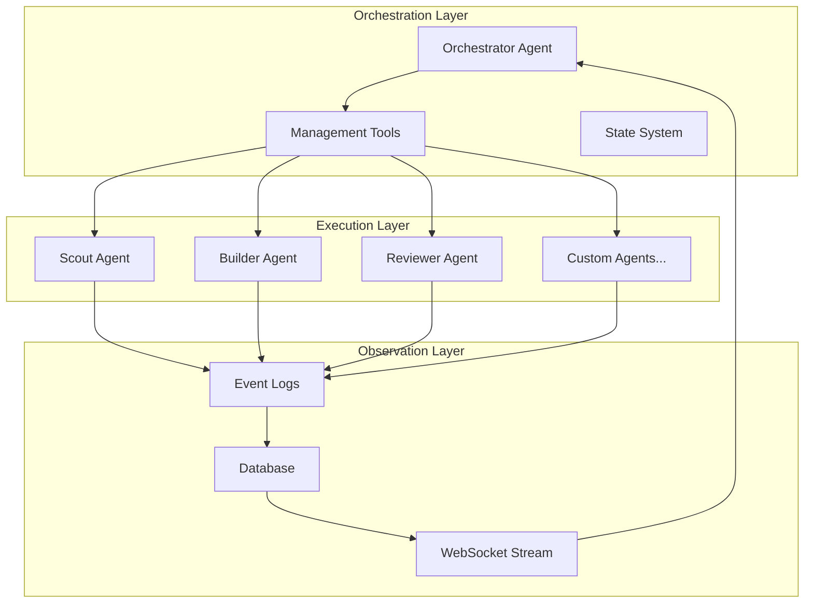

# 🎯 MULTI-AGENT ORCHESTRATION: The Ultimate Implementation Guide

## Executive Summary: Why Orchestration Is the Final Frontier

> **"There is one mode of engineering that matters above all now: agentic engineering. Here, we don't focus on the application layer, we focus on the agentic layer. We build the system that builds the system."**

Multi-Agent Orchestration represents the **culmination of agentic engineering**—the point where you transition from managing individual agents to conducting entire orchestras of specialized AI workers. This is where you achieve true scale: not 2x or 5x productivity gains, but **100x transformations** in how work gets done.

### The Evolution Journey

```
Base Agents → Better Agents → More Agents → Custom Agents → ORCHESTRATED AGENTS
```

Each step multiplies your impact:
- **Base Agents**: 2x productivity (using Claude/Cursor)
- **Better Agents**: 5x productivity (optimized prompts)
- **More Agents**: 10x productivity (parallel execution)
- **Custom Agents**: 20x productivity (domain-specific)
- **Orchestrated Agents**: 100x+ productivity (coordinated swarms)

### Why This Matters Now

The constraint on engineering output has shifted:
- **Before**: How fast you can type
- **Now**: How fast you can create and command agents
- **Future**: How well your agents coordinate themselves

Multi-Agent Orchestration is the bridge to that future.

---

## 🔥 The Orchestration Challenge

### The Wall Every Engineer Hits

> **"You will hit a wall. There are hard limits on the current interface of agents. You can't scale by hopping into one terminal at a time, writing one prompt at a time."**

#### The Problems at Scale

1. **Context Explosion**
   - Single agents drowning in information
   - Context windows polluted with irrelevant data
   - Performance degradation with task complexity

2. **Coordination Chaos**
   - Agents working in isolation
   - No communication between specialists
   - Duplicated effort, inconsistent results

3. **Observability Blindness**
   - Can't see what agents are doing
   - No way to measure performance
   - Debugging becomes impossible

4. **Management Overhead**
   - Manual creation of each agent
   - Individual monitoring required
   - No systematic lifecycle control

### The Orchestration Solution

Multi-Agent Orchestration solves these challenges through:



---

## 🏗️ Core Orchestration Patterns

### Pattern 1: The Orchestrator Agent (The Conductor)

The **"One Agent to Rule Them All"** pattern:

```python
class OrchestratorAgent:
    """
    The single interface pattern applied to your fleet of agents.
    It interprets natural language and orchestrates specialized workers.
    """

    def __init__(self):
        self.system_prompt = """
        You are an Orchestrator Agent. Your role is to:
        1. Understand high-level user intent
        2. Decompose tasks into agent-solvable units
        3. Create and manage specialized agents
        4. Coordinate execution and collect results
        5. Synthesize outputs for the user

        You DO NOT do the work yourself.
        You CONDUCT others to do the work.
        """

        self.tools = [
            "create_agent",
            "command_agent",
            "check_agent_status",
            "list_agents",
            "delete_agent",
            "read_agent_logs",
            "interrupt_agent",
            "report_cost"
        ]
```

#### Key Principles

1. **Separation of Concerns**
   - Orchestrator: High-level planning and coordination
   - Command Agents: Focused execution of specific tasks
   - No cross-contamination of responsibilities

2. **Context Protection**
   ```python
   # Orchestrator maintains minimal context
   orchestrator_context = {
       "conversation_history": last_n_messages,
       "agent_registry": active_agents,
       "current_objective": user_goal
   }

   # Each agent has isolated context
   agent_context = {
       "task_specification": detailed_prompt,
       "relevant_files": task_specific_files,
       "dependencies": required_resources
   }
   ```

3. **Natural Language Interface**
   ```
   User: "Create three agents to summarize the codebase"

   Orchestrator interprets → Creates agents → Commands them → Collects results
   ```

### Pattern 2: CRUD for Agents

Complete lifecycle management through programmatic control:

```python
class AgentManager:
    """Provides CRUD operations for agent fleet management"""

    async def create_agent(
        self,
        name: str,
        system_prompt: str,
        model: str = "claude-sonnet-4-5",
        template: str = None
    ):
        """Spawn a new specialized agent"""
        agent = ClaudeCodeAgent(
            system_prompt=system_prompt,
            model=model
        )
        self.agents[name] = agent
        await self.broadcast("agent_created", agent.metadata)
        return agent

    async def command_agent(self, name: str, command: str):
        """Send work to a specific agent"""
        agent = self.agents[name]
        await agent.update_status("executing")
        result = await agent.execute(command)
        await agent.update_status("idle")
        return result

    async def delete_agent(self, name: str):
        """Remove agent when work is complete"""
        agent = self.agents.pop(name)
        await agent.cleanup()
        await self.broadcast("agent_deleted", {"name": name})
```

#### The Agent Lifecycle

```
Created → Idle → Executing → Idle → ... → Deleted
                     ↓
                  Errored → Recovered/Deleted
```

**Critical Insight**: Treat agents as ephemeral resources
> **"You must treat your agents as deleteable temporary resources that serve a single purpose."**

### Pattern 3: Parallel Execution Architecture

Maximize compute through coordinated parallelism:

```python
class ParallelOrchestrator:
    """Orchestrate parallel agent execution"""

    async def execute_parallel_workflow(self, tasks):
        """Launch agents in parallel for independent tasks"""

        # Phase 1: Identify parallelizable work
        task_groups = self.analyze_dependencies(tasks)

        # Phase 2: Spawn agents for each group
        for group in task_groups:
            if group.is_independent():
                agents = await asyncio.gather(*[
                    self.create_agent(task) for task in group
                ])

                # Phase 3: Execute in parallel
                results = await asyncio.gather(*[
                    agent.execute() for agent in agents
                ])

                # Phase 4: Clean up
                await asyncio.gather(*[
                    self.delete_agent(agent) for agent in agents
                ])

        return self.aggregate_results(results)
```

#### Parallel Patterns in Practice

1. **Fork-Join Pattern**
   ```
   Task → [Agent1, Agent2, Agent3] → Results → Aggregate
   ```

2. **Pipeline Pattern**
   ```
   Scout → Plan → [Build1, Build2, Build3] → Review → Deploy
   ```

3. **Map-Reduce Pattern**
   ```
   Data → [Process1...N] → [Reduce1...M] → Final Result
   ```

---

## 🚀 Parallel Execution Strategies

### Strategy 1: Task Decomposition

Breaking complex work into parallel-executable units:

```python
def decompose_for_parallel_execution(requirement):
    """
    Decompose a requirement into parallel tasks
    """
    # Identify independent components
    components = identify_components(requirement)

    # Create task specifications
    tasks = []
    for component in components:
        task = {
            "agent_type": select_agent_type(component),
            "specification": create_detailed_spec(component),
            "dependencies": identify_dependencies(component),
            "priority": calculate_priority(component)
        }
        tasks.append(task)

    # Group by dependencies
    parallel_groups = []
    current_group = []

    for task in sorted(tasks, key=lambda x: x["priority"]):
        if not has_dependencies_in_group(task, current_group):
            current_group.append(task)
        else:
            if current_group:
                parallel_groups.append(current_group)
            current_group = [task]

    if current_group:
        parallel_groups.append(current_group)

    return parallel_groups
```

### Strategy 2: Dynamic Agent Spawning

Create agents on-demand based on workload:

```python
class DynamicSpawner:
    """Dynamically spawn agents based on workload"""

    def __init__(self, max_agents=10):
        self.max_agents = max_agents
        self.active_agents = []
        self.work_queue = asyncio.Queue()

    async def spawn_workers(self, tasks):
        """Spawn optimal number of workers"""

        # Calculate optimal agent count
        agent_count = min(len(tasks), self.max_agents)

        # Spawn agents
        for i in range(agent_count):
            agent = await self.create_worker_agent(f"worker_{i}")
            self.active_agents.append(agent)

            # Start worker loop
            asyncio.create_task(
                self.worker_loop(agent)
            )

        # Queue tasks
        for task in tasks:
            await self.work_queue.put(task)

    async def worker_loop(self, agent):
        """Worker agent execution loop"""
        while True:
            try:
                task = await self.work_queue.get()
                if task is None:  # Poison pill
                    break

                result = await agent.execute(task)
                await self.store_result(result)

            except Exception as e:
                await self.handle_error(agent, e)
```

### Strategy 3: Load Balancing

Distribute work efficiently across available agents:

```python
class LoadBalancer:
    """Balance work across agent fleet"""

    def __init__(self):
        self.agents = {}
        self.agent_loads = {}

    async def assign_task(self, task):
        """Assign task to least loaded agent"""

        # Find agent with minimum load
        if not self.agents:
            # Create new agent if none exist
            agent = await self.create_agent()
        else:
            # Select least loaded
            agent_id = min(
                self.agent_loads.keys(),
                key=lambda k: self.agent_loads[k]
            )
            agent = self.agents[agent_id]

        # Update load tracking
        self.agent_loads[agent.id] += task.estimated_tokens

        # Execute
        result = await agent.execute(task)

        # Update load
        self.agent_loads[agent.id] -= task.estimated_tokens

        return result
```

---

## 🔄 Agent Communication Protocols

### Protocol 1: Direct Message Passing

Agents communicate through structured messages:

```python
class AgentMessage:
    """Structured message for inter-agent communication"""

    def __init__(
        self,
        sender: str,
        receiver: str,
        message_type: str,
        content: dict,
        metadata: dict = None
    ):
        self.id = str(uuid.uuid4())
        self.timestamp = datetime.now()
        self.sender = sender
        self.receiver = receiver
        self.message_type = message_type
        self.content = content
        self.metadata = metadata or {}

class MessageBus:
    """Central message routing system"""

    def __init__(self):
        self.subscribers = defaultdict(list)
        self.message_queue = asyncio.Queue()

    async def publish(self, message: AgentMessage):
        """Publish message to bus"""
        await self.message_queue.put(message)

        # Notify subscribers
        for subscriber in self.subscribers[message.receiver]:
            await subscriber.handle_message(message)

    def subscribe(self, agent_id: str, handler):
        """Subscribe agent to messages"""
        self.subscribers[agent_id].append(handler)
```

### Protocol 2: Shared State System

Agents coordinate through shared state:

```python
class SharedState:
    """Thread-safe shared state for agent coordination"""

    def __init__(self):
        self.state = {}
        self.locks = defaultdict(asyncio.Lock)
        self.watchers = defaultdict(list)

    async def set(self, key: str, value: any, agent_id: str):
        """Set state value with locking"""
        async with self.locks[key]:
            old_value = self.state.get(key)
            self.state[key] = value

            # Notify watchers
            for watcher in self.watchers[key]:
                await watcher.notify_change(
                    key, old_value, value, agent_id
                )

    async def get(self, key: str):
        """Get state value safely"""
        async with self.locks[key]:
            return self.state.get(key)

    def watch(self, key: str, watcher):
        """Watch for state changes"""
        self.watchers[key].append(watcher)
```

### Protocol 3: Event-Driven Coordination

Agents react to events in the system:

```python
class EventCoordinator:
    """Event-driven agent coordination"""

    def __init__(self):
        self.event_handlers = defaultdict(list)
        self.event_history = []

    async def emit(self, event_type: str, data: dict):
        """Emit event to all listeners"""
        event = {
            "id": str(uuid.uuid4()),
            "type": event_type,
            "data": data,
            "timestamp": datetime.now()
        }

        # Store in history
        self.event_history.append(event)

        # Notify handlers
        for handler in self.event_handlers[event_type]:
            asyncio.create_task(handler(event))

    def on(self, event_type: str, handler):
        """Register event handler"""
        self.event_handlers[event_type].append(handler)

    # Common orchestration events
    async def agent_ready(self, agent_id: str):
        await self.emit("agent:ready", {"agent_id": agent_id})

    async def task_complete(self, task_id: str, result: dict):
        await self.emit("task:complete", {
            "task_id": task_id,
            "result": result
        })

    async def pipeline_stage_complete(self, stage: str):
        await self.emit("pipeline:stage:complete", {
            "stage": stage
        })
```

---

## 📊 State Management Across Agents

### The State Challenge

Managing state across multiple agents requires careful coordination:

1. **Consistency**: All agents see the same truth
2. **Isolation**: Agent work doesn't interfere
3. **Persistence**: State survives failures
4. **Performance**: Fast access and updates

### State Management Architecture

```python
class OrchestratorStateManager:
    """
    Comprehensive state management for multi-agent systems
    """

    def __init__(self, db_connection):
        self.db = db_connection
        self.memory_cache = {}
        self.file_state = FileStateManager()
        self.event_log = []

    # Three-tier state system
    async def save_state(self, state_type: str, data: dict):
        """Save state to appropriate tier"""

        if state_type == "ephemeral":
            # Memory only (fast, temporary)
            self.memory_cache[data["key"]] = data["value"]

        elif state_type == "session":
            # File system (medium persistence)
            await self.file_state.save(data)

        elif state_type == "persistent":
            # Database (long-term storage)
            await self.db.save_state(data)

        # Log state change
        self.event_log.append({
            "action": "save",
            "type": state_type,
            "data": data,
            "timestamp": datetime.now()
        })

    async def get_agent_state(self, agent_id: str):
        """Retrieve complete agent state"""

        return {
            "memory": self.memory_cache.get(agent_id, {}),
            "session": await self.file_state.load(agent_id),
            "persistent": await self.db.get_agent_state(agent_id),
            "status": await self.get_agent_status(agent_id)
        }

    async def checkpoint(self, workflow_id: str):
        """Create workflow checkpoint for recovery"""

        checkpoint = {
            "workflow_id": workflow_id,
            "timestamp": datetime.now(),
            "agents": {},
            "shared_state": dict(self.memory_cache),
            "progress": await self.calculate_progress()
        }

        # Save each agent's state
        for agent_id, agent in self.get_active_agents():
            checkpoint["agents"][agent_id] = {
                "status": agent.status,
                "context": agent.get_context_summary(),
                "results": agent.get_results()
            }

        await self.db.save_checkpoint(checkpoint)
        return checkpoint["id"]

    async def restore(self, checkpoint_id: str):
        """Restore from checkpoint"""

        checkpoint = await self.db.load_checkpoint(checkpoint_id)

        # Restore shared state
        self.memory_cache = checkpoint["shared_state"]

        # Recreate agents
        for agent_id, state in checkpoint["agents"].items():
            agent = await self.create_agent_from_state(
                agent_id, state
            )
            await agent.restore_context(state["context"])

        return checkpoint["workflow_id"]
```

### State Handoff Patterns

#### Pattern 1: Direct Handoff
```python
async def handoff_pattern(self, from_agent: str, to_agent: str):
    """Direct state transfer between agents"""

    # Get results from first agent
    results = await self.agents[from_agent].get_results()

    # Create handoff package
    handoff = {
        "from": from_agent,
        "to": to_agent,
        "timestamp": datetime.now(),
        "data": results,
        "context": await self.create_context_summary(results)
    }

    # Transfer to next agent
    await self.agents[to_agent].receive_handoff(handoff)

    # Log handoff
    await self.log_handoff(handoff)
```

#### Pattern 2: Orchestrator-Mediated Handoff
```python
async def orchestrated_handoff(
    self,
    from_agent: str,
    to_agent: str,
    transform_fn=None
):
    """Orchestrator processes data between agents"""

    # Collect from source
    raw_results = await self.agents[from_agent].get_results()

    # Orchestrator transforms/enriches
    if transform_fn:
        processed = await transform_fn(raw_results)
    else:
        processed = await self.orchestrator.process_handoff(
            raw_results,
            target_agent=to_agent
        )

    # Send to destination
    await self.agents[to_agent].execute_with_context(processed)
```

#### Pattern 3: Broadcast Pattern
```python
async def broadcast_results(self, source_agent: str):
    """Broadcast results to multiple agents"""

    results = await self.agents[source_agent].get_results()

    # Determine interested agents
    subscribers = self.get_subscribers_for_results(results)

    # Broadcast in parallel
    await asyncio.gather(*[
        agent.process_broadcast(results)
        for agent in subscribers
    ])
```

---

## 🔧 The Todone System (Parallel Task Execution)

### What is Todone?

The **Todone System** is a revolutionary parallel task execution framework that transforms sequential work into massively parallel operations. Unlike traditional "todo" lists that execute sequentially, Todone enables **simultaneous execution across multiple agents**.

### Core Architecture

```python
class TodoneSystem:
    """
    The parallel task board system for massive parallelization
    """

    def __init__(self):
        self.task_board = []
        self.agent_pool = []
        self.results = {}
        self.git_worktrees = {}

    async def load_tasks(self, tasks: list):
        """Load tasks into the Todone board"""

        for task in tasks:
            todone_task = {
                "id": str(uuid.uuid4()),
                "description": task["description"],
                "dependencies": task.get("dependencies", []),
                "agent_type": task.get("agent_type", "generic"),
                "status": "pending",
                "assigned_to": None,
                "result": None
            }
            self.task_board.append(todone_task)

    async def execute_parallel(self):
        """Execute all tasks in parallel where possible"""

        # Phase 1: Analyze dependencies
        execution_waves = self.calculate_execution_waves()

        # Phase 2: Execute each wave
        for wave_num, wave_tasks in enumerate(execution_waves):
            print(f"Executing wave {wave_num + 1} with {len(wave_tasks)} tasks")

            # Create agents for this wave
            agents = await self.spawn_wave_agents(wave_tasks)

            # Execute in parallel
            results = await asyncio.gather(*[
                self.execute_task_with_agent(task, agent)
                for task, agent in zip(wave_tasks, agents)
            ])

            # Store results
            for task, result in zip(wave_tasks, results):
                self.results[task["id"]] = result
                task["status"] = "completed"

            # Clean up agents
            await self.cleanup_agents(agents)

    def calculate_execution_waves(self):
        """Group tasks into parallel execution waves"""

        waves = []
        remaining = list(self.task_board)
        completed_ids = set()

        while remaining:
            # Find tasks with satisfied dependencies
            wave = []
            for task in remaining:
                deps_satisfied = all(
                    dep in completed_ids
                    for dep in task["dependencies"]
                )
                if deps_satisfied:
                    wave.append(task)

            if not wave:
                # Circular dependency detected
                raise ValueError("Circular dependency in tasks")

            waves.append(wave)

            # Mark wave tasks as completed for dependency tracking
            for task in wave:
                completed_ids.add(task["id"])
                remaining.remove(task)

        return waves
```

### Git Worktree Integration

The Todone system leverages Git worktrees for true parallel file operations:

```python
class TodoneGitWorktree:
    """
    Enable parallel file operations through Git worktrees
    """

    def __init__(self, base_repo_path: str):
        self.base_path = base_repo_path
        self.worktrees = {}

    async def create_worktree_for_agent(self, agent_id: str):
        """Create isolated worktree for agent"""

        worktree_path = f"/tmp/todone_worktree_{agent_id}"

        # Create worktree
        await self.run_command(
            f"git worktree add {worktree_path} HEAD",
            cwd=self.base_path
        )

        self.worktrees[agent_id] = worktree_path
        return worktree_path

    async def merge_agent_work(self, agent_id: str):
        """Merge agent's work back to main branch"""

        worktree_path = self.worktrees[agent_id]

        # Commit changes in worktree
        await self.run_command(
            "git add -A && git commit -m 'Agent work'",
            cwd=worktree_path
        )

        # Create patch
        patch = await self.run_command(
            "git format-patch HEAD~1",
            cwd=worktree_path
        )

        # Apply to main repo
        await self.run_command(
            f"git am {patch}",
            cwd=self.base_path
        )

        # Clean up worktree
        await self.cleanup_worktree(agent_id)
```

### Todone Execution Patterns

#### Pattern 1: Massive Parallel Builds
```python
async def parallel_build_pattern(files_to_create: list):
    """Build multiple files simultaneously"""

    todone = TodoneSystem()

    # Create tasks for each file
    tasks = [
        {
            "description": f"Build {file['path']}",
            "agent_type": "builder",
            "spec": file["specification"]
        }
        for file in files_to_create
    ]

    # Load and execute
    await todone.load_tasks(tasks)
    await todone.execute_parallel()

    return todone.results
```

#### Pattern 2: Parallel Testing
```python
async def parallel_test_pattern(test_suites: list):
    """Run test suites in parallel"""

    todone = TodoneSystem()

    # Create test tasks
    tasks = [
        {
            "description": f"Run {suite['name']}",
            "agent_type": "tester",
            "commands": suite["commands"]
        }
        for suite in test_suites
    ]

    # Execute all tests simultaneously
    await todone.load_tasks(tasks)
    await todone.execute_parallel()

    # Aggregate results
    return todone.aggregate_test_results()
```

#### Pattern 3: Parallel Analysis
```python
async def parallel_analysis_pattern(codebase_sections: list):
    """Analyze different parts of codebase in parallel"""

    todone = TodoneSystem()

    tasks = [
        {
            "description": f"Analyze {section}",
            "agent_type": "analyzer",
            "target": section
        }
        for section in codebase_sections
    ]

    await todone.load_tasks(tasks)
    await todone.execute_parallel()

    # Combine analysis results
    return todone.create_unified_report()
```

---

## 🎯 ADW Orchestration (AI Developer Workflows)

### Integrating ADWs with Orchestration

ADWs become even more powerful when orchestrated:

```python
class ADWOrchestrator:
    """
    Orchestrate AI Developer Workflows at scale
    """

    def __init__(self, orchestrator_agent):
        self.orchestrator = orchestrator_agent
        self.workflows = {}
        self.load_workflows()

    def load_workflows(self):
        """Load available ADW definitions"""

        workflow_files = glob.glob(".claude/workflows/*.md")

        for file in workflow_files:
            workflow = self.parse_workflow(file)
            self.workflows[workflow["name"]] = workflow

    async def execute_workflow(
        self,
        workflow_name: str,
        parameters: dict
    ):
        """Execute an ADW through orchestration"""

        workflow = self.workflows[workflow_name]

        # Phase 1: Planning
        plan = await self.orchestrator.create_execution_plan(
            workflow, parameters
        )

        # Phase 2: Agent allocation
        agents = await self.allocate_agents_for_workflow(plan)

        # Phase 3: Parallel execution
        results = {}
        for phase in plan["phases"]:
            phase_results = await self.execute_phase(
                phase, agents
            )
            results[phase["name"]] = phase_results

        # Phase 4: Cleanup
        await self.cleanup_workflow_agents(agents)

        return results

    async def execute_phase(self, phase: dict, agents: dict):
        """Execute a workflow phase"""

        if phase["parallel"]:
            # Execute steps in parallel
            return await asyncio.gather(*[
                self.execute_step(step, agents)
                for step in phase["steps"]
            ])
        else:
            # Execute sequentially
            results = []
            for step in phase["steps"]:
                result = await self.execute_step(step, agents)
                results.append(result)
            return results
```

### ADW Patterns for Orchestration

#### Pattern 1: Scout-Plan-Build-Review
```python
async def scout_plan_build_review_workflow(requirement: str):
    """
    The complete SDLC workflow orchestrated
    """

    orchestrator = OrchestratorAgent()

    # Scout Phase - Parallel investigation
    scouts = await orchestrator.create_agents(
        ["frontend_scout", "backend_scout", "database_scout"]
    )

    scout_results = await orchestrator.command_parallel(
        scouts,
        "Investigate requirements for your domain"
    )

    # Plan Phase - Sequential synthesis
    planner = await orchestrator.create_agent("planner")
    plan = await planner.create_plan(scout_results)

    # Build Phase - Massive parallelization
    build_tasks = plan.get_build_tasks()
    builders = await orchestrator.create_agents(
        [f"builder_{i}" for i in range(len(build_tasks))]
    )

    build_results = await orchestrator.execute_todone(
        builders, build_tasks
    )

    # Review Phase - Quality assurance
    reviewer = await orchestrator.create_agent("reviewer")
    review = await reviewer.review_all(build_results)

    # Cleanup
    await orchestrator.delete_all_agents()

    return {
        "scout_results": scout_results,
        "plan": plan,
        "build_results": build_results,
        "review": review
    }
```

---

## 📉 ISO Workflows (Issue Structured Orchestration)

### The ISO Pattern

ISO Workflows structure agent work around issues/tickets:

```python
class ISOWorkflow:
    """
    Issue Structured Orchestration for systematic problem solving
    """

    def __init__(self, issue_tracker):
        self.tracker = issue_tracker
        self.orchestrator = OrchestratorAgent()

    async def process_issue(self, issue_id: str):
        """Process a single issue through orchestration"""

        issue = await self.tracker.get_issue(issue_id)

        # Phase 1: Triage
        triage_agent = await self.orchestrator.create_agent(
            "triage",
            system_prompt="Analyze and categorize issues"
        )

        classification = await triage_agent.classify(issue)

        # Phase 2: Route to specialists
        if classification["type"] == "bug":
            return await self.handle_bug_workflow(issue)
        elif classification["type"] == "feature":
            return await self.handle_feature_workflow(issue)
        elif classification["type"] == "refactor":
            return await self.handle_refactor_workflow(issue)

    async def handle_bug_workflow(self, issue):
        """Bug-specific orchestration"""

        # Reproduce
        reproducer = await self.orchestrator.create_agent(
            "reproducer"
        )
        repro_steps = await reproducer.reproduce_bug(issue)

        # Diagnose
        debugger = await self.orchestrator.create_agent(
            "debugger"
        )
        diagnosis = await debugger.diagnose(repro_steps)

        # Fix
        fixer = await self.orchestrator.create_agent(
            "fixer"
        )
        fix = await fixer.implement_fix(diagnosis)

        # Test
        tester = await self.orchestrator.create_agent(
            "tester"
        )
        test_results = await tester.verify_fix(fix)

        return {
            "issue_id": issue["id"],
            "reproduction": repro_steps,
            "diagnosis": diagnosis,
            "fix": fix,
            "tests": test_results
        }
```

---

## ⚠️ Conflict Resolution and Error Handling

### Handling Agent Conflicts

When multiple agents modify the same resources:

```python
class ConflictResolver:
    """
    Resolve conflicts between agent operations
    """

    def __init__(self):
        self.lock_manager = LockManager()
        self.conflict_log = []

    async def acquire_resource_lock(
        self,
        agent_id: str,
        resource: str,
        timeout: float = 30.0
    ):
        """Acquire exclusive lock on resource"""

        lock = await self.lock_manager.acquire(
            resource,
            agent_id,
            timeout
        )

        if not lock:
            # Handle lock failure
            await self.handle_lock_conflict(
                agent_id, resource
            )

        return lock

    async def handle_lock_conflict(
        self,
        agent_id: str,
        resource: str
    ):
        """Handle resource lock conflicts"""

        self.conflict_log.append({
            "agent_id": agent_id,
            "resource": resource,
            "timestamp": datetime.now()
        })

        # Strategy 1: Wait and retry
        await asyncio.sleep(5)
        return await self.acquire_resource_lock(
            agent_id, resource
        )

        # Strategy 2: Find alternative resource
        # alternative = self.find_alternative(resource)
        # return await self.acquire_resource_lock(
        #     agent_id, alternative
        # )

        # Strategy 3: Escalate to orchestrator
        # await self.orchestrator.resolve_conflict(
        #     agent_id, resource
        # )

    async def merge_concurrent_changes(
        self,
        changes: list
    ):
        """Merge changes from multiple agents"""

        # Sort by timestamp
        changes.sort(key=lambda x: x["timestamp"])

        merged = {}
        for change in changes:
            # Apply three-way merge
            merged = self.three_way_merge(
                base=change.get("base"),
                theirs=merged,
                ours=change["content"]
            )

        return merged
```

### Error Recovery Patterns

```python
class ErrorRecovery:
    """
    Comprehensive error recovery for agent systems
    """

    def __init__(self):
        self.retry_policies = {}
        self.fallback_strategies = {}
        self.circuit_breakers = {}

    async def execute_with_recovery(
        self,
        agent: Agent,
        task: dict,
        max_retries: int = 3
    ):
        """Execute task with automatic recovery"""

        for attempt in range(max_retries):
            try:
                # Attempt execution
                result = await agent.execute(task)

                # Validate result
                if self.validate_result(result):
                    return result
                else:
                    raise ValueError("Invalid result")

            except Exception as e:
                # Log error
                await self.log_error(agent, task, e, attempt)

                # Determine recovery strategy
                if attempt < max_retries - 1:
                    strategy = self.select_recovery_strategy(
                        e, attempt
                    )
                    await self.apply_recovery(
                        agent, strategy
                    )
                else:
                    # Final attempt failed
                    return await self.handle_final_failure(
                        agent, task, e
                    )

    def select_recovery_strategy(
        self,
        error: Exception,
        attempt: int
    ):
        """Select appropriate recovery strategy"""

        if isinstance(error, ContextWindowError):
            return "reduce_context"
        elif isinstance(error, RateLimitError):
            return "exponential_backoff"
        elif isinstance(error, ModelError):
            return "switch_model"
        else:
            return "reset_agent"

    async def apply_recovery(
        self,
        agent: Agent,
        strategy: str
    ):
        """Apply recovery strategy"""

        if strategy == "reduce_context":
            agent.reduce_context_window()

        elif strategy == "exponential_backoff":
            wait_time = 2 ** attempt
            await asyncio.sleep(wait_time)

        elif strategy == "switch_model":
            agent.switch_to_fallback_model()

        elif strategy == "reset_agent":
            await agent.reset()
```

---

## ⚡ Performance Optimization

### Optimization Strategies

#### 1. Agent Pooling
```python
class AgentPool:
    """
    Reuse agents to reduce creation overhead
    """

    def __init__(self, pool_size: int = 10):
        self.pool = asyncio.Queue(maxsize=pool_size)
        self.all_agents = []

    async def initialize(self):
        """Pre-create agents for the pool"""

        for i in range(self.pool.maxsize):
            agent = await self.create_pooled_agent()
            await self.pool.put(agent)
            self.all_agents.append(agent)

    async def acquire(self) -> Agent:
        """Get agent from pool"""

        agent = await self.pool.get()
        await agent.reset_for_reuse()
        return agent

    async def release(self, agent: Agent):
        """Return agent to pool"""

        await agent.cleanup_after_use()
        await self.pool.put(agent)
```

#### 2. Context Caching
```python
class ContextCache:
    """
    Cache and reuse expensive context operations
    """

    def __init__(self):
        self.cache = {}
        self.ttl = 3600  # 1 hour

    async def get_or_compute(
        self,
        key: str,
        compute_fn: callable
    ):
        """Get from cache or compute"""

        if key in self.cache:
            entry = self.cache[key]
            if time.time() - entry["timestamp"] < self.ttl:
                return entry["value"]

        # Compute and cache
        value = await compute_fn()
        self.cache[key] = {
            "value": value,
            "timestamp": time.time()
        }

        return value
```

#### 3. Batching Operations
```python
class BatchProcessor:
    """
    Batch operations for efficiency
    """

    def __init__(self, batch_size: int = 10):
        self.batch_size = batch_size
        self.queue = []

    async def add_operation(self, op: dict):
        """Add operation to batch"""

        self.queue.append(op)

        if len(self.queue) >= self.batch_size:
            await self.flush()

    async def flush(self):
        """Process batched operations"""

        if not self.queue:
            return

        # Process batch in parallel
        results = await asyncio.gather(*[
            self.process_operation(op)
            for op in self.queue
        ])

        self.queue.clear()
        return results
```

---

## ❌ Common Mistakes and Antipatterns

### Antipattern 1: Context Pollution

**Wrong:**
```python
# DON'T: Stuff everything into one agent
agent.add_context(entire_codebase)
agent.add_context(all_documentation)
agent.add_context(complete_history)
result = agent.execute("simple task")  # Overwhelmed agent
```

**Right:**
```python
# DO: Focus agents on specific tasks
scout_agent = create_agent(
    context=relevant_files_only,
    task="investigate specific area"
)
result = scout_agent.execute("focused task")
```

### Antipattern 2: Sequential When Parallel Possible

**Wrong:**
```python
# DON'T: Sequential execution of independent tasks
for file in files_to_create:
    agent = create_agent()
    agent.create_file(file)
    delete_agent(agent)
```

**Right:**
```python
# DO: Parallel execution
agents = [create_agent() for _ in files_to_create]
await asyncio.gather(*[
    agent.create_file(file)
    for agent, file in zip(agents, files_to_create)
])
```

### Antipattern 3: Ignoring Agent Lifecycle

**Wrong:**
```python
# DON'T: Leave agents running indefinitely
agents = []
for task in tasks:
    agent = create_agent()
    agent.execute(task)
    agents.append(agent)
# Never cleaned up!
```

**Right:**
```python
# DO: Clean lifecycle management
for task in tasks:
    agent = create_agent()
    try:
        result = await agent.execute(task)
        process_result(result)
    finally:
        await delete_agent(agent)
```

### Antipattern 4: No Error Recovery

**Wrong:**
```python
# DON'T: Fail entire orchestration on single error
results = await asyncio.gather(*[
    agent.execute(task) for agent in agents
])  # One failure kills all
```

**Right:**
```python
# DO: Graceful degradation
results = await asyncio.gather(*[
    execute_with_fallback(agent, task)
    for agent in agents
], return_exceptions=True)

# Handle failures individually
for result in results:
    if isinstance(result, Exception):
        handle_failure(result)
```

### Antipattern 5: Over-Orchestration

**Wrong:**
```python
# DON'T: Orchestrator doing the work
orchestrator.read_files()
orchestrator.analyze_code()
orchestrator.write_documentation()
```

**Right:**
```python
# DO: Orchestrator delegates work
scout = orchestrator.create_agent("scout")
files = await scout.read_files()

analyzer = orchestrator.create_agent("analyzer")
analysis = await analyzer.analyze_code(files)

writer = orchestrator.create_agent("writer")
docs = await writer.write_documentation(analysis)
```

---

## 🔗 Integration with TAC Workflows

### TAC + Orchestration = Unlimited Scale

The Tactical Agentic Coding principles amplify with orchestration:

#### TAC-1: Stop Coding + Orchestration
```python
# Instead of writing code, orchestrate agents to write it
orchestrator.command("Build complete authentication system")
# Orchestrator handles everything
```

#### TAC-4: ADW + Orchestration
```python
# ADWs become orchestrated workflows
orchestrator.execute_adw("scout_plan_build_review", {
    "requirement": "Add payment processing",
    "parallel_agents": 10
})
```

#### TAC-6: One Agent, One Prompt, One Purpose + Orchestration
```python
# Each agent perfectly focused
agents = {
    "router": "Handle routing logic only",
    "validator": "Validate inputs only",
    "processor": "Process payments only",
    "logger": "Log transactions only"
}
orchestrator.coordinate_specialists(agents)
```

#### TAC-8: The Complete System
```python
class TAC8OrchestrationSystem:
    """
    The complete TAC system with orchestration
    """

    def __init__(self):
        self.orchestrator = OrchestratorAgent()
        self.adw_library = ADWLibrary()
        self.todone = TodoneSystem()
        self.validators = ValidationSystem()

    async def execute_complete_workflow(self, requirement):
        """Execute complete TAC workflow with orchestration"""

        # TAC-3: Templates
        template = self.select_template(requirement)

        # TAC-4: ADW with orchestration
        plan = await self.orchestrator.execute_adw(
            template.workflow
        )

        # TAC-8: Todone parallel execution
        tasks = self.decompose_plan(plan)
        results = await self.todone.execute_parallel(tasks)

        # TAC-5: Validation
        validated = await self.validators.validate_all(results)

        # TAC-6: Review
        review = await self.orchestrator.review(validated)

        return {
            "requirement": requirement,
            "plan": plan,
            "results": results,
            "validation": validated,
            "review": review
        }
```

---

## 🚀 Advanced Techniques

### Technique 1: Self-Organizing Agent Swarms

```python
class SelfOrganizingSwarm:
    """
    Agents that organize themselves based on workload
    """

    def __init__(self):
        self.agents = []
        self.performance_metrics = {}

    async def auto_scale(self, workload: list):
        """Automatically scale agent count based on work"""

        # Analyze workload
        complexity = self.analyze_complexity(workload)
        optimal_count = self.calculate_optimal_agents(complexity)

        # Spawn or remove agents
        current_count = len(self.agents)
        if optimal_count > current_count:
            await self.spawn_agents(optimal_count - current_count)
        elif optimal_count < current_count:
            await self.reduce_agents(current_count - optimal_count)

        # Self-organize into teams
        teams = self.form_teams(self.agents, workload)

        # Execute with self-coordination
        return await self.execute_with_self_coordination(teams)
```

### Technique 2: Recursive Orchestration

```python
class RecursiveOrchestrator:
    """
    Orchestrators that create and manage other orchestrators
    """

    async def create_sub_orchestrator(self, domain: str):
        """Create specialized sub-orchestrator"""

        sub_orchestrator = OrchestratorAgent(
            system_prompt=f"Specialized orchestrator for {domain}"
        )

        # Give it management capabilities over its domain
        sub_orchestrator.tools = self.filter_tools_for_domain(domain)

        return sub_orchestrator

    async def recursive_execution(self, master_task: dict):
        """Execute through recursive orchestration"""

        # Decompose into domains
        domains = self.identify_domains(master_task)

        # Create sub-orchestrators
        sub_orchestrators = {}
        for domain in domains:
            sub_orchestrators[domain] = await self.create_sub_orchestrator(domain)

        # Each sub-orchestrator handles its domain
        results = {}
        for domain, orchestrator in sub_orchestrators.items():
            domain_task = self.extract_domain_task(master_task, domain)
            results[domain] = await orchestrator.execute(domain_task)

        # Master orchestrator synthesizes
        return self.synthesize_results(results)
```

### Technique 3: Predictive Agent Allocation

```python
class PredictiveAllocator:
    """
    Predict and pre-allocate agents based on patterns
    """

    def __init__(self):
        self.task_history = []
        self.performance_model = None

    async def predict_resource_needs(self, task: dict):
        """Predict resource requirements"""

        features = self.extract_features(task)

        if self.performance_model:
            prediction = self.performance_model.predict(features)
            return {
                "agent_count": prediction["agents"],
                "agent_types": prediction["types"],
                "estimated_time": prediction["duration"],
                "parallel_waves": prediction["waves"]
            }
        else:
            # Fallback to heuristics
            return self.heuristic_prediction(features)

    async def pre_allocate(self, upcoming_tasks: list):
        """Pre-allocate agents for upcoming work"""

        predictions = [
            await self.predict_resource_needs(task)
            for task in upcoming_tasks
        ]

        # Pre-spawn agents
        for pred in predictions:
            await self.warm_up_agents(
                count=pred["agent_count"],
                types=pred["agent_types"]
            )
```

---

## ✅ Implementation Checklist

### Phase 1: Foundation (Week 1)
- [ ] Set up orchestrator agent with basic tools
- [ ] Implement CRUD operations for agents
- [ ] Create simple observability (logging)
- [ ] Test with 2-3 agent workflows

### Phase 2: Scaling (Week 2)
- [ ] Add parallel execution capabilities
- [ ] Implement state management
- [ ] Create agent communication protocols
- [ ] Build error recovery mechanisms

### Phase 3: Optimization (Week 3)
- [ ] Implement agent pooling
- [ ] Add context caching
- [ ] Create performance monitoring
- [ ] Optimize resource usage

### Phase 4: Advanced (Week 4)
- [ ] Integrate Todone system
- [ ] Connect ADW workflows
- [ ] Implement predictive allocation
- [ ] Add self-organizing capabilities

### Phase 5: Production (Week 5+)
- [ ] Comprehensive error handling
- [ ] Complete observability suite
- [ ] Performance benchmarking
- [ ] Documentation and training

---

## 🎯 Key Takeaways

### The Transformation Path

You've learned to evolve from:
```
Single Agent → Multiple Agents → Orchestrated Swarms
```

### The Power Multipliers

1. **Orchestrator Agent**: Your conductor that manages all others
2. **CRUD for Agents**: Complete lifecycle management
3. **Observability**: See everything, improve everything
4. **Parallel Execution**: 10x-100x speedup through parallelization
5. **State Management**: Consistency across distributed agents

### The Mental Model Shift

Stop thinking about:
- Writing code
- Managing individual agents
- Sequential execution
- Manual coordination

Start thinking about:
- Orchestrating builders
- Managing agent fleets
- Parallel workflows
- Autonomous coordination

### The Implementation Priority

1. **Start Simple**: Basic orchestrator with 2-3 agents
2. **Add Observability**: You can't improve what you can't measure
3. **Enable Parallelism**: This is where the magic happens
4. **Scale Gradually**: Add agents and complexity over time
5. **Optimize Later**: Get it working, then make it fast

### The Ultimate Goal

> **"In the generative AI age, the rate at which you can create and command your agents becomes the constraint of your engineering output."**

With Multi-Agent Orchestration, you remove that constraint. You're no longer limited by:
- How fast you can type
- How many terminals you can open
- How much context you can manage

You're only limited by your imagination and the compute you can orchestrate.

---

## 🚀 Your Next Actions

### This Week
1. **Build Your First Orchestrator**: Start with the basic pattern
2. **Create 3 Specialized Agents**: Scout, Builder, Reviewer
3. **Implement Basic Workflow**: Scout → Build → Review
4. **Measure The Difference**: Track time saved

### This Month
1. **Scale to 10+ Agents**: Handle larger workflows
2. **Add Parallel Execution**: Implement Todone patterns
3. **Build Observability**: Create your monitoring dashboard
4. **Share Results**: Document your productivity gains

### This Quarter
1. **Production System**: Deploy for your team
2. **Custom Workflows**: Build domain-specific orchestrations
3. **Measure Impact**: 100x productivity target
4. **Lead Change**: Become the orchestration expert

---

## 💫 Final Wisdom

### Remember The Core Truth

> **"Multi-agent orchestration is the next step in our journey as agentic engineers."**

This isn't just about using more agents. It's about creating **self-managing systems** where agents coordinate themselves to achieve complex goals. It's about building **the system that builds the system**.

### The Competitive Advantage

While others are still:
- Writing code manually
- Using single agents
- Working sequentially

You'll be:
- Orchestrating agent swarms
- Working at 100x speed
- Building self-improving systems

### The Future Is Here

> **"Big labs are going to be doing something like this. You already see it with cloud-based tools. These are coming, all right?"**

The question isn't whether multi-agent orchestration will transform engineering. The question is whether you'll be leading that transformation or following it.

**Go forth and orchestrate. The system that builds the system awaits.**

---

*"When your agents are slow, you're slow. When your agents have a problem, you have a problem. But when your agents are orchestrated, you become unlimited."*

**Welcome to Multi-Agent Orchestration. Welcome to unlimited scale.**