# 🎨 ORCHESTRATION PATTERNS LIBRARY

## The Comprehensive Catalog of Multi-Agent Coordination Patterns

This library contains **battle-tested patterns** for orchestrating multiple agents to solve complex problems at scale. Each pattern includes diagrams, implementation templates, use cases, trade-offs, and real examples from production systems.

---

## 📚 Table of Contents

### Sequential Patterns
1. [Pipeline Pattern](#pipeline-pattern)
2. [Waterfall with Validation Gates](#waterfall-with-validation-gates)
3. [Chain of Responsibility](#chain-of-responsibility)

### Parallel Patterns
4. [Fork-Join Pattern](#fork-join-pattern)
5. [Map-Reduce Pattern](#map-reduce-pattern)
6. [Todone Board Pattern](#todone-board-pattern)
7. [Scatter-Gather Pattern](#scatter-gather-pattern)

### Hierarchical Patterns
8. [Supervisor-Worker Pattern](#supervisor-worker-pattern)
9. [Coordinator-Specialist Pattern](#coordinator-specialist-pattern)
10. [Master-Slave Pattern](#master-slave-pattern)

### Adaptive Patterns
11. [Dynamic Agent Spawning](#dynamic-agent-spawning)
12. [Load Balancing Pattern](#load-balancing-pattern)
13. [Self-Healing Workflows](#self-healing-workflows)
14. [Elastic Scaling Pattern](#elastic-scaling-pattern)

### Hybrid Patterns
15. [Scout-Plan-Build-Review](#scout-plan-build-review)
16. [Parallel Pipeline](#parallel-pipeline)
17. [Recursive Orchestration](#recursive-orchestration)
18. [Swarm Intelligence](#swarm-intelligence)

---

## 📐 Sequential Patterns

### Pipeline Pattern

**Description**: Tasks flow through agents in sequence, each transforming the output for the next.

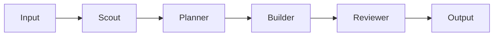

#### Implementation Template

```python
class PipelineOrchestrator:
    """
    Execute agents in sequential pipeline
    Plan → Build → Test → Review → Deploy
    """

    def __init__(self):
        self.stages = []
        self.orchestrator = OrchestratorAgent()

    def add_stage(self, name: str, agent_type: str, config: dict):
        """Add stage to pipeline"""
        self.stages.append({
            "name": name,
            "agent_type": agent_type,
            "config": config,
            "agent": None,
            "result": None
        })

    async def execute(self, input_data: any):
        """Execute pipeline sequentially"""

        current_data = input_data

        for stage in self.stages:
            # Create agent for this stage
            stage["agent"] = await self.orchestrator.create_agent(
                name=f"{stage['name']}_agent",
                template=stage["agent_type"],
                config=stage["config"]
            )

            # Execute stage
            try:
                stage["result"] = await stage["agent"].execute(current_data)
                current_data = stage["result"]

                # Log progress
                await self.orchestrator.log_progress(
                    f"Stage {stage['name']} completed"
                )

            except Exception as e:
                await self.handle_stage_failure(stage, e)
                raise

            finally:
                # Clean up agent
                await self.orchestrator.delete_agent(stage["agent"])

        return current_data

    async def handle_stage_failure(self, stage: dict, error: Exception):
        """Handle pipeline stage failure"""
        await self.orchestrator.log_error(
            f"Stage {stage['name']} failed: {error}"
        )
        # Implement retry logic or fallback
```

#### Use Cases
- **Software Development**: Requirements → Design → Implementation → Testing → Deployment
- **Content Creation**: Research → Outline → Write → Edit → Publish
- **Data Processing**: Extract → Transform → Validate → Load

#### Trade-offs
✅ **Pros**:
- Simple to understand and debug
- Clear data flow
- Easy error handling per stage

❌ **Cons**:
- No parallelization
- Bottlenecked by slowest stage
- Entire pipeline fails if one stage fails

#### Real Example
```python
# From multi-agent-orchestration codebase
async def software_pipeline(requirement: str):
    pipeline = PipelineOrchestrator()

    pipeline.add_stage("analyze", "scout", {
        "focus": "requirement_analysis"
    })
    pipeline.add_stage("design", "architect", {
        "patterns": ["mvc", "repository", "service"]
    })
    pipeline.add_stage("implement", "builder", {
        "language": "python",
        "framework": "fastapi"
    })
    pipeline.add_stage("test", "tester", {
        "coverage_target": 80
    })
    pipeline.add_stage("document", "documenter", {
        "format": "markdown"
    })

    result = await pipeline.execute(requirement)
    return result
```

---

### Waterfall with Validation Gates

**Description**: Sequential execution with validation checkpoints between stages.

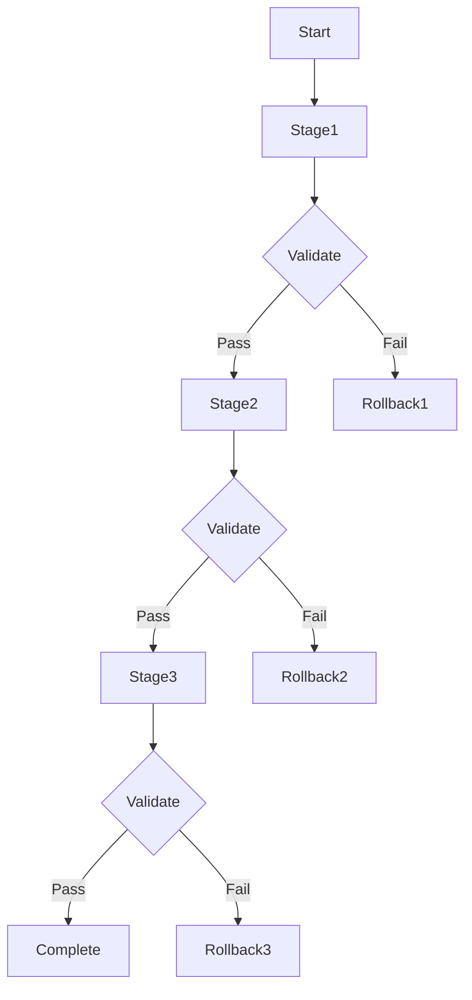

#### Implementation Template

```python
class WaterfallWithGates:
    """
    Sequential execution with validation gates
    """

    def __init__(self):
        self.stages = []
        self.validators = {}
        self.checkpoints = {}

    def add_stage_with_gate(
        self,
        stage_name: str,
        agent_config: dict,
        validation_fn: callable
    ):
        """Add stage with validation gate"""
        self.stages.append(stage_name)
        self.validators[stage_name] = validation_fn

    async def execute(self, initial_input: any):
        """Execute with validation gates"""

        current_state = initial_input

        for stage_name in self.stages:
            # Save checkpoint before stage
            self.checkpoints[stage_name] = current_state

            # Execute stage
            agent = await self.create_stage_agent(stage_name)
            result = await agent.execute(current_state)

            # Validate result
            validator = self.validators[stage_name]
            if await validator(result):
                current_state = result
                await self.log_success(stage_name)
            else:
                # Validation failed - rollback
                await self.rollback_to_checkpoint(stage_name)
                raise ValidationError(f"Stage {stage_name} failed validation")

            # Clean up agent
            await self.delete_agent(agent)

        return current_state

    async def rollback_to_checkpoint(self, stage_name: str):
        """Rollback to previous checkpoint"""
        if stage_name in self.checkpoints:
            return self.checkpoints[stage_name]
        return None
```

#### Use Cases
- **Deployment Pipelines**: Build → Test → Stage → Production (with rollback)
- **Financial Transactions**: Validate → Process → Confirm → Settle
- **Quality Assurance**: Code → Review → Test → Approve

#### Trade-offs
✅ **Pros**:
- Safe with rollback capability
- Quality gates ensure standards
- Clear audit trail

❌ **Cons**:
- Slower due to validation overhead
- Complex rollback logic
- Rigid flow

---

### Chain of Responsibility

**Description**: Request passes through chain of handlers until one handles it.

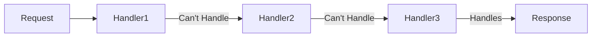

#### Implementation Template

```python
class ChainOfResponsibilityOrchestrator:
    """
    Pass request through chain until handled
    """

    def __init__(self):
        self.handlers = []

    def add_handler(self, agent_type: str, can_handle_fn: callable):
        """Add handler to chain"""
        self.handlers.append({
            "agent_type": agent_type,
            "can_handle": can_handle_fn
        })

    async def execute(self, request: dict):
        """Execute chain of responsibility"""

        for handler in self.handlers:
            # Check if this handler can process
            if await handler["can_handle"](request):
                # Create specialized agent
                agent = await self.create_agent(
                    handler["agent_type"]
                )

                try:
                    result = await agent.execute(request)
                    return result
                finally:
                    await self.delete_agent(agent)

        # No handler could process
        raise NoHandlerError(f"No handler for request: {request}")

# Example usage
async def handle_customer_issue(issue: dict):
    chain = ChainOfResponsibilityOrchestrator()

    chain.add_handler(
        "billing_agent",
        lambda r: r["type"] == "billing"
    )
    chain.add_handler(
        "technical_agent",
        lambda r: r["type"] == "technical"
    )
    chain.add_handler(
        "general_agent",
        lambda r: True  # Handles everything else
    )

    return await chain.execute(issue)
```

---

## ⚡ Parallel Patterns

### Fork-Join Pattern

**Description**: Split work into parallel tasks, execute simultaneously, then merge results.

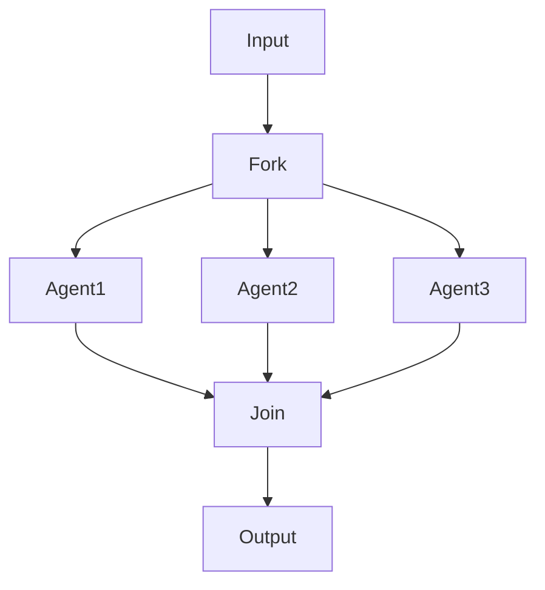

#### Implementation Template

```python
class ForkJoinOrchestrator:
    """
    Fork work to multiple agents, join results
    """

    def __init__(self):
        self.orchestrator = OrchestratorAgent()

    async def execute(
        self,
        input_data: any,
        agent_configs: list,
        join_fn: callable = None
    ):
        """Execute fork-join pattern"""

        # Fork: Create agents
        agents = []
        for config in agent_configs:
            agent = await self.orchestrator.create_agent(
                name=config["name"],
                type=config["type"],
                prompt=config.get("prompt")
            )
            agents.append(agent)

        # Execute in parallel
        tasks = [
            agent.execute(input_data) for agent in agents
        ]
        results = await asyncio.gather(*tasks)

        # Clean up agents
        cleanup_tasks = [
            self.orchestrator.delete_agent(agent)
            for agent in agents
        ]
        await asyncio.gather(*cleanup_tasks)

        # Join results
        if join_fn:
            return await join_fn(results)
        else:
            return self.default_join(results)

    def default_join(self, results: list):
        """Default join strategy - merge all results"""
        merged = {}
        for result in results:
            if isinstance(result, dict):
                merged.update(result)
            else:
                merged[f"result_{len(merged)}"] = result
        return merged

# Example: Parallel analysis
async def analyze_codebase_parallel(codebase_path: str):
    orchestrator = ForkJoinOrchestrator()

    agent_configs = [
        {
            "name": "security_analyzer",
            "type": "analyzer",
            "prompt": "Analyze security vulnerabilities"
        },
        {
            "name": "performance_analyzer",
            "type": "analyzer",
            "prompt": "Analyze performance bottlenecks"
        },
        {
            "name": "quality_analyzer",
            "type": "analyzer",
            "prompt": "Analyze code quality issues"
        }
    ]

    def combine_analyses(results):
        return {
            "security": results[0],
            "performance": results[1],
            "quality": results[2],
            "overall_score": calculate_score(results)
        }

    return await orchestrator.execute(
        codebase_path,
        agent_configs,
        combine_analyses
    )
```

#### Use Cases
- **Parallel Testing**: Run multiple test suites simultaneously
- **Multi-perspective Analysis**: Security, performance, quality in parallel
- **Document Generation**: Create multiple sections concurrently

#### Trade-offs
✅ **Pros**:
- Massive speedup through parallelization
- Efficient use of resources
- Simple conceptual model

❌ **Cons**:
- Requires independent tasks
- Complex result merging
- All tasks must complete

---

### Map-Reduce Pattern

**Description**: Map operation across data, then reduce to final result.

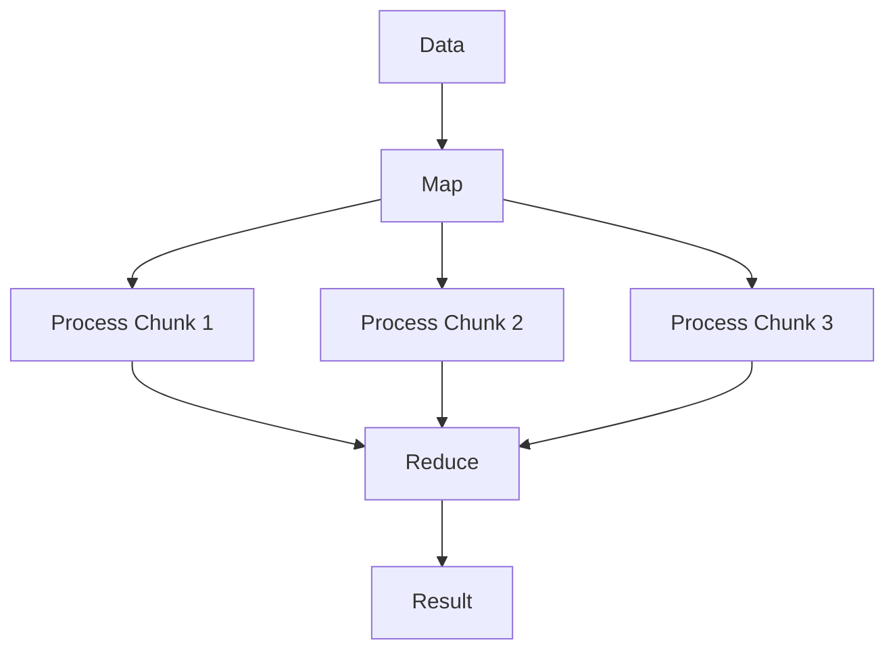

#### Implementation Template

```python
class MapReduceOrchestrator:
    """
    Map-Reduce pattern for data processing
    """

    def __init__(self, chunk_size: int = 100):
        self.chunk_size = chunk_size
        self.orchestrator = OrchestratorAgent()

    async def execute(
        self,
        data: list,
        map_fn: str,  # Agent task for mapping
        reduce_fn: callable  # Function to reduce results
    ):
        """Execute map-reduce pattern"""

        # Chunk data for mapping
        chunks = self.create_chunks(data, self.chunk_size)

        # Map phase: Process chunks in parallel
        map_agents = []
        for i, chunk in enumerate(chunks):
            agent = await self.orchestrator.create_agent(
                name=f"mapper_{i}",
                type="processor"
            )
            map_agents.append(agent)

        # Execute map operations in parallel
        map_tasks = [
            agent.execute(map_fn, chunk)
            for agent, chunk in zip(map_agents, chunks)
        ]
        map_results = await asyncio.gather(*map_tasks)

        # Clean up map agents
        for agent in map_agents:
            await self.orchestrator.delete_agent(agent)

        # Reduce phase: Combine results
        reducer = await self.orchestrator.create_agent(
            name="reducer",
            type="aggregator"
        )

        final_result = await reducer.execute(
            reduce_fn, map_results
        )

        await self.orchestrator.delete_agent(reducer)

        return final_result

    def create_chunks(self, data: list, size: int):
        """Split data into chunks"""
        return [data[i:i + size] for i in range(0, len(data), size)]

# Example: Process large dataset
async def analyze_logs_map_reduce(log_files: list):
    orchestrator = MapReduceOrchestrator(chunk_size=10)

    map_task = "Extract errors and warnings from logs"

    def reduce_results(results):
        """Aggregate error counts"""
        total_errors = 0
        total_warnings = 0

        for result in results:
            total_errors += result.get("errors", 0)
            total_warnings += result.get("warnings", 0)

        return {
            "total_errors": total_errors,
            "total_warnings": total_warnings,
            "critical_issues": identify_critical(results)
        }

    return await orchestrator.execute(
        log_files,
        map_task,
        reduce_results
    )
```

---

### Todone Board Pattern

**Description**: All tasks on a board, agents pull work as they're ready.

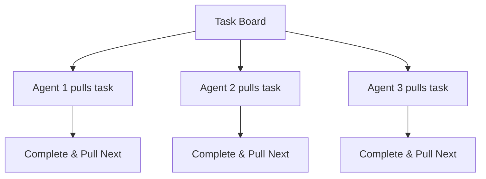

#### Implementation Template

```python
class TodoneBoardOrchestrator:
    """
    Todone board pattern for massive parallelization
    """

    def __init__(self, max_agents: int = 10):
        self.max_agents = max_agents
        self.task_board = asyncio.Queue()
        self.results = []
        self.active_agents = []

    async def load_board(self, tasks: list):
        """Load tasks onto board"""
        for task in tasks:
            await self.task_board.put(task)

    async def execute(self):
        """Execute Todone pattern"""

        # Determine optimal agent count
        task_count = self.task_board.qsize()
        agent_count = min(task_count, self.max_agents)

        # Spawn worker agents
        workers = []
        for i in range(agent_count):
            worker = asyncio.create_task(
                self.worker_loop(f"worker_{i}")
            )
            workers.append(worker)

        # Add sentinel values to stop workers
        for _ in range(agent_count):
            await self.task_board.put(None)

        # Wait for all workers to complete
        await asyncio.gather(*workers)

        return self.results

    async def worker_loop(self, worker_id: str):
        """Worker agent loop"""

        # Create agent
        agent = await self.create_worker_agent(worker_id)
        self.active_agents.append(agent)

        try:
            while True:
                # Pull task from board
                task = await self.task_board.get()

                # Sentinel value signals end
                if task is None:
                    break

                # Execute task
                result = await agent.execute(task)
                self.results.append({
                    "task": task,
                    "result": result,
                    "worker": worker_id
                })

        finally:
            # Clean up agent
            await self.delete_agent(agent)
            self.active_agents.remove(agent)

# Example: Build multiple files in parallel
async def parallel_file_build(file_specs: list):
    todone = TodoneBoardOrchestrator(max_agents=5)

    tasks = [
        {
            "type": "build_file",
            "path": spec["path"],
            "content": spec["template"]
        }
        for spec in file_specs
    ]

    await todone.load_board(tasks)
    results = await todone.execute()

    return {
        "files_created": len(results),
        "results": results
    }
```

---

### Scatter-Gather Pattern

**Description**: Scatter requests to multiple agents, gather first/best response.

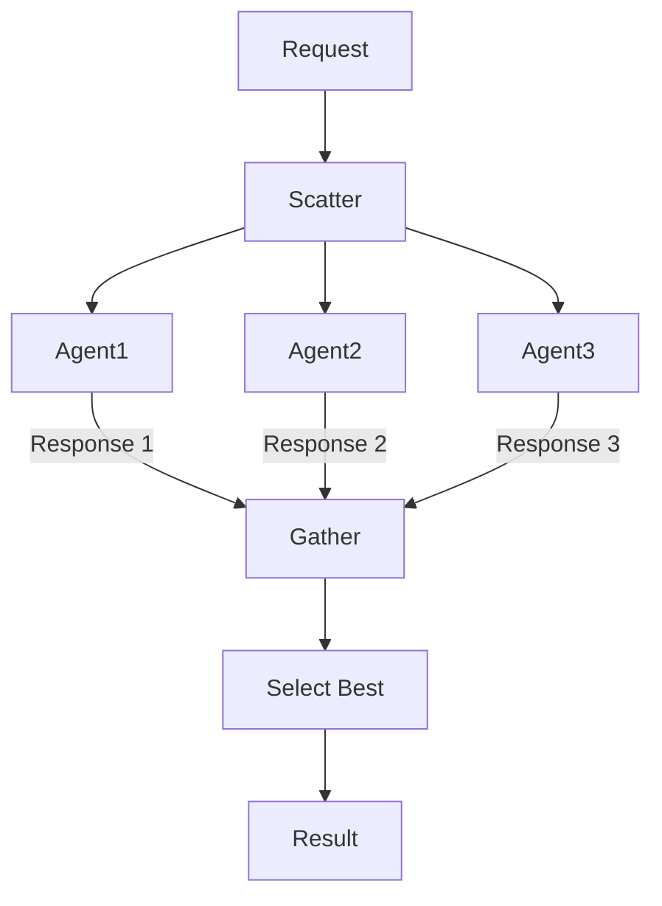

#### Implementation Template

```python
class ScatterGatherOrchestrator:
    """
    Scatter to multiple agents, gather results
    """

    def __init__(self, selection_strategy: str = "first"):
        self.selection_strategy = selection_strategy
        self.orchestrator = OrchestratorAgent()

    async def execute(
        self,
        request: dict,
        agent_configs: list,
        timeout: float = 30.0
    ):
        """Execute scatter-gather pattern"""

        # Scatter: Create multiple agents
        agents = []
        for config in agent_configs:
            agent = await self.orchestrator.create_agent(**config)
            agents.append(agent)

        # Create tasks with timeout
        tasks = []
        for agent in agents:
            task = asyncio.create_task(
                self.execute_with_timeout(agent, request, timeout)
            )
            tasks.append(task)

        # Gather based on strategy
        if self.selection_strategy == "first":
            # Return first successful response
            result = await self.race_to_first(tasks)

        elif self.selection_strategy == "best":
            # Wait for all and select best
            results = await asyncio.gather(*tasks, return_exceptions=True)
            result = await self.select_best(results)

        elif self.selection_strategy == "consensus":
            # Wait for consensus among agents
            results = await asyncio.gather(*tasks, return_exceptions=True)
            result = await self.find_consensus(results)

        # Clean up all agents
        for agent in agents:
            await self.orchestrator.delete_agent(agent)

        return result

    async def race_to_first(self, tasks: list):
        """Return first successful result"""
        done, pending = await asyncio.wait(
            tasks,
            return_when=asyncio.FIRST_COMPLETED
        )

        # Cancel pending tasks
        for task in pending:
            task.cancel()

        # Return first result
        for task in done:
            if not task.exception():
                return task.result()

        raise Exception("All agents failed")

    async def select_best(self, results: list):
        """Select best result based on quality metrics"""
        valid_results = [
            r for r in results
            if not isinstance(r, Exception)
        ]

        if not valid_results:
            raise Exception("No valid results")

        # Score each result
        scored = [
            (r, self.score_result(r))
            for r in valid_results
        ]

        # Return highest scoring
        scored.sort(key=lambda x: x[1], reverse=True)
        return scored[0][0]
```

---

## 🏢 Hierarchical Patterns

### Supervisor-Worker Pattern

**Description**: Supervisor manages pool of workers, assigns tasks, monitors progress.

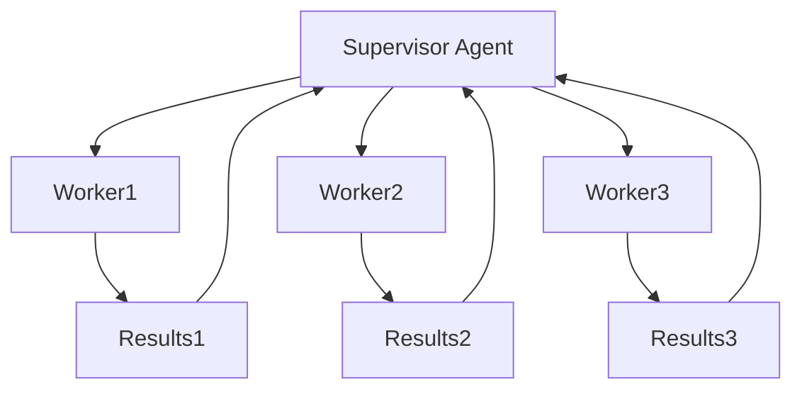

#### Implementation Template

```python
class SupervisorWorkerOrchestrator:
    """
    Supervisor manages worker pool
    """

    def __init__(self, worker_count: int = 5):
        self.worker_count = worker_count
        self.supervisor = None
        self.workers = []
        self.task_queue = asyncio.Queue()
        self.result_queue = asyncio.Queue()

    async def initialize(self):
        """Initialize supervisor and workers"""

        # Create supervisor agent
        self.supervisor = await self.create_agent(
            name="supervisor",
            system_prompt="""
            You are a supervisor agent. Your role is to:
            1. Decompose work into tasks
            2. Assign tasks to workers
            3. Monitor progress
            4. Handle failures
            5. Aggregate results
            """
        )

        # Create worker pool
        for i in range(self.worker_count):
            worker = await self.create_agent(
                name=f"worker_{i}",
                system_prompt="You are a worker. Execute assigned tasks."
            )
            self.workers.append(worker)

    async def execute(self, job: dict):
        """Execute job with supervisor-worker pattern"""

        await self.initialize()

        try:
            # Supervisor decomposes job
            tasks = await self.supervisor.decompose_job(job)

            # Load tasks into queue
            for task in tasks:
                await self.task_queue.put(task)

            # Start worker loops
            worker_tasks = [
                self.worker_loop(worker)
                for worker in self.workers
            ]

            # Supervisor monitors progress
            monitor_task = asyncio.create_task(
                self.supervisor_monitor()
            )

            # Wait for completion
            await self.task_queue.join()

            # Stop workers
            for _ in self.workers:
                await self.task_queue.put(None)

            await asyncio.gather(*worker_tasks)
            monitor_task.cancel()

            # Supervisor aggregates results
            results = []
            while not self.result_queue.empty():
                results.append(await self.result_queue.get())

            final_result = await self.supervisor.aggregate_results(results)

            return final_result

        finally:
            await self.cleanup()

    async def worker_loop(self, worker):
        """Worker execution loop"""
        while True:
            task = await self.task_queue.get()

            if task is None:
                break

            try:
                result = await worker.execute(task)
                await self.result_queue.put({
                    "task": task,
                    "result": result,
                    "worker": worker.name
                })
            except Exception as e:
                await self.result_queue.put({
                    "task": task,
                    "error": str(e),
                    "worker": worker.name
                })
            finally:
                self.task_queue.task_done()

    async def supervisor_monitor(self):
        """Supervisor monitors progress"""
        while True:
            await asyncio.sleep(5)

            progress = {
                "pending": self.task_queue.qsize(),
                "completed": self.result_queue.qsize(),
                "workers_active": len(self.workers)
            }

            await self.supervisor.log_progress(progress)
```

---

### Coordinator-Specialist Pattern

**Description**: Coordinator routes work to specialized agents based on expertise.

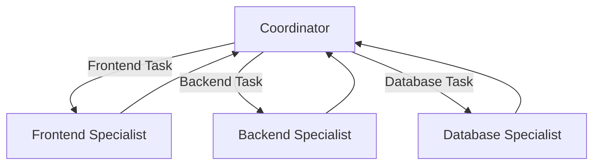

#### Implementation Template

```python
class CoordinatorSpecialistOrchestrator:
    """
    Coordinator routes to specialists
    """

    def __init__(self):
        self.coordinator = None
        self.specialists = {}

    async def initialize(self):
        """Initialize coordinator and specialists"""

        # Create coordinator
        self.coordinator = await self.create_agent(
            name="coordinator",
            system_prompt="""
            You coordinate specialist agents.
            Analyze tasks and route to appropriate specialists.
            """
        )

        # Create specialists
        specialist_configs = {
            "frontend": "Expert in React, Vue, UI/UX",
            "backend": "Expert in APIs, services, architecture",
            "database": "Expert in SQL, optimization, schema design",
            "security": "Expert in vulnerabilities, authentication",
            "devops": "Expert in CI/CD, deployment, infrastructure"
        }

        for specialty, expertise in specialist_configs.items():
            self.specialists[specialty] = await self.create_agent(
                name=f"{specialty}_specialist",
                system_prompt=f"You are a {specialty} specialist. {expertise}"
            )

    async def execute(self, requirements: list):
        """Execute with coordinator-specialist pattern"""

        await self.initialize()

        results = {}

        for requirement in requirements:
            # Coordinator analyzes requirement
            analysis = await self.coordinator.analyze(requirement)

            # Route to appropriate specialist(s)
            if analysis["needs_multiple"]:
                # Multiple specialists needed
                specialist_tasks = []
                for specialty in analysis["specialties"]:
                    specialist = self.specialists[specialty]
                    task = specialist.execute(requirement)
                    specialist_tasks.append(task)

                specialist_results = await asyncio.gather(*specialist_tasks)

                # Coordinator integrates results
                integrated = await self.coordinator.integrate(
                    requirement,
                    specialist_results
                )
                results[requirement["id"]] = integrated

            else:
                # Single specialist
                specialty = analysis["specialty"]
                specialist = self.specialists[specialty]
                result = await specialist.execute(requirement)
                results[requirement["id"]] = result

        return results

# Example usage
async def build_full_stack_app(specs: dict):
    orchestrator = CoordinatorSpecialistOrchestrator()

    requirements = [
        {"id": "auth", "type": "feature", "description": "User authentication"},
        {"id": "api", "type": "backend", "description": "REST API"},
        {"id": "ui", "type": "frontend", "description": "Dashboard UI"},
        {"id": "db", "type": "database", "description": "Schema design"}
    ]

    return await orchestrator.execute(requirements)
```

---

## 🔄 Adaptive Patterns

### Dynamic Agent Spawning

**Description**: Spawn agents dynamically based on workload.

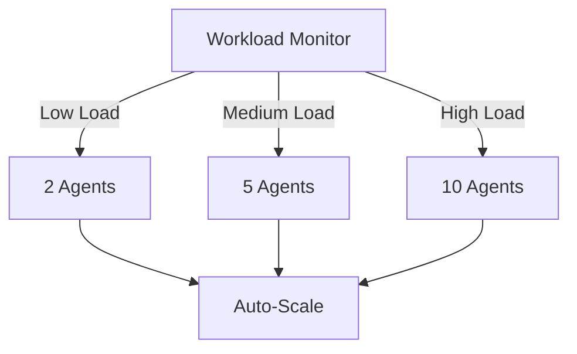

#### Implementation Template

```python
class DynamicSpawningOrchestrator:
    """
    Dynamically spawn agents based on workload
    """

    def __init__(
        self,
        min_agents: int = 1,
        max_agents: int = 10,
        scale_threshold: float = 0.8
    ):
        self.min_agents = min_agents
        self.max_agents = max_agents
        self.scale_threshold = scale_threshold
        self.agents = []
        self.workload_queue = asyncio.Queue()
        self.metrics = {
            "queue_size": 0,
            "processing_rate": 0,
            "avg_task_time": 0
        }

    async def execute(self, initial_tasks: list):
        """Execute with dynamic spawning"""

        # Load initial tasks
        for task in initial_tasks:
            await self.workload_queue.put(task)

        # Start with minimum agents
        await self.spawn_agents(self.min_agents)

        # Start monitoring and scaling
        monitor_task = asyncio.create_task(self.monitor_and_scale())

        # Process until done
        await self.workload_queue.join()

        # Cleanup
        monitor_task.cancel()
        await self.cleanup_agents()

    async def monitor_and_scale(self):
        """Monitor workload and scale agents"""

        while True:
            await asyncio.sleep(5)

            # Calculate metrics
            self.metrics["queue_size"] = self.workload_queue.qsize()
            utilization = self.calculate_utilization()

            current_count = len(self.agents)

            if utilization > self.scale_threshold:
                # Scale up
                if current_count < self.max_agents:
                    new_agents = min(
                        current_count * 2,
                        self.max_agents
                    ) - current_count
                    await self.spawn_agents(new_agents)
                    print(f"Scaled up to {len(self.agents)} agents")

            elif utilization < self.scale_threshold * 0.5:
                # Scale down
                if current_count > self.min_agents:
                    remove_count = max(
                        1,
                        (current_count - self.min_agents) // 2
                    )
                    await self.remove_agents(remove_count)
                    print(f"Scaled down to {len(self.agents)} agents")

    async def spawn_agents(self, count: int):
        """Spawn new agents"""
        for i in range(count):
            agent_id = f"agent_{len(self.agents)}"
            agent = await self.create_agent(agent_id)
            self.agents.append(agent)

            # Start agent work loop
            asyncio.create_task(
                self.agent_work_loop(agent)
            )

    async def agent_work_loop(self, agent):
        """Agent work loop"""
        while agent in self.agents:
            try:
                task = await asyncio.wait_for(
                    self.workload_queue.get(),
                    timeout=10
                )

                start_time = time.time()
                await agent.execute(task)
                task_time = time.time() - start_time

                # Update metrics
                self.update_metrics(task_time)

                self.workload_queue.task_done()

            except asyncio.TimeoutError:
                # No work available
                continue
            except Exception as e:
                print(f"Agent {agent.name} error: {e}")
```

---

### Load Balancing Pattern

**Description**: Distribute work evenly across available agents.

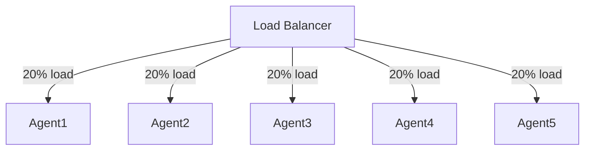

#### Implementation Template

```python
class LoadBalancingOrchestrator:
    """
    Balance work across agents
    """

    def __init__(self, agent_count: int = 5):
        self.agent_count = agent_count
        self.agents = {}
        self.agent_loads = {}
        self.strategy = "least_loaded"  # round_robin, least_loaded, weighted

    async def initialize(self):
        """Initialize agent pool"""
        for i in range(self.agent_count):
            agent = await self.create_agent(f"worker_{i}")
            self.agents[agent.id] = agent
            self.agent_loads[agent.id] = 0

    async def execute(self, tasks: list):
        """Execute with load balancing"""

        await self.initialize()

        results = []

        for task in tasks:
            # Select agent based on strategy
            agent = await self.select_agent(task)

            # Update load
            self.agent_loads[agent.id] += self.estimate_load(task)

            # Execute task
            result = await agent.execute(task)
            results.append(result)

            # Update load
            self.agent_loads[agent.id] -= self.estimate_load(task)

        return results

    async def select_agent(self, task: dict):
        """Select agent based on load balancing strategy"""

        if self.strategy == "least_loaded":
            # Find least loaded agent
            agent_id = min(
                self.agent_loads,
                key=self.agent_loads.get
            )
            return self.agents[agent_id]

        elif self.strategy == "round_robin":
            # Simple round robin
            agent_ids = list(self.agents.keys())
            index = hash(task) % len(agent_ids)
            return self.agents[agent_ids[index]]

        elif self.strategy == "weighted":
            # Weighted by agent capabilities
            weights = self.calculate_weights(task)
            agent_id = self.weighted_random_choice(weights)
            return self.agents[agent_id]

    def estimate_load(self, task: dict):
        """Estimate task load"""
        # Simple estimation based on task type
        load_map = {
            "simple": 1,
            "moderate": 5,
            "complex": 10,
            "heavy": 20
        }
        return load_map.get(task.get("complexity", "moderate"), 5)
```

---

### Self-Healing Workflows

**Description**: Automatically detect and recover from failures.

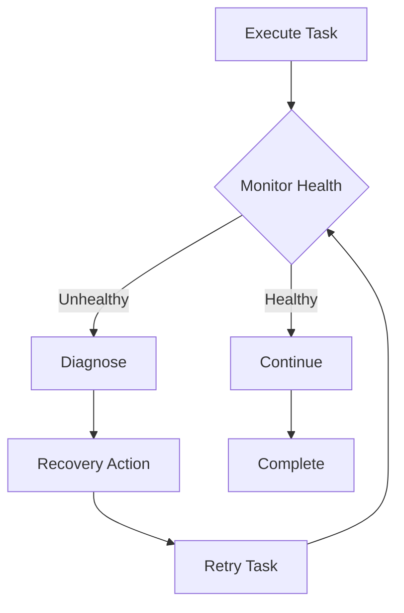

#### Implementation Template

```python
class SelfHealingOrchestrator:
    """
    Self-healing workflow orchestration
    """

    def __init__(self):
        self.health_checks = {}
        self.recovery_strategies = {}
        self.failure_history = []

    def register_health_check(
        self,
        name: str,
        check_fn: callable,
        recovery_fn: callable
    ):
        """Register health check and recovery"""
        self.health_checks[name] = check_fn
        self.recovery_strategies[name] = recovery_fn

    async def execute_with_healing(
        self,
        task: dict,
        agent: Agent,
        max_retries: int = 3
    ):
        """Execute with self-healing"""

        retry_count = 0

        while retry_count < max_retries:
            try:
                # Execute task
                result = await agent.execute(task)

                # Health checks
                for check_name, check_fn in self.health_checks.items():
                    if not await check_fn(result, agent):
                        # Health check failed
                        await self.handle_health_failure(
                            check_name,
                            agent,
                            task,
                            result
                        )
                        retry_count += 1
                        continue

                # All checks passed
                return result

            except Exception as e:
                # Execution failed
                await self.handle_execution_failure(
                    e,
                    agent,
                    task
                )
                retry_count += 1

                if retry_count >= max_retries:
                    raise

                # Apply recovery
                await self.recover_agent(agent, e)

        raise MaxRetriesError(f"Failed after {max_retries} attempts")

    async def handle_health_failure(
        self,
        check_name: str,
        agent: Agent,
        task: dict,
        result: any
    ):
        """Handle health check failure"""

        self.failure_history.append({
            "timestamp": datetime.now(),
            "check": check_name,
            "agent": agent.id,
            "task": task
        })

        # Apply recovery strategy
        recovery_fn = self.recovery_strategies.get(check_name)
        if recovery_fn:
            await recovery_fn(agent, task, result)

    async def recover_agent(self, agent: Agent, error: Exception):
        """Recover agent from error"""

        if isinstance(error, ContextWindowError):
            # Reduce context
            await agent.clear_context()
            await agent.reload_minimal_context()

        elif isinstance(error, RateLimitError):
            # Wait and retry
            await asyncio.sleep(30)

        elif isinstance(error, ModelError):
            # Switch to fallback model
            await agent.switch_model("claude-haiku")

        else:
            # Generic recovery - reset agent
            await agent.reset()

# Example usage
async def self_healing_build(specs: dict):
    orchestrator = SelfHealingOrchestrator()

    # Register health checks
    orchestrator.register_health_check(
        "syntax_valid",
        lambda r, a: validate_syntax(r),
        lambda a, t, r: fix_syntax_errors(a, t, r)
    )

    orchestrator.register_health_check(
        "tests_pass",
        lambda r, a: run_tests(r),
        lambda a, t, r: fix_failing_tests(a, t, r)
    )

    agent = await create_agent("builder")
    result = await orchestrator.execute_with_healing(
        specs,
        agent,
        max_retries=3
    )

    return result
```

---

## 🔀 Hybrid Patterns

### Scout-Plan-Build-Review

**Description**: Complete SDLC workflow combining sequential and parallel patterns.

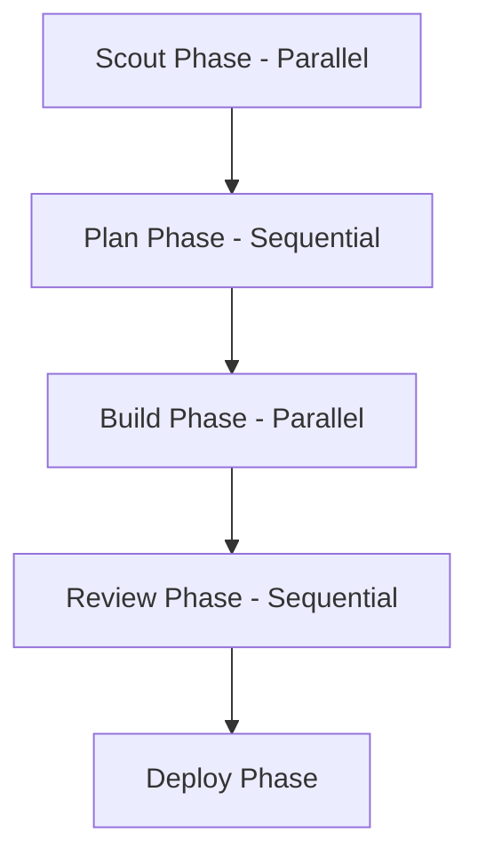

#### Implementation Template

```python
class ScoutPlanBuildReviewOrchestrator:
    """
    Complete SDLC orchestration pattern
    """

    def __init__(self):
        self.orchestrator = OrchestratorAgent()
        self.phases = {}

    async def execute(self, requirement: str):
        """Execute complete SDLC workflow"""

        # Phase 1: Scout (Parallel)
        print("Phase 1: Scouting...")
        scout_results = await self.scout_phase(requirement)
        self.phases["scout"] = scout_results

        # Phase 2: Plan (Sequential)
        print("Phase 2: Planning...")
        plan = await self.plan_phase(scout_results)
        self.phases["plan"] = plan

        # Phase 3: Build (Parallel)
        print("Phase 3: Building...")
        build_results = await self.build_phase(plan)
        self.phases["build"] = build_results

        # Phase 4: Review (Sequential)
        print("Phase 4: Reviewing...")
        review = await self.review_phase(build_results)
        self.phases["review"] = review

        # Phase 5: Deploy (Sequential)
        if review["approved"]:
            print("Phase 5: Deploying...")
            deployment = await self.deploy_phase(build_results)
            self.phases["deploy"] = deployment

        return self.phases

    async def scout_phase(self, requirement: str):
        """Parallel investigation"""

        # Create scout agents
        scouts = {
            "technical": await self.orchestrator.create_agent(
                "technical_scout",
                "Investigate technical requirements"
            ),
            "business": await self.orchestrator.create_agent(
                "business_scout",
                "Investigate business requirements"
            ),
            "security": await self.orchestrator.create_agent(
                "security_scout",
                "Investigate security requirements"
            )
        }

        # Execute in parallel
        scout_tasks = {
            name: agent.investigate(requirement)
            for name, agent in scouts.items()
        }

        results = {}
        for name, task in scout_tasks.items():
            results[name] = await task

        # Cleanup
        for agent in scouts.values():
            await self.orchestrator.delete_agent(agent)

        return results

    async def plan_phase(self, scout_results: dict):
        """Sequential planning"""

        planner = await self.orchestrator.create_agent(
            "planner",
            "Create detailed implementation plan"
        )

        plan = await planner.create_plan(scout_results)

        await self.orchestrator.delete_agent(planner)

        return plan

    async def build_phase(self, plan: dict):
        """Parallel building"""

        # Extract build tasks from plan
        build_tasks = plan["tasks"]

        # Create builder agents
        builders = []
        for i, task in enumerate(build_tasks):
            builder = await self.orchestrator.create_agent(
                f"builder_{i}",
                f"Build {task['component']}"
            )
            builders.append((builder, task))

        # Execute in parallel
        build_results = await asyncio.gather(*[
            builder.build(task)
            for builder, task in builders
        ])

        # Cleanup
        for builder, _ in builders:
            await self.orchestrator.delete_agent(builder)

        return build_results

    async def review_phase(self, build_results: list):
        """Sequential review"""

        reviewer = await self.orchestrator.create_agent(
            "reviewer",
            "Review and validate implementation"
        )

        review = await reviewer.review_all(build_results)

        await self.orchestrator.delete_agent(reviewer)

        return review

    async def deploy_phase(self, build_results: list):
        """Sequential deployment"""

        deployer = await self.orchestrator.create_agent(
            "deployer",
            "Deploy to production"
        )

        deployment = await deployer.deploy(build_results)

        await self.orchestrator.delete_agent(deployer)

        return deployment
```

---

### Parallel Pipeline

**Description**: Multiple pipelines executing in parallel.

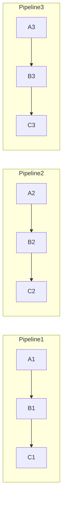

#### Implementation Template

```python
class ParallelPipelineOrchestrator:
    """
    Execute multiple pipelines in parallel
    """

    def __init__(self):
        self.pipelines = []

    def add_pipeline(self, name: str, stages: list):
        """Add pipeline configuration"""
        self.pipelines.append({
            "name": name,
            "stages": stages
        })

    async def execute(self, input_data: dict):
        """Execute all pipelines in parallel"""

        # Create pipeline tasks
        pipeline_tasks = []
        for pipeline in self.pipelines:
            task = self.execute_pipeline(
                pipeline,
                input_data.get(pipeline["name"], input_data)
            )
            pipeline_tasks.append(task)

        # Execute pipelines in parallel
        results = await asyncio.gather(*pipeline_tasks)

        # Combine results
        combined = {}
        for pipeline, result in zip(self.pipelines, results):
            combined[pipeline["name"]] = result

        return combined

    async def execute_pipeline(self, pipeline: dict, input_data: any):
        """Execute single pipeline"""

        current_data = input_data

        for stage in pipeline["stages"]:
            agent = await self.create_agent(
                f"{pipeline['name']}_{stage['name']}"
            )

            current_data = await agent.execute(
                stage["task"],
                current_data
            )

            await self.delete_agent(agent)

        return current_data

# Example: Process multiple data formats
async def multi_format_processing(data: dict):
    orchestrator = ParallelPipelineOrchestrator()

    orchestrator.add_pipeline("json", [
        {"name": "parse", "task": "Parse JSON"},
        {"name": "validate", "task": "Validate schema"},
        {"name": "transform", "task": "Transform to internal format"}
    ])

    orchestrator.add_pipeline("xml", [
        {"name": "parse", "task": "Parse XML"},
        {"name": "validate", "task": "Validate DTD"},
        {"name": "transform", "task": "Transform to internal format"}
    ])

    orchestrator.add_pipeline("csv", [
        {"name": "parse", "task": "Parse CSV"},
        {"name": "validate", "task": "Validate columns"},
        {"name": "transform", "task": "Transform to internal format"}
    ])

    results = await orchestrator.execute(data)
    return results
```

---

### Recursive Orchestration

**Description**: Orchestrators creating and managing sub-orchestrators.

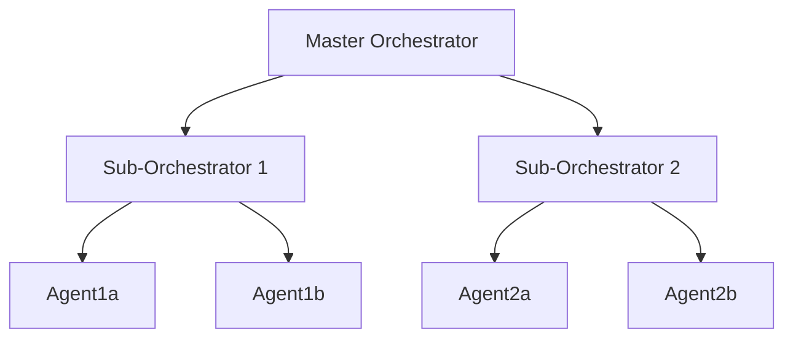

#### Implementation Template

```python
class RecursiveOrchestrationPattern:
    """
    Orchestrators managing orchestrators
    """

    def __init__(self, max_depth: int = 3):
        self.max_depth = max_depth

    async def execute(
        self,
        task: dict,
        depth: int = 0
    ):
        """Execute with recursive orchestration"""

        if depth >= self.max_depth:
            # Max depth reached - execute directly
            agent = await self.create_agent("worker")
            result = await agent.execute(task)
            await self.delete_agent(agent)
            return result

        # Analyze task complexity
        complexity = self.analyze_complexity(task)

        if complexity["needs_orchestration"]:
            # Create sub-orchestrator
            sub_orchestrator = await self.create_sub_orchestrator(
                f"level_{depth}_orchestrator"
            )

            # Decompose task
            subtasks = await sub_orchestrator.decompose(task)

            # Execute subtasks (potentially recursive)
            results = []
            for subtask in subtasks:
                result = await self.execute(
                    subtask,
                    depth + 1
                )
                results.append(result)

            # Aggregate results
            final = await sub_orchestrator.aggregate(results)

            await self.delete_orchestrator(sub_orchestrator)

            return final
        else:
            # Simple task - execute directly
            agent = await self.create_agent(f"worker_level_{depth}")
            result = await agent.execute(task)
            await self.delete_agent(agent)
            return result

    async def create_sub_orchestrator(self, name: str):
        """Create a sub-orchestrator"""
        return await OrchestratorAgent(
            name=name,
            system_prompt=f"""
            You are a sub-orchestrator at recursion level.
            Manage your assigned domain and coordinate agents.
            """
        )

    def analyze_complexity(self, task: dict):
        """Determine if task needs orchestration"""

        # Simple heuristics
        if task.get("subtask_count", 0) > 3:
            return {"needs_orchestration": True}

        if task.get("complexity", "simple") in ["complex", "very_complex"]:
            return {"needs_orchestration": True}

        return {"needs_orchestration": False}
```

---

### Swarm Intelligence

**Description**: Many simple agents exhibiting emergent intelligent behavior.

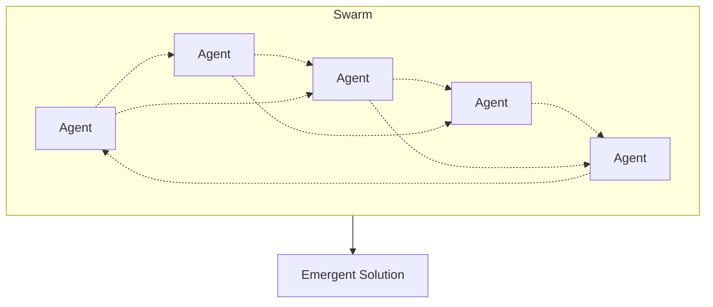

#### Implementation Template

```python
class SwarmIntelligenceOrchestrator:
    """
    Swarm of simple agents with emergent behavior
    """

    def __init__(self, swarm_size: int = 20):
        self.swarm_size = swarm_size
        self.agents = []
        self.pheromone_map = {}  # Shared communication medium
        self.best_solution = None

    async def execute(
        self,
        problem: dict,
        iterations: int = 10
    ):
        """Execute swarm intelligence pattern"""

        # Initialize swarm
        await self.initialize_swarm()

        # Run iterations
        for iteration in range(iterations):
            print(f"Swarm iteration {iteration + 1}/{iterations}")

            # Each agent explores
            explorations = await asyncio.gather(*[
                self.agent_explore(agent, problem)
                for agent in self.agents
            ])

            # Update pheromone map
            self.update_pheromones(explorations)

            # Share best solutions
            await self.share_knowledge()

            # Check for convergence
            if self.has_converged():
                print(f"Swarm converged at iteration {iteration + 1}")
                break

        return self.best_solution

    async def initialize_swarm(self):
        """Initialize swarm agents"""

        for i in range(self.swarm_size):
            agent = await self.create_agent(
                f"swarm_agent_{i}",
                system_prompt="""
                You are a swarm agent. Explore solutions and
                communicate with other agents through pheromones.
                """
            )
            self.agents.append(agent)

    async def agent_explore(self, agent: Agent, problem: dict):
        """Single agent exploration"""

        # Get pheromone guidance
        guidance = self.get_pheromone_guidance(agent.id)

        # Explore with guidance
        solution = await agent.explore(problem, guidance)

        # Update best if better
        if self.is_better(solution, self.best_solution):
            self.best_solution = solution

        return {
            "agent": agent.id,
            "solution": solution,
            "quality": self.evaluate_solution(solution)
        }

    def update_pheromones(self, explorations: list):
        """Update pheromone trails based on solutions"""

        # Evaporate old pheromones
        for key in self.pheromone_map:
            self.pheromone_map[key] *= 0.9

        # Add new pheromones
        for exploration in explorations:
            quality = exploration["quality"]
            solution_path = exploration["solution"]["path"]

            for step in solution_path:
                key = str(step)
                self.pheromone_map[key] = self.pheromone_map.get(key, 0) + quality

    async def share_knowledge(self):
        """Share best solutions among swarm"""

        # Broadcast best solution to random subset
        share_count = self.swarm_size // 5
        selected = random.sample(self.agents, share_count)

        for agent in selected:
            await agent.receive_knowledge(self.best_solution)

    def has_converged(self):
        """Check if swarm has converged on solution"""

        # Simple convergence check
        if not self.best_solution:
            return False

        # Check if pheromone map is stable
        max_pheromone = max(self.pheromone_map.values())
        avg_pheromone = sum(self.pheromone_map.values()) / len(self.pheromone_map)

        return max_pheromone / avg_pheromone > 10  # Strong trail emerged
```

---

## 📊 Pattern Selection Guide

### Decision Matrix

| Pattern | Best For | Parallelism | Complexity | Overhead |
|---------|----------|-------------|------------|----------|
| **Pipeline** | Sequential workflows | None | Low | Low |
| **Waterfall with Gates** | Quality-critical flows | None | Medium | Medium |
| **Fork-Join** | Independent tasks | High | Low | Low |
| **Map-Reduce** | Data processing | High | Medium | Medium |
| **Todone Board** | Task queues | Very High | Medium | Low |
| **Scatter-Gather** | Redundancy/Speed | High | Low | High |
| **Supervisor-Worker** | Task distribution | High | Medium | Medium |
| **Coordinator-Specialist** | Domain expertise | Medium | High | Medium |
| **Dynamic Spawning** | Variable load | Variable | High | High |
| **Load Balancing** | Even distribution | High | Medium | Medium |
| **Self-Healing** | Reliability-critical | Medium | Very High | High |
| **Scout-Plan-Build-Review** | Complete SDLC | Mixed | Very High | High |
| **Recursive Orchestration** | Complex hierarchies | Variable | Very High | Very High |
| **Swarm Intelligence** | Optimization problems | Very High | Very High | High |

### Pattern Selection Flowchart

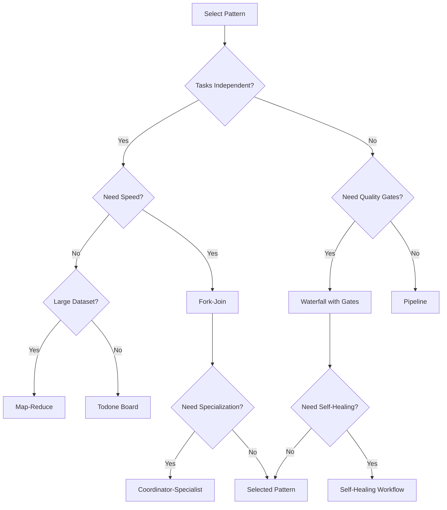

---

## 🎯 Implementation Best Practices

### 1. Start Simple
Always begin with the simplest pattern that could work:
```python
# Start with Pipeline
pipeline = PipelineOrchestrator()
# If too slow, upgrade to Fork-Join
# If needs specialization, add Coordinator-Specialist
```

### 2. Measure Everything
```python
class InstrumentedOrchestrator:
    async def execute(self, task):
        start = time.time()
        result = await super().execute(task)
        duration = time.time() - start

        self.metrics.record({
            "pattern": self.__class__.__name__,
            "duration": duration,
            "agents_used": len(self.agents),
            "tokens_consumed": self.total_tokens
        })

        return result
```

### 3. Handle Failures Gracefully
```python
async def execute_with_fallback(primary_pattern, fallback_pattern, task):
    try:
        return await primary_pattern.execute(task)
    except Exception as e:
        logger.warning(f"Primary pattern failed: {e}")
        return await fallback_pattern.execute(task)
```

### 4. Clean Up Resources
```python
async def execute_with_cleanup(orchestrator, task):
    try:
        return await orchestrator.execute(task)
    finally:
        await orchestrator.cleanup_all_agents()
```

### 5. Document Pattern Choice
```python
# Pattern: Scout-Plan-Build-Review
# Reason: Complex feature requiring investigation and validation
# Trade-offs: Higher latency but ensures quality
# Alternative: Could use simple Pipeline if requirements are clear
```

---

## 🚀 Advanced Combinations

### Hybrid Pattern Example

```python
class HybridSDLCOrchestrator:
    """
    Combines multiple patterns for complete SDLC
    """

    async def execute(self, project: dict):
        # Phase 1: Scatter-Gather for requirements
        requirements = await ScatterGatherOrchestrator().execute(
            project["requirements"],
            ["business_analyst", "tech_lead", "architect"]
        )

        # Phase 2: Swarm Intelligence for design
        design = await SwarmIntelligenceOrchestrator().execute(
            requirements,
            iterations=5
        )

        # Phase 3: Todone Board for implementation
        implementation = await TodoneBoardOrchestrator().execute(
            design["tasks"]
        )

        # Phase 4: Pipeline for deployment
        deployment = await PipelineOrchestrator().execute(
            implementation,
            ["test", "stage", "production"]
        )

        return deployment
```

---

## 📚 Pattern Evolution

### Generation 1: Sequential
- Pipeline
- Waterfall

### Generation 2: Parallel
- Fork-Join
- Map-Reduce

### Generation 3: Adaptive
- Dynamic Spawning
- Self-Healing

### Generation 4: Intelligent
- Swarm Intelligence
- Recursive Orchestration

### Generation 5: Self-Organizing (Future)
- Agents choosing their own patterns
- Emergent orchestration structures
- Self-optimizing workflows

---

## 🎯 Key Takeaways

1. **No Single Best Pattern**: Choose based on your specific needs
2. **Combine Patterns**: Hybrid approaches often work best
3. **Start Simple**: Evolve complexity as needed
4. **Measure Impact**: Data drives pattern selection
5. **Clean Lifecycle**: Always cleanup agents properly
6. **Error Handling**: Every pattern needs failure recovery
7. **Documentation**: Document why you chose each pattern

---

## 🚀 Your Next Steps

1. **Identify Your Use Case**: What problem are you solving?
2. **Select Initial Pattern**: Start with the simplest that could work
3. **Implement Core Version**: Get basic pattern working
4. **Add Error Handling**: Make it robust
5. **Measure Performance**: Collect metrics
6. **Iterate and Optimize**: Refine based on data
7. **Document Learnings**: Share with team

---

*Remember: The best orchestration pattern is the one that ships working code. Start simple, measure everything, and evolve based on real needs.*

**Master these patterns, and you master multi-agent orchestration.**