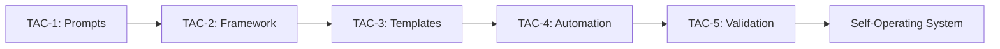

# TAC-5: The Ultimate Guide
## Testing as the Culmination of Agentic Engineering

> "Let's be brutally honest with ourselves. As engineers, we often make the mistake of thinking the most valuable asset we create is code, architecture, systems, plans, or features. This is wrong. Our most valuable contribution is the experience we create for our users." - TAC-5 Opening

## Executive Summary

TAC-5 completes the Tactical Agentic Coding journey by adding comprehensive testing and validation to the agentic development pipeline. It transforms agents from code writers into quality assurance engineers who validate user experience at scales impossible for humans.

**The Core Innovation**: Closed-loop, self-validating prompts that test, identify failures, fix issues, and retry until success.

**The Multiplication Effect**: Test value = Test Coverage × Agent Executions. With agents running tests 100+ times during development, the ROI becomes exponential.

## The TAC Journey to TAC-5



- **TAC-1**: Made prompts reusable like code
- **TAC-2**: Established SDLC framework and 12 leverage points
- **TAC-3**: Created meta-prompts and templates
- **TAC-4**: Built ADW automation system
- **TAC-5**: Added testing to close the loop

## Core Concepts

### 1. The Closed-Loop Pattern

The fundamental pattern that changes everything:

```markdown
# Structure of Closed-Loop Prompts
1. REQUEST - What needs to be done
2. VALIDATE - How to verify it's done correctly
3. RESOLVE - What to do if validation fails
```

**Example Implementation**:
```python
# Simple closed loop
Update the SQL processor
Validate with: ruff check
If errors, fix them

# Complex closed loop
Build the feature
Validate with:
  - ruff check (linting)
  - pytest (unit tests)
  - tsc --noEmit (type checking)
  - bun run build (compilation)
  - playwright tests (E2E)
If any fail, fix and retry all
```

### 2. Always Add Feedback Loops

The author's mantra repeated throughout:

> "The lesson five tactic is always add feedback loops. Your work, my work, any engineer's work is useless unless it's tested."

This isn't optional - it's the core tactic of TAC-5.

### 3. Testing as Rule of Law

Revolutionary concept:

> "What's more important, the code or your tests? The answer should be your tests. Your tests should be the rule of law in your codebase."

Tests don't validate code; code must conform to tests.

### 4. The Confidence Stack

Progressive validation layers:

```python
confidence_stack = [
    "Linting",      # Basic syntax/style
    "Unit Tests",   # Function correctness
    "Type Check",   # Type safety
    "Build",        # Compilation success
    "E2E Tests"     # User experience
]
```

Each layer adds confidence that the system works.

## Implementation Architecture

### Directory Structure

```
tac-5/
├── .claude/
│   ├── commands/
│   │   ├── test.md                    # Unit test runner
│   │   ├── test_e2e.md               # E2E test executor
│   │   ├── resolve_failed_test.md    # Test failure resolver
│   │   ├── resolve_failed_e2e_test.md
│   │   └── e2e/
│   │       ├── test_basic_query.md
│   │       ├── test_complex_query.md
│   │       └── test_sql_injection.md
├── adws/
│   ├── adw_test.py                   # Test orchestrator
│   ├── adw_plan_build_test.py        # Full SDLC
│   ├── adw_modules/                  # Reusable components
│   └── adw_tests/                    # Test specs
└── agents/
    └── <adw_id>/
        └── <agent_name>/
            ├── logs/                  # Execution logs
            └── img/                   # Screenshots
```

### The Testing Pipeline

```python
# Complete testing workflow
class TestingPipeline:
    def execute(self):
        # 1. Run all tests
        results = run_all_tests()

        # 2. If failures, attempt resolution
        if results.has_failures():
            for failure in results.failures:
                resolution_agent = spawn_resolver(failure)
                resolution_agent.fix()

            # 3. Retry tests
            results = run_all_tests()

        # 4. Report results
        return results
```

## Key Components

### 1. E2E Test Specification Format

```markdown
# E2E Test: [Test Name]

## User Story
As a [user type]
I want to [action]
So that [benefit]

## Test Steps
1. Navigate to application
2. **Verify** initial state
3. Perform action
4. **Verify** result
5. Capture screenshot

## Success Criteria
- [Criterion 1]
- [Criterion 2]

## Output Format
{
  "test_name": "...",
  "status": "passed|failed",
  "screenshots": [...],
  "error": null | "description"
}
```

### 2. Browser Automation (Playwright + MCP)

```python
# Playwright integration via MCP Server
playwright_config = {
    "mode": "headed",  # Visible browser
    "screenshots": True,
    "wait_for_async": True,
    "timeout": 30000
}
```

Key insight from transcript:
> "Browser control is another tool that you can use to validate work... this is huge."

### 3. Test Resolution Agents

Self-healing pattern:

```python
MAX_RETRY_ATTEMPTS = 4  # Unit tests
MAX_E2E_RETRY_ATTEMPTS = 2  # E2E tests

def resolve_test_failures(failures):
    for attempt in range(MAX_RETRY_ATTEMPTS):
        for test_failure in failures:
            # Spawn specialized resolver agent
            agent = create_resolver_agent(test_failure)
            agent.analyze_failure()
            agent.implement_fix()

        # Retry tests
        results = run_tests()
        if results.all_passing():
            break
```

### 4. Screenshot Documentation System

Visual proof of agent work:

```
agents/<adw_id>/<agent_name>/img/<test_name>/
├── 01_initial_page.png
├── 02_query_input.png
├── 03_results_display.png
└── 04_error_state.png
```

### 5. Templated Testing in Meta-Prompts

Testing embedded in engineering templates:

```markdown
# In bug.md and feature.md templates

## Validation Commands
- `cd app/server && uv run pytest`
- `cd app/client && bun tsc --noEmit`
- `cd app/client && bun run build`

## E2E Test Creation (if UI affected)
- Create test file in .claude/commands/e2e/
- Add E2E validation to commands
- Include screenshot verification
```

## Advanced Patterns

### Pattern 1: Test-Fix-Verify Loop

```
┌──────────┐     ┌──────────┐     ┌──────────┐
│   TEST   │────▶│   FAIL   │────▶│ ANALYZE  │
└──────────┘     └──────────┘     └──────────┘
     ▲                                   │
     │           ┌──────────┐           │
     └───────────│   PASS   │◀──────────┘
                 └──────────┘      ┌──────────┐
                                   │   FIX    │
                                   └──────────┘
```

### Pattern 2: Fresh Agent Handoffs

Each agent starts clean to prevent contamination:

```python
# Agent 1: Run tests
test_results = TestAgent().execute()

# Agent 2: Fresh context, fix failures
if test_results.failed:
    FixerAgent(test_results).resolve()

# Agent 3: Fresh context, verify fixes
VerifyAgent().confirm_resolution()
```

### Pattern 3: Multiplicative Testing Value

```
Human Testing:
- 1 test run per feature
- Manual execution
- Value = 1x

Agent Testing:
- 100+ test runs during development
- Automated execution
- Value = 100x

ROI = 100:1
```

## Philosophy & Mental Models

### 1. Testing as User Experience Validation

Not about code correctness, but user value:

> "Our most valuable contribution is the experience we create for our users."

### 2. The System That Builds Itself

> "This is us building the system that builds the system."

We're not coding features; we're building the builder.

### 3. Liberation from Manual Testing

> "These are things that you and I will do less and less and less as we scale our agentic systems."

### 4. Tests Define Truth

Tests aren't derived from code; code must satisfy tests.

### 5. Exponential vs Linear Impact

With agents, testing impact becomes exponential rather than linear.

## Implementation Checklist

### Phase 1: Basic Testing Infrastructure
- [ ] Set up test commands in `.claude/commands/`
- [ ] Create test.md for unit tests
- [ ] Add validation commands to existing templates
- [ ] Implement basic closed-loop prompts

### Phase 2: E2E Testing
- [ ] Install Playwright MCP Server
- [ ] Create test_e2e.md executor
- [ ] Write first E2E test specification
- [ ] Set up screenshot directories

### Phase 3: Test Resolution
- [ ] Create resolve_failed_test.md
- [ ] Create resolve_failed_e2e_test.md
- [ ] Implement retry logic
- [ ] Add failure analysis patterns

### Phase 4: ADW Integration
- [ ] Create adw_test.py workflow
- [ ] Add test stage to existing ADWs
- [ ] Implement adw_plan_build_test.py
- [ ] Set up test result reporting

### Phase 5: Advanced Patterns
- [ ] Add parallel test execution
- [ ] Implement test classification
- [ ] Create test generation agents
- [ ] Build regression test suite

## Common Pitfalls & Solutions

### Pitfall 1: Context Contamination
**Problem**: Agents carrying over context from previous runs
**Solution**: Always use fresh agents with clean context

### Pitfall 2: Flaky Tests
**Problem**: Tests failing intermittently
**Solution**: Add retry logic and wait conditions

### Pitfall 3: Missing Database Resets
**Problem**: Tests polluting database state
**Solution**: Always run `reset_db.sh` before test runs

### Pitfall 4: Port Conflicts
**Problem**: Services already running on required ports
**Solution**: Kill existing processes, use dynamic ports

### Pitfall 5: Incomplete Validation
**Problem**: Tests passing but feature broken
**Solution**: Add E2E tests for user-facing features

## Hidden Features & Tips

### The "Think Hard" Keyword
Activates Claude's advanced reasoning:
```markdown
Instructions: think hard about this problem
```

### Screenshot Timing
Allow async operations to complete:
```javascript
await page.waitForTimeout(1000); // Let UI settle
```

### Structured Output for Chaining
Always return JSON for agent handoffs:
```json
{
  "status": "passed|failed",
  "next_action": "proceed|retry|escalate"
}
```

### The One-Agent Limitation
In-loop testing limited to one agent; use ADW for parallel execution.

## Metrics & Success Criteria

### Key Performance Indicators

1. **Test Coverage**: % of features with tests
2. **Agent Success Rate**: % of tests passing without human intervention
3. **Resolution Rate**: % of failures fixed automatically
4. **Time to Resolution**: Average time to fix test failures
5. **Regression Prevention**: Number of bugs caught by tests

### Success Metrics

- All features have E2E tests
- 95%+ tests pass on first run
- 90%+ failures resolved automatically
- Zero manual testing required
- Complete user journey coverage

## Integration with TAC Ecosystem

### TAC-1 Integration
Every prompt becomes a closed-loop prompt with validation.

### TAC-2 Integration
Testing completes the SDLC framework as the critical validation step.

### TAC-3 Integration
Templates automatically include testing specifications.

### TAC-4 Integration
ADW orchestrates testing as part of the complete pipeline.

## Future Directions

### Emerging Patterns
- Visual regression testing
- Performance testing automation
- Security testing integration
- Accessibility validation
- Cross-browser testing

### Advanced Capabilities
- AI-powered test generation
- Predictive test selection
- Intelligent test prioritization
- Self-optimizing test suites

## Conclusion

TAC-5 represents the culmination of the Tactical Agentic Coding journey. By adding comprehensive testing and validation, it transforms a powerful automation system into a self-validating, self-improving development pipeline.

The key insight: **Testing isn't a burden when agents do it at scale**. It becomes a multiplicative force that ensures every line of code delivers user value.

As the author passionately states:
> "Now engineers that test with their agents win. Full stop, zero exceptions."

TAC-5 doesn't just complete the system - it makes it trustworthy. And in the age of AI-generated code, trust through validation is everything.

## Final Thought

> "Lean into the future. Don't lean into the present, don't lean into the past, lean into the future."

The future is agents that don't just write code - they ensure it works. TAC-5 is that future, available today.